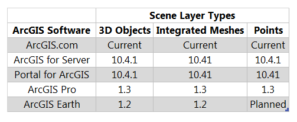

Scene Layers: Service and Package Specification
===============================================

[http://www.arcgis.com](http://www.arcgis.com/home/webscene/viewer.html?webscene=196b89953b2d4e7d9fb1ada5997d3391&viewpoint=cam:-4.18890092,34.70563622,20953545.907;358.044,0.117)

This repository hosts the specification for a Scene Layer, which is a container for arbitrarily large amounts of 3D geographic data. The delivery format for a Scene Layer, Indexed 3D Scene (I3S) and its persistency format, Scene Layer Package (.slpk), are also defined in this repository. Both formats are encoded using JSON and binary ArrayBuffers.

I3S originated from investigations into technologies for rapidly streaming and distributing large volumes of 3D content across enterprise systems that may consist of server components, cloud hosted components, and a variety of client software from desktop to web and mobile applications.
A single i3S data set, referred to as a Scene Layer is a container for arbitrarily large amounts of heterogeneously distributed 3D geographic data. An i3S Layer is characterized by a combination of layer type and profile that fully describe the behavior of the layer and the manner in which it is realized within the specification.

The format is declarative and extendable and has been used to represent different types of 3D data.
The following layer types have been specified and the specifications validated via implementation and production deployments:
- 3D Objects (e.g. Building Exteriors, from GIS Data  as well as 3D models in various formats)
- Integrated Meshes (e.g. eg an integrated surface representing the skin of the earth, from satellite, aerial or drone imagery via dense  matching photogrammetric software)
- Point Features (e.g. Hospitals or Schools, trees, street furniture, signs, from GIS Data) )

The following layer types are planned for future inclusion:

- Line Features (e.g. from GIS Data)
- Polygon Features (e.g. from GIS Data)
- Pointclouds (e.g. from LiDAR)

The specification for the [Indexed 3d Scene Layer (I3S)](./format/Indexed%203d%20Scene%20Format%20Specification.md)  and [Scene Layer Package](./format/Indexed%203d%20Scene%20Format%20Specification.md), as well as the specification for accessing these I3S resources and operations, as [Scene Service REST](./service/SceneService.md) endpoints, are presented here as open formats.

## Designed for Web, Mobile and Cloud  

I3S is designed from the ground up to be cloud, web and mobile friendly. It is based on JSON, REST and modern web standards and is easy to handle, efficiently parse and render by Web and Mobile Clients. I3S is designed to stream large 3d datasets and is designed for performance and scalability.

## Designed for 3D
I3S is intrinsically designed to support 3D geospatial content and supports the requisite coordinate systems and height models in conjunction with a rich set of layer types.

## Open Specification

I3S is an open specification for the purpose of encouraging community adoption, encouraging feedback, and for ensuring that adopting organizations would have flexibility in access to 3D data. The specification is licensed under the Creative Commons Attribution-NoDerivs 3.0 Unported License. Implementers can use the specification in services, clients or processing tools without restrictions. Consult the [License](### License for Indexed 3D Scene Format and REST Endpoint Specification) section below for more information.

## Where can I use...?

This table below shows the various 3d layer types that are currently supported by the <a href="http://server.arcgis.com/en/server/latest/publish-services/windows/scene-services.htm#">ArcGIS platform. </a>
The ArcGIS software products listed below support publishing as well as consuming Scene Layers. The rows below in Table. 1 indicate the current version of each software product that support scene layers.

       
Table.1 Shows scene layer support in various ArcGIS Software products (rows indicate software product and version)

The list of supported scene layer types in the ArcGIS platform is growing at every release. For example, support for [Point Cloud](./profiles/pointcloud.md) data as a scene layer type is currently in active development. The complete specification is expected to be released in Q3 of 2016 and production software implementation shortly in Q4 of 2016.

## Contributing

You are very much invited to fork this repository to a public or private repository and to send Pull Requests if you have ideas for improvements or have found bugs in this documentation. Creating a Fork solely for this purpose
does not constitute the creation and distribution of a derivative work. Please see our [guidelines for contributing](https://github.com/esri/contributing).

## License for Indexed 3D Scene Format and REST Endpoint Specification

Copyright 2016 Esri

The specification is licensed under the [Creative Commons Attribution-NoDerivs 3.0 Unported License](http://creativecommons.org/licenses/by-nd/3.0/).
You can implement the specification in services, clients or processing tools without restrictions.

You may also extend or modify the specification using the built-in extension and profiling mechanisms, however modified or extended versions of the specification may not be redistributed. The specification may only be redistributed in its unmodified version, under the same license.

You are free to:

- Share — copy and redistribute the material in any medium or format for any purpose, even commercially.
- The licensor cannot revoke these freedoms as long as you follow the license terms.

Under the following terms:

- Attribution — You must give appropriate credit, provide a link to the license, and indicate if changes were made. You may do so in any reasonable manner, but not in any way that suggests the licensor endorses you or your use.
- No derivatives — If you remix, transform, or build upon the material, you may not distribute (see Note below) the modified material.
- No additional restrictions — You may not apply legal terms or technological measures that legally restrict others from doing anything the license permits.

## License for JSON resources, validator, and examples

The supplementary resources may be updated without notice and are provided for use under the [Apache 2.0](https://www.apache.org/licenses/LICENSE-2.0) license and may be used, under the terms of that license, at your own risk.

