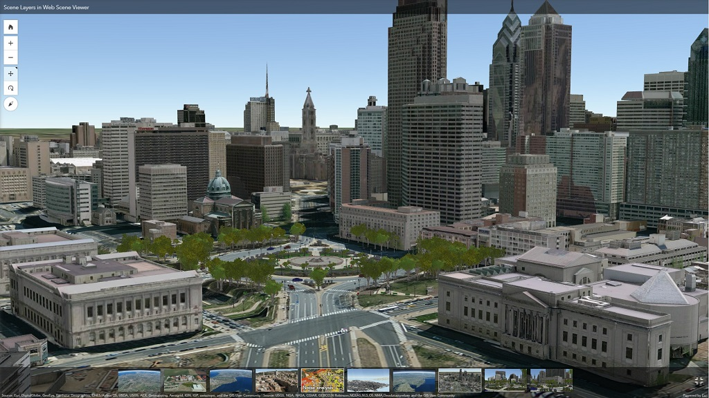

Scene Layers: Service and Package Standard
===============================================

[http://www.arcgis.com](http://www.arcgis.com)

This repository hosts the standard for scene layers which are containers for arbitrarily large amounts of geographic data. The delivery format and persistence model for scene layers, referred to as indexed 3D scene layer (I3S) and scene layer package (.slpk) respectively, are specified in detail. Both formats are encoded using JSON and binary ArrayBuffers.

The format I3S originated from investigations into technologies for rapidly streaming and distributing large volumes of 3D content across enterprise systems that may consist of server components, cloud hosted components, and a variety of client software from desktop to web and mobile applications.  

A single I3S data set, referred to as a scene layer, is a container for arbitrarily large amounts of heterogeneously distributed 3D geographic data. A scene layer is characterized by a combination of layer type and profile to fully describe the behavior of the layer and the manner in which it is realized within the specification.

The I3S format is declarative and extendable and can be used to represent different types of 3D data.
The following layer types have been specified and the standard validated via implementation and production deployments:

- [3D objects](docs/1.6/3Dobject_ReadMe.md) (e.g. building exteriors, from GIS data as well as 3D models in various formats)
- [integrated meshes](docs/1.6/IntegratedMesh_ReadMe.md) (e.g. an integrated surface representing the skin of the earth, from satellite, aerial or drone imagery via dense matching photogrammetric software)
- [points](docs/1.6/Point_ReadMe.md) (e.g. hospitals or schools, trees, street furniture, signs, from GIS data)
- [point clouds](docs/2.0/pcsl_README.md) (e.g. large point data from LiDAR)
- [building scene layer](docs/1.6/BSL_ReadMe.md) (e.g. comprehensive building model including building components)

The specification of the [indexed 3D scene layer (I3S)](./format/Indexed%203d%20Scene%20Layer%20Format%20Specification.md) and [scene layer package (\*.slpk)](./format/Indexed%203d%20Scene%20Layer%20Format%20Specification.md#scene-layer-packages), as well as the specification for accessing I3S resources as [scene service REST](./service/SceneService.md) endpoints, are described in this standard as open formats.

## Designed for Web, Mobile and Cloud  

The I3S format is designed from the ground up to be cloud, web and mobile friendly. It is based on JSON, REST and modern web standards and is easy to handle, efficiently parse and render by Web and Mobile Clients. The goal is to be able to stream large 3D datasets with high performance and scalability.

## Designed for 3D
The I3S format is intrinsically designed to support 3D geospatial content, the requisite coordinate systems and height models in conjunction with a rich set of layer types.

## Open Standard

For the purpose of encouraging community adoption and feedback, the I3S format is an open standard. By being an open standard, we further hope to ensure that adopting organizations have flexibility in accessing and visualizing their 3D data. The standard is licensed under the Creative Commons Attribution-NoDerivatives 4.0 International Public License. Implementers can use the standard in services, clients or processing tools without restrictions. Consult the [[License|i3s-spec#license-for-indexed-3d-scene-format-and-rest-endpoint-specification]] section below for more information.

## Whats new?

Each I3S profile type evolves independendly to allow new functionality to be added frequently without effecting already existing scene layer types. 

### Version 2.0

#### Point Cloud Scene Layer
- public [point cloud scene layer](docs/2.0/pcsl_README.md) spec

### Version 1.6

#### 3D Object Scene Layer
- New object [obb](docs/1.6/obb.cmn.md) - Support of oriented bounding boxes as bounding volume hierarchy.
- New object [domain](docs/1.6/domain.cmn.md) - Attribute domains are rules that describe the legal values of a field type, providing a method for enforcing data integrity. The domain values will be displayed by clients for example when using pop-ups of defining definition queries.
- New object [serviceUpdateTimeStamp](docs/1.6/serviceUpdateTimeStamp.cmn.md) - Time stamp allowing to persist the time a 3D object was updated. Used in conjunction with associated feature layer and editing.

#### Building Scene Layer
- Newly introduced profile type to visualize and work with [Buildings](docs/1.6/BSL_ReadMe.md), starting with version number 1.6.

## Where can I use...?

There are few applications that can create and consume scene layers. The tables below list some of those applications. This is an evolving list and will be updated frequently. If an application that's either consuming or generating scene layers is missing, please let us know so we can add it to the list.
<table>
 <tr>
  <td><strong>Vendor</strong></td>  
  <td><strong>Product/URL</strong></td>
  <td><strong>Scene Layer Type</strong></td>
 </tr>
 <tr>
  <td>Bentley</td>  
  <td><a href="https://www.bentley.com/en/products/brands/contextcapture">ContextCapture</a></td>  
  <td>IntegratedMesh</a></td>
 </tr>
 <tr>
  <td>Vricon</td>
  <td><a href="http://www.vricon.com">Vricon</a></td>
  <td>IntegratedMesh</td>
 </tr>
  <tr>
  <td>Pix4D</td>
  <td><a href="https://pix4d.com/">Pix4D</a></td>
  <td>IntegratedMesh</td>  
 </tr>
</table>

<em>List of vendors and products that support creation of I3S layers.</em>

The Table below shows the various scene layer types that are currently supported by the <a href="http://server.arcgis.com/en/server/latest/publish-services/windows/scene-services.htm#">ArcGIS platform</a>. 

This table reflects the current versions of the ArcGIS Clients.

_Note: The release when the scene layer type started to be supported are added in brackets._

<table>
  <tr>
    <th colspan="1" rowspan="2"> Scene Layer Types</th>
    <th colspan="2">ArcGIS Online</th> 
    <th colspan="3">ArcGIS API for Javascript</th>
    <th colspan="3">ArcGIS Runtime</th>
  </tr>
  <tr>
    <td>Publishing</td>
    <td>Consuming</td>
    <td>Publishing</td>
    <td>Consuming</td>
    <td>First Released</td>
    <td>Publishing</td>
    <td>Consuming</td>
    <td>First Released</td>
  </tr>
  <tr>
    <td>3D Objects</td>
    <td align="middle"></td>
    <td align="middle"></td>
    <td></td>
    <td align="middle"></td>
    <td></td>
    <td></td>
    <td align="middle"> </td>
    <td>100.2</td>
  </tr>
  <tr>
    <td>Integrated Meshes</td>
    <td></td>
    <td align="middle"></td>
    <td></td>
    <td align="middle"></td>
    <td></td>
    <td></td>
    <td align="middle"></td>
    <td>100.2</td>
  </tr>
  <tr>
    <td>Points</td>
    <td align="middle"></td>
    <td align="middle"></td>
    <td></td>
    <td align="middle"></td>
    <td></td>
    <td></td>
    <td></td>
    <td></td>
  </tr>
  <tr>
    <td>Points Clouds</td>
    <td></td>
    <td align="middle"></td>
    <td></td>
    <td align="middle"></td>
    <td></td>
    <td></td>
    <td></td>
    <td></td>
  </tr>
  <tr>
    <td>Building Scene Layer</td>
    <td></td>
    <td align="middle"></td>
    <td></td>
    <td align="middle"></td>
    <td></td>
    <td></td>
    <td></td>
    <td></td>
  </tr>
</table>

<table>
  <tr>
    <th colspan="1" rowspan="2"> Scene Layer Types</th>
    <th colspan="3">ArcGIS Enterprise</th> 
    <th colspan="3">ArcGIS Pro</th>
  </tr>
  <tr>
    <td>Publishing</td>
    <td>Consuming</td>
    <td>First Released</td>
    <td>Publishing</td>
    <td>Consuming</td>
    <td>First Released</td>
  </tr>
  <tr>
    <td>3D Objects</td>
    <td align="middle"></td>
    <td align="middle"></td>
    <td>10.5</td>
    <td align="middle"></td>
    <td align="middle"></td>
    <td>1.4</td>
  </tr>
  <tr>
    <td>Integrated Meshes</td>
    <td></td>
    <td align="middle"></td>
    <td>10.5</td>
    <td align="middle"></td>
    <td align="middle"></td>
    <td>1.4/2.1*</td>
  </tr>
  <tr>
    <td>Points</td>
    <td align="middle"></td>
    <td align="middle"></td>
    <td>10.5</td>
    <td align="middle"></td>
    <td align="middle"></td>
    <td>1.4</td>
  </tr>
  <tr>
    <td>Points Clouds</td>
    <td></td>
    <td align="middle"></td>
    <td>10.5.1</td>
    <td align="middle"></td>
    <td align="middle"></td>
    <td>2.0</td>
  </tr>
  <tr>
    <td>Building Scene Layer</td>
    <td></td>
    <td align="middle"></td>
    <td>10.7</td>
    <td align="middle"></td>
    <td align="middle"></td>
    <td>2.2</td>
  </tr>
</table>

<table>
  <tr>
    <th colspan="1" rowspan="2"> Scene Layer Types</th>
    <th colspan="3">ArcGIS Earth</th>
    <th colspan="3">Esri City Engine</th>
  </tr>
  <tr>
    <td>Publishing</td>
    <td>Consuming</td>
    <td>First Released</td>
    <td>Publishing</td>
    <td>Consuming</td>
    <td>First Released</td>
  </tr>
  <tr>
    <td>3D Objects</td>
    <td></td>
    <td align="middle"></td>
    <td>1.6</td>
    <td align="middle"></td>
    <td></td>
    <td>2017.1</td>
 </tr>
  <tr>
    <td>Integrated Meshes</td>
    <td></td>
    <td align="middle"></td>
    <td>1.6</td>
    <td></td>
    <td></td>
  </tr>
  <tr>
    <td>Points</td>
    <td></td>
    <td></td>
    <td></td>
    <td></td>
    <td></td>
    <td></td>
  </tr>
  <tr>
    <td>Points Clouds</td>
    <td></td>
    <td></td>
    <td></td>
    <td></td>
    <td></td>
    <td></td>
  </tr>
  <tr>
    <td>Building Scene Layer</td>
    <td></td>
    <td></td>
    <td></td>
    <td></td>
    <td></td>
    <td></td>
  </tr>
</table>

## Contributing

You are invited to fork this repository and to submit pull requests with ideas for improvements, bugs, or issues in this documentation. Creating a fork solely for this purpose does not constitute the creation and distribution of a derivative work. Please see our [guidelines for contributing](https://github.com/esri/contributing).

## License for indexed 3D scene format and REST endpoint specification

Copyright 2015 - 2017 Esri

The specification is licensed under the [Creative Commons Attribution-NoDerivatives 4.0 International Public License](https://creativecommons.org/licenses/by-nd/4.0/legalcode).
You can implement the specification in services, clients or processing tools without restrictions.

You may also extend or modify the standard using the built-in extension and profiling mechanisms, however modified or extended versions of the standard may not be redistributed. The standard may only be redistributed in its unmodified version, under the same license.

You are free to:

- Share — copy and redistribute the material in any medium or format for any purpose, even commercially.
- The licensor cannot revoke these freedoms as long as you follow the license terms.

Under the following terms:

- Attribution — You must give appropriate credit, provide a link to the license, and indicate if changes were made. You may do so in any reasonable manner, but not in any way that suggests the licensor endorses you or your use.
- No derivatives — If you remix, transform, or build upon the material, you may not distribute (see note below) the modified material.
- No additional restrictions — You may not apply legal terms or technological measures that legally restrict others from doing anything the license permits.

License history:  

Version 1.0 – 1.5 (04/30/2015 to 01/30/2017) of this specification are licensed under the older Creative Commons Attribution-NoDerivs 3.0 Unported license. 

Version 1.6 – present integrated mesh, 3D object, point scene layer, building scene layer (dated 01/31/2017 to present) of this specification are licensed under the newer Creative Commons Attribution-NoDerivatives 4.0 International Public License.  

Version 2.0 - present point cloud scene layer (01/01/2017 to present) of this specification are licensed under the newer Creative Commons Attribution-NoDerivatives 4.0 International Public License.  

## License for JSON resources, validator, and examples

The supplementary resources may be updated without notice and are provided for use under the [Apache 2.0](https://www.apache.org/licenses/LICENSE-2.0) license and may be used, under the terms of that license, at your own risk.

