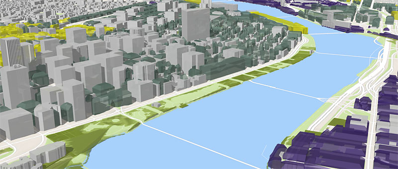

Scene Layers: Service and Package Specification
===============================================

[] (http://www.arcgis.com/)

This repository hosts the specification for the ArcGIS Scene Service, including the Indexed 3D Scene delivery format and the Scene Layer Package definition (both encoded using JSON). 

A Scene Layer is a container for arbitrarily large amounts of 3D geographic data. The format is a extendable design to encode different types of 3D data such as:

- 3D Objects (e.g. from Esri Multipatch)
- Integrated Meshes (e.g. from dense matching photogrammetric software)
- Point Features (e.g. from GIS Data)
- Line Features (e.g. from GIS Data)
- Polygon Features (e.g. from GIS Data)
- Pointclouds (e.g. from LiDAR)
- 3D Multirepresentation Objects (e.g. from CityGML files with multiple Levels of Detail)
- Analytics (e.g. from Sensor Data or Simulations)
- ...

## Can I Use...?

For the first release in ArcGIS 10.3.1, we support Scene Layers of the 3D Objects and Integrated Mesh types. All other layer types are in development. Access to these experimental specifications has to be requested separately.

This table explains which implementations of the specification exist and what they support.

Software / Layers     | 3D Objects | Integrated Mesh | ...
--------------------- | ---------- | --------------- | -----------
ArcGIS Server         | 10.3.1     | 10.3.1          | Planned for 10.4.0        
ArcGIS Pro            | 1.1        | 1.1             | Planned for 1.2           
ArcGIS Scene Viewer   | 3.7/10.3.1 | 3.7/10.3.1      | Planned for 3.9/10.4.0 

## Structure

The specification explains how different types of Scene Layers are encoded using profiles. A profile is a common technique often used e.g. in JSON to encode format subsets. Each layer type maps to one profile.

- [Indexed 3d Scene Format](./format/Indexed%203d%20Scene%20Format%20Specification.md) – Specification for the Indexed 3D Scene Format and Scene Layer Package
- [Specification for the REST endpoint](./service/SceneService.md) of the Scene Service with resources and operations
- Example JSON resources and validation rule files for each layer type

We are also building a Validation Toolkit to support developers that is available upon request.

## Contributing

You are very much invited to fork this repository to a public or private repository and to send Pull Requests if you have ideas for improvements or have found bugs in this documentation. Creating a Fork solely for this purpose 
does not consitute the creation and distribution of a derivative work. Please see our [guidelines for contributing](https://github.com/esri/contributing).

## License for Indexed 3D Scene Format and REST Endpoint Specification

Copyright 2015 Esri

The specification is licensed under the [Creative Commons Attribution-NoDerivs 3.0 Unported License](http://creativecommons.org/licenses/by-nd/3.0/). 
You can implement the specification in services, clients or processing tools without restrictions.

You may also extend or modify the specification using the builtin extension and profiling mechanisms, however modified or extended versions of the specification may not be redistributed. The specification may only be redistributed in its unmodified version, under the same license.

You are free to:

- Share — copy and redistribute the material in any medium or format for any purpose, even commercially.
- The licensor cannot revoke these freedoms as long as you follow the license terms.

Under the following terms:

- Attribution — You must give appropriate credit, provide a link to the license, and indicate if changes were made. You may do so in any reasonable manner, but not in any way that suggests the licensor endorses you or your use.
- No derivatives — If you remix, transform, or build upon the material, you may not distribute (see Note below) the modified material.
- No additional restrictions — You may not apply legal terms or technological measures that legally restrict others from doing anything the license permits.

## Contributing to the Specifications

You are very much invited to fork this repository to a public or private repository and to send Pull Requests if you have ideas for improvements or have found bugs in this documentation. Creating a Fork solely for this purpose 
does not consitute the creation and distribution of a derivative work.

## License for JSON resources, validator, and examples

The supplementary resources may be updated without notice and are provided for use under the [Apache 2.0](https://www.apache.org/licenses/LICENSE-2.0) license and may be used, under the terms of that license, at your own risk.

