# I3S Mesh Performance 

## Summary
07/03/18 Meeting: The following action-items have been identified:
### Action items:
| Proposed change | Performance improvements | Impacted Party|
|---|---| 
| Oriented-Bounding Box | Fewer requests / Reduce GPU memory usage | 3D clients & IM provider |
| Paged-access (implies `integer` ids, compact node) | Fewer requests |3D clients & IM provider
| Deprecate `sharedResource` for IM| Fewer requests | 3D clients & IM provider |
| Texture compression resources (DDS, ETC2) | Reduce GPU memory usage | IM provider
| LOD selection meta-data in index (`textureSize`, `vertexCount`) | Fewer tile to load/draw | IM provider (3D clients)|
| Mesh indexing | Reduce GPU memory | 3D clients & IM provider|
| Mesh quantization (16bit) in addition to indexing **contingent on WebGL 1.0 support**| Reduce GPU memory | 3D clients & IM provider|
| SDK / IM optimizer tooling for IM providers | Better control over UX/SLPK quality | Scene layer team|

### Additional work:

- Investigate feasibility for **forward-compatibility** with older services.  
- "Universal" texture compression format. 
- Investigate geometry transmission compression (predictive compression + quantization)
- Investigate applicability to **"mesh-pyramid"** profile. (impact on `sharedResource`, multiple co-trees, non-power-of-two/small/repeated textures, etc.) 

#### Notes:
- I3S specs updates should be grouped into a single new revision of the format to avoid "incremental" specs changes.

 
## Analysis

Several changes to I3S and 3D clients have been proposed to address performance issues reported by customers and distributors. 
These optimization candidates are:


### 1. Oriented-bounded box 

Many tiles - especially at lower LOD- have very large horizontal-over-vertical aspect ratio (i.e. "pizza box" shape). As a consequence, relying on minimum bounding spheres (MBS) is problematic for 2 reasons:

1. MBS do not fit tied around the mesh: geometries that are not in view may actually pass the view-culling test.
2. MBS is isotropic so its projected size on screen is function of its distance from the camera only. At low view angle (i.e. close to ground) actual mesh projection may be an order of magnitude smaller, but 3D clients still "refine" distant nodes unnecessarily.  

Both shortcoming lead to wasted video memory and network bandwidth. Issue 2) being the lead cause.

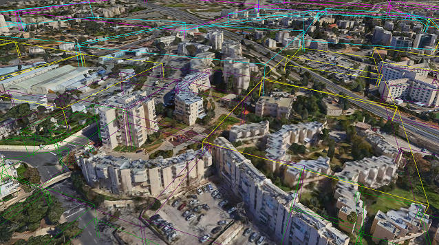


**Implemented solution:**
1. Used tied OBB for view-culling ("optimizer" -presented below- computes them from geometries and add them to each node-index) 
2. 3D Viewer compute "perspective-correct" rectangular projection of OBB as the screen-size metric for LOD switching
3. Use `OBB projected area/(texture.width*texture.heigh)` ("optimizer" adds `texture size` information to each `node_index` so texture payload does not need to be fetched.) 


### 2. Paged index 

Request one node-index document per-request is very inefficient since index request must complete before the tree could be traverse further, in most cases. In high latency scenario, client-server "chattiness" is a major bottleneck. 

**Implemented solution:**
1. The optimizer tool (see "_implementation_" section) groups index-nodes into "pages" of 64 nodes
2. All redundant information is stripped from the `Node-index` (i.e. `parentNode`, `neighbors`, resource references) to make JSON more compact. 
3. `tree-keys` are replaced by integer `id`. 
4. Added texture size information (`textureWidth`, `textureHeight`) to allow for accurate LOD switching computation without extra request. Legacy `lodSelection` and has been dropped but could be re-instated if useful.   
5. `sharedResource` document have been dropped since it's useless for IM and increases requests-per-node by 1/4. A new integer `id` based material resource will be evaluated for 3D object layers.

``` javascript
    "nodes": [
        {
            "id": 0,
            "mbs": [
                35.24183996, 31.79702922, 733, 1847.073699
            ],
            "obb": {
                "center": [ 35.24185021, 31.79702943,764.774121],
                "halfSize": [1894.442749,822.7074585,81.25891876],
                "quaternion":[ 0.00248162006,-0.01082093921,-0.008798263967,0.9998996854]
            },
            "textureWidth": 256,
            "textureHeight": 128,
            "vertexCount": 231,
            "children": [
                1,
                2
            ]
        },
        {
            "id": 1,
            "mbs": [
                35.23341115,31.79717743,733,1191.340482],
			"obb": {
                "center": [35.23341432,31.79717736,787.1089994],
                "halfSize": [959.4315186,53.65865326,822.4165039],
                "quaternion": [0.01159460936,0.7068728805,0.7072451115,0.0008235819987]
            },
            "textureWidth": 512,
            "textureHeight": 256,
            "vertexCount": 1527,
            "children": [
                3,
                4,
                5,
                6
            ]
        },
// ... 62 more nodes...
```

### 3. Texture compression

GPU memory usage is a major limiting factor that can be mitigated through texture compression.  
Three scenerios are possible

| Network compresion| GPU compression | Download size | CPU usage | GPU Memory | 
|--|--|--|--|--|
| jpeg| none| lowest | high | highest | 
| jpeg| DXT1 | lowest | highest | lowest | 
| DDS (with mips) | DXT1 | highest | negligible| lowest | 

Transmitting compressed textures the following drawbacks
- Compression ratio is less than JPEG (even with extra GZIP compression)
- Storage requirement for SLPK/Service (about 100% per support compression format). JPEG must always be present as a fallback. 
- Format fragmentation: DDS (Microsoft), ETC2 (Android/WebGL) and PVRTC (Apple) means that SLPK/Service size may triple in size to support all devices.  

 **Implemented solution:**

3D test viewer support all three texture management options. Please note that conclusions about DDS/DXT compression applies to other compression formats (ETC2 / PVRTC)

### 4. Geometry Compression
At a minimum, we need `position XYZ` and `Texture Coordinate (UV)` per vertex to draw Integrated Meshes. This currently translate to 20 bytes per vertex using `float32` values.
Once we enable texture compression, Geometry GPU memory usage becomes significant:
    
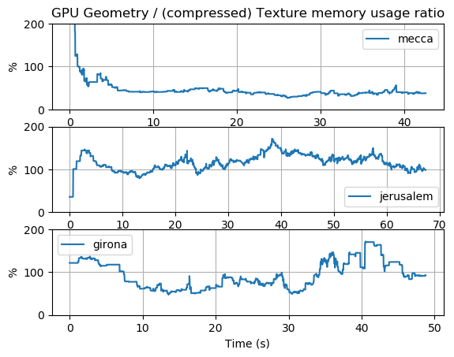

As we can see from the figure above, the detailed geometry of high resolution IM (context capture, Acute3D) consumes as much memory as compressed textures!.

 **Proposed solution:**

GPUs do not support any compressed geometry format natively, so there is only two options to reduce geometry memory usage:

- **Indexed mesh** : This lossless way to draw meshes reduce the overhead of repeated vertices in adjacent triangles. 
- **Quantization** : Encode XYZ/UV using less than 32 bits. (lossy).


### 5. Smaller tile-size

> Why does top-down views use so much video memory ?

#### Cause 1: large tile size
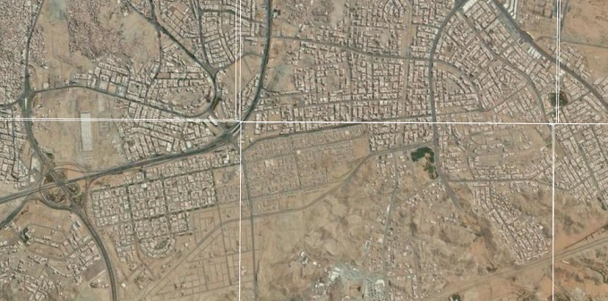
As we can see on the screenshot above, a typical 1 Mpixel top-down view (1280x720) intersects six 1-Mpixel tiles (1024x1024). Texture memory usage will be over 30 MB (uncompressed). Smaller tiles (e.g. 256x256) would reduce the viewport intersection to 27 tiles for a memory usage of less than 9 MB (27x327kB), much closer to the 5MB theoretical minimum. Please note that texture compression will further reduce these 9 MB to a little over one MB.

**Proposed solution**:
- Using smaller node size (say 256x256) would reduce the cost of "partially" visible tiles on the edge of the viewport

	->... and for "perspective" view, 3D clients will be able to swith to lower LOD sooner and reduce memory usage (better LOD granualarity)

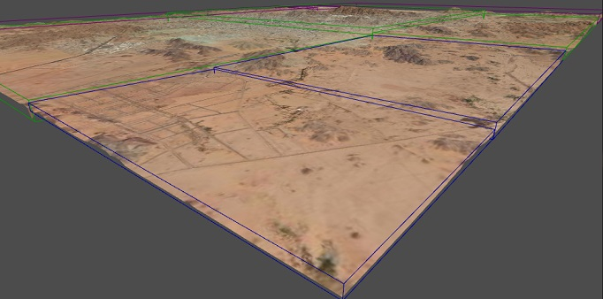
*Dataset showing poor LOD granularity due to large tile size*

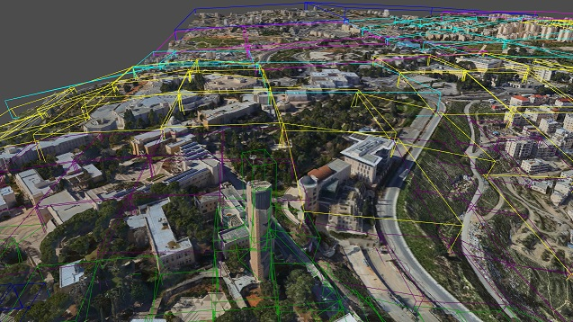
*Scene with smaller tiles and improved LOD granularity*

#### Cause 2: Invalid LOD Selection
Since IM are created by 3rd party providers, we have no control over the correctness of their `lodSelection` metrics. For instance, if MBS projected area (the only currently supported bounding volume) is used, this threshold could be too conservative and force a switch to the next (more refined) lod. The same top-down view would now consume 2 to 4 times more memory (close to 80 MB in the example above!!).

In addition, I3S specs for `lodSelection` can be an array of three different metrics which add unnecessary confusion for implementers. The actual meaning of these metrics is somewhat open to interpretation: "area" based metrics, for instance, assume an underlying bounding-volume (MBS or OBB?) AND a specific way of computing "projected area" (bounding rectangle of projection?, fixed-orientation projection ?, convex-hull projected area? etc.). The addition of OBB will compound this problem. 


**Proposed solution**:

Since GPU capabilities varies wildly (Workstation GPU to mobile device) and resources have to be shared across all visible layers in a scene, it's unrealistic to expect 3D clients  to follow `lodThreshold`. Even applying a "scale" to the LOD metric based on system capability won't help 3D clients figure out the resource cost of refining nodes. So instead of trying to impose unrealistic constrain on the Viewer, we should add meta-data to assist their resource management and LOD switching logic:
  
- Replace `lodThreshold` with the following (per-node) meta-data:
	- `obb`: footprint computation
	- `textureSize`: "texel resolution" and memory usage cost can be easily inferred (texture compression have a fix compression ratio)
	- `vertexCount`: vertex-buffer memory cost can be inferred based on both rendering mode (shaded, textured, colored, etc.) and attribute encoding (float32, float16, uint8,etc.)


## Implementation and results

In order to evaluate the benefits of the proposed improvements, I've implemented the following tools:

- **I3S Optimizer** (convert a service/SLPK to an "optimized" SLPK with change 1), 2)and 3). Optimization 4) has been investigated but not used in benchmarks and 5) may be implemented in the future).
- **IO Testbench** with throttleable bandwidth and adjustable Time-to-first-byte (TTFB).
- **3D Viewer** which can render both "legacy" and "optimized" services.     
- **Python scripts** to generate performance charts.

### 3D Viewer
The test viewer is a 64-bit standalone application written in C++ using D3D11 as the graphic API. This viewer was used to benchmark different node-access pattern and resource management techniques and identify techiques that maximize performance (Visual quality, frame-rate and memory consumption). 


#### Resource loading / LOD switching
- Tile loading proceed **top-down** (i.e. **breadth-first**). A parent is replaced by its children only when all **_visible_** children are ready to be renderered. So Viewer avoid missing tile 'gaps' by falling back to resident lower LOD tile.
- Tile request are ordered **by LOD first and then by distance from camera** (when same lod). `Node-index` request priority is **bumped by one LOD** compare to texture/geometry requests.  
- Visible nodes ancestry is **always kept in video memory**. While visual quality benefits are obvious (no "disappearing" tiles), we'll show that `texture` compression combined with `OBB`s makes this approach practical even for memory constrained systems.  
- LOD swithing is based on the following metric:`OBB projected area/(texture.width*texture.height)` 
for optimized mesh and I3S `lodThreshold` is ignored.


#### Threading model:
- Scene culling, Win32 event handling and 3D rendering execute in a single thread (main UI thread). 
- All IO, tile processing, JPEG-to-DDS re-compression (optional) and JSON parsing execute asynchronously using thread-pool of size 8. Test machine CPU has 4 physical core and 8 logical cores).
- Concurrency is at the **_tile_** level, not **_request_** level. So multiple requests for a single tile (e.g. geometry + texture) are handle sequentially by a worker thread. 
- To avoid IO request queue "latency" and/or complex request cancellation logic, the resource loader uses a dynamic "tile set":
	- View culling determine which resource should be requested for the **current** frame (i.e the `request_list`).
	- At the end of scene culling, `request_list` is swapped with the worker-thread pool. So request queue depth is _at most_ equal to the pool size: requests that didn't get processed and are not in the newest `request_list` are _de-facto_ discarded
	- Tile/request status is maintain atomically so render-thread may query it lock-free.

#### Features	: 
- Supports oriented-bounding box (OBB) and minimum bounding spheres (MBS). OBB may be reconstructed (asynchronously) from tile geometry if not provided by service.
-  Support on-the-fly JPEG-to-DDS texture compression with mipmap generation. (optimized for SSE2 instruction set).
- View culling is based on frustum/OBB or frustum/MBS collision,
- Support quota-based video memory management. Quota is mutualized across all visible layers in the scene graph. If quota is set to 0, only visible assets (and their ancestors) are kept in GPU memory.  

#### Benchmarking:
- Support fly-though creation & playback
- Performances measurement and logging.  


### Test datasets


#### Jerusalem (context capture)


Israeli distributor complained about poor performance in WSV with this dataset. Dataset visual quality and structure is quite good. Tile size -which is smaller than other datasets- highlights I3S inefficient client-server communication.

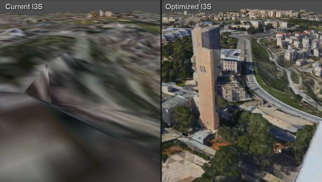

**Stats:**
- ~49k tiles
- ~6 GB (jpeg only), 11GB (jpeg + DDS)
- Texture size varies, but usually < 512

**Notes**:
- **DATASET MUST NOT BE SHARED OUTSIDE OF ESRI** 
- A few "no-data" nodes found at various tree-depth. 
- A few hundred "missing" nodes references found at various tree-depth. May impact performance a bit, but root cause is unclear (subset of a bigger dataset ?)


#### Girona (Acute 3D)


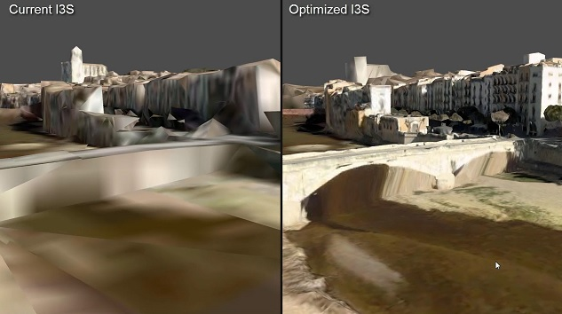

**Stats:**
- ~6800 tiles
- ~4GB (jpeg+DDS)
- Texture size varies, but usually < 1024

**notes**:
- One node has an invalid texture. ( tree-key: 26-0-0-0-0-0-3-1-0-0)


#### Mecca (Vricon)
Lower resolution dataset with large tiles. Texture quality is low. 
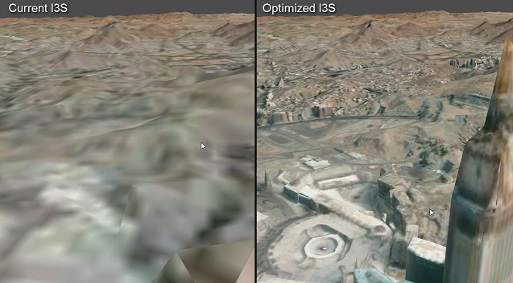
**Stats:**
- ~2GB (jpeg only), ~7.2GB (jpeg+DDS)
- Texture size ~1024


### Paged index results:

We compare optimized vs. regular (i.e. legacy) I3S performance.
- Bandwidth limit is set to 4 MBytes per second
- Time-to-first-byte (TTFB) set 250 milliseconds.
- Quality setting is 1.25 (i.e.refine node if `screen pixels/texel > 1.25` ).
- Window size is 1280*720 (720p HD).
- "Optimized" version downloads jpeg textures, create mipmaps and re-compress textures on the fly to DXT1.
- Video memory quota is set to 100 MB
- `sharedResource` JSON is **not requested** even for "legacy" I3S. Doing so would penalize "legacy" runs even more. (25% more requests-per-node)
 

#### Jerusalem dataset:
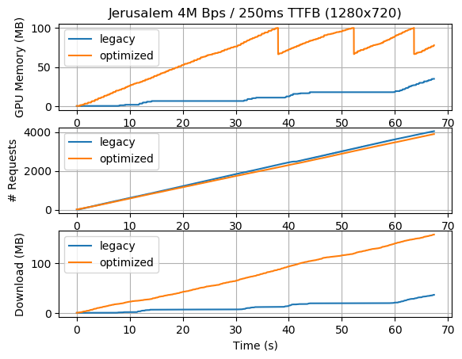

As we can clearly see here, this dataset is **latency (i.e. TTFB) limited**. So much so that "legacy" run can't utilize all the bandwidth available. As a result, the visual quality is unacceptable at 1280x720 and poor at 640x720. On the other end, "Optimized" visual quality is excellent at 250 ms TTFB and still good at 500 ms TTFB 
 
**Visual quality comparative video**: 
- [Jerusalem side-by-side 640x720 - 500 ms TTFB ](https://esri.box.com/s/nzx67z68h19yrwvwqnk5r29svicyslvy)
- [Jerusalem side-by-side  640x720 - 250 ms TTFB ](https://esri.box.com/s/5hedx8181odqcxyv0ls9pd783a120q8b)

 #### Girona dataset:
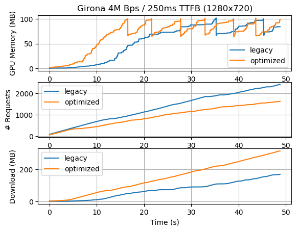

The benefits of the paged-index access are clearly visible here:
- "Legacy" is mostly latency bound.
- "optimized" is maximizing available "bandwidth" even with 250 TTFB ! -an ideal situation-
 
**Visual quality comparative video**: 
- [Girona side-by-side 640x720 - 500 ms TTFB](https://esri.box.com/s/1vppvn8zuqmhhtfletxl3ftkc8uxwpdb)

#### Mecca dataset:
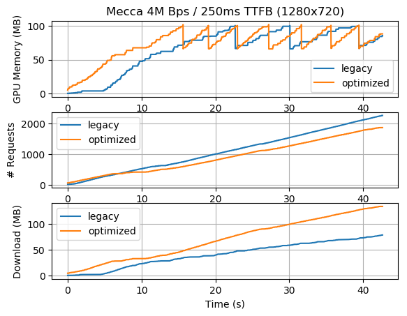

The benefits of the paged-index access are a bit less pronounced since this dataset uses bigger tiles (so fewer node-index requests), but the same observations hold: 
- "legacy" is especially hurt at the beginning of the run due to (mostly) depth-first traversal of the tree. This requires "serial" (i.e. dependent) requests which compound TTFB. `# of request` is the about the same, but "optimized" is able to discover many more useful nodes and figure out which tiles to query much quicker.  
- "Legacy" is mostly latency bound.
- "optimized" is maximizing available "bandwidth".
 
**Visual quality comparative video**: 
- [Mecca side-by-side 640x720 - 500 ms TTFB](https://esri.box.com/s/76o8ajl52s8c28sp3enfnjpm1rodzxmf)

### Texture compression results:

We measure the video memory usage in the three texture compression scenarios. (jpeg/uncompress, jpeg/dds, dds/dds)

- DXT1 (DDS) has a 1:8 fixed compression ratio (RGBA8 with A=255 always, RGB8 is not practical since modern GPU require 4-byte aligned texel)
- DDS (over wire) is GZIP compressed and contains mipmaps (up to 4x4 mip)
- Bandwidth limit is set to 4 MBytes per second.
- Time-to-first-byte (TTFB) set to 250 milliseconds.
- Quality setting is set to 1.25 (i.e.refine node if `screen pixels/texel > 1.25` ).
- Window size is 1280*720 (720p HD).
- When texture compression is not used (i.e.`jepg/raw`), mipmaps are computed on GPU.  

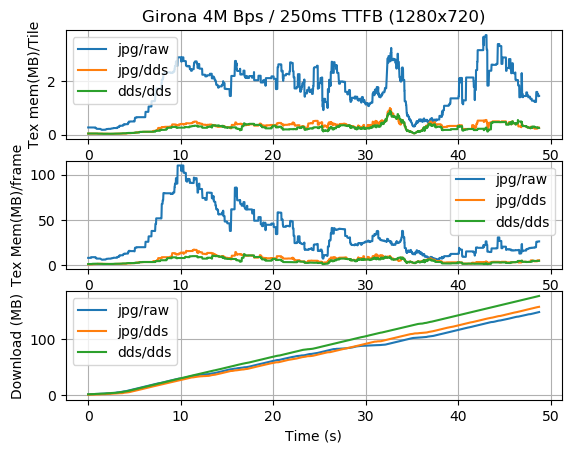

- The benefit of compression on video memory usage is clearly visible in both Memory-per- frame and Memory-per-tile measurements. 
- Surprisingly, download size for `DDS/DDS` scenario is not prohibitive (`dds+gzip` (over wire) size is higher than JPEG, but very reasonable). For high quality texture dataset, DDS-over-wire is clearly the best approach.
- Reduction in visual quality due to DXT compression wasn't noticeable

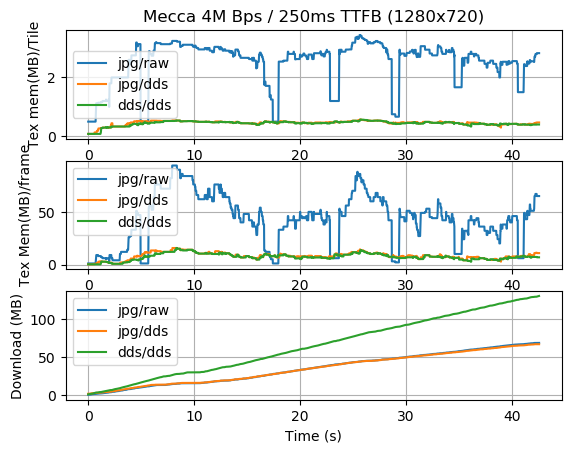

- DDS-over-wire bandwidth cost is must higher here. The reason is that Vricon's texture quality is low (with very little high-frequency information) so JPEG compressor achieve very high compression ratios while DDS+gzip doesn't. 
- `jpg/raw` visual quality suffers quite a bit since tiles are constantly garbage-collected to stay within memory quota (see "drops" in blue lines). This cause the viewer to often drop to lower LOD when camera moves. 
- In this case JPEG->DDS recompression would be best if CPU cycles are available or -`dds/dds` otherwise- since `jpeg/raw` scenario degrades UX too much.
- Reduction in visual quality due to DXT compression wasn't noticeable   

  
### Geometry compression results:

#### Indexed mesh vs. bag of triangles : 
To index each tile of the mesh, we assign a index to all identical xyz coordinates quantized to 16 bit. i.e:
1. compute tile geometry extent (min/max)
2. Quantize XYZ: i.e.  `Q(xyz) = ( xyz - min_xyz ) / (max_xyz-min_xyz) * 65535`
3. Quantize UV to 16 bit. `Q(uv) = uv * 65535` 
3. Hash `Q(xyz) | Q(uv)` to a unique 80-bit key 
4. Vertices with the same `key` are assigned the same mesh index. (index are 16 bit )

Notes:
- This method may not return the optimal index for the mesh, but it's very fast to compute.
- While 16 bit UV seems generous (especially for small textures), the non-contiguous mapping of IM requires this precision. 

|Dataset|Compression Ratio* XYZ index only | Compression Ratio* XYZ+UV index| Compression Ratio* XYZ+UV index+16bit
|---|---:|---:|---:|
|Girona|33%|75%|~36%|
|Jerusalem|33%|51%|~30%|
|Mecca|33%|45%|~28%|

_* compression ratio `compress/original` (less is better). All compressed size computed using a 16-bit index_ 

Context Capture/Acute 3D meshes use highly dis-contiguous UV mapping. As a result the identical vertices get assigned very different UV coordinates which severely reduce the benefits of mesh indexing.
    
Given the relative simplicity and losslessness of indexing, we still recommend it, but if `normals` were added to the hashed key, mesh indexing may become ineffective. (Are normals useful for IM ? TBD) 


#### Coordinate/UV quantization : 

Encoding vertex data on 16-bit would further reduce the indexed mesh size by 40-50%. To achieve this, we encode and store `{xyz,uv}` per tile using 16-bit fixed point precision. In the vertex shader, we scale & offset back our `uint16` inputs to float tile-space for positions and [0.0, 1.0] for UV.  
 
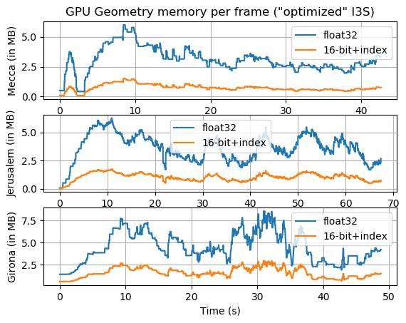
 
This option has a couple of drawbacks:
1. Lossy compression, but **no noticeable visual difference with 16-bit precision**. Only a (potential) issue if IM were used as input to analysis, but IM lack of topology makes this unlikely anyway.
2. Web GL 1.0 does not seem to support 16-bit integer format for `position` and `float16` (half-float) may not work either. (TBD). Likely possible with WebGL 2.0 


## Future work

- Geometry compression for transmission (Draco)
- 3D object meshes optimization (including BIM scene layer) 
 


## Contact / feedback
rpoirrie@esri.com

