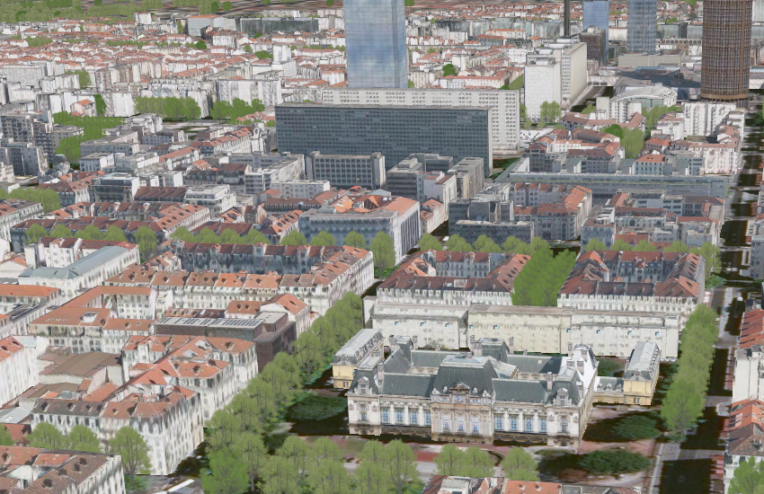
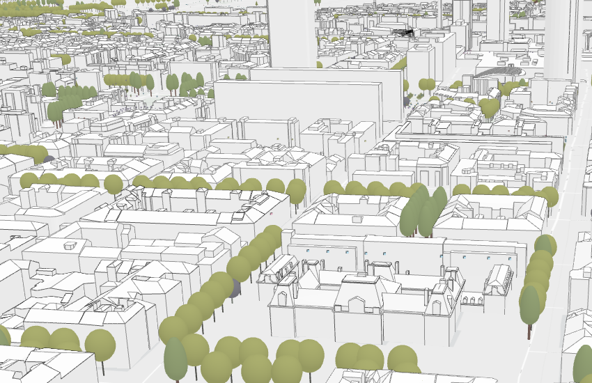

# 3D Object Scene Layer

A 3D object scene layer is used to visualize 3D objects.  3D object scene layers are often created from GIS data with attributes and explicitly modeled in 3D.  These attributes allow definition queries to specify symbology and other properties in lieu of setting properties for each object individually.  A 3D object scene layer can efficiently create and share just a few buildings or an entire city.  

*Realistic 3D Object Scene Layer with textures*



*Thematic 3D Object Scene Layer without textures*



## 3D Object Scene Layer Structure
The 3D object scene layer is structured into a tree of multiple JSON files. Besides storing information in the JSON format, some are also provided as binary buffer. A 3D object scene layer can be used to create a scene layer package (*.slpk) or a I3S service. A 3D object scene layer contains the following:

- [Layer description](3DSceneLayer.cmn.md)
- Nodes containing [Geometry](geometry.cmn.md) and [Attributes](attributeStorageInfo.cmn.md)
- [Statistics](statsInfo.cmn.md)

*Example of 3DObject layer structure*

```
.<host>/SceneServer/layers
	+--0 // layer description (named 3dSceneLayer.json in SLPK)
	+-- nodes
	|  +--0
	|  |  +-- attributes
	|  |  |  +--2 
	|  |  |  +--4
	|  |  |  +--8
	|  |  |  +--(...)
	|  |  +-- geometries
	|  |  |  +-- 0
	|  +--1 
	|  |  (...) //same structure for all nodes
	|  +--...
	|  +-- 259
	|  |  (...) //same structure for all nodes
	+--statistics
	|  +-- 2
	|  +-- 4
	|  +-- 8
	|  +-- (...)
```
# HTTP API Overview

The following API methods are available for point cloud scene layer:

|Method|Example|
|------|-------|
|To query SceneLayer document|http://my.server.com/layers/{layerId}|
|To query attribute, statistics, documents|http://my.server.com/layers/{layerId}/statistics/{AttribKey}|
|To query  NodePage  document|http://my.server.com/layers/{layerId}/nodepages/{firstNodeIdInPage} |
|To query  Geometry  Buffer|http://my.server.com/layers/{layerId}/nodes/{resourceID}/geometries/0 |
|To query  Attribute  Buffer|http://my.server.com/layers/{layerId}/nodes/{resourceID}/attributes/{AttribKey}  Node:  {AttribKey}  is listed at  scenelayer.attributeStorageInfo[].key |

