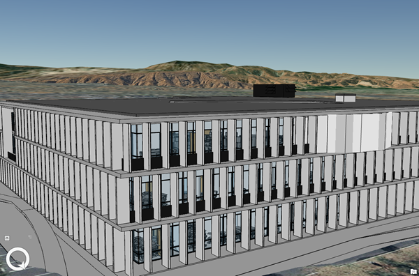

# Building Scene Layer

Building content is derived from a Building Information Modeling (BIM). BIM is a best-practice process for optimizing design and construction. BIM processes can produce 3D virtual representations of real-world assets that are commonly used for construction, documentation, and evaluation. BIM processes are applied in multiple domains including architecture, buildings, energy, utilities, and transportation. A building scene layer can represent the 3D model aspect of BIM structuring disciplines such as architectural or piping, and its categories like windows or walls.



## Building Scene Layer Structure
The building scene layer contains discipline and category layers as sublayers which represent a building and its assets. Building scene layers can be used to create a scene layer package (*.slpk) or an I3S service. A building scene layer contains the following:

- [Layer description](layer.bld.md)
- [Sublayers](sublayer.bld.md)
- [Statistics](statsummary.bld.md)

```
.<host>/SceneServer/layers
	+-- layers
|  +-- 10 (3dSceneLayer.json for layer10, layerType ='building' )
|  |  +-- statistics
|  |  |   +-- summary.json
|  |  +-- sublayers
|  |  |  +--0 (3dSceneLayer.json for layer0, layerType='3DObject')
|  |  |  |  +--nodes
|  |  |  |  |  +--root
|  |  |  |  |  |  +--3dNodeIndexDocument.json
|  |  |  |  |  |  +--geometries (...)
|  |  |  |  |  |  +--attributes (...)
|  |  |  |  |  +--0
|  |  |  |  |  |  +--3dNodeIndexDocument.json
|  |  |  |  |  |  +--geometries (...)
|  |  |  |  |  |  +--attributes (...)
|  |  |  |  |  +--(...)
|  |  |  |  +--statistics
|  |  |  +--1 (3dSceneLayer.json for layer1, layerType='3DObject')
|  |  |  |  +-- (...)
|  |  |  +--(... , layerType='3DObject')
```
*Example of building scene scene layer structure.*

# HTTP API Overview

The following API methods are available for Building Scene Layer:

|Method|Example|
|------|-------|
|To query SceneLayer document|http://my.server.com/layers/{layerId}|
|To query attribute, statistics, documents|http://my.server.com/layers/{layerId}/statistics/{AttribKey} |
|To query  NodePage  document|http://my.server.com/layers/{layerId}/nodepages/{firstNodeIdInPage} |
|To query  Geometry  Buffer|http://my.server.com/layers/{layerId}/nodes/{resourceID}/geometries/0 |
|To query  Attribute  Buffer|http://my.server.com/layers/{layerId}/nodes/{resourceID}/attributes/{AttribKey}  Node:  {AttribKey}  is listed at  scenelayer.attributeStorageInfo[].key |

