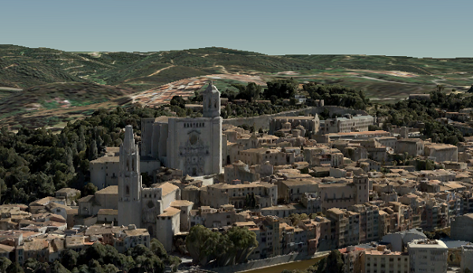

# Integrated Mesh Scene Layer (1.6)

Integrated mesh scene layers are generally created for citywide 3D mapping.  Integrated mesh scene layers include an entire surface and cannot be restyled.  Three-dimensional mesh data are typically captured by an automated process (e.g. drone) for constructing 3D objects out of large sets of overlapping imagery. The result integrates the original input image information as a textured mesh including 3D objects, such as buildings and trees, and elevation information.

*Example of integrated mesh scene layer*



## Integrated Mesh Scene Layer Structure
The Integrated Mesh scene layer is structured into a tree of multiple JSON files.  Integrated mesh scene layers can be used to create a scene layer package (*.slpk) or a I3S service. A Integrated Mesh scene layer contains the following:

- [Layer description](3DSceneLayer.cmn.md)
- Nodes containing [Geometry](geometry.cmn.md), [Feature Data](featureData.cmn.md), and [Texture](texture.cmn.md)
- [Shared Resources](sharedResource.cmn.md)

*Example of integrated mesh scene layer structure*

```
.<host>/SceneServer/layers
	+--0 // scene layer document
	+-- nodes
	|  +--0
	|  |  +-- geometries
	|  |  |  +-- 0
	|  |  |  +-- 1
	|  |  |  +--(...)
	|  |  +-- textures
	|  |  |  +-- 0
	|  |  |  +-- 1
	|  |  |  +--(...)
	|  |  +-- shared 
    |  +-- (...)

```


# HTTP API Overview for 1.6

The following API methods are available for Integrated Mesh Scene Layer:

| Resource             | Type   | Description                                                  | URL Template                         |
| -------------------- | ------ | ------------------------------------------------------------ | ------------------------------------ |
| Scene Layer Document | `JSON` | This is the root document for the service that will contain properties common to the entire layer. | `http://serviceURL/layers/{layerID}` |

- `layerID`: Integer. ID of the associated layer. Esri products expect this to be `0`.

Example: http://my.server.com/IntegratedMeshSceneLayer/SceneServer/layers/0


| Resource      | Type   | Description              | URL Template                                            |
| ------------- | ------ | ------------------------ | ------------------------------------------------------- |
| Node Document | `JSON` | Description of the node. | `http://serviceURL/layers/{layerID}/nodes/{resourceID}` |

- `layerID`: Integer. ID of the associated layer. Esri products expect this to be `0`.
- `resourceID`: String. ID of the associated resource. 

Example: http://my.server.com/IntegratedMeshSceneLayer/SceneServer/layers/0/nodes/98


| Resource | Type                       | Description                   | URL Template                                                 |
| -------- | -------------------------- | ----------------------------- | ------------------------------------------------------------ |
| Textures | `JPG`, `PNG`, `DDS`, `KTX` | The texture resource  (image) | `http://serviceURL/layers/{layerID}/nodes/{resourceID}/textures/{texture ID}` |

- `layerID`: Integer. ID of the associated layer. Esri products expect this to be `0`.
- `resourceID`: String. ID of the associated node.
- `textureID`: String. This ID returns one of the textures available for this node. The same texture may be available in different formats. 

Example: http://my.server.com/IntegratedMeshSceneLayer/SceneServer/layers/0/nodes/98/textures/1


| Resource   | Type  | Description                              | URL Template                                                 |
| ---------- | ----- | ---------------------------------------- | ------------------------------------------------------------ |
| Geometries | `bin` | The geometry resource (mesh information) | `http://serviceURL/layers/{layerID}/nodes/{resourceID}/geometries/0` |

- `layerID`: Integer. ID of the associated layer. Esri products expect this to be `0`.
- `resourceID`: String. ID of the associated node.

Example: http://my.server.com/IntegratedMeshSceneLayer/SceneServer/layers/0/nodes/98/geometries/0 


| Resource         | Type   | Description                        | URL Template                                                 |
| ---------------- | ------ | ---------------------------------- | ------------------------------------------------------------ |
| Shared Resources | `JSON` | Texture and material descriptions. | `http://serviceURL/layers/{layerID}/nodes/{resourceID}/shared` |

- `layerID`: Integer. ID of the associated layer. Esri clients expect this to be `0`.
- `resourceID`: String. ID of the associated node. 

Example: http://my.server.com/IntegratedMeshSceneLayer/SceneServer/layers/0/nodes/98/shared