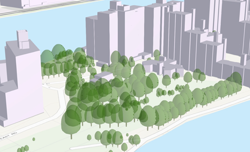

# Point Scene Layer

Point scene layers contain point features and their attributes. Point scene layers are often used to visualize large amounts of 3D data like trees or buildings.  Most phenomena that can be visualized by 3D symbols can be displayed with a point scene layers.

*Example of a point scene layer*



## Point Scene Layer Structure
The point scene layer is structured into a tree of multiple JSON files. Besides storing information in the JSON format, some are also provided as binary buffer. Point scene layers can be used to create a scene layer package (*.slpk) or a I3S service. A point scene layer contains the following:

- [Layer description](3DSceneLayer.psl.md)
- Nodes containing [Feature Data](featureData.cmn.md) and [Attributes](attributeStorageInfo.cmn.md)
- [Node Index Document](3DNodeIndexDocument.cmn.md)
- [Statistics](statisticsInfo.cmn.md)

*Example of point scene layer structure*

```
.<host>/SceneServer/layers
	+--0 // layer description (named 3dSceneLayer.json in SLPK)
	+-- nodes
	|  +--root
	|  |  +-- attributes
	|  |  |  +--2
	|  |  |  +--4
	|  |  |  +--8
	|  |  |  +--(...)
	|  |  +-- features
	|  |  |  +-- 0
	+--statistics
	|  +-- f_1
	|  | +--0
	|  +-- f_4
	|  | +--0
	|  +-- f_8
	|  | +--0
	|  +-- (...)
	+--resources
	    +-- styles
	 	| +-- root
	 	| +-- web 

```
# HTTP API Overview

The following API methods are available for Point Scene Layer:

| Resource             | Type   | Description                                                  | URL Template                         |
| -------------------- | ------ | ------------------------------------------------------------ | ------------------------------------ |
| Scene Layer Document | `JSON` | This is the root document for the service that will contain properties common to the entire layer. | `http://serviceURL/layers/{layerID}` |

- `layerID`: Integer. ID of the associated layer. Esri products expect this to be `0`.

Example: http://my.server.com/PointSceneLayer/SceneServer/layers/0


| Resource      | Type   | Description              | URL Template                                            |
| ------------- | ------ | ------------------------ | ------------------------------------------------------- |
| Node Document | `JSON` | Description of the node. | `http://serviceURL/layers/{layerID}/nodes/{resourceID}` |

- `layerID`: Integer. ID of the associated layer. Esri clients expect this to be `0`.
- `resourceID`: Integer. ID of the associated resource. 

Example: http://my.server.com/PointSceneLayer/SceneServer/layers/0/nodes/98


| Resource | Type                       | Description                   | URL Template                                                 |
| -------- | -------------------------- | ----------------------------- | ------------------------------------------------------------ |
| Textures | `JPG`, `PNG`, `DDS`, `KTX` | The texture resource  (image) | `http://serviceURL/layers/{layerID}/nodes/{resourceID}/textures/{texture ID}` |

- `layerID`: Integer. ID of the associated layer. Esri products expect this to be `0`.
- `resourceID`: Integer. ID of the associated node.
- `textureID`: String. This ID returns one of the textures available for this node. The same texture may be available in different formats. 

Example: http://my.server.com/PointSceneLayer/SceneServer/layers/0/nodes/98/textures/1


| Resource | Type  | Description                              | URL Template                                                 |
| -------- | ----- | ---------------------------------------- | ------------------------------------------------------------ |
| Geometry | `bin` | The geometry resource (mesh information) | `http://serviceURL/layers/{layerID}/nodes/{resourceID}/geometries/{geometry ID}` |

- `layerID`: Integer. ID of the associated layer. Esri clients expect this to be `0`.
- `resourceID`: Integer. ID of the associated node.
- `geometryID`: Integer. This ID return the geometry available for the node. 

Example: http://my.server.com/PointSceneLayer/SceneServer/layers/0/nodes/98/geometries/1 


| Resource   | Type   | Description                                                  | URL Template                                                 |
| ---------- | ------ | ------------------------------------------------------------ | ------------------------------------------------------------ |
| Statistics | `JSON` | The statistics for the entire layer for a specific attribute. | `http://serviceURL/layers/{layerID}/statistics/f_{attributeID}/0` |

- `layerID`: Integer. ID of the associated layer. Esri clients expect this to be `0`.
- `attributeID`: Integer.  ID of the specific attribute for the layer.

Example:  http://my.server.com/PointSceneLayer/SceneServer/layers/0/statistics/f_48/0 


| Resource   | Type   | Description                                                  | URL Template                                                 |
| ---------- | ------ | ------------------------------------------------------------ | ------------------------------------------------------------ |
| Attributes | `JSON` | The attributes for the entire layer for a specific attribute. | `http://serviceURL/layers/{layerID}/attributes/f_{attributeID}/0` |

- `layerID`: Integer. ID of the associated layer. Esri clients expect this to be `0`.
- `attributeID`: Integer.  ID of the specific attribute for the layer.

Example:  http://my.server.com/PointSceneLayer/SceneServer/layers/0/statistics/f_48/0 


| Resource         | Type   | Description                        | URL Template                                                 |
| ---------------- | ------ | ---------------------------------- | ------------------------------------------------------------ |
| Shared Resources | `JSON` | Texture and material descriptions. | `http://serviceURL/layers/{layerID}/nodes/{resourceID}/shared` |

- `layerID`: Integer. ID of the associated layer. Esri clients expect this to be `0`.
- `resourceID`: Integer. ID of the associated node. 

Example:  http://my.server.com/PointSceneLayer/SceneServer/layers/0/nodes/98/shared