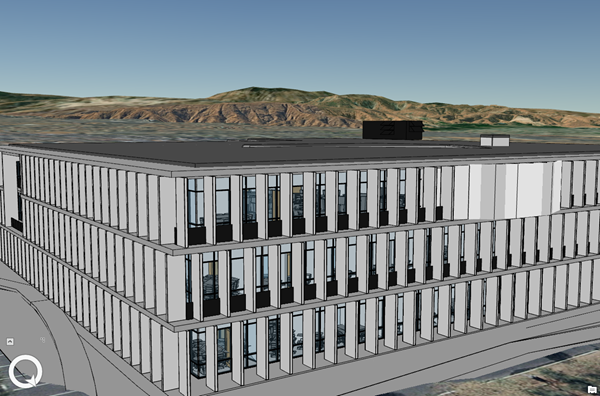

# Building Scene Layer

Building content is derived from a Building Information Modeling (BIM). BIM is a best-practice process for optimizing design and construction. BIM processes can produce 3D virtual representations of real-world assets that are commonly used for construction, documentation, and evaluation. BIM processes are applied in multiple domains including architecture, buildings, energy, utilities, and transportation. A building scene layer can represent the 3D model aspect of BIM structuring disciplines such as architectural or piping, and its categories like windows or walls.

**Examples**:<br />
Building Scene Layer example [SLPK](https://www.arcgis.com/home/item.html?id=1cad3c2028f740a39460d32081265c06 ).<br />
Building Scene Layer example [service](https://www.arcgis.com/home/item.html?id=812feb34830941a196e517ff3b8bf98f ).<br />

*Example of a Building Scene Layer*



## Building Scene Layer Structure
The building scene layer contains discipline and category layers as sublayers which represent a building and its assets. Building scene layers can be represented as a scene layer package (*.slpk) or an I3S service. A building scene layer contains the following:

- [3DSceneLayer](layer.bld.md)
- [Sublayers](sublayer.bld.md)
- [Statistics](stats.bld.md)

*Example of building scene scene layer structure*

```
.<host>/SceneServer/layers
  +--0 // scene layer document
  |  +-- statistics
  |  |   +-- summary.json
  |  +-- sublayers
  |  |  +--0 // sublayer document
  |  |  |  +--nodes
  |  |  |  |  +--0
  |  |  |  |  |  +-- attributes
  |  |  |  |  |  |  +--f_2
  |  |  |  |  |  |  +--f_4
  |  |  |  |  |  |  +--(...)
  |  |  |  |  |  +-- geometries
  |  |  |  |  |  |  +-- 0
  |  |  |  |  |  +-- textures
  |  |  |  |  |  |  +-- 0
  |  |  |  |  |  |  +-- 0_0_1
  |  |  |  |  |  |  +--(...)
  |  |  |  +-- 3dNodeIndexDocument*
  |  |  |  |  |  +-- shared* 
  |  |  |  |  (...) 
  |  |  |  +--statistics
  |  |  |  | +-- f_2
  |  |  |  |  |  | +--0
  |  |  |  |  +-- f_4
  |  |  |  |  |  | +--0
  |  |  |  |  +-- (...)
```

_* Only required for 1.6 compatability for older clients._ <br />

# HTTP API Overview

The following API methods are available for Building Scene Layer:

**Scene Layer Document**
<table>
<tr>
    <td>Type</td>
    <td>JSON</td>
</tr>
<tr>
    <td>URL Template</td>
    <td>http://serviceURL/layers/{layerID}</td>
</tr>
<tr>
    <td>Example</td>
    <td>http://my.server.com/BuildingSceneLayer/SceneServer/layers/0 </td>
</tr>
<tr>
    <td>Description</td>
    <td>This is the root document for the service that will contain properties common to the entire layer. layerID: Integer. ID of the associated layer. Esri products expect this to be `0`.</td>
</tr>
</table>

[3DSceneLayer](layer.bld.md)

**Sublayer Document**
<table>
<tr>
    <td>Type</td>
    <td>JSON</td>
</tr>
<tr>
    <td>URL Template</td>
    <td>http://serviceURL/layers/{layerID}/sublayers/{sublayerID}</td>
</tr>
<tr>
    <td>Example</td>
    <td>http://my.server.com/BuildingSceneLayer/SceneServer/layers/0/sublayers/33 <br /> 
    http://my.server.com/BuildingSceneLayer/SceneServer/layers/0/sublayers/33/nodes/0/geometries/0 </td>
</tr>
<tr>
    <td>Description</td>
    <td>Discipline or category layer. <br/>
    <code>layerID</code> Integer. ID of the associated layer. Esri products expect this to be `0`. <br/>
    <code>sublayerID</code> Integer. ID of the associated resource. </td>
</tr>
</table>

[Sublayers](sublayer.bld.md)

**Statistics**
<table>
<tr>
    <td>Type</td>
    <td>JSON</td>
</tr>
<tr>
    <td>URL Template</td>
    <td>http://serviceURL/layers/{layerID}/statistics/summary</td>
</tr>
<tr>
    <td>Example</td>
    <td>http://my.server.com/3DObjectSceneLayer/SceneServer/layers/0/statistics/summary  </td>
</tr>
<tr>
    <td>Description</td>
    <td>The statistics for the entire layer for a specific attribute. <br/>
    <code>layerID</code> Integer. ID of the associated layer. Esri products expect this to be `0`.
</tr>
</table>

[Statistics](stats.bld.md)
