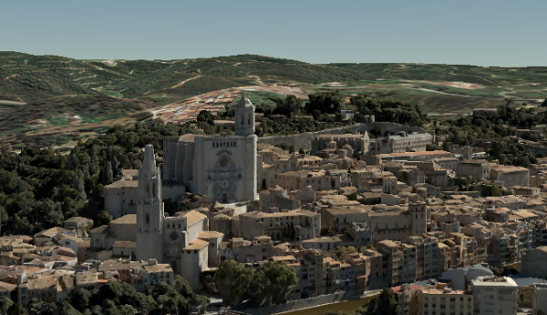

# Integrated Mesh Scene Layer (1.7)

Integrated mesh scene layers are generally created for citywide 3D mapping.  Integrated mesh scene layers include an entire surface and cannot be restyled.  Three-dimensional mesh data are typically captured by an automated process (e.g. drone) for constructing 3D objects out of large sets of overlapping imagery. The result integrates the original input image information as a textured mesh including 3D objects, such as buildings and trees, and elevation information.
 
**Examples**:<br />
Rancho Cucamonga Fire Station No. 3 [SLPK](https://www.arcgis.com/home/item.html?id=e0dfde9f11054aac8e15edbb8aa1631d). <br />
Rancho Cucamonga Fire Station No. 3 [service](https://www.arcgis.com/home/item.html?id=4028eb46e12e42f7889367bafcd6866d). <br />

*Example of integrated mesh scene layer*



## Integrated Mesh Scene Layer Structure
The Integrated Mesh scene layer is structured into a tree of multiple JSON files. Integrated mesh scene layers can be used to create a scene layer package (*.slpk) or a I3S service. A Integrated Mesh scene layer contains the following:

- [Layer description](3DSceneLayer.cmn.md)
- [Node Pages](nodes.cmn.md)
- geometryBuffer (binary)
- textures (binary)
- [Shared Resources](sharedResource.cmn.md)*

*Shared resources and feature data are deprecated as of version 1.7 and are only included for backwards compatibility.*

Integrated mesh scene layer packages can optionally contain a [hash table](slpk_hashtable.cmn.md) for faster indexing. 

*Example of integrated mesh scene layer structure*

```
.<host>/SceneServer/layers
	+--0 // scene layer document
	+-- nodePages
	|  +-- 0
	|  +-- (...)
	+-- nodes
	|  +--0
	|  |  +-- geometries
	|  |  |  +-- 0
	|  |  |  +-- 1
	|  |  |  +--(...)
	|  |  +-- textures
	|  |  |  +-- 0
	|  |  |  +-- 1
	|  |  |  +--(...)
	|  |  +-- shared 
	|  |  |  +-- sharedResource*
    |  +-- (...)

```
_* Only required for 1.6 compatability for older clients._ <br />

# HTTP API Overview 1.7

Spec version 1.7 is backwards compatible with 1.6.  For all of our clients to be able to read 1.7, sharedResources and nodeDocument are included but not used in 1.7.

The following API methods are available for integrated mesh scene layer:

**Scene layer document**

<table>
<tr>
    <td>Type</td>
    <td>JSON</td>
</tr>
<tr>
    <td>URL Templace</td>
    <td>http://serviceURL/layers/{layerID}</td>
</tr>
<tr>
    <td>Example</td>
    <td>http://my.server.com/IntegratedMeshSceneLayer/SceneServer/layers/0</td>
</tr>
<tr>
    <td>Description</td>
    <td>This is the root document for the service containing properties common to the entire layer. layerID: Integer. ID of the associated layer. Esri products expect this to be `0`.</td>
</tr>
</table>

**Node page** <br />

<table>
<tr>
    <td>Type</td>
    <td>JSON</td>
</tr>
<tr>
    <td>URL Templace</td>
    <td>`http://serviceURL/layers/{layerID}/nodepages/{nodePageID}/`</td>
</tr>
<tr>
    <td>Example</td>
    <td>http://my.server.com/IntegratedMeshSceneLayer/SceneServer/layers/0/nodepages/8</td>
</tr>
<tr>
    <td>Description</td>
    <td>`layerID`: Integer. ID of the associated layer. Esri products expect this to be `0`. `nodePageID`: Integer. ID of the associated node page.</td>
</tr>
</table>

**Textures**
<table>
<tr>
    <td>Type</td>
    <td>JPG, PNG, DDS, KTX </td>
</tr>
<tr>
    <td>URL Templace</td>
    <td>http://serviceURL/layers/{layerID}/nodes/{resourceID}/textures/{texture ID}</td>
</tr>
<tr>
    <td>Example</td>
    <td>http://my.server.com/IntegratedMeshSceneLayer/SceneServer/layers/0/nodes/98/textures/1
 </td>
</tr>
<tr>
    <td>Description</td>
    <td>The texture resource (image). layerID: Integer. ID of the associated layer. Esri products expect this to be `0`. resourceID: Integer. ID of the associated node. textureID: String. This ID returns one of the textures available for this node. The same texture may be available in different formats.</td>
</tr>
</table>

**Geometry**
<table>
<tr>
    <td>Type</td>
    <td>bin, draco</td>
</tr>
<tr>
    <td>URL Templace</td>
    <td>http://serviceURL/layers/{layerID}/nodes/{resourceID}/geometries/{geometry ID}</td>
</tr>
<tr>
    <td>Example</td>
    <td>http://my.server.com/IntegratedMeshSceneLayer/SceneServer/layers/0/nodes/98/geometries/1  </td>
</tr>
<tr>
    <td>Description</td>
    <td>The geometry resource (mesh information). layerID: Integer. ID of the associated layer. Esri products expect this to be `0`. resourceID: Integer. ID of the associated node.
geometryID: Integer. This ID returns one of the geometries available for this node. The same geometry may be available in a different format. </td>
</tr>
</table>

## HTTP API included for backward compatibility with 1.6

**Shared resources**
<table>
<tr>
    <td>Type</td>
    <td>JSON</td>
</tr>
<tr>
    <td>URL Templace</td>
    <td>http://serviceURL/layers/{layerID}/nodes/{resourceID}/shared</td>
</tr>
<tr>
    <td>Example</td>
    <td>http://my.server.com/IntegratedMeshSceneLayer/SceneServer/layers/0/nodes/98/shared  </td>
</tr>
<tr>
    <td>Description</td>
    <td>Legacy texture and material description. **Not used in 1.7.**. layerID: Integer. ID of the associated layer. ArcGIS clients expect this to be `0`. resourceID: Integer. ID of the associated node.  </td>
</tr>
</table>

**3D node index document**

<table>
<tr>
    <td>Type</td>
    <td>JSON</td>
</tr>
<tr>
    <td>URL Templace</td>
    <td>http://serviceURL/layers/{layerID}/nodes/{resourceID}</td>
</tr>
<tr>
    <td>Example</td>
    <td>http://my.server.com/IntegratedMeshSceneLayer/SceneServer/layers/0/nodes/98</td>
</tr>
<tr>
    <td>Description</td>
    <td>Description of the node. **Not used in 1.7.** layerID: Integer. ID of the associated layer. Esri clients expect this to be `0`. resourceID: Integer. ID of the associated resource.</td>
</tr>
</table>
