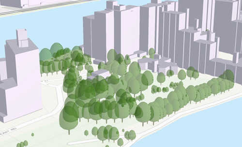

# Point Scene Layer (1.8)

Point scene layers contain point features and their attributes. Point scene layers are often used to visualize large amounts of 3D data like trees or buildings.  Most phenomena that can be visualized by 3D symbols can be displayed with a point scene layer.

**Examples**:<br />

NYC 2015 Tree Survey [SLPK](https://3dcities.maps.arcgis.com/home/item.html?id=d013ee07650d4a5192994b1fa1259a69)

NYC 2015 Tree Survey [service](https://3dcities.maps.arcgis.com/home/item.html?id=17b734b164ea47b1802a30ce0eb9c99f)

*Example of a point scene layer*



## Point Scene Layer Structure
The point scene layer is structured into a tree of multiple JSON files. Point scene layers can be represented as a scene layer package (*.slpk) or a I3S service. A point scene layer contains the following:

- [3DSceneLayer](3DSceneLayer.psl.md)
- [nodePages](nodePage.cmn.md)
- [featureData](featureData.cmn.md)*
- attribute (binary)
- geometryBuffer (binary)
- [3DNodeIndexDocument](3DNodeIndexDocument.cmn.md)*
- [statistics](statisticsInfo.cmn.md)
- [resources](resource.psl.md)

*Example of point scene layer structure*

```
.<host>/SceneServer/layers
	+--0 // scene layer document
	+-- nodepages
	|  +-- 0
	|  +-- (...)
	+-- nodes
	|  +--root
	|  |  +-- attributes
	|  |  |  +--f_2
	|  |  |  +--f_4
	|  |  |  +--(...)
	|  |  +-- features*
	|  |  |  +-- 0
	|  |  +-- geometries    
	|  |  |  +-- 0
	|  +-- (...)
	+--statistics
	|  +-- f_1
	|  | +--0
	|  +-- f_2
	|  | +--0
	|  +-- (...)
	+--resources
	    +-- styles
	 	| +-- root
```
\* <i>Only required for 1.6 compatability for older clients.</i>

# HTTP API Overview
The following API methods are available for Point Scene Layer:

**Scene layer document**

<table>
<tr>
    <td>Type</td>
    <td>JSON</td>
</tr>
<tr>
    <td>URL Template</td>
    <td>http://serviceURL/layers/{layerID}</td>
</tr>
<tr>
    <td>Example</td>
    <td>http://my.server.com/PointSceneLayer/SceneServer/layers/0</td>
</tr>
<tr>
    <td>Description</td>
    <td>This is the root document for the service containing properties common to the entire layer.<br/>
    <code>layerID</code>: Integer. ID of the associated layer. Esri products expect this to be `0`.</td>
</tr>
</table>

[3DSceneLayer](3DSceneLayer.psl.md)

**3D node index document**

<table>
<tr>
    <td>Type</td>
    <td>JSON</td>
</tr>
<tr>
    <td>URL Template</td>
    <td>http://serviceURL/layers/{layerID}/nodes/{nodeID}</td>
</tr>
<tr>
    <td>Example</td>
    <td>http://my.server.com/PointSceneLayer/SceneServer/layers/0/nodes/98</td>
</tr>
<tr>
    <td>Description</td>
    <td>Description of the node.<br/>
    <code>layerID</code>: Integer. ID of the associated layer. Esri clients expect this to be `0`.<br/>
    <code>nodeID</code>: Integer. ID of the associated resource.</td>
</tr>
</table>

[3DNodeIndexDocument](3DNodeIndexDocument.cmn.md)

**Attributes**
<table>
<tr>
    <td>Type</td>
    <td>bin</td>
</tr>
<tr>
    <td>URL Template</td>
    <td>http://serviceURL/layers/{layerID}/nodes/{nodeID}/attributes/f_{attributeID}/0</td>
</tr>
<tr>
    <td>Example</td>
    <td>http://my.server.com/PointSceneLayer/SceneServer/layers/0/nodes/98/attributes/f_8/0 </td>
</tr>
<tr>
    <td>Description</td>
    <td>The value for a specific attribute within a node.<br/>
    <code>layerID</code>: Integer. ID of the associated layer. Esri products expect this to be `0`.<br/>
    <code>nodeID</code>: Integer. ID of the associated resource. attributeID: Integer. ID of the specific attribute for the layer. </td>
</tr>
</table>

**Feature**
<table>
<tr>
    <td>Type</td>
    <td>JSON</td>
</tr>
<tr>
    <td>URL Template</td>
    <td>http://serviceURL/layers/{layerID}/nodes/{nodeID}/features/0</td>
</tr>
<tr>
    <td>Example</td>
    <td>http://my.server.com/PointSceneLayer/SceneServer/layers/0/nodes/98/features/0 </td>
</tr>
<tr>
    <td>Description</td>
    <td>Point location and feature IDs.<br/>
    <code>layerID</code>: Integer. ID of the associated layer. Esri products expect this to be `0`.<br/>
    <code>nodeID</code>: Integer. ID of the associated resource.<br/>
    <code>attributeID</code>: Integer. ID of the specific attribute for the layer. </td>
</tr>
</table>

[featureData](featureData.cmn.md)

**Geometry**
<table>
<tr>
    <td>Type</td>
    <td>bin, draco</td>
</tr>
<tr>
    <td>URL Template</td>
    <td>http://serviceURL/layers/{layerID}/nodes/{nodeID}/geometries/{geometryID}</td>
</tr>
<tr>
    <td>Example</td>
    <td>http://my.server.com/PointSceneLayer/SceneServer/layers/0/nodes/98/geometries/0 </td>
</tr>
<tr>
    <td>Description</td>
    <td>The geometry resource (mesh information). <br/>
    <code>layerID</code> Integer. ID of the associated layer. Esri products expect this to be `0`. <br/>
    <code>nodeID</code> Integer. ID of the associated node. <br/>
    <code>geometryID</code> Integer. This ID returns one of the geometries available for this node. The same geometry may be available in a different format. </td>
</tr>
</table>

The available gometry formats are specified in [geometryDefinitions](geometryDefinition.psl.md) on the layer document.

**Statistics**
<table>
<tr>
    <td>Type</td>
    <td>JSON</td>
</tr>
<tr>
    <td>URL Template</td>
    <td>http://serviceURL/layers/{layerID}/statistics/f_{attributeID}/0</td>
</tr>
<tr>
    <td>Example</td>
    <td> http://my.server.com/PointSceneLayer/SceneServer/layers/0/statistics/f_8/0  </td>
</tr>
<tr>
    <td>Description</td>
    <td>The statistics for the entire layer for a specific attribute.<br/>
    <code>layerID</code>: Integer. ID of the associated layer. Esri products expect this to be `0`.<br/>
    <code>attributeID</code>: Integer.  ID of the specific attribute for the layer</td>
</tr>
</table>

[statistics](statisticsInfo.cmn.md)

**Resources**
<table>
<tr>
    <td>Type</td>
    <td>JSON</td>
</tr>
<tr>
    <td>URL Template</td>
    <td>http://serviceURL/layers/{layerID}/resources/styles/{resourceType}/resource/{uniqueId}</td>
</tr>
<tr>
    <td>Example</td>
    <td> http://my.server.com/PointSceneLayer/SceneServer/layers/0/resources/styles/gltf/resource/5fe9e487e2230d61de71aff13744c5e9  </td>
</tr>
<tr>
    <td>Description</td>
    <td>A specific symbology resource.<br/>
    <code>layerID</code>: Integer. ID of the associated layer. Esri products expect this to be `0`.<br/>
    <code>resourceType</code>: String.  Possible values include <code>JPEG, PNG, GLB.GZ</code><br>
    <code>uniqueId</code>: Integer.  Unique ID of the specific resource for the symbol</td>
</tr>
</table>

[resources](resource.psl.md)
