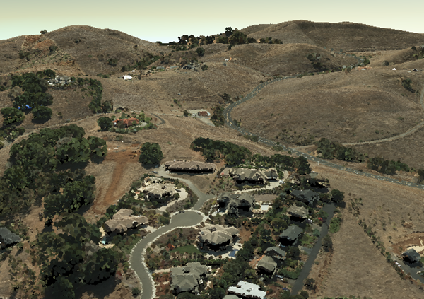

# I3S Point Cloud Scene Layer Specification

Specification for the I3S point cloud scene layer format.

# Content
[Point cloud scene layer documentation](documentation.pcsl.md)

- ../docs/: The documentation generated from the schema/ schema files for each profile type. 
- examples/: Examples for reference and testing.

# Version / Releases
I3S specification is versioned as major.minor, e.g. 1.6

Major number denotes a breaking change: 2.x I3S cannot be read by a 1.x client, and must be rejected.
To indicate patch releases between versions, releases are numbered with an additional patch number z, (x.y.z)

Latest I3S point cloud store version: **2.0**

Version 2.0 - present point cloud scene layer of this specification are licensed under the newer Creative Commons Attribution-NoDerivatives 4.0 International Public License.

## ArcGIS clients supporting latest release
- ArcGIS Pro 2.2 (beta 1)
- ArcGIS Enterprise 10.6.1
- ArcGIS Javascript API 4.7

# I3S specification
For general information about the I3S specification please see I3S schema guide.
