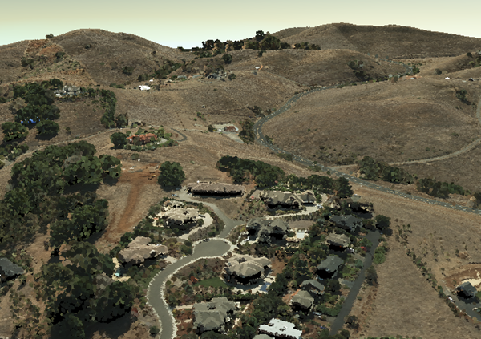

# Point Cloud Scene Layer

Point cloud scene layers quickly display large volumes of symbolized and filtered point cloud data. They are optimized for the displaying and sharing a variety of sensor data, including LiDAR.  

Point cloud scene layers are scalable, which allows for efficiency when working with large datasets.  While rendering very large point cloud datasets can be slow and limited by hardware, point cloud scene layers are efficient because they are rendered at an optimized point resolution for the specified area. 

Point cloud scene layers also support caching attributes like RGB, Intensity, Flags, Class Code, Returns, User Data, Point Source ID, GPS Time, Scan Angle and Near Infrared.  This allows client applications to update the symbology as well as query point information.

**Examples**:<br />
Morro Bay LiDAR data sample [SLPK](https://www.arcgis.com/home/item.html?id=496552d059644b4892c51ad06bdba8e2).<br />
Morro Bay LiDAR data sample [service](https://www.arcgis.com/home/item.html?id=908d6b986f314d51b1ff50b3bc321dfd).<br />


*Example of point cloud rendering*



## Point Cloud Scene Layer Structure
The point cloud scene layer is structured into a tree of multiple JSON files.  Point cloud scene layers can be represented as a scene layer package (*.slpk) or an I3S service. Since an *.slpk file can contain millions of documents, an [SLPK hash table](slpk_hashtable.pcsl.md) improves performance when scanning the slpk. A point cloud scene layer contains the following:

- [Layer description](layer.pcsl.md)
- Nodes containing [Geometry](defaultGeometrySchema.pcsl.md) and [Attributes](attributeInfo.pcsl.md)
- [Node pages](nodePageDefinition.pcsl.md)
- [Statistics](statistics.pcsl.md)

*Example of point cloud layer structure*

```
.<host>/SceneServer/layers
	+--0 // scene layer document
	+-- nodepages
	|  +-- 0
	|  +-- 1   
	|  +-- 2  
	|  +-- (...)
	+-- nodes
	|  +--0
	|  |  +-- attributes
	|  |  |  +--2 
	|  |  |  +--4
	|  |  |  +--(...)
	|  |  +-- geometries
	|  |  |  +-- 0
	+-- (...) 
	+--statistics
	|  +-- 2
	|  +-- 4
	|  +-- (...)
```
# HTTP API Overview

The following API methods are available for point cloud scene layer:

**Scene Layer Document**
<table>
<tr>
    <td>Type</td>
    <td>JSON</td>
</tr>
<tr>
    <td>URL Templace</td>
    <td>http://serviceURL/layers/{layerID}</td>
</tr>
<tr>
    <td>Example</td>
    <td>http://my.server.com/PointCloudSceneLayer/SceneServer/layers/0 </td>
</tr>
<tr>
    <td>Description</td>
    <td>This is the root document for the service that will contain properties common to the entire layer. layerID: Integer. ID of the associated layer. Esri products expect this to be `0`</td>
</tr>
</table>

[Layer description](layer.pcsl.md)

**Node Page**
<table>
<tr>
    <td>Type</td>
    <td>JSON</td>
</tr>
<tr>
    <td>URL Templace</td>
    <td>http://serviceURL/layers/{layerID}/nodepages/{nodePageID}</td>
</tr>
<tr>
    <td>Example</td>
    <td>http://my.server.com/PointCloudSceneLayer/SceneServer/layers/0/nodepages/8</td>
</tr>
<tr>
    <td>Description</td>
    <td>A page of nodes. layerID: Integer. ID of the associated layer. Esri products expect this to be `0`. nodePageID: Integer. ID of the associated node page.</td>
</tr>
</table>

[Node pages](nodePageDefinition.pcsl.md)

**Geometries**
<table>
<tr>
    <td>Type</td>
    <td>lepcc</td>
</tr>
<tr>
    <td>URL Templace</td>
    <td>http://serviceURL/layers/{layerID}/nodes/{nodeID}/geometries/0</td>
</tr>
<tr>
    <td>Example</td>
    <td>http://my.server.com/PointCloudSceneLayer/SceneServer/layers/0/nodes/98/geometries/0</td>
</tr>
<tr>
    <td>Description</td>
    <td>The point coordinate values within the node.<br/>
    <code>layerID</code>: Integer. ID of the associated layer. Esri products expect this to be `0`.<br/>
    <code>nodeID</code>: Integer. ID of the associated node.</td>
</tr>
</table>

**Attributes**
<table>
<tr>
    <td>Type</td>
    <td>bin</td>
</tr>
<tr>
    <td>URL Templace</td>
    <td>http://serviceURL/layers/{layerID}/nodes/{nodeID}/attributes/{attributeID}</td>
</tr>
<tr>
    <td>Example</td>
    <td>http://my.server.com/PointCloudSceneLayer/SceneServer/layers/0/nodes/20/attributes/64</td>
</tr>
<tr>
    <td>Description</td>
    <td>The value for a specific  attribute within a node.<br/>
    <code>layerID</code>: Integer. ID of the associated layer. Esri products expect this to be `0`.<br/>
    <code>nodeID</code>: Integer. ID of the associated node.<br/>
    <code>attributeID</code>: Integer.  ID of the specific attribute for the layer.</td>
</tr>
</table>

**Statistics**
<table>
<tr>
    <td>Type</td>
    <td>JSON</td>
</tr>
<tr>
    <td>URL Templace</td>
    <td>http://serviceURL/layers/{layerID}/statistics/{attributeID}</td>
</tr>
<tr>
    <td>Example</td>
    <td>http://my.server.com/PointCloudSceneLayer/SceneServer/layers/0/statistics/64 </td>
</tr>
<tr>
    <td>Description</td>
    <td>The statistics for the entire layer for a specific attribute.<br/>
    <code>layerID</code>: Integer. ID of the associated layer. Esri products expect this to be `0`.<br/>
    <code>attributeID</code>: Integer.  ID of the specific attribute for the layer.</td>
</tr>
</table>

[Statistics](statistics.pcsl.md)
