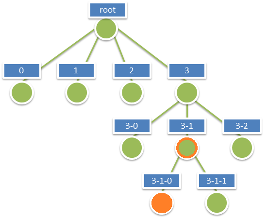
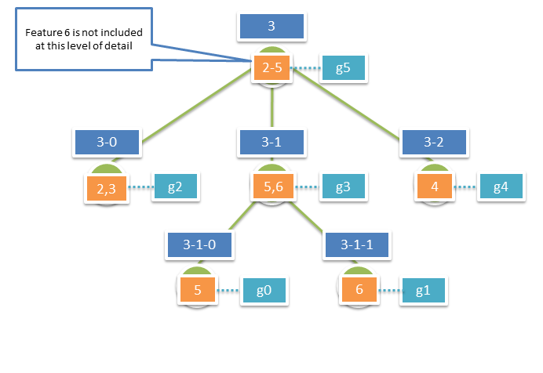

<h2>Esri Indexed 3d Scene (i3s/i3p)  
Format Specification</h2>

Version 1.3, rev. 51, 2014-05-13

<em>Editor:</em> Thorsten Reitz, Esri R&amp;D Center Zurich  
<em>Contributors:</em> Tamrat Belayneh, Javier Gutierrez, Pascal Müller, Dragan Petrovic, Johannes Schmid, Chengliang Shan, Ben Tan, Moxie Zhang

This document specifies the Indexed 3D Scene delivery
format used to stream 3D GIS data to mobile, web and desktop clients. It’s the
default format delivered by the ArcGIS Scene Service. The first sections of
this specification explain the conceptual structure of i3s, while the latter
sections provide a detailed implementation-level view.

<h2>Table of Contents</h2>

<ol>
	<li><a href="#_1">Requirements</a></li>
	<li><a href="#_2">The i3s Store – what goes into an Indexed 3D Scene?</a></li>
	<li><a href="#_3">The Index Structure</a></li>
	<li><a href="#_4">Level of Detail Concept</a>
	<ol>
		<li><a href="#_4_1">Feature LoD Trees</a></li>
		<li><a href="#_4_2">Integrated Mesh Pyramids</a></li>
	</ol></li>
	<li><a href="#_5">Coordinate Reference Systems</a></li>
	<li><a href="#_6">Structure of i3s Resources</a></li>
	<li><a href="#_7">JSON Resources Schema and Documentation</a>
	<ol>
		<li><a href="#_7_1">3dSceneServiceInfo.js</a></li>
		<li><a href="#_7_2">3dSceneLayerInfo.js</a></li>
		<li><a href="#_7_3">3dNodeIndexDocument.js</a></li>
		<li><a href="#_7_4">FeatureData.js</a></li>
		<li><a href="#_7_5">SharedResources.js</a></li>
		<li><a href="#_7_6">Textures.bin</a></li>
		<li><a href="#_7_7">Geometry.bin</a></li>
	</ol></li>
	<li><a href="#_8">Persistence</a>
	<ol>
		<li><a href="#_8_1">File System</a></li>
		<li><a href="#_8_2">CouchDB and other KV Stores</a></li>
		<li><a href="#_8_3">Packaged Indexed 3d Scenes (i3p files)</a></li>
	</ol></li>
</ol>

<h2><a name="_1">Requirements</a></h2>

The Esri Indexed 3d Scene (i3s) format and the corresponding package format (i3d) are
specified to fulfill this set of requirements:

<ol>
	<li><strong>User Experience first:</strong> Support a very good user experience – high interactivity, fast display, rendering of visually relevant features first</li>
	<li><strong>Scalability:</strong> Support very large scenes, with global extent and a very large number of features (up to 1 billion), as well as very heavy features</li>
	<li><strong>Reusability:</strong> Be useable both as the delivery format of the ArcGIS Scene Service, the ArcGIS "MultiPatch" Feature Service and as a format stored in a local file or database</li>
	<li><strong>Level of Detail:</strong> Support Level of Detail concepts for generalization of very large/heavy features and for "semantic" Level of Detail approaches</li>
	<li><strong>Distribution:</strong> Allow distribution of resources in very large data sets</li>
	<li><strong>Merging:</strong> Allow combination/merging with data from other scene data sets</li>
	<li><strong>User-controllable symbology:</strong> Support client-side symbology rendering</li>
	<li><strong>Extensibility:</strong> Be extensible to support new features (e.g. geometry types) and new platforms (e.g. by allowing definition of different materials/shaders)</li>
	<li><strong>Web Friendliness:</strong> Easy to handle and parse by web clients by using JSON and current web standards</li>
	<li><strong>Compatibility:</strong> Have a single structure that is useable by all ArcGIS Desktop, Web and native apps, cross platform and cross device usage, map well to GL APIS</li>
	<li><strong>Declarative:</strong> limit how much specific knowledge on the client-side is needed for format support (e.g. Index generation method only needs to be known while writing the format)</li>
	<li><strong>Follow REST/JSON API best practices:</strong> "Hypertext as the Engine of Application State" – make all resources navigable using hrefs from relevant other resources.</li>
</ol>

Some of these requirements (especially 8, 9, 10 and 12) are shared with the <a href="https://github.com/KhronosGroup/glTF">Khronos glTF format</a>, which is an upcoming standard for transferring 3D content. In this
version of i3s, the two formats share the specification of Geometry TypedArrays.

<h2><a name="_2">The i3s Store – what goes into an Indexed 3D Scene?</h2>

The basic unit of an Indexed 3D Scene is a Store, which contains individual resources (files) for a set of layers, index,
geometries, textures and more. Within such a store, the i3s format supports a
wide range of types of 2D and 3D content needed for 3D GIS scenes via <strong>profiling</strong> of this format. All content types
supported are listed in the following Table.

<table>
 <tr>
  <td><strong>Name <em>(example)</em></strong></td>
  <td><strong>Profile</strong></td>
  <td><strong>Fields</strong></td>
  <td><strong>Symbology</strong></td>
 </tr>
 <tr>
  <td>Integrated Mesh <em>(Acute3D)</em></td>
  <td><a href="../profiles/mesh-pyramids/mesh-pyramids.md">mesh-pyramids</a></td>
  <td>Yes</td>
  <td>No</td>
 </tr>
 <tr>
  <td>Individual Feature Mesh <em>(Multipatch)</em></td>
  <td><a href="../profiles/features-meshes/features-meshes.md">features-meshes</a></td>
  <td>Yes</td>
  <td>Yes</td>
 </tr>
  <tr>
  <td>Point Features <em>(GIS Data)</em></td>
  <td><a href="../profiles/features-points/features-points.md">features-points</a></td>
  <td>Yes</td>
  <td>Yes</td>
 </tr>
  <tr>
  <td>Line Features <em>(GIS Data)</em></td>
  <td><a href="../profiles/features-lines/features-lines.md">features-lines</a></td>
  <td>Yes</td>
  <td>Yes</td>
 </tr>
  <tr>
  <td>Polygon Features <em>(GIS Data)</em></td>
  <td><a href="../profiles/features-polygons/features-polygons.md">features-polygons</a></td>
  <td>Yes</td>
  <td>Yes</td>
 </tr>
 <tr>
  <td>Pointclouds <em>(LAS)</em></td>
  <td><a href="../profiles/pointclouds/pointclouds.md">pointclouds</a></td>
  <td>Vertex Attributes (VA)</td>
  <td>On VAs only</td>
 </tr>
 <tr>
  <td>Analytics <em>(Sensor Data, Simulations)</em></td>
  <td><a href="../profiles/analytics/analytics.md">analytics</a></td>
  <td>Yes</td>
  <td>Yes</td>
 </tr>
 </table>

<em>Table 1: i3s Content Types supported in i3s</em>

A single i3s store can contain data from multiple layers, but only one content type (one profile), as the
different content types typically require different indexing and Level of
Details methods to perform best. In many cases their schema also differs
substantially. However, a single cache can contain multiple layers that share
the same content type. Effectively these layers will share the same index, but
they can still be accessed individually. This reduces the number of calls to a
Scene Service, local database or the file system that need to be made by the client
drastically and furthermore allows reducing the total data volume. In addition,
layers in a shared stored can share resources, such as instance geometries.

<h2><a name="_3">The Index Structure</a></h2>

Esri i3s is, as the name implies, an indexed, partitioned 3D Scene format with some
similarities to <a href="http://code.google.com/p/regionator/wiki/Welcome">regionated KML</a>
or X3D Earth. The purpose of any index is to allow fast access to (blocks of)
relevant data. In an Indexed 3D Scene, the spatial extent is split into regions
with a roughly equal amount of data in them, and an access data structure – the
actual index – allows the client and the server to quickly discover which data the
client actually needs. Such a region of a 3D Scene is called a <em>Node</em>.
Node creation is capacity driven – the smaller the node capacity is, the smaller
the spatial extent of each node will be.

All Nodes have an ID that is unique throughout a cache. The ID format used is that of a treekey,
i.e. the key directly indicates the position of the node in the tree. Treekeys
allow sorting all resources on a single dimension and usually maintain 2D
spatial proximity in the 1D ordering. Treekeys are strings that in which levels are separated by dashes: 
"3-0-34-234-2" has 5 numeric elements, hence the node is on level 5 (root is level 0) and the node "1-2-34-234" is its parent.  
The root node always gets ID <code>"root"</code>. An example of this numbering pattern is shown in Figure 1 below.

<em>Figure 1: A sample Index Tree with Treekeys</em>

<h2><a name="_4">Level of Detail Concept</a></h2>

The Level of Detail concept introduced with this format specification covers several use cases, 
including splitting up very heavy features such as detailed buildings, very large features (coastlines, rivers, infrastructure), 
thinning/clustering for optimized visualization and semantic LODs, i.e. the usage of explicit, 
authored representations to be used for different viewing ranges. 

<table>
  <tr>
    <td><strong>Concept</strong></td>
    <td><strong>Definition</strong></td>
    <td><strong>Examples</strong></td>
  </tr>
  <tr>
    <td>Discrete</td>
    <td><em>Multiple representations</em>, a more detailed one fully replaces a co-arser representation</td>
    <td>Image Pyramid, Mesh Pyramid, Height map pyramid, Line/Polygon Generalization</td>
  </tr>
  <tr>
    <td>Continous</td>
    <td><em>Single representation</em> that is refined continuously</td>
    <td>SMTerrain, TVTerrain, BitLOD, Progressive Meshes</td>
  </tr>
  <tr>
    <td>Semantic</td>
    <td>Independent models for the same feature</td>
    <td>CityGML, BIM</td>
  </tr>
</table>

In i3s, Level of Detail and Aggregation of Geometries into single bigger meshes for
optimal rendering performance are orthogonal concepts. This enables Level of
Detail approaches for individual features in a node based via the concept of a
feature tree as well as aggregated LoD geometries for all features in a node
via the concept of a mesh pyramid. An example of the individual feature
approach is a single feature where in an inner Node the CityGML LoD1
representation is used, but has three LoD2 children (Ground Plate, Walls, Roof)
in the next inner Node. In the leaf node, the LoD3 representation is stored
with additional children representing Exterior Installations and other details.
In both cases, geometries are pre-aggregated into Geometry Array Buffers.

<h3><a name="_4_1">Feature LoD trees</a></h3>

In the feature-based Level of Detail approach each feature in a node can have
higher-detail or lower-detail representations. This approach enables clients to switch out representations by feature instead of by node, as in the mesh-pyramid case. 
A Feature in a Node has the following properties when using feature tree LoDs:

<ul>
	<li>A Feature can participate in a so-called LoD tree.</li>
	<li>A LoD tree has a single root feature.</li>
	<li>Each non-leaf participating Feature has a set of n <code>lodChildFeatures</code>. </li>
	<li>The client receives LoD information with the Node Index Document already, allowing making a choice whether to load a certain resource or not, and also to later identify which features replace which other features.</li>
	<li><code>lodChildFeatures</code> are guaranteed to be either in the same node or in a direct child node.</li>
	<li>Each Feature that participates in a LoD tree has a rank from 0..d.</li>
	<li>Each Feature that participates in a LoD tree and has a rank > 1 has a <code>rootFeature</code> reference. This reference enables the client to detect which features represent a single object, e.g. for picking purposes.</li>
</ul>

<em>Figure 2: Example Nodes + Feature LoD Index Tree. Orange boxes represent features, orange dotted lines indicate lodChildFeatures relationships.</em>

In the feature tree example above, the features 1 to 3 need to have the following properties set:

<table>
	<tr>
		<td><strong>Property</strong></td>
		<td><strong>Feature 1</strong></td>
		<td><strong>Feature 2</strong></td>
		<td><strong>Feature 3</strong></td>
	</tr>
	<tr>
		<td><strong>id</strong></td>
		<td><code>1</code></td>
		<td><code>2</code></td>
		<td><code>3</code></td>
	</tr>
	<tr>
		<td><strong>lodChildFeatures</strong></td>
		<td><code>[2, 3, 4]</code></td>
		<td><code>null</code></td>
		<td><code>null</code></td>
	</tr>
	<tr>
		<td><strong>lodChildNodes</strong></td>
		<td><code>["3-0", "3-0", "3-1"]</code></td>
		<td><code>null</code></td>
		<td><code>null</code></td>
	</tr>
	<tr>
		<td><strong>rootFeature</strong></td>
		<td><code>null</code></td>
		<td><code>1</code></td>
		<td><code>1</code></td>
	</tr>
	<tr>
		<td><strong>rank</strong></td>
		<td><code>0</code></td>
		<td><code>1</code></td>
		<td><code>1</code></td>
	</tr>
</table>

<h3><a name="_4_2">Integrated Mesh Pyramids</a></h3>

An Integrated Mesh typically is a single, fused geometry that represents multiple real-world features, such as a full block of buildings. 
Meshes are common and can be generated automatically from LiDAR, oblique imagery and stereophotogrammetry by many providers. 
They can also be built by aggregating, fusing and reducing individual features meshes.

In cases where such "integrated meshes" are encoded in i3s, it is expected to have a single feature per node, 
with LoD children in the direct descendants, filling up the entire index with representations. 
The figure below shows an example of such a tree.

<em>Figure 1: Example Nodes + Mesh Pyramid. Turquise boxes represent geometries, orange boxes represent features. Turquise dotted lines indicate Geometry -> Feature relationships.</em>

In this example, from root to leaf nodes, each node carries a single mesh representing one or multiple features, for a total count of six nodes and six meshes. 
This is typically the case with <em>integrated meshes</em>. Each of the features that is not a in a root node has a set of lodChildren, 
with the same set size as the number of node children.

The links between all meshes participating in a LoD tree are either created during the cache creation process, e.g. by breaking down a heavy and large feature, or they are predefined by the data provider, as it is the case with integrated meshes (Acute3D) data.
When using a mesh pyramid based LOD approach each interior node in the i3S tree has a set of features that represent the reduced LOD representation of all of the features covered by that interior node.  With mesh pyramids there is no concept of an LOD tree for an individual feature. Applications accessing the i3S tree are assumed to display all of the features in an internal node and stop there or instead descend further and use the features found in its child nodes, based on the required level of detail.

<h3><a name="_4_3">LoD Selection Metrics</a></h3>

A client needs information to determine whether a node’s contents are "good enough" to
render under constraints such as resolution, screen size, bandwidth and
available memory and target minimum quality goals. i3s originally used a single, unit-less "precision"
value that i3s generators add to each node. Clients use a heuristic to
determine what the resulting maximum on-screen error would be. However, it was
found that clients can benefit from having more information on the errors
introduced in LoD Generation. Thus, multiple metrics can be included, as in the
following example:

<pre><code>
"lodSelection": [
	{
		"metricType": "removedFeatureDiameter", 
		"maxError": 17.59,			
		"avgError": 12.34 
	},
	{
		"metricType": "removedFaceDiameter",
		"maxError": 11.11,
		"avgError": 2.19			
	},
	{
		"metricType": "screenSpaceRelative", 
		"maxError": 0.0034  
	}
]
</code></pre>

These metrics are used by clients to determine the optimal resource access patterns. Each i3s profile definition provides additional details on LoD Selection.

<h2><a name="_5">Coordinate Reference Systems</a></h2>

Indexed 3D Scenes have to fulfill several in part conflicting requirements when it comes
to the selection of spatial reference systems to use:

<ul>
	<li>Minimal reprojection on client side needed (such as "bending" of large features to the ellipsoid from a projected CRS to an internal geocentric CRS)</li>
	<li>Support true global extent data sets</li>
	<li>Ensure consistency between nodes of a single layer</li>
	<li>Ensure consistency of positions across multiple layers, potentially created from different source projections</li>
	<li>Render easily in Planar (Projected Cartesian) and Globe (Geocentric Cartesian) modes</li>
	<li>Support local data with very high positional accuracy</li>
	<li>Support global data sets with high positional accuracy</li>
</ul>

To match these requirements, the following approach is taken:

<ol>
	<li>Use of a single, global (bounds -180.0000, -90.0000, 180.0000, 90.0000) Geographic CRS for geographical location in all index-relevant data structures. Elevation and node minimum bounding sphere radius are given in meters. Allowed EPSG codes:</li>
		<ol>
			<li>EPSG:4326 (WGS84)</li>
		</ol>
	<li>Use of a geographic or of various projected CRS, with meter-based x,y,z axes and with a per-node offset (from the center point of the node’s minimum bounding sphere) and using the WGS84 datum, for all vertex positions. Allowed EPSG codes:
	<li>
		<ol>
			<li>EPSG:4326 (WGS84)</li>
			<li>EPSG:32601 to EPSG:32660, EPSG:32701 to EPSG:32760 (UTM WGS84)</li>
			<li>EPSG:3857 (Web Mercator WGS84) or EPSG:32662 (Plate Carrée WGS84) for large extent datasets (~12° to 360° horizontal extent)</li>
		</ol>
	<li>3.	Axis Order: All positions, independent of the used geographic or projected CRS, use the Easting, Northing, Elevation (x,y,z) axis order. The Z axis points upwards towards the sky.
</ol>

<h2><a name="_6">Structure of i3s resources</a></h2>

The i3s format contains different components – node index documents (NIDs), feature
data, textures, geometry and resources shared across features of a given node.
Feature data, textures, geometry and shared resources are all called resources
and are always attached to a node.

Figure 4: Structure of a single Node and its attached Resources

Per node, there is exactly one Node Index Document and one Shared Resource. Feature Data,
Geometry files and Texture files are split into bundles for optimal network
transfer and client-side reactivity. This allows balancing between index size,
feature splitting (with a relatively large node capacity between 1MB and 10MB)
and optimal network usage (with a smaller bundle size, usually in the range of
64kB to 512kB).

There are always an equal number <em>n</em> of Feature Data and Geometry resources, and each set contains
the corresponding data elements to be able to render a complete feature.
Textures are not tightly coupled to bundles due to the fact that they can also
be in the node as part of a shared resource that bubbled up. For each texture
(atlas) in the Node (<strong>m</strong>), the number of Texture resources
created is then equal <strong>m*Texture LoD Steps</strong>. The following
figure illustrates an example set of bundles within a node:

Figure 5: Detailed Node Structure

<h2><a name="_7">JSON Resources Schema and Documentation</a></h2>

This section provides a detailed, logical-level specification for each of the
resource types.

<h3><a name="_7_1">3dSceneServiceInfo.js</a></h3>

The 3dSceneServiceInfo file is a JSON file that describes the capability and data
sets offered by an instance of a 3dSceneService.

The 3dSceneServiceInfo has the following structure:

Figure 6: Logical schema of the 3dSceneServiceInfo document

This file is not generated by the authoring tools and is not part of a i3p package file.
It is generated solely by the 3D Scene Server for each service instance. Its
description is contained here only for reference.

<h4>Class 3dSceneServiceInfo</h4>

The 3dSceneServiceInfo is the major object in the 3dSceneServiceInfo document.
There is always exactly one 3dSceneServiceInfo object in the document, which
describes a running SceneService instance. 

<table>
	<tr>
		<td><strong>Name</strong></td>
		<td><strong>Type</strong></td>
		<td><strong>Description</strong></td>
	</tr>
	<tr>
		<td>serviceName</td>
		<td>String</td>
		<td>The type of the service; always SceneService.</td>
	</tr>
	<tr>
		<td>serviceVersion</td>
		<td>String</td>
		<td>The version of the service protocol/REST endpoint.</td>
	</tr>
	<tr>
		<td>supportedBindings</td>
		<td>String[1..*]</td>
		<td>the list of bindings, should we ever need to add new bindings in addition to the REST binding initially supported</td>
	</tr>
	<tr>
		<td>supportedOperations</td>
		<td>String[1..3]</td>
		<td>Supported profiles of the service from the choice {Base, Dynamic, Editing}.</td>
	</tr>
</table>

<em>Table 3: Attributes of the Class <strong>3dSceneServiceInfo</strong> within the 3dSceneServiceInfo document</em>

<h4>Class Layer</h4>

In the 3dSceneServiceInfo document, the Layer object provides a reference so that
clients know which Layers are served by a given service. 

<table>
	<tr>
		<td><strong>Name</strong></td>
		<td><strong>Type</strong></td>
		<td><strong>Description</strong></td>
	</tr>
	<tr>
		<td>id</td>
		<td>long</td>
		<td>The ID of this layer, unique within a 3dSceneService.</td>
	</tr>
	<tr>
		<td>name</td>
		<td>String</td>
		<td>The version of the service protocol/REST endpoint.</td>
	</tr>
	<tr>
		<td>alias</td>
		<td>String[0..1]</td>
		<td>An optional display alias for the layer.</td>
	</tr>
	<tr>
		<td>geometryType</td>
		<td>String</td>
		<td>The geometry type of the cache; selected from <code>{FeatureMesh, IntegratedMesh, RasterTerrain, TINTerrain, Point, Line, Polygon, PointCloud}</code>.</td>
	</tr>
	<tr>
		<td>lodType </td>
		<td>String[0..1]</td>
		<td>The type of level of detail information present; selected from <code>{FeatureTree, MeshPyramid}</code>. The default is <code>FeatureTree</code>.</td>
	</tr>
	<tr>
		<td>href</td>
		<td>URL</td>
		<td>The relative URL to the Layer resource giving full information on the Layer's schema and drawing info</td>
	</tr>
</table>

<em>Table 4: Attributes of the Class Layer within the 3dSceneServiceInfo document</em>

<h3><a name="_7_2">3dSceneLayerInfo.js</a></h3>

The 3dSceneLayerInfo file is a JSON file that describes the properties of a single
layer in a store, including the default symbology to use. It shares the
definition of this default symbology with the web scene item JSON file. The
3dSceneLayerInfo has the following structure:

<em>Figure 7: Logical schema of the 3dSceneLayerInfo document</em>

<h4>Class 3dSceneLayerInfo</h4>

The 3dSceneLayerInfo is the major object in the 3dSceneLayerInfo document. There is
always exactly one 3dSceneLayerInfo object in the document, which describes a
Layer.

<table>
	<tr>
		<td><strong>Name</strong></td>
		<td><strong>Type</strong></td>
		<td><strong>Description</strong></td>
	</tr>
	<tr>
		<td>id</td>
		<td>long</td>
		<td>Unique numeric ID of the Layer.</td>
	</tr>
	<tr>
		<td>version</td>
		<td>string</td>
		<td>The ID of the last update session in which any resource belonging to this layer has been updated.</td>
	</tr>
	<tr>
		<td>name</td>
		<td>string</td>
		<td>The name of this layer.</td>
	</tr>
	<tr>
		<td>alias</td>
		<td>string[0..1]</td>
		<td>The display alias to be used for this layer.</td>
	</tr>
	<tr>
		<td>description</td>
		<td>string[0..1]</td>
		<td>Description string for this layer.</td>
	</tr>
	<tr>
		<td>copyrightText</td>
		<td>String[0..1]</td>
		<td>Copyright and usage information for the data in this layer.</td>
	</tr>
	<tr>
		<td>capabilities</td>
		<td>String[1..3]</td>
		<td>Capabilities from the Set <code>{View, Query, Edit}</code> that are possible on this layer. If not served by a 3DSceneServer (e.g. exported by CE), "View" only.</td>
	</tr>
</table>

<em>Table 5: Attributes of the Class <strong>Node</strong> within the 3dSceneLayerInfo</em>

<h4>Class Store</h4>

While Layers are the user-visible entry point to the 3dSceneServer resources (for web
scene authoring and viewing), internally the service uses so-called stores. A
store can contain 1…* layers, which will share a common index and set of nodes,
as well as resources. The Store object describes the exact physical storage of
a Layer and enables the client to detect when multiple Layers are served from
the same Store. Storing multiple layers in a single store – and thus having
them share resources – enables efficient serving of many layers of the same
content type, but with different attribute schemas or different symbology
applied.

<table>
	<tr>
		<td><strong>Name</strong></td>
		<td><strong>Type</strong></td>
		<td><strong>Description</strong></td>
	</tr>
	<tr>
		<td>id</td>
		<td>UUID</td>
		<td>A Store ID, unique across a SceneServer. Enables the client to discover which layers a part of a common store, if any.</td>
	</tr>
	<tr>
		<td>profile</td>
		<td>String</td>
		<td>Indicates which profile this scene store fulfills. 
		One of <code>{features-meshes, features-polygons, features-points, features-lines, analytics, meshpyramids, pointclouds, symbols}</code>.</td>
	</tr>
	<tr>
		<td>rootNode</td>
		<td>URL</td>
		<td>relative URL to root node resource.</td>
	</tr>
	<tr>
		<td>version</td>
		<td>String</td>
		<td>Format version of this resource; used here again if this store hasn't been served by a 3D Scene Server.</td>
	</tr>
	<tr>
		<td>extent</td>
		<td>Double[4]</td>
		<td>The 2D spatial extent (xmin, ymin, xmax, ymax) of this store, in the horizontal geographicCRS</td>
	</tr>
	<tr>
		<td>geographicCRS</td>
		<td>URL</td>
		<td>The horizontal CRS used for all minimum bounding spheres (mbs) in this store, identified by an OGC URL.</td>
	</tr>
	<tr>
		<td>projectedCRS</td>
		<td>URL</td>
		<td>The horizontal CRS used for all "vertex positions" in this store, identified by an OGC URL.</td>
	</tr>
	<tr>
		<td>nidEncoding</td>
		<td>MIMEType</td>
		<td>MIME type for the encoding used for the Node Index Documents; format:  
		<code>application/vnd.esri.i3s.json+gzip; version=1.3</code></td>
	</tr>
	<tr>
		<td>featureEncoding</td>
		<td>MIMEType</td>
		<td>MIME type for the encoding used for the Feature Data Resources; format: 
		<code>application/vnd.esri.i3s.json+gzip; version=1.3</code></td>
	</tr>
	<tr>
		<td>geometryEncoding</td>
		<td>MIMEType</td>
		<td>MIME type for the encoding used for the Geometry Resources; format: 
		<code>application/octet-stream; version=1.3</code></td>
	</tr>
	<tr>
		<td>textureEncoding</td>
		<td>MIMEType</td>
		<td>MIME type for the encoding used for the Texture Resources</td>
	</tr>
	<tr>
		<td>lodType</td>
		<td>String[0..1]</td>
		<td>The type of level of detail information present; selected from <code>{FeatureTree, MeshPyramid}</code>. The default is <code>FeatureTree</code>.</td>
	</tr>
	<tr>
		<td>indexingScheme</td>
		<td>String</td>
		<td>Indexing Scheme used; selected from <code>{esriRTree, QuadTree, AGOLTilingScheme}</code></td>
	</tr>
	<tr>
		<td>featureOrdering</td>
		<td>String[1..3]</td>
		<td>Ordered list of keywords indicating the ordering scheme applied to sort features within a node; selected from <code>{ID, Prominence, Layer}</code></td>
	</tr>
</table>

<em>Table 6: Attributes of the Class <strong>Store</strong> within the 3dSceneServiceInfo document</em>

<h4>Class Field</h4>

The Field class is used to provide schema information for this 3dSceneLayer.

<table>
	<tr>
		<td><strong>Name</strong></td>
		<td><strong>Type</strong></td>
		<td><strong>Description</strong></td>
	</tr>
	<tr>
		<td>name</td>
		<td>string</td>
		<td>The name of the field.</td>
	</tr>
	<tr>
		<td>type</td>
		<td>string</td>
		<td>The type of the field, from this enum: <code>{esriFieldTypeBlob, esriFieldTypeDate, esriFieldTypeDouble, esriFieldTypeGeometry, esriFieldTypeGlobalID, esriFieldTypeGUID, esriFieldTypeInteger, esriFieldTypeOID, esriFieldTypeRaster, esriFieldTypeSingle, esriFieldTypeSmallInteger, esriFieldTypeString, esriFieldTypeXML}</code></td>
	</tr>
	<tr>
		<td>alias</td>
		<td>string[0..1] </td>
		<td>The display alias to be used for this field.</td>
	</tr>
</table>

<em>Table 7: Attributes of the Class <strong>Field</strong> within the 3dSceneLayerInfo</em>

<h4>Class IndexScheme</h4>

The IndexScheme class declaratively describes computational and structural
properties of the index used within an i3s store. This information can be used
by clients to better understand how to work with the index.

<table>
	<tr>
		<td><strong>Name</strong></td>
		<td><strong>Type</strong></td>
		<td><strong>Description</strong></td>
	</tr>
	<tr>
		<td>name</td>
		<td>string</td>
		<td>The name of the field.</td>
	</tr>
	<tr>
		<td>inclusive</td>
		<td>boolean</td>
		<td>true indicates that the extent and mbs of all children nodes is fully within their parent nodes' extent/mbs</td>
	</tr>
	<tr>
		<td>dimensionality</td>
		<td>int</td>
		<td>The number of dimensions in which this index differentiates.</td>
	</tr>
	<tr>
		<td>childrenCardinality</td>
		<td>int[2]</td>
		<td>min/max number of children per node.</td>
	</tr>
	<tr>
		<td>neighborCardinality</td>
		<td>int[2]</td>
		<td>min/max number of neighbors per node.</td>
	</tr>
</table>

<em>Table 8: Attributes of the Class <strong>IndexScheme</strong> within the 3dSceneLayerInfo</em>

<h4>Class WebCimDrawingInfo</h4>

WebCimDrawingInfo and the associated classes contain the default symbology for this Layer. This
part matches the WebCIM (Cartographic Information Model) as used by the other
Esri REST services.

<h3><a name="_7_3">3dNodeIndexDocument.js</a></h3>

The 3dNodeIndexDocument JSON file describes a single index node within a store, with links to other
nodes (children, sibling, and parent), links to feature data, geometry data and
texture data resources, metadata such as metrics used for LoD selection, its
spatial extent and a list of features that the node contains.

Depending on the geometry and lodTypes used, a Node document can be tuned towards being
light-weight or more heavy-weight. It is the means clients have to further
decide which data to retrieve. The features list already provides sufficient
data for simple visualization by rendering the centroids as point features or
the Minimum Bounding Sphere as spheres.

The 3dNodeIndexDocument has the following structure:

Figure 8: Logical schema of the 3dNodeIndexDocument

<h4>Class Node</h4>

The Node is the root object in the 3dNodeIndexDocument. There is always exactly one Node
object in a 3dNodeIndexDocument.

<table>
	<tr>
		<td><strong>Name</strong></td>
		<td><strong>Type</strong></td>
		<td><strong>Description</strong></td>
	</tr>
	<tr>
		<td>id</td>
		<td>String TreeKey</td>
		<td>Tree Key ID, unique within the store. The root node is always "root", all others follow the pattern "2-4-0-15-2". At each leve in a subtree, numbering starts at 0.</td>
	</tr>
	<tr>
		<td>level</td>
		<td>int</td>
		<td>Explicit level of this node within the index tree. The lowest level is 0.</td>
	</tr>
	<tr>
		<td>version</td>
		<td>UUID</td>
		<td>The version (store update session ID) of this node.</td>
	</tr>
	<tr>
		<td>mbs</td>
		<td>double[4]</td>
		<td>An array of four doubles, corresponding to x, y, z and radius of the minimum bounding sphere of a node.</td>
	</tr>
	<tr>
		<td>created</td>
		<td>timestamp[0..1]</td>
		<td>Creation date of this node in UTC.</td>
	</tr>
	<tr>
		<td>expires</td>
		<td>timestamp[0..1]</td>
		<td>Expiration date of this node in UTC.</td>
	</tr>
	<tr>
		<td>transform</td>
		<td>Double[16]</td>
		<td>Optional, 3D (4x4) transformation matrix expressed as a linear array of 16 values.</td>
	</tr>
</table>

<em>Table 9: Attributes of the Class <strong>Node</strong> within the NodeIndexDocument</em>

<h4>Class NodeReference</h4>

A NodeReference is a pointer to another node – the parent, a child or a
neighbor. NodeReferences contain a relative URL pointing to the referenced NID,
as well as a set of metainformation that can be used by the client to determine
whether to load that node or not, as well as maintaining store consistency.

<table>
	<tr>
		<td><strong>Name</strong></td>
		<td><strong>Type</strong></td>
		<td><strong>Description</strong></td>
	</tr>
	<tr>
		<td>id</td>
		<td>string</td>
		<td>Tree Key ID (e.g. "1-3-0-5") of the referenced node.</td>
	</tr>
	<tr>
		<td>mbs</td>
		<td>double[4]</td>
		<td>An array of four doubles, corresponding to x, y, z and radius of the minimum bounding sphere of the referenced node.</td>
	</tr>
	<tr>
		<td>href</td>
		<td>URL</td>
		<td>The relative URL to the referenced node resource.</td>
	</tr>
	<tr>
		<td>version</td>
		<td>UUID</td>
		<td>Version (store update session ID) of the referenced node.</td>
	</tr>
	<tr>
		<td>featureCount</td>
		<td>int</td>
		<td>Number of features in the referenced node and its descendants, down to the leaf nodes.</td>
	</tr>
</table>

<em>Table 10: Attributes of the Class <strong>NodeReference</strong> within the NodeIndexDocument</em>

<h4>Class Resource</h4>

Resource objects are pointers to different types of resources related to a node, such as
the feature data, the geometry attributes and indices, textures and shared
resources.

<table>
	<tr>
		<td><strong>Name</strong></td>
		<td><strong>Type</strong></td>
		<td><strong>Description</strong></td>
	</tr>
	<tr>
		<td>href</td>
		<td>string</td>
		<td>The relative URL to the referenced resource.</td>
	</tr>
	<tr>
		<td>layerContent</td>
		<td>string[1..*]</td>
		<td>The list of layer names that indicates which layer features in the bundle belongs to. The client can use this information to selectively download bundles.</td>
	</tr>
	<tr>
		<td>featureRange</td>
		<td>int[2]</td>
		<td>Optional attributed only used with featureData resources that provides inclusive indices of the features list in this node that indicate which features of the node are located in this bundle.</td>
	</tr>
	<tr>
		<td>multiTexturedBundle</td>
		<td>boolean</td>
		<td><code>true</code> if the bundle contains multiple textures to tell the client in advance how to handle that bundle. </td>
	</tr>
</table>

<em>Table 11: Attributes of the Class <strong>Resource</strong> within the NodeIndexDocument</em>

<h4>Class Feature</h4>

Features are representations of the geographic objects stored in a layer. 
In the 3dNodeIndexDocument, these objects define relationships, e.g. for linking feature representations of multiple LoDs.

<table>
	<tr>
		<td>id</td>
		<td>long</td>
		<td>An ID of the Feature, unique within the store (important to note when using Features from multiple stores!)</td>
	</tr>
	<tr>
		<td>mbs</td>
		<td>double[4]</td>
		<td>An array of four doubles, corresponding to x, y, z and radius of the minimum bounding sphere of the referenced node.</td>
	</tr>
	<tr>
		<td>lodChildren</td>
		<td>long[0..*]</td>
		<td>IDs of Features in a lower LOD level, which can replace this feature when loaded.</td>
	</tr>
	<tr>
		<td>rank</td>
		<td>int[0..1]</td>
		<td>The LOD level of this feature. Only required for Features that participate in a LOD tree and are not root features of that LOD tree.</td>
	</tr>
	<tr>
		<td>root</td>
		<td>long[0..1]</td>
		<td>The ID of the root node of a feature LOD tree that this feature participates in. Only required if the feature participates in a LOD tree.</td>
	</tr>
</table>

<em>Table 12: Attributes of the Class <strong>Feature</strong> within the NodeIndexDocument</em>

<h4>Class LodSelection</h4>

A LodSelection object provides information on a given metric determined during
the cooking process of an i3s store. This metric can be used by the client to
determine whether a representation is of the right quality level for rendering
or whether a different representation is needed. 

Cookers can add as many <code>LodSelection</code> objects as desired but must provide
one as soon as the layer’s <code>lodType</code> is not null. Of the three
min/avg/max values, typically only one or two are used.

<table>
	<tr>
		<td><strong>Name</strong></td>
		<td><strong>Type</strong></td>
		<td><strong>Description</strong></td>
	</tr>
	<tr>
		<td>metricType</td>
		<td>String</td>
		<td>The name of the error metric, one of <code>{removedFeatureDiameter, removedFaceDiameter, vertexMergeDistance, ...}</code></td>
	</tr>
	<tr>
		<td>maxValue</td>
		<td>float[0..1]</td>
		<td>maximum metric value, expressed in the CRS of the vertex coordinates or in reference to other constants such as screen size</td>
	</tr>
	<tr>
		<td>avgValue</td>
		<td>float[0..1]</td>
		<td>maximum metric value, expressed in the CRS of the vertex coordinates or in reference to other constants such as screen size</td>
	</tr>
	<tr>
		<td>minValue</td>
		<td>float[0..1]</td>
		<td>minimum metric value, expressed in the CRS of the vertex coordinates or in reference to other constants such as screen size</td>
	</tr>
</table>

<em>Table 13: Attributes of the Class <strong>LodSelection</strong> within the NodeIndexDocument</em>

<h3><a name="_7_4">FeatureData.js</a></h3>

The FeatureData JSON file(s) contain geographical features with a set of attributes, accessors
to geometry attributes and other references to styling or materials.

Features have the following structure:

<em>Figure 9: Logical schema of the FeatureData document</em>

<h4>Class Feature</h4>

A Feature is a single object within a GIS data set, usually
representative of a feature present in the real, geographic world.

<table>
	<tr>
		<td><strong>Name</strong></td>
		<td><strong>Type</strong></td>
		<td><strong>Description</strong></td>
	</tr>
	<tr>
		<td>id</td>
		<td>long</td>
		<td>Feature ID, unique within the store.</td>
	</tr>
	<tr>
		<td>position</td>
		<td>double[2]</td>
		<td>An array of two doubles, giving the x,y (easting/northing) position of this feature's minimum bounding sphere center, in the projectedCRS.</td>
	</tr>
	<tr>
		<td>pivotOffset</td>
		<td>double[3]</td>
		<td>An array of three doubles, providing an optional, "semantic" pivot offset that can be used to e.g. correctly drape tree symbols.</td>
	</tr>
	<tr>
		<td>mbb</td>
		<td>double[6]</td>
		<td>An array of six doubles, corresponding to xmin, ymin, zmin, xmax, ymax and zmax of the minimum bounding box of the feature, expressed in the projectedCRS, without offset. The mbb can be used with the Feature’s Transform to provide a LOD0 representation without loading the GeometryAttributes.</td>
	</tr>
	<tr>
		<td>layer</td>
		<td>string</td>
		<td>The name of the Feature Class this feature belongs to.</td>
	</tr>
</table>

<em>Table 14: Attributes of the Class <strong>Feature</strong> within the FeatureData document</em>

<h4>Class FeatureAttribute</h4>

A FeatureAttribute is a field carrying a value.

<table>
	<tr>
		<td><strong>Name</strong></td>
		<td><strong>Type</strong></td>
		<td><strong>Description</strong></td>
	</tr>
	<tr>
		<td>name</td>
		<td>String</td>
		<td>The name of the attribute.</td>
	</tr>
	<tr>
		<td>value</td>
		<td>String</td>
		<td>The value of the attribute.</td>
	</tr>
</table>

<em>Table 15: Attributes of the Class <strong>FeatureAttribute</strong> within the FeatureData document</em>

<h4>Class AbstractGeometry</h4>

This is the superclass for all types of geometry definitions used in i3s.

<table>
	<tr>
		<td><strong>Name</strong></td>
		<td><strong>Type</strong></td>
		<td><strong>Description</strong></td>
	</tr>
	<tr>
		<td>id</td>
		<td>Long</td>
		<td>Referenceable, unique ID of the Geometry in this cache.</td>
	</tr>
	<tr>
		<td>type</td>
		<td>String</td>
		<td>The type denotes whether the following geometry is defined by using array buffer views (ArrayBufferView), as an internal reference (GeometryReference), as a reference to a shared Resource (SharedResourceReference) or embedded (Embedded).</td>
	</tr>
	<tr>
		<td>transformation</td>
		<td>double[16]</td>
		<td>3D (4x4) transformation matrix expressed as a linear array of 16 values.</td>
	</tr>
</table>

<em>Table 16: Attributes of the Class <strong>AbstractGeometry</strong> within the FeatureData document</em>

<h4>Class MultiComponentGeometry</h4>

Objects of this type extend AbstractGeometry and include a definition of a geometry that may have
multiple materials, textures, or use multiple regions from a texture. One
Feature can have multiple geometries, which can consist of multiple components.
They do not have additional fields, only references to <a href="#_7_4_Components">Components</a>.

<h4>Class SingleComponentGeometry</h4>

Objects of this type extend AbstractGeometry and use only one texture and one material. Components may
only be declared to denote subimage regions.

<table>
	<tr>
		<td><strong>Name</strong></td>
		<td><strong>Type</strong></td>
		<td><strong>Description</strong></td>
	</tr>
	<tr>
		<td>material</td>
		<td>URI</td>
		<td>i3s Pointer reference to the material definition in this node's shared resource, from its root element. If present, used for the entire geometry.</td>
	</tr>
	<tr>
		<td>texture</td>
		<td>URI</td>
		<td>i3s Pointer reference to the material definition in this node's shared resource, from its root element. If present, used for the entire geometry.</td>
	</tr>
</table>

<em>Table 17: Attributes of the Class <strong>FeatureAttribute</strong> within the FeatureData document</em>

<h4><a name="_7_4_Components">Class Component</a></h4>

Component objects provide information on parts of the geometry they
belong to, specifically with which material and texture to render them.

<table>
	<tr>
		<td><strong>Name</strong></td>
		<td><strong>Type</strong></td>
		<td><strong>Description</strong></td>
	</tr>
	<tr>
		<td>id</td>
		<td>Long</td>
		<td>The ID of the component, only unique within the Geometry</td>
	</tr>
	<tr>
		<td>materialID</td>
		<td>UUID</td>
		<td>ID of the material, as defined in the shared resources bundle, to use for rendering this component</td>
	</tr>
	<tr>
		<td>textureID</td>
		<td>Long[0..1]</td>
		<td>Optional ID of the texture, as defined in shared resources, to use with the material to render this component</td>
	</tr>
	<tr>
		<td>regionID</td>
		<td>Long[0..1]</td>
		<td>Optional ID of a texture atlas region which to use with the texture to render this component</td>
	</tr>
</table>

<em>Table 18: Attributes of the Class <strong>Component</strong> within the FeatureData document</em>

<h4>Class GeometryAttribute</h4>

Each GeometryAttribute object is an accessor, i.e. a view, into an arraybuffer. There are two types of GeometryAttributes – VertexAttributes and
FaceAttributes. While the first describe properties that are valid for a single
vertex, the second are used to describe faces and other structures by providing
a set of indices. As an example, the <code>faces.position</code> index attribute is used to define
which vertex positions make up a face.

<table>
	<tr>
		<td><strong>Name</strong></td>
		<td><strong>Type</strong></td>
		<td><strong>Description</strong></td>
	</tr>
	<tr>
		<td>byteOffset</td>
		<td>long</td>
		<td>The starting byte position where the required bytes begin</td>
	</tr>
	<tr>
		<td>count</td>
		<td>long</td>
		<td>The number of elements. Multiply by number of bytes used for valueType to know how many bytes need to be read.</td>
	</tr>
	<tr>
		<td>valueType</td>
		<td>String</td>
		<td>The element type, from <code>{UInt8, UInt16, Int16, Int32, Int64 or Float32, Float64}</code></td>
	</tr>
	<tr>
		<td>valuesPerElement</td>
		<td>short</td>
		<td>The number of values need to make a valid element (such as 3 for a xyz position)</td>
	</tr>
	<tr>
		<td>componentIndices</td>
		<td>int[0…*]</td>
		<td>An optional array that indicates how many of the elements in this view belong to the first, second and consecutive components of the geometry. The number of entries in this array, when present, has to be equal to the number of entries in the components List of the enclosing Geometry object. The entire field is optional when no components have been declared for this Geometry.</td>
	</tr>
</table>

<em>Table 19: Attributes of the Class <strong>FeatureAttribute</strong> within the FeatureData document</em>

<h3><a name="_7_5">SharedResources.js</a></h3>

Shared resources are models or textures that can be shared among features within the
same store. They are stored as a JSON file entirely, comparable to the encoding
used for geometry and textures in a 3ws 2.2 file. Each node has a shared
resource which contains materials and symbols used by more than a single
feature in that node or in features which are stored in the subtree of the
current node. This approach ensures an optimal distribution of shared resources
across nodes, while maintaining the node-based updating process.

<em>Figure 10: Logical schema of the SharedData document</em>

<h4>Class SharedResource</h4>

The <code>SharedResource</code> class collects Material definitions, Texture definitions, Shader definitions and geometry
symbols that need to be instanced.

<h4>Class Material</h4>

Materials describe how a Feature or a set of Features is to be rendered. This includes
which shading and which colors to use. The following table provides the set of
attributes and params for the <code>"type": "Standard"</code> material.

<table>
	<tr>
		<td><strong>Name</strong></td>
		<td><strong>Type</strong></td>
		<td><strong>Description</strong></td>
	</tr>
	<tr>
		<td>name</td>
		<td>String</td>
		<td>A name for the material as assigned in the creating application.</td>
	</tr>
	<tr>
		<td>type</td>
		<td>String</td>
		<td>Indicates the material type, chosen from the supported values <code>{Standard, Water, Leafcard, Billboard}</code></td>
	</tr>
	<tr>
		<td>params.vertexColors</td>
		<td>Boolean</td>
		<td>Indicates whether this Material use Vertex Colors.</td>
	</tr>
	<tr>
		<td>params.transparency</td>
		<td>Float </td>
		<td>Indicates whether the transparency of this material; 0 = opaque, 1 = fully transparent.</td>
	</tr>
	<tr>
		<td>params.reflectivity</td>
		<td>Float</td>
		<td>Indicates reflectivity of this Material.</td>
	</tr>
	<tr>
		<td>params.shininess</td>
		<td>Float</td>
		<td>Indicates shininess of this Material.</td>
	</tr>
	<tr>
		<td>params.ambient</td>
		<td>Float[3]</td>
		<td>Ambient color of this Material.</td>
	</tr>
	<tr>
		<td>params.diffuse</td>
		<td>Float[3]</td>
		<td>Diffuse color of this Material.</td>
	</tr>
	<tr>
		<td>params.specular</td>
		<td>Float[3]</td>
		<td>Specular color of this Material.</td>
	</tr>
	<tr>
		<td>params.renderMode</td>
		<td>String</td>
		<td>Rendering mode, any one of <code>{textured, solid, untextured, wireframe}</code></td>
	</tr>
</table>

<em>Table 20: Attributes of the Class <strong>Material</strong> within the SharedResources document</em>

<h4>Class Texture</h4>

A Texture is a set of images, with some parameters specific to the texture/uv mapping to
geometries.

<table>
	<tr>
		<td><strong>Name</strong></td>
		<td><strong>Type</strong></td>
		<td><strong>Description</strong></td>
	</tr>
	<tr>
		<td>encoding</td>
		<td>MIMEtype</td>
		<td>The encoding/content type that is used by all images in this map</td>
	</tr>
	<tr>
		<td>wrap</td>
		<td>String[2] </td>
		<td>UV wrapping modes, from <code>{none, repeat, mirror}</code></td>
	</tr>
	<tr>
		<td>atlas</td>
		<td>Boolean</td>
		<td>true if the Map represents a texture atlas.</td>
	</tr>
	<tr>
		<td>uvSet</td>
		<td>String</td>
		<td>The name of the UV set to be used as texture coordinates.</td>
	</tr>
	<tr>
		<td>Channels</td>
		<td>String</td>
		<td>indicates which channels are stored in which channel of this map. Possible values: r=red, g=green, b=blue, a=alpha, r=bump, d=displacement, ...</td>
	</tr>
</table>

<em>Table 21: Attributes of the Class <strong>Texture</strong> within the SharedResources document</em>

<h4>Class Image</h4>

An image is a binary resource, containing a single raster that can be used to texture a
feature or symbol. It represents one specific texture LoD. 
For details on texture organisation, please refer to the section on <a href="#_7_6">Texture resources</a>.

<table>
	<tr>
		<td><strong>Name</strong></td>
		<td><strong>Type</strong></td>
		<td><strong>Description</strong></td>
	</tr>
	<tr>
		<td>id</td>
		<td>string</td>
		<td>A unique ID for each image. Generated using the <a href="#_7_6_GenerateID">BuildID</a> function.</td>
	</tr>
	<tr>
		<td>size</td>
		<td>int</td>
		<td>x size of this image.</td>
	</tr>
	<tr>
		<td>pixelInWorldUnits</td>
		<td>float</td>
		<td>maximum size of a single pixel in world units (used by the renderer to pick the image to load/map)</td>
	</tr>
	<tr>
		<td>href</td>
		<td>URL</td>
		<td>The href to the image. The resource ID is identical to the id.</td>
	</tr>
	<tr>
		<td>byteOffset</td>
		<td>long[0..1]</td>
		<td>The byte offset of this image in the block in which this texture image resides.</td>
	</tr>
	<tr>
		<td>length</td>
		<td>long[0..1]</td>
		<td>The length in bytes of this image.</td>
	</tr>
</table>

<em>Table 22: Attributes of the Class <strong>Image</strong> within the SharedResources document</em>

<h4>Class ShaderDefinition</h4>

ShaderDefinitions are, in this version of the i3s specification, an optional feature to provide
API-dependent shader programs with a layer.

<h4>Class Symbol</h4>

For Symbols, the same model is used as in the FeatureData Geometry.

<h3><a name="_7_6">Textures.bin</a></h3>

The Textures file is a binary resource that contains one or multiple images that
are used as textures of features in the store. A single Texture.bin file
contains 1…n textures for a single specific texture LoD. It can contain a
single texture atlas or multiple individual textures; the decision how this is
bundled is left to the authoring application so that specific aspects of the
materials and textures used can be taken into account, such as tiling.

<h3><a name="_Toc367801583">Texture Recommendations and Requirements</a></h3>

Especially for Web and Mobile clients, the number of textures and their volume is the
limiting factor in how much data can be displayed at any given time, Thus, this
specification provides several recommendations and requirements on texture
resources that are delivered as part of an Indexed 3D Scene.

<h4>Image Formats</h4>

At the current stage, the following texture formats are recommended – JPEG for RGB and
PNG for RGBA. They were chosen over S3TC because of low bandwidth consumption
and widespread adoption in all steps of the toolchain, such as supporting alpha
transparency rendering in WebGL. However, with more wide-spread client support
for next-generation texture compression formats such as <a href="http://en.wikipedia.org/wiki/Adaptive_Scalable_Texture_Compression">ASTC</a>
and <a href="http://www.g-truc.net/post-0340.html ">BPTC</a> which will become available later on.

<h4>Texture Sets</h4>

While this specification allows the combination of multiple textures into a single
resource by using array buffer views, we generally recommend to use large
atlases (e.g. 2048x2048px) and then to use exactly one texture per bundle. 

<h4>Atlas usage</h4>

Individual textures should be aggregated into texture atlases, where they become subtextures. As
all texture resources, the atlas has to be 2n-sized on both
dimensions, with n being in the range [3,16]. Width and height dimensions do
not have to be equal, e.g. 512px x 256px. Subtextures contained within an atlas
also need to be 2n-sized, with n being in the range [3,16].
Otherwise if their width or height dimension is not 2n, border
artifacts are likely to appear when filtering or MIP-mapping. If source subtexture
dimensions do not match this requirement, they need to be padded (with nearest/interpolated
pixels) or scaled to the nearest lower 2n size. An image that is
140px x 90px would thus be rescaled to 128px x 64px before being inserted into
the atlas or padded to 256px x 128px.

The pixels belonging to a subtexture are identified by the <code>subimageRegion: [0, 0, 0.5, 0.5]</code> attribute. An atlas may have a
maximum of 256 <code>subimageRegions</code>; the reason for this limitation is
the amount of information that can be passed to the shader when not embedding
them in the texture itself.

Implementation Hint: Region information can be passed on
to WebGL and other APIs using Uniform Arrays and can be encoded in a 32bit Float per region using the following pattern:

<ul>
	<li>anchor x: 12 bit, value is 16 * n, range of n: [1,4096], values: [16, 32, 48, 64, , …, 65536]</li>
	<li>anchor y: 12 bit, value is 16 * n, range of n: [1,4096], values: [16, 32, 48, 64, , …, 65536]</li>
	<li>width: 4 bit, value is 2n, range of n:  [1,16], values: [2,4,8,16,32,…,4096]</li>
	<li>height: 4 bit, value is 2n, range of n:  [1,16] , values: [2,4,8,16,32,…,4096]</li>
</ul>

<h4>Texture coordinates</h4>

Texture coordinates do not take atlas regions into account directly. They always range
from <code>0…1</code> in U and V, except when using the
“repeat” wrapping mode, where they may range from <code>0…n</code> (n being the number of repeats). The client is expected to use the <code>subimageRegion</code> values and the texture coordinates to best
handle repeating textures in atlases. This approach has been selected since
client capabilities in dealing with more complex UV cases vary greatly.

<h4><a name="#_7_6_GenerateID">Generating Image IDs</a></h4>

The Id of an image is generated using the following method:

<code><pre>UInt64 BuildID(LONG id, int w, int h , int l, int al)
{
   UInt64 l_al = ((UInt64)al)<<60;
   UInt64 l_l = ((UInt64)l)<<56;
   UInt64 l_w = ((UInt64)w)<<44;
   UInt64 l_h = ((UInt64)h)<<32;
   UInt64 id64 = l_al + l_l + l_w + l_h + (UInt64)id;
   return id64;
}</pre></code>

Usage syntax:  
<code>UInt64 BuildID(Long id, int w, int h , int l, int al);</code> 

<h5>Function Parameters</h5>

<table>
	<tr>
		<td>id</td>
		<td>Index of the texture in the cache, start from 1</td>
	</tr>
	<tr>
		<td>w</td>
		<td>Width of the texture</td>
	</tr>
	<tr>
		<td>h</td>
		<td>Height of the texture</td>
	</tr>
	<tr>
		<td>l</td>
		<td>Index of the level that the texture belong to, start from 0</td>
	</tr>
	<tr>
		<td>al</td>
		<td>Level count of the texture</td>
	</tr>
</table>

<h3><a name="_7_7">Geometry.bin</a></h3>

The binary geometry attribute file follows the <a href="http://www.khronos.org/registry/typedarray/specs/latest/">Khronos Typed Array
specification</a> in the Editor’s Draft version of 10th April 2013.
Citing the overview of that spec:

<blockquote>This specification defines an ArrayBuffer
type, representing a generic fixed-length binary buffer. It is not possible to
manipulate the contents of an ArrayBuffer directly. Instead, a group of types
are used to create views of the ArrayBuffer. For example, to access the buffer
as an array of 32-bit signed integers, an Int32Array would be created that
refers to the ArrayBuffer.</blockquote>

<blockquote>Multiple typed array views can refer to the
same ArrayBuffer, of different types, lengths, and offsets. This allows for
complex data structures to be built up in the ArrayBuffer. As an example, given
the following code:</blockquote>

<code><pre>      // create an 8-byte ArrayBuffer
      var b = new ArrayBuffer(8);

      // create a view v1 referring to b, of type Int32, starting at
      // the default byte index (0) and extending until the end of the buffer
      var v1 = new Int32Array(b);

      // create a view v2 referring to b, of type Uint8, starting at
      // byte index 2 and extending until the end of the buffer
      var v2 = new Uint8Array(b, 2);

      // create a view v3 referring to b, of type Int16, starting at
      // byte index 2 and having a length of 2
      var v3 = new Int16Array(b, 2, 2);</pre>
</code>

<blockquote>This defines an 8-byte buffer b, and three
views of that buffer, v1, v2, and v3. Each of the views refers to the same
buffer -- so v1[0] refers to bytes 0..3 as a signed 32-bit integer, v2[0]
refers to byte 2 as a unsigned 8-bit integer, and v3[0] refers to bytes 2..3 as
a signed 16-bit integer. Any modification to one view is immediately visible in
the other: for example, after v2[0] = 0xff; v2[1] = 0xff; then v3[0] == -1
(where -1 is represented as 0xffff)."</blockquote>

<strong>Note: The expected triangle/face winding order in all geometry resources is
counterclockwise (CCW).</strong>

<h2><a name="_8">Persistence</a></h2>

All storage methods store the Indexed 3D Scene in a simple key-value structure, with the
key representing the access URL and the value being the JSON document or other
resource type.

<h3><a name="_8_1">File System</a></h3>

In this persistence schema, all resources reside in the file system as individual files. These files are organsed in folders in the following scheme:

<pre>
/3dSceneLayer.json
/nodes/root/3dNodeIndexDocument.json
/nodes/root/features/0.json ...n.json
/nodes/root/geometries/0.json ...n.json
/nodes/root/shared/SharedResource.json
/nodes/root/textures/0_0.json ...n_m.bin
/nodes/0/3dNodeIndexDocument.json
/nodes/0/features/0.json ...n.json
/nodes/0/geometries/0.json ...n.json
/nodes/0/shared/SharedResource.json
/nodes/0/textures/0_0.json ...n_m.bin
/nodes/0-1/3dNodeIndexDocument.json
/nodes/0-1/features/0.json ...n.json
/nodes/0-1/geometries/0.json ...n.json
/nodes/0-1/shared/SharedResource.json
/nodes/0-1/textures/0_0.json ...n_m.bin
...
</pre>

This scheme is not recommended for very large caches, as there is a limit of 64K folders in serveral contexts such as FAT32 file systems, 
which are still used on mobile media.

<h3><a name="_8_2">CouchDB, IndexedDB and other Key-Value Stores</a></h3>

The Scene Server stores i3s resources in a document-oriented database. After
testing, CouchDB was selected as being suitable. Especially large stores
benefit from this type of storage. Especially when data is updated often 
or when highly distributed cooking processes are used, CouchDB storage is recommended.

In CouchDB, each node is stored by using <code>nodes_&lt;NodeID&gt;</code> as a key. The document 
itself is stored as the value document. All resources are added as attachments to that value document. 
3dSceneLayer.json documents are stored using the special key <code>3dSceneLayer_&lt;LayerID&gt;</code>.

IndexedDB is a Key-value document store available in
many current browsers, such as Firefox, Chrome and Internet Explorer.
IndexedDB offers a method of storing data client-side and allows indexed
database queries against JSON documents. 
It can be used to have persistent caches on the client side and uses an identical scheme as server-side, CouchDB storage.

<h3><a name="_8_3">Packaged Indexed 3d Scenes (i3p files)</a></h3>

Coming very soon!
