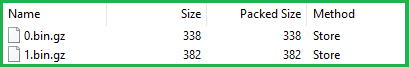

# Esri Indexed 3d Scene Layer (I3S) and Scene Layer Package (*.slpk) Format Specification

Version 1.7. June 30, 2019

*Contributors:* Chris Andrews, Tamrat Belayneh, Jillian Foster, Javier Gutierrez, Markus Lipp, Sud Menon, Pascal M&uuml;ller, Dragan Petrovic, Ronald Poirrier, Simon Reinhard, Juan Ruiz, Johannes Schmid, Ivonne Seler, Chengliang Shan,Thorsten Reitz, Ben Tan, Moxie Zhang

*Acknowledgements:* Bart van Andel, Fabien Dachicourt, Carl Reed

---

The Indexed 3D Scene Layer (I3S) format is an open 3D content delivery format used to rapidly stream and distribute large volumes of 3D GIS data to mobile, web and desktop clients.  I3S content can be shared across enterprise systems using both physical and cloud servers.  ArcGIS Scene Layers and [Scene Services](http://server.arcgis.com/en/server/latest/publish-services/windows/scene-services.htm) use the I3S infrastructure.  See the [version history on the main ReadMe](../README.md) for more details about previous versions and OGC specification compatibility. 

# Table of Contents

[Introduction to Scene Layers](#introduction-to-scene-layers)  
[Organization and Structure](#organization-and-structure)  
&emsp;[Nodes](#nodes)  
&emsp;&emsp;[Indexing Model and Tree Structure](#indexing-model-and-tree-structure)  
&emsp;&emsp;[Node Paging and the Node Page Index](#node-paging-and-the-node-page-index)  
&emsp;&emsp;[Indexing for I3S 1.6 and earlier](#Indexing-for-I3S-1.6-and-earlier)  
&emsp;[REST API](#rest-API)  
&emsp;[Scene Layer Package](#scene-layer-packages)  
&emsp;[Coordinate Reference Systems](#coordinate-reference-systems)  
&emsp;[Height Models](#height-models)  
&emsp;[Geometry Model and Storage](#geometry-model-and-storage)  
&emsp;[geometryDefinition](#geometryDefinition)  
&emsp;[Textures](#textures-structure)  
&emsp;[textureSetDefinition](#textureSetDefinition)  
&emsp;[materialDefinition](#materialDefinition)  
&emsp;[Attribute Model and Storage](#attribute-model-and-storage)  
&emsp;[Bounding Volume Hierarchy](#bounding-volume-hierarchy)  
&emsp;[Level of Detail](#level-of-detail)  
&emsp;&emsp;[Discrete Level of Detail](#discrete-level-of-detail)  
&emsp;&emsp;[Multiple Representations](#multiple-representations)  
&emsp;&emsp;[Switching Models](#switching-models)  
&emsp;&emsp;[Level of Detail Generation](#level-of-detail-generation)  
&emsp;&emsp;[Selection Metrics](#selection-metrics)  

[JSON Resources](#json-resources)  
​&emsp;[Supported Data Types](#supported-data-types)  
​&emsp;[SceneServiceInfo](#sceneServiceInfo)  
​&emsp;[Class 3DSceneLayer](#class-3dSceneLayer)  
​&emsp;[Class Store](#class-store)  
​&emsp;[Class Geometry Schema](#class-geometry-schema)  
​&emsp;[Class HeaderAttribute](#class-headerAttribute)  
​&emsp;[Class Field](#class-field)  
​&emsp;[Class AttributeStorageInfo](#class-attributestorageinfo)  
​&emsp;[Class IndexScheme](#class-indexscheme)  
​&emsp;[Class DrawingInfo](#class-drawinginfo)  
&emsp;[Class StatisticsInfo](#class-statisticsInfo)  
​&emsp;[Class Domains](#class-domains)  
​&emsp;[Class Material](#class-material)  
​&emsp;[Class CachedDrawingInfo](#class-cacheddrawinginfo)  
​&emsp;[3DNodeIndexDocument](#3dNodeIndexDocument)  
​&emsp;[Class NodeReference](#class-nodereference)  
​&emsp;[Class Resource](#class-resource)  
​&emsp;[Class Level of Detail Selection](#class-level-of-detail-selection)  
​&emsp;[FeatureData](#featureData)  
​&emsp;[Class Feature](#class-feature)  
​&emsp;[Class FeatureAttribute](#class-featureAttribute)  
​&emsp;[Class Geometry](#class-geometry)  
​&emsp;[Class GeometryParams](#class-geometryparams)  
​&emsp;[Class GeometryReferenceParams](#class-geometryreferenceparams)  
​&emsp;[Class VestedGeometryParams](#class-vestedgeometryparams)  
​&emsp;[Class SingleComponentParmas](#class-singlecomponentparams)  
​&emsp;[Class Geometry Attribute](#class-GeometryAttribute)  
​&emsp;[Shared Resources](#shared-resources)  
​&emsp;[Class Component](#class-component)  
​&emsp;[Class Feature](#class-feature)  
​&emsp;[Class Outline](#class-outline)  
​&emsp;[Class Color](#class-color)  
​&emsp;[Class Renderer](#class-renderer)  
​&emsp;[Class Symbol](#class-symbol)  

[Textures](#textures)  
&emsp;[Texture Recommendations and Requirements](#texture-recommendations-and-requirements)  
&emsp;[Generating Image IDs](#generating-image-ids)  
&emsp;[Geometry](#geometry)  
&emsp;[Attribute Data](#attribute-data)  
&emsp;[Accessing the Legend of a 3D Object Layer](#accessing-the-legend-of-a-3d-object-layer)  

[I3S Flexbility](#i3s-flexibility)  
​&emsp;[I3S Defining Characteristics](#i3s-defining-characteristics)  
​&emsp;[Persistence](#persistence)  

# I3S Design Principles

The Esri Indexed 3d Scene Layer (I3S) format and the corresponding Scene Layer Package format (*.slpk) utilize these design principles:  

- **User Experience First**: Provide a positive user experience, including high interactivity and fast display.
- **Scalability**: Support very large scene layers, including scenes with a global extent and many detailed features.
- **Reusability**: Use as a service delivery format, storage format, and exchange format.
- **Level of Detail**: Support multiple detail levels.
- **Distribution**: Allow efficient distribution of very large data sets.
- **User-controllable symbology**: Support efficient rendering of client-side symbology and styling.
- **Extensibility**: Support new layer types, new geometry types, and new platforms.
- **Web Friendliness**: Provide easy to handle data using JSON and current web standards.
- **Compatibility**: Provide a single structure that is compatible across web, mobile, and desktop clients.  Support is also included for cloud and servers.
- **Declarative**: Communicate clearly to minimize the amount of required domain knowledge to support the format.
- **Follow REST/JSON API Best Practices:** Provide navigable links to all resources.
- **[Version History of I3S](../README.md)**: Provide an overview on which ESRI I3S specification version is equivalent to OGC I3S specification version.
- **[I3S Converter](../i3s_converter/i3s_converter_ReadMe.md)**: Allows users to update existing 1.6 3D object or Integrated Mesh Scene layers to update to 1.7

# Introduction to Scene Layers

An I3S Scene Layer is a file format which stores 3D geographic data.  Scene Layers provide a structured way for clients to store and visualize large amounts of data.  I3S organizes information using nodes that contain features with geometry, textures and attributes.

 There are several Scene Layer profile types:

* [3D Object](../docs/1.7/3Dobject_ReadMe.md) (e.g. 3D models in various formats)
* [Integrated Mesh](../docs/1.7/IntegratedMesh_ReadMe.md) (e.g. an integrated surface that may include vegetation, buildings and roads)
* [Point](../docs/1.6/Point_ReadMe.md) (e.g. a collection of point data, like individual trees in a forest)
* [Point Cloud](../docs/2.0/pcsl_ReadMe.md) (e.g. a volumetric collection of point data, like lidar data)
* [Building](../docs/1.7/BSL_ReadMe.md) (e.g. a building including its components, such as windows, doors, chairs, etc.)


# Organization and Structure

## Nodes 

In a Scene Layer, the spatial extent of the data is split into regions called *nodes*.  The nodes contain the texture, geometry, and attribute information for the region.  Each node has a unique index, which allows clients to efficiently locate and load the resources. 

Nodes include the following resources:

- [3D Node Index Document](../docs/1.7/3DNodeIndexDocument.cmn.md): A JSON resource that describes a node, its index, and information about other sub-resources including bounding-volume information, LoD selection criteria, and parent-child relationships.  This resource allows for paging or tree traversal without the need to access the more voluminous content within a node.
- [Features](../docs/1.7/featureData.cmn.md): A JSON resource that identifies the features within a node. It stores the geometry and attributes for all the features in the node either by value or by reference.
- [Geometries](../docs/1.7/geometry.cmn.md): A binary resource describing the geometries of the features and the mapping between individual feature and geometry segments.
- [Attributes](../docs/1.7/attributeStorageInfo.cmn.md): A binary resources describing the structure of the attribute data.
- [Textures](#textures): A binary resource containing the texture. 
- [Materials](../docs/1.7/materialDefinitions.cmn.md): A JSON resource that describes the material rendering.  It is feature-compatible with glTF materials.  *Only supported in v1.7.*
- *[Shared Resource](../docs/1.7/sharedResource.cmn.md): A JSON resource with models or textures that can be shared among features within the same layer. (Deprecated in v1.7)*

Note: All binary data is stored in little endian. 

Features, attributes, and geometry are bundled.  This balances the node size, which helps optimize network transfer and client-side reactivity. 

Each set of features and geometries contains all the data elements to render a complete feature.  In order to avoid dependency on the features, the geometries are available as a separate binary resource. The geometry data includes all vertex attributes, feature counts, and mesh segmentation.  There are always an equal number of features and geometries.  

A node's bounding-volume determines if a node is within the current 3D view. If a node is in view, then the client determines the level of detail to display based on the view parameters, the node's bounding volume, and the [level of detail selection metrics](../docs/1.7/lodSelection.cmn.md).  Nodes are loaded according to their indexing model.

### Indexing Model and Tree Structure

Depending on the I3S version, the indexing model can vary.  In I3S version 1.7, nodes are indexed using a [node page index](#Node-Paging-and-the-Node-Page-Index-for-I3S-1.7).  In I3S version 1.6 and earlier, nodes can be indexed using most common indexing models (e.g. [treekeys](indexing-for-I3S-1.6-and-earlier), quadtrees, R-trees).  Within the indexing scheme, the regions are organized in a [bounding volume hierarchy](#Bounding-Volume-Hierarchy).  The specific indexing scheme is hidden from clients since they only need to load resources.

### Node Paging and the Node Page Index

Nodes represent the spatial index of the data as a [bounding-volume hierarchy](#bounding-volume-hierarchy). To reduce the number of requests required to traverse the tree, they are organized into pages. Loading a page of nodes instead of an individual node allows clients to get more data with a single round-trip.  This structure reduces the overall number of round-trips and increases performance.  One node page is considered one resource.

Nodes are stored in a flat array and divided by a fixed size page.  Each node references its children using their index in this array.  To traverse the tree, clients start by loading the node page that contains the root.  Then, clients identify the pages required to access its children within the view.  The process is repeated until the desired nodes have been discovered.   

Note that for backward compatability reasons, the node index must be a **stringified integer**.   This index must be unique and is used for identification only.  It has no other semantic meaning in I3S. 

For more details regarding 3D Objects and Integrated Mesh in 1.7, see [nodePages](../docs/1.7/nodePageDefinition.cmn.md).

For more details regarding Point Cloud in 2.0, see [nodePages](../docs/2.0/nodePageDefinition.pcsl.md).

### Indexing for I3S 1.6 and earlier

Prior to the introduction of node paging, any indexing scheme can be used for I3S version 1.6 and earlier.  This is a brief example for "treekeys". 

The treekey format is loosely modeled on binary search trees. The key value indicates the level and sibling association of a given node.  Since the key directly indicates the position of the node in the tree, it allows the nodes to be sorted in a single dimension.  Treekeys are stringified integers.

Treekeys contain levels which are separated by dashes.  The root node is at level 1 and should always be indicated by the ID `root`.


*A sample index tree using Treekeys.*


## REST API 

I3S is a REST API.  Each scene layer profile has different components and features.  For details on a specific profile and version, refer to the individual README documents. 

Version 1.7 support for [3D Objects](../docs/1.7/3Dobjects_ReadMe.md), [Integrated Mesh](../docs/1.7/IntegratedMesh_ReadMe.md) and [Building](../docs/1.7/BSL_ReadMe.md).

Version 1.6 support for [3D Objects](../docs/1.6/3Dobjects_ReadMe.md), [Integrated Mesh](../docs/1.6/IntegratedMesh_ReadMe.md), [Building](../docs/1.6/BSL_ReadMe.md), and [Point](../docs/1.6/Point_ReadMe.md).

Version 2.0 support for [Point Cloud](../docs/2.0/pcsl_ReadMe.md).


The following examples are included to provide a structural overview. 

**REST API 1.7: 3D Object Example**

```
.<host>/SceneServer/layers
	+--0 // Scene Layer Document
	+-- nodePages
	|  +-- 0
	|  +-- (...)
	+-- nodes
	|  +--0
	|  |  +-- attributes
	|  |  |  +--f_2
	|  |  |  +--f_4
	|  |  |  +--(...)
	|  |  +-- geometries
	|  |  |  +-- 0
	|  |  |  +-- 1
	|  |  |  +--(...)
	|  |  +-- textures
	|  |  |  +-- 0
	|  |  |  +-- 0_0_1
	|  |  |  +--(...)
	|  |  +-- shared 
	|  |  (...) 
	+--statistics
	|  +-- f_2
	|  +-- f_4
	|  +-- (...)
```


Spec version 1.7 is backward compatible with 1.6.  For all of clients to be able to read 1.7, `sharedResources` and `nodeDocument` are included but not used in 1.7.

The following API methods are available for 3D Object scene layer:

| Resource             | Type   | Description                                                  | URL Template                         |
| -------------------- | ------ | ------------------------------------------------------------ | ------------------------------------ |
| Scene Layer Document | `JSON` | This is the root document for the service that will contain properties common to the entire layer. | `http://serviceURL/layers/{layerID}` |

- `layerID`: Integer. ID of the associated layer. Esri products expect this to be `0`.

Example: http://my.server.com/3DObjectSceneLayer/SceneServer/layers/0


| Resource  | Type   | Description      | URL Template                                                 |
| --------- | ------ | ---------------- | ------------------------------------------------------------ |
| Node Page | `JSON` | A page of nodes. | `http://serviceURL/layers/{layerID}/nodepages/{nodePageID}/` |

- `layerID`: Integer. ID of the associated layer. Esri products expect this to be `0`.
- `nodePageID`: Integer. ID of the associated node page.

Example: http://my.server.com/3DObjectSceneLayer/SceneServer/layers/0/nodepages/8


| Resource | Type                       | Description                   | URL Template                                                 |
| -------- | -------------------------- | ----------------------------- | ------------------------------------------------------------ |
| Textures | `JPG`, `PNG`, `DDS`, `KTX` | The texture resource  (image) | `http://serviceURL/layers/{layerID}/nodes/{resourceID}/textures/{texture ID}` |

- `layerID`: Integer. ID of the associated layer. Esri products expect this to be `0`.
- `resourceID`: Integer. ID of the associated node.
- `textureID`: String. This ID returns one of the textures available for this node. The same texture may be available in different formats. 

Example: http://my.server.com/3DObjectSceneLayer/SceneServer/layers/0/nodes/98/textures/1


| Resource   | Type           | Description                              | URL Template                                                 |
| ---------- | -------------- | ---------------------------------------- | ------------------------------------------------------------ |
| Geometries | `bin`, `draco` | The geometry resource (mesh information) | `http://serviceURL/layers/{layerID}/nodes/{resourceID}/geometries/{geometry ID}` |

- `layerID`: Integer. ID of the associated layer. Esri products expect this to be `0`.
- `resourceID`: Integer. ID of the associated node.
- `geometryID`: Integer. This ID returns one of the geometries available for this node. The same geometry may be available in a different format. 

Example: http://my.server.com/3DObjectSceneLayer/SceneServer/layers/0/nodes/98/geometries/1 


| Resource   | Type   | Description                                                  | URL Template                                                 |
| ---------- | ------ | ------------------------------------------------------------ | ------------------------------------------------------------ |
| Statistics | `JSON` | The statistics for the entire layer for a specific attribute. | `http://serviceURL/layers/{layerID}/statistics/f_{attributeID}/0` |

- `layerID`: Integer. ID of the associated layer. Esri products expect this to be `0`.
- `attributeID`: Integer.  ID of the specific attribute for the layer.

Example: http://my.server.com/3DObjectSceneLayer/SceneServer/layers/0/statistics/f_48/0 


| Resource   | Type  | Description                                        | URL Template                                                 |
| ---------- | ----- | -------------------------------------------------- | ------------------------------------------------------------ |
| Attributes | `bin` | The value for a specific  attribute within a node. | `http://serviceURL/layers/{layerID}/attributes/f_{attributeID}/0` |

- `layerID`: Integer. ID of the associated layer. Esri products expect this to be `0`.
- `attributeID`: Integer.  ID of the specific attribute for the layer.

Example: http://my.server.com/3DObjectSceneLayer/SceneServer/layers/0/attributes/f_48/0 


**Shared Resources must be included for backwards compatibility with 1.6, but is only used by 1.6 clients.**

| Resource         | Type   | Description                                                  | URL Template                                                 |
| ---------------- | ------ | ------------------------------------------------------------ | ------------------------------------------------------------ |
| Shared Resources | `JSON` | Legacy texture and material description. **Not used in 1.7.** | `http://serviceURL/layers/{layerID}/nodes/{resourceID}/shared` |

- `layerID`: Integer. ID of the associated layer. Esri clients expect this to be `0`.
- `resourceID`: Integer. ID of the associated node. 

Example: http://my.server.com/3DObjectSceneLayer/SceneServer/layers/0/nodes/98/shared


**Node Document must be included for backwards compatibility with 1.6, but is only used by 1.6 clients.**

| Resource      | Type   | Description                                   | URL Template                                            |
| ------------- | ------ | --------------------------------------------- | ------------------------------------------------------- |
| Node Document | `JSON` | Description of the node. **Not used in 1.7.** | `http://serviceURL/layers/{layerID}/nodes/{resourceID}` |

- `layerID`: Integer. ID of the associated layer. Esri clients expect this to be `0`.
- `resourceID`: Integer. ID of the associated resource. 

Example: http://my.server.com/3DObjectSceneLayer/SceneServer/layers/0/nodes/98


**REST API 1.6: 3D Object Example**

```
.<host>/SceneServer/layers
	+--0 // scene layer document
	+-- nodes
	|  +--0
	|  |  +-- attributes
	|  |  |  +--f_2
	|  |  |  +--f_4
	|  |  |  +--(...)
	|  |  +-- geometries
	|  |  |  +-- 0
	|  |  +-- textures
	|  |  |  +-- 0
	|  |  |  +-- 0_0_1
	|  |  |  +--(...)
	|  |  +-- shared 
	|  |  (...) 
	+--statistics
	|  +-- f_2
	|  |  | +--0
	|  +-- f_4
	|  |  | +--0
	|  +-- (...)
```

The following API methods are available for 3D Object scene layer:

| Resource             | Type   | Description                                                  | URL Template                         |
| -------------------- | ------ | ------------------------------------------------------------ | ------------------------------------ |
| Scene Layer Document | `JSON` | This is the root document for the service that will contain properties common to the entire layer. | `http://serviceURL/layers/{layerID}` |

- `layerID`: Integer. ID of the associated layer. Esri products expect this to be `0`.

Example: http://my.server.com/3DObjectSceneLayer/SceneServer/layers/0


| Resource      | Type   | Description              | URL Template                                            |
| ------------- | ------ | ------------------------ | ------------------------------------------------------- |
| Node Document | `JSON` | Description of the node. | `http://serviceURL/layers/{layerID}/nodes/{resourceID}` |

- `layerID`: Integer. ID of the associated layer. Esri products expect this to be `0`.
- `resourceID`: String. ID of the associated resource. 

Example: http://my.server.com/3DObjectSceneLayer/SceneServer/layers/0/nodes/98


| Resource | Type                       | Description                   | URL Template                                                 |
| -------- | -------------------------- | ----------------------------- | ------------------------------------------------------------ |
| Textures | `JPG`, `PNG`, `DDS`, `KTX` | The texture resource  (image) | `http://serviceURL/layers/{layerID}/nodes/{resourceID}/textures/{texture ID}` |

- `layerID`: Integer. ID of the associated layer. Esri products expect this to be `0`.
- `resourceID`: String. ID of the associated node.
- `textureID`: String. This ID returns one of the textures available for this node. The same texture may be available in different formats. 

Example: http://my.server.com/3DObjectSceneLayer/SceneServer/layers/0/nodes/98/textures/1


| Resource   | Type  | Description            | URL Template                                                 |
| ---------- | ----- | ---------------------- | ------------------------------------------------------------ |
| Geometries | `bin` | The geometry resource. | `http://serviceURL/layers/{layerID}/nodes/{resourceID}/geometries/0` |

- `layerID`: Integer. ID of the associated layer. Esri products expect this to be `0`.
- `resourceID`: String. ID of the associated node.

Example: http://my.server.com/3DObjectSceneLayer/SceneServer/layers/0/nodes/98/geometries/1 


| Resource   | Type   | Description                                                  | URL Template                                                 |
| ---------- | ------ | ------------------------------------------------------------ | ------------------------------------------------------------ |
| Statistics | `JSON` | The statistics for the entire layer for a specific attribute. | `http://serviceURL/layers/{layerID}/statistics/f_{attributeID}/0` |

- `layerID`: Integer. ID of the associated layer. Esri clients expect this to be `0`.
- `attributeID`: Integer.  ID of the specific attribute for the layer.

Example: http://my.server.com/3DObjectSceneLayer/SceneServer/layers/0/statistics/f_48/0 


| Resource   | Type   | Description                                                  | URL Template                                                 |
| ---------- | ------ | ------------------------------------------------------------ | ------------------------------------------------------------ |
| Attributes | `JSON` | The attributes for the entire layer for a specific attribute. | `http://serviceURL/layers/{layerID}/attributes/f_{attributeID}/0` |

- `layerID`: Integer. ID of the associated layer. Esri products expect this to be `0`.
- `attributeID`: Integer.  ID of the specific attribute for the layer.

Example: http://my.server.com/3DObjectSceneLayer/SceneServer/layers/0/attributes/f_48/0 


| Resource         | Type   | Description                        | URL Template                                                 |
| ---------------- | ------ | ---------------------------------- | ------------------------------------------------------------ |
| Shared Resources | `JSON` | Texture and material descriptions. | `http://serviceURL/layers/{layerID}/nodes/{resourceID}/shared` |

- `layerID`: Integer. ID of the associated layer. Esri products expect this to be `0`.
- `resourceID`: String. ID of the associated node. 

Example: http://my.server.com/3DObjectSceneLayer/SceneServer/layers/0/nodes/98/shared


# Scene Layer Packages

Scene Layer Packages (SLPK) consolidate an I3S layer into a single file.  It is designed to be directly consumed by applications.

An SLPK is a [zip](https://en.wikipedia.org/wiki/Zip_(file_format)) archive containing compressed files and resources.  The archiving method for SLPK is `STORE`, meaning that the archive itself is not compressed.  The individual resources within the SLPK may be compressed.  Resource compression is recommended but not required.

Both 64-bit and 32-bit zip archives are supported.  64-bit is required for data larger than 2GB.

Please note that this method is slightly different than a typical zip archive.  In general, when a file is added to a zip archive, the new file is individually compressed and the overall archive is compressed. **That is not the case for SLPK.**  When adding files to an SLPK, the new file is compressed, but the overall archive remains uncompressed and is archived using `STORE`. 

This is an example of a geometry resource opened in 7-zip.  Notice that both the Size and the Packaged Size are equal.  The method is `STORE`.

 *Compressed geometry resource with size and method.*

**Resource Compression** 

Resources may be individually compressed before they are added to the archive. Compression is not mandatory, but recommended for resource types that would benefit from additional compression. In the case of an SLPK, all resources should be compressed except for PNG and JPG.  

`GZIP` is the only supported compression scheme.

**File Extensions**

SLPK require file extensions to determine the file type.  In a scene service, no file extensions are needed because the are provided by the http protocol request. 

Here are a few examples of SLPK file extensions:

- .jpg
- .bin (PNG)
- .bin.dds
- .json

These file types can be compressed with `GZIP`, which includes the previous extension followed by `.gz`.  For example, `.json.gz`.

**Hash**

In 1.7, an M5D [hash](../docs/1.7/slpk_hashtable.cmn.md) is used to improve loading time.  The hash must be the last item at the end of the central directory and named `@specialIndexFileHASH128@`.  


### 1.7 SLPK Structure

**Example 1.7 SLPK Structure Summary for 3D Objects**

```
.\example_17.slpk
	+--nodePages
	|  +--0.json.gz
	|  +-- (...)
	+--nodes
	|  +--root
	|  |  +--3dNodeIndexDocument.json.gz
	|  +--0
	|  |  +--attributes
	|  |  |  +--f_0
	|  |  |  |  +--0.bin.gz
	|  |  |  +--(...)
	|  |  +--features
	|  |  |  +-- 0.json.gz
	|  |  |  +--(...)
	|  |  +--geometries
	|  |  |  +-- 0.bin.gz
	|  |  |  +--(...)
	|  |  +--textures
	|  |  |  +--0.jpg
	|  |  |  +--0_0_1.bin.dds.gz
	|  |  |  +--(...)
	|  |  +--shared 
	|  |  |  +--sharedResource.json.gz
	|  |  + 3dNodeIndexDocument.json.gz
	|  +--(...)
	+--statistics
	|  +--f_1
	|  |  +--0.json.gz
	|  +--(...)
	+--3dSceneLayer.json.gz
	+--@specialIndexFileHASH128@
```

The central directory includes: 

- A folder "nodepages" that contains the [node pages](../docs/1.7/nodePageDefinition.cmn.md)
- A folder "nodes" that contains the [node](../docs/1.7/nodePageDefinition.cmn.md) resources
- A folder "statistics" that contains the [statistical](../docs/1.7/statsInfo.cmn.md) summary of the nodes
- A *3dSceneLayer.json.gz* file that defines the [Scene Layer](../docs/1.7/3DSceneLayer.cmn.md)
- An MD5 [hash](../docs/1.7/slpk_hashtable.cmn.md) to improve loading time

The nodepages folder contains the list of nodes in each page.  Nodes are stored fixed-size pages in contiguously in a flat array. The nodes folder contains the full list of nodes.  

Each node contains its own resources including [attributes](../docs/1.7/attributeStorageInfo.cmn.md), [features](../docs/1.7/featureAttribute.cmn.md), [geometries](../docs/1.7/geometryAttribute.cmn.md), [shared resources](../docs/1.7/sharedResource.cmn.md), [textures](../docs/1.7/texture.cmn.md), and a [3DNodeIndexDocument](../docs/1.7/3DNodeIndexDocument.cmn.md).  The shared resources are included for backwards compatibility with 1.6 and are not used in 1.7.


Each resource can be individually compressed with `GZIP`.

### 1.6 SLPK Structure

**Example 1.6 Structure Summary for 3D Objects**

```
.\example_16.slpk
	+--nodes
	|  +--root
	|  |  +--3dNodeIndexDocument.json.gz
	|  +--0
	|  |  +--attributes
	|  |  |  +--f_0
	|  |  |  |  +--0.bin.gz
	|  |  |  +--(...)
	|  |  +--features
	|  |  |  +--0.json.gz
	|  |  |  +--(...)
	|  |  +--geometries
	|  |  |  +--0.bin.gz
	|  |  |  +--(...)
	|  |  +--textures
	|  |  |  +--0.jpg
	|  |  |  +--0_0_1.bin.dds.gz
	|  |  |  +--(...)
	|  |  +--shared 
	|  |  |  +--sharedResource.json.gz
	|  |  +--3dNodeIndexDocument.json.gz
	|  +--0-0
	|  |  +--(...)
	|  +--0-0-0
	|  |  +--(...)
	|  +--1 
	|  |  +--(...)
	|  +--1-0
	|  |  +--(...)
	|  +--1-0-0
	|  |  +--(...)
	|  +--(...)
	+--statistics
	|  +--f_1
	|  |  +--0.json.gz
	|  +-- (...)
	+--3dSceneLayer.json.gz
	+--metadata.json
```

The central directory includes:

- A folder "nodes" that contains all [node](../docs/1.6/nodeReference.cmn.md) resources
- A folder "statistics" that includes a [statistical](../docs/1.6/statisticsInfo.cmn.md) summary of the nodes
- A *3dSceneLayer.json.gz* file that defines the [Scene Layer](../docs/1.6/3DSceneLayer.cmn.md)
- A *metadata.json* file that describes the content of the SLPK

The *nodes* folder contains each node in a folder in a tree structure. 

Each node contains its own resources including [attributes](../docs/1.6/attributeStorageInfo.cmn.md), [features](../docs/1.6/featureData.cmn.md), [geometries](../docs/1.6/geometryAttribute.cmn.md), [shared resources](../docs/1.6/sharedResource.cmn.md), [textures](../docs/1.6/texture.cmn.md), and a [3DNodeIndexDocument](../docs/1.6/3DNodeIndexDocument.cmn.md).

Each resource can be individually compressed with `GZIP`.

## Coordinate Reference Systems

The I3S specification supports specifying the Coordinate Reference System (CRS) as a Well Known Text, as defined in clause 6.4 in OGC Simple Features [99-036/ISO 19125](http://portal.opengeospatial.org/files/?artifact_id=13227) standard. I3S also supports specifying CRS in the WKT standard [CRS/ISO 19162:2015](http://docs.opengeospatial.org/is/12-063r5/12-063r5.html), Geographic information – Well-known text representation of coordinate reference systems, which provided an update to the original WKT representation. The two standards are referred to as WKT1 and WKT2 respectively.

In I3S implementation the CRS may be represented using either WKT1 or WKT2. While WKT1 has been in use for many years, WKT1 has been superseded by WKT2. Although implementations of OGC standards using WKT2 are not yet widely available the guidance from the OGC/ISO community is to implement WKT2. Important Note: WKT1 does not support explicit definition of axis order.

Therefore, I3S implementers need to note for their implementations if they support WKT1 only or both (as WKT2 requires continued support of WKT1). In addition, please note that not all ArcGIS client applications support WKT2 yet.  

The Coordinate Reference System (CRS) of the Indexed 3D Scene Layer should be selected with the following considerations:

- Minimize the need for re-projection on the client side
- Render in both geographic and projected coordinate reference systems
- Support data with a global extent
- Support local and global data with high positional accuracy

All I3S profiles support writing 3D content in two modes: *global* and *local*. In global mode, only the geographic CRS WGS84 ,as identified by its EPSG code 4326 and GCS China Geodetic Coordinate System 2000, as identified by its EPSG 4490 is supported for both index and vertex positions. It is represented using longitude, latitude and elevation. In local mode, all other geodetic CRS, including projected coordinate systems, are allowed.

In both modes, node index and position vertex must have the same CRS. In addition, all vertex positions are specified as an *offset* from a node's Minimum Bounding Volume (MBV) center. The MBV could be specified as a Minimum Bounding Sphere (MBS) or as an Oriented Bounding Box (OBB).

As a result, for an I3S layer to be in a *global* mode the following requirements must be met:

The location of all vertex positions and index-related data structures, such as the nodes minimum bounding volume, are specified using the geographic CRS WGS84 or CGCS 2000, where:

- The only supported CRS in this mode is EPSG code, 4326 and 4490.
- X and Y Coordinate bounds of the layer and XY components of the vertex position are specified in decimal degrees.
- Elevation (the z component of the vertex position) is specified in meters.
- The Minimum Bounding Volume (MBV) radius unit (for MBS) or halfSize unit (for OBB) is specified in meters.

For an I3S layer to be in a *local* mode the following requirements must be met:

All vertex positions are specified using geodetic CRS, identified by an EPSG code. Any CRS with an EPSG code *other* than 4326 or 4490 will be treated as in a local mode. In addition:

- All the three components of a vertex position (XYZ) and the Minimum Bounding Volume (MBV) radius (for MBS) or halfSize (for OBB) need to be in the same unit

All I3S layers indicate the coordinate system used by the layer with the spatialReference property in the [3dSceneLayer](../docs/1.6/3DSceneLayer.cmn.md) resource. This property is normative.

The [spatial reference](../docs/1.6/spatialReference.cmn.md) object is common to all i3s profile types.

## Height Models

The I3S standard allows either ellipsoidal or gravity-related vertical coordinate systems. This allows I3S to be applied across a diverse range of fields and applications.

At version 1.5, I3S added support for vertical coordinate systems. The Well known Text (WKT) representation of the Coordinate Reference System now includes the vertical coordinate system used by the layer. The [spatial reference](../docs/1.6/spatialReference.cmn.md) object also includes a Well-known ID (WKID) and a Vertical Coordinate System Well-known ID (VcsWKID).  The client application can consume any of these properties to designate the height model.

The heightModelInfo, included in the 3DSceneLayerInfo resource, is used by clients to determine if the layer's height model is orthometric or gravity-related.

For more details, see the [3DSceneLayerInfo-common](../docs/1.6/3DSceneLayer.cmn.md), [3DSceneLayerInfo-point](../docs/1.6/3DSceneLayer.psl.md) and [heightModelInfo](../docs/1.6/heightModelInfo.cmn.md) pages.

## Geometry Model and Storage

All Scene Layer types make use of the same fundamental set of geometry types: points and triangles.

The Array Buffer View controls geometry storage and consumption representation.  For example, the Array Buffer View can require per-vertex layout of components.  This orders the vertex position, normal and texture coordinates to ensure the same pattern across the Scene Layer.

Both 3D Object and Integrated Mesh layer types model geometries as triangle meshes using the meshpyramid profile. The meshpyramid profile uses the triangles geometry type to store triangle meshes.  The meshes have a reduced level of detail, are segmented by features, and available in the interior nodes.

For more details regarding 3D objects and point scene layer, see [Geometry](../docs/1.7/geometry.cmn.md).

For more details regarding point cloud scene layer, see [defaultGeometryShema](../docs/2.0/defaultGeometrySchema.pcsl.md).

## geometryDefinition

Defines the layouts of the mesh geometry and its attributes.  

For more details regarding Integrated Mesh and 3D objects in 1.7, see the [geometryDefinition](../docs/1.7/geometryDefinition.cmn.md).

## Textures

Textures are stored as a binary resource with a node. The texture resource contains the texture images.  I3S supports most commonly used image formats, like JPEG and PNG, and compressed texture formats such as S3TC and ETC2.  Both integrated mesh and 3D object profile support textures. Authoring applications can provide additional texture formats using `textureEncoding` declarations.

For more details, see the [Textures](../docs/1.7/texture.cmn.md) section.

## textureSetDefinition

Defies the set of textures that a mesh can reference. 

For more details regarding Integrated Mesh and 3D objects in 1.7, see the [textureSetDefinition](../docs/1.7/textureSetDefinition.cmn.md).

## materialDefinition

List of material classes used in this layer. Physically based materials that are feature-compatible with glTF materials.  

For more details regarding Integrated Mesh and 3D objects in 1.7, see the [material definition](../docs/1.7/materialDefinitions.cmn.md).

## Attribute Model and Storage

I3S supports two ways to access attribute data.  They can be accessed through:

1. Paired services with RESTful endpoints.
   - Enables direct access to source data.
   - The query uses the unique feature ID key.
2. Fully cached attribute information within the I3S store.
   - Binary storage representation, which provides a significant performance benefit.

Clients can use either method if the attributes are cached. The attribute values are stored as a geometry aligned, per field, key-value pair arrays.  

For more details regarding point cloud scene layer, see [AttributeInfo](../docs/2.0/attributeInfo.pcsl.md).

For more details on all other scene layer types, see [Attribute](../docs/1.7/attributeStorageInfo.cmn.md).

## Bounding Volume Hierarchy

Bounding volume hierarchy (BVH) is based on minimum bounding sphere (MBS) or oriented bounding box (OBB).

The meshpyramid profile supports specifying the bounding volume in either MBS or OBB representation. OBB is the more optimal representation and implementers are encouraged to output node bounding volume in OBB format. Point cloud profile supports OBB representation only.

For more details regarding the two types of bounding volumes see [minimum bounding box](../docs/1.7/mbs.cmn.md) and [oriented bounding box](../docs/1.7/obb.cmn.md) sections.

## Level of Detail

Scene Layers include Levels of Detail (LoD) that apply to the whole layer and serve to generalize the layer. They are similar to image pyramids or raster vector tiling schemes. A node in the I3S scene layer tree could be considered the analog of a tile in a raster or vector tiling scheme. Scene Layers support Levels of Detail in a manner that preserves the identity of the individual features that are retained within any level of detail. Levels of Detail can be used to split heavy features, thin or cluster for better visuals, and integrate externally authored multiple LOD files.

Note that the I3S Level of Detail concept is orthogonal to the concept of consolidated storage (batches) for a set of geometries within a level of detail. Batching  of geometries into larger geometry collection assists in optimal rendering. Geometry Array Buffers can be used to provide access to the individual geometries when needed, preserving the feature to geometry element mapping within the consolidated geometries.

### Discrete Level of Detail

Discrete Levels of Detail provide multiple models to display the same object.  A specific detail level is bound to certain levels of the index tree. Leaf nodes typically contain the original feature representation with the most detail.  The closer a node is to the root (in the BVH tree), the lower the level of detail. The detail is reduced by texture down-sampling, feature reduction/generalization, mesh reduction/generalization, clustering or thinning in order to ensure inner nodes have a balanced weight. The number of discrete Levels of Detail for the layer corresponds to the number of levels in the index tree.

By using only information found in the node index document, such as bounding volume and level of detail selection metrics, a client application traversing an I3S tree can readily decide if it needs to:

- Stop traversal to the node's children if the current node bounding volume is not visible.
- Use the data in the node if the quality is appropriate, and then stop traversal to children.
- Continue traversal until nodes with higher quality are found.

I3S supports multiple level of detail selection metrics and switching level of detail models.  Details about the level of detail generation process can be optionally included in the Scene Layer's metadata.

### Multiple Representations

I3S Layers can be used to represent input data that already have multiple, semantically authored, levels of detail. The most common method is to represent each  semantically authored input level of detail as its own I3S Layer with visibility thresholds. The thresholds capture the range of distances for which the layer should be used.

A set of I3S Layers that represent a single level of detail can be grouped within the same I3S service. For each layer within the set, the features in the leaf nodes represent the modeled features at the level of detail of the input data. Additional levels of detail can be generated automatically by extending the viewing range of each input level.

Tools can also be developed to load a semantically authored levels of detail input data into a single I3S layer. In this case, the depth of the I3S index tree is fixed to the number of levels of detail present in the input data. Feature identities and geometries in each node are set based upon the input data.

### Switching Models

Node switching lets clients focus on the display of a node as a whole.  A node switch occurs when the content from a node's children is used to replace the content of an existing node.  This can include features, geometry, attributes and textures. Node switching can be helpful when the user needs to see more detailed information.

Each interior node in the I3S tree has a set of features that represent the reduced level of detail.  This includes the details for all features covered by the node.  Due to generalization at lower Levels of Detail, not all features are present in reduced level of detail nodes.

The feature IDs link the reduced level of detail feature and an interior node, as well as the descendant nodes.  Applications can determine the visual quality by using the I3S tree to display all of the features in an internal node or use the features found in its descendants.

### Level of Detail Generation

Integrated Mesh layer types typically come with pre-authored Levels of Detail.  If the desired level of detail does not exist, it can be generated.

For example, 3D Object Layers based on the meshpyramids profile can create a level of detail pyramid for all features based on generalizing, reducing and fusing the geometries of individual features while preserving feature identity. The same approach can also be used with Integrated Mesh Layers based on the meshpyramid profile.  In this case, there are no features, and each node contains a generalized version of the mesh covered by its descendants.

The bounding volume hierarchy tree is built based on the spatial distribution of the features.  The method used to create the levels depends on the Scene Layer type.

| &nbsp;         |Integrated Mesh  | 3D Object                    | Points                       | Point Clouds                 | Building Scene Layer         |
| -------------- | ----------------|---------------------------- | ---------------------------- | ---------------------------- | ---------------------------- |
| meshpyramids   |  | | &nbsp;                       | &nbsp;                       |  |
| Thinning       |  | |  |  |  |
| Clustering     |  | |  |  |  |
| Generalization |  | | &nbsp;                       | &nbsp;                       |  |

*Example Level of Detail generation methods based on Scene Layer type*

### Selection Metrics

Selection metrics help clients determine which level of detail to render.  For example, clients need to weigh the options of screen size, resolution, bandwidth, and memory to reach the target quality.  

For more details regarding Integrated Mesh, 3D objects and point scene layer, see the [Level of Detail Selection](../docs/1.7/lodSelection.cmn.md).


# JSON Resources

### Supported Data Types

A value schema ensures that the JSON properties follow a fixed pattern and support the following data types:

- **String**: utf8 string
- **Float**: float64
- **Integer**: int32
- **UUID**: A hexadecimal universally unique identifier
- **Date**: An ISO 8601 timestamp YYYY-MM-DDThh:mm:ss.sTZD
- **URL**: Both relative and absolute
- **NodeID**: A treekey string that is zero-based (first child is "0", root node is "root")

### SceneServiceInfo

The SceneServiceInfo is a JSON file that describes the capability and data sets offered by an instance of a Scene Service. This file is automatically generated by the Scene Server for each service instance and is not part of a Scene Layer Package (SLPK) file. 

The implementation details for the scene service REST endpoints are described on the ReadMe documents for each scene layer profile.

For more details, see [SceneServiceInfo](../docs/1.6/SceneServiceInfo.md).

### Class 3dSceneLayerInfo

The Class 3dSceneLayerInfo describes the properties of a single layer in a store.  It includes the default symbology, or the stylization information, for a layer.  The symbology is further described in the sub Class [Class DrawingInfo](../docs/1.7/drawingInfo.cmn.md)

For more details regarding Integrated Mesh, 3D objects, see [3D Scene Layer Info](../docs/1.7/3DSceneLayer.cmn.md).

For more details regarding point, see [3D Scene Layer Info](../docs/1.6/3DSceneLayer.psl.md).

For more details regarding point cloud, see [Layer description](../docs/2.0/layer.pcsl.md).

### Class Store

The Class Store object describes the physical storage of a layer.  This enables the client to detect when multiple layers are served from the same store. Including multiple layers in a single store allows them to share resources.  When the resources are shared, layers with different attribute schemas or symbology, but the same content type, can be served efficiently.

For more details regarding Integrated Mesh, 3D objects, see the [store](../docs/1.7/store.cmn.md).  
For more details regarding point scene layer, see the [store point scene layer](../docs/1.6/store.psl.md).  
For more details regarding point cloud scene layer, see the [store point cloud scene layer](../docs/2.0/store.pcsl.md).

### Class Geometry Schema

The defaultGeometry schema is used in stores where all ArrayBufferView geometry declarations use the same pattern for face and vertex elements. It reduces redundancies of ArrayBufferView geometry declarations in a store, and reuses the GeometryAttribute type from FeatureData. Only valueType and valuesPerElement are required.

For more details regarding Integrated Mesh, 3D objects and point scene layer, see the [default geometry schema](../docs/1.7/defaultGeometrySchema.cmn.md).

For more details regarding point scene layer, see the [default geometry schema point cloud scene layer](../docs/2.0/defaultGeometrySchema.pcsl.md).

### Class HeaderAttribute

Headers to Geometry resources must be uniform across a cache and may only contain fixed-width, single element fields. The HeaderDefinition provides the name of each field and the header valueType.

For more details regarding 3D objects and point scene layer, see [header attribute](../docs/1.7/headerAttribute.cmn.md).

### Class Field

The Field class is used to provide schema information for a 3dSceneLayer.

For more details regarding Integrated Mesh, 3D objects and point scene layer, see the [class field](../docs/1.7/field.cmn.md).

For more details regarding point cloud scene layer, see the [class field](../docs/2.0/field.cmn.md).

### Class AttributeStorageInfo

The attributeStorageInfo is a major object in the 3dSceneLayerInfo document. It describes the structure of a node's binary attributeData resource.

For more details regarding 3D objects and point scene layer, see [attribute storage info](../docs/1.7/attributeStorageInfo.cmn.md).

For more details regarding point cloud scene layer, see [attributeInfo](../docs/2.0/attributeInfo.pcsl.md).

### Class IndexScheme

The IndexScheme class describes the computational and structural properties of the index used within an I3S store.

Point clouds have a different index scheme. For more details, see [point cloud index scheme](../docs/2.0/index.pcsl.md).

### Class DrawingInfo

DrawingInfo and the associated classes contain the default symbology (drawing information) of an Indexed 3D Scene Layer.

When the DrawingInfo object is present in the 3dSceneLayerInfo Class, a client can symbolize an I3S layer using the Renderer information.  The DrawingInfo can alternatively be captured in the Scene Layer as part of the binary I3S representation.  This helps support clients that may not be able to override the symbology in a layer.  In this case, the DrawingInfo is described in the CachedDrawingInfo class.

For more details regarding 3D objects and point scene layer, see [drawing info](../docs/1.7/drawingInfo.cmn.md).

For more details regarding point cloud scene, see [drawing info point cloud scene layer](../docs/2.0/drawingInfo.pcsl.md).

### Class StatisticsInfo

Statistical information help clients to define symbology, definition queries or other functionality which is depending on statistical information.

For more details regarding 3D objects and point scene layer, see [statisticsInfo](../docs/1.7/statisticsInfo.cmn.md)

For more details regarding point cloud scene layers, see [statistics](../docs/2.0/statistics.pcsl.md).

### Class Domains

Attribute domains are rules that describe the legal values of a field type, providing a method for enforcing data integrity. Attribute domains are used to constrain the values allowed in any particular attribute for a table or feature class. If the features in a feature class or non-spatial objects in a table have been grouped into subtypes, different attribute domains can be assigned to each of the subtypes. A domain is a declaration of acceptable attribute values. Whenever a domain is associated with an attribute field, only the values within that domain are valid for the field. In other words, the field will not accept a value that is not in that domain. Using domains helps ensure data integrity by limiting the choice of values for a particular field.

For more details regarding 3D objects scene layer and point scene layer, see [domains](../docs/1.7/domain.cmn.md).

### Class Material

The material used to shade the geometry.

For more details regarding Integrated Mesh and 3D object scene layer, see [material](../docs/1.7/materialDefinition.cmn.md).

### Class CachedDrawingInfo

The Class CachedDrawingInfo is used to indicate if the DrawingInfo object is captured as part of the binary I3S representation.

For more details Integrated Mesh and 3D object scene layer, see [cached drawing info](../docs/1.7/cachedDrawingInfo.cmn.md).

### 3dNodeIndexDocument

The 3dNodeIndexDocument file describes a single index node within a store.  It includes links to other nodes (children, siblings, and parent), feature data, geometry data, texture data, and other metadata.

Depending on the geometry and level of detail, a node document can be tuned to be light-weight or heavy-weight.  Clients decide which data to retrieve.  A simple data visualization can be created using centroids with the details from the node, its parent, its children, and neighbors to help the client understand the overall distribution of the data.

For more details Integrated Mesh, 3D objects see [Node Pages](../docs/1.7/nodePageDefinition.cmn.md).

For more details on points, see [3D Node Index Document](../docs/1.7/3DNodeIndexDocument.cmn.md).

Point cloud scene layer define indexed page nodes, see [Node Page](../docs/2.0/nodePageDefinition.pcsl.md).

### Class NodeReference

A NodeReference is a pointer to another node.  A node can reference the parent, a child or a neighbor. Node references contain a relative URL and metadata.  The URL points to the node ID.  The metadata is used to determine which nodes to load and helps maintain store consistency.

For more details Integrated Mesh, 3D objects and point scene layer, see [node reference](../docs/1.7/nodeReference.cmn.md).

### Class Resource

Resource objects are pointers to resources related to a node, like the feature data, geometry attributes, indices, textures and shared resources.

For more details regarding Integrated Mesh, 3D objects and point scene layer, see [resource](../docs/1.7/resource.cmn.md).

### Class Level of Detail Selection

A level of detail selection (lodSelection) object provides information about a metrics determined during
the cooking process.  Clients use these metrics to determine representation quality.

Cookers can add as many lodSelection objects as desired but must provide at least one so that the level of detail type (lodType) is not null. Typically, minimum, average, or maximum value is used.

For more details Integrated mesh, 3D objects and point scene layer, see [level of detail selection](../docs/1.7/lodSelection.cmn.md).

### FeatureData

The FeatureData JSON files contain geographical features with a set of attributes, accessors to geometry attributes, and other references to styling or materials.  

Point Clouds do not have feature data.

For details on all other layer types, see [feature data](../docs/1.7/featureData.cmn.md).

### Class Feature

A Feature is a single object within a GIS data set.  It usually represents a real world feature.

For more details 3D objects and point scene layer, see [feature data](../docs/1.7/featureData.cmn.md).

### Class FeatureAttribute

A FeatureAttribute is a field carrying a value. This value may be a list of complete attributes used with reports or metadata.

For 3D Objects and Point Scene Layers, see [feature attribute](../docs/1.7/featureAttribute.cmn.md).

### Class Geometry

This is the common container class for all types of geometry definitions used in I3S.

For more details Integrated mesh and 3D objects scene layer, see [geometry](../docs/1.7/geometry.cmn.md).

### Class GeometryParams

This is the abstract parent class for all GeometryParams classes (GeometryReferenceParams, VestedGeometryParamas, SingleComponentParams). It does not have properties of its own.

For more details Integrated mesh and 3D objects scene layer, see [geometry params](../docs/1.7/geometryParams.cmn.md).

### Class GeometryReferenceParams

Instead of owning a geometry exclusively, a feature can reference a Geometry defined for the node.  Using GeometryReferenceParameters allows clients to pre-aggregate geometries for many features.

For more details Integrated mesh and 3D objects scene layer, see [geometry reference params](../docs/1.7/geometryReferenceParams.cmn.md).

### Class VestedGeometryParams

VestedGeometryParams extends GeometryParams.  It is the abstract parent class for all concrete ("vested") GeometryParams classes that directly contain a Geometry definition.  The definition can be either an ArrayBufferView or an Embedded Geometry.

For more details Integrated Mesh and 3D objects scene layer, see [vested geometry params](../docs/1.7/vestedGeometryParams.cmn.md).

### Class SingleComponentParams

SingleCompenentParams extends VestedGeometryParams.  It uses one texture and one material, and can be used with aggregated geometries.

For more details Integrated mesh and 3D objects scene layer, see [single component params](../docs/1.7/singleComponentParams.cmn.md).

### Class GeometryAttribute

For more details regarding 3D objects scene layer and point scene layer, see [domains](../docs/1.7/domain.cmn.md).

For more details Integrated mesh and 3D objects scene layer, see [geometry attribute](../docs/1.7/geometryAttribute.cmn.md).

### layerType and profile strings

Layers are described in the JSON properties using two properties, type and profile. The type of a layer describes the type of geospatial data. The profile for a layer includes additional detail on the specific I3S implementation for the layer that is exposed to clients. 

The following table shows the strings regarding the layer types and profiles. 

| layerType String | profile String | Attributes                                                |
| ---------------- | -------------- | --------------------------------------------------------- |
| 3DObject         | meshpyramids   | Yes                                                       |
| IntegratedMesh   | meshpyramids   | Triangle Attributes (planned)                             |
| Point            | points         | Yes                                                       |
| PointCloud       | PointCloud     | [Vertex Attributes](../docs/2.0/vertexAttributes.pcsl.md) |
| Building         | Building       | Yes                                                       |

### Shared Resources

**Note: Shared resources are deprecated with spec version 1.7.**  The [material definition](../docs/1.7/materialDefinition.cmn.md) and [texture defintion](../docs/1.7/textureDefinition.cmn.md) are now independent resources. 

Shared Resources are models or textures stored as a JSON file that can be shared among features within the same layer.  The Shared Resources are stored in the subtree of the current node. This approach ensures an optimal distribution of shared resources across nodes, while maintaining the node-based updating process.  

Shared resources include the [material definition](../docs/1.7/materialDefinition.cmn.md) and [texture defintion](../docs/1.7/textureDefinition.cmn.md) for the resource regarding Integrated mesh and 3D objects scene layer.  

For more details regarding Integrated mesh and 3D objects scene layer, see [shared resources](../docs/1.7/sharedResource.cmn.md).

### Class Component

*Note: Class Component is not used by ArcGIS Clients. [DrawingInfo](../docs/1.7/drawingInfo.cmn.md) is used instead.* Component objects provide specific geometry information.  This is used to determine which material to use during rendering.

<table>
	<tr>
		<td><strong>Name</strong></td>
		<td><strong>Type</strong></td>
		<td><strong>Description</strong></td>
	</tr>
	<tr>
		<td>id</td>
		<td>Integer</td>
		<td>The ID of the component, only unique within the Geometry</td>
	</tr>
	<tr>
		<td>materialID</td>
		<td>UUID</td>
		<td>ID of the material, as defined in the shared resources bundle, to use for rendering this component</td>
	</tr>
	<tr>
		<td>textureID</td>
		<td>Long[0..1]</td>
		<td>Optional ID of the texture, as defined in shared resources, to use with the material to render this component</td>
	</tr>
	<tr>
		<td>regionID</td>
		<td>Long[0..1]</td>
		<td>Optional ID of a texture atlas region which to use with the texture to render this component</td>
	</tr>
</table>
<p><em>Attributes of the Class Component within the FeatureData document</em></p>
### Class Feature

*Note: Class Feature is not used by ArcGIS Clients. Instead, they use feature binaries.* Features are representations of the geographic objects stored in a layer. In the 3dNodeIndexDocument, these objects define relationships.  For example, the features can be used for linking feature representations of multiple Levels of Detail.

<table>
	<tr>
		<td><strong>Name</strong></td>
		<td><strong>Type</strong></td>
		<td><strong>Description</strong></td>
	</tr>
	<tr>
		<td>id</td>
		<td>Integer</td>
		<td>An ID of the Feature object, unique within the store (important to note when using Features from multiple stores!). The ID must not be re-used e.g. for multiple representation of an input feature that are present in different nodes.</td>
	</tr>
	<tr>
		<td>mbs</td>
		<td>Float[4]</td>
		<td>An array of four doubles, corresponding to x, y, z and radius of the minimum bounding sphere of the referenced node.</td>
	</tr>
	<tr>
		<td>lodChildFeatures</td>
		<td>Integer[0..*]</td>
		<td>IDs of features in a higher LoD level which together make up this feature.</td>
	</tr>
	<tr>
		<td>lodChildNodes</td>
		<td>String[0..*]</td>
		<td>Tree Key IDs of the nodes in which the lodChildFeatures are found</td>
	</tr>
	<tr>
		<td>rank</td>
		<td>Integer[0..1]</td>
		<td>The LoD level of this feature. Only required for features that participate in a LoD tree. The lowest rank is 1.</td>
	</tr>
	<tr>
		<td>rootFeature</td>
		<td>String</td>
		<td>The Tree Key ID of the root node of a feature LoD tree that this feature participates in. Only required if the feature participates in a LoD tree and if it is not the rootFeature itself.</td>
	</tr>
</table>
<p><em>Attributes of the Class Feature within the NodeIndexDocument</em></p>
### Class Outline

*Note: Class Outline is not used by ArcGIS Clients. [DrawingInfo](../docs/1.7/drawingInfo.cmn.md) is used instead.* The Class Outline defines the outline of the mesh fill symbol.

<table>
	<tr>
		<td><strong>Name</strong></td>
		<td><strong>Type</strong></td>
		<td><strong>Description</strong></td>
	</tr>
	<tr>
		<td>color</td>
		<td>Material::Color</td>
		<td>Color is represented as a three-element array. The three elements represent values for red, green and blue in that order.</td>
	</tr>
	<tr>
		<td>size</td>
		<td>Integer</td>
		<td>Outline size in points, positive only.</td>
	</tr>
	<tr>
		<td>transparency</td>
		<td>Integer</td>
		<td>Indicates the transparency value associated with the outline of the symbol.The value has to lie between 100 (full transparency) and 0 (full opacity).</td>
	</tr>
</table>
<p><em>Attributes of the Class Material within the 3dSceneLayerInfo document</em></p>
### Class Color

*Note: Class Outline is not used by ArcGIS Clients. [DrawingInfo](../docs/1.7/drawingInfo.cmn.md) is used instead.* The Color class defines the color of a symbol or the outline. Color is represented as a three-element array representing red, green, and blue.  Values range from 0 through 255. If color is undefined for a symbol or an outline, the color value is null.

<table>
	<tr>
		<td><strong>Name</strong></td>
		<td><strong>Type</strong></td>
		<td><strong>Description</strong></td>
	</tr>
	<tr>
		<td>color</td>
		<td>String</td>
		<td>The renderer type. One of <code>{\*Simple\*, UniqueValue, ClassBreaks}</code>. The default, <code> simple</code> renderer is a renderer that uses one symbol only. </td>
	</tr>
	<tr>
		<td>symbolLayers</td>
		<td>Renderer::Symbol</td>
		<td>An object that represents how all features of this I3S layer will be drawn.</td>
	</tr>
</table>
<p><em>Attributes of the Class Color within the 3dSceneLayerInfo document</em></p>
### Class Renderer

*Note: Class Renderer is not used by ArcGIS Clients. [Drawing Info](../docs/1.7/drawingInfo.cmn.md) is used instead.* The Renderer class contains properties that define the drawing symbology of an Indexed 3D Scene Layer including its type, symbol, label and descriptions.  

<table>
	<tr>
		<td><strong>Name</strong></td>
		<td><strong>Type</strong></td>
		<td><strong>Description</strong></td>
	</tr>
	<tr>
		<td>type</td>
		<td>String</td>
		<td>The renderer type. One of <code>{\*Simple\*, UniqueValue, ClassBreaks}</code>. The default, <code>simple</code> renderer is a renderer that uses one symbol only. </td>
	</tr>
	<tr>
		<td>symbol</td>
		<td>Renderer::Symbol</td>
		<td>An object that represents how all features of this I3S layer will be drawn.</td>
	</tr>
	<tr>
		<td>label</td>
		<td>String</td>
		<td>The text string that may be used to label a symbol when displayed in a table of content of an application.</td>
	</tr>
	<tr>
		<td>description</td>
		<td>String</td>
		<td>The text string that does not appear in the table of contents but may appear in the legend.</td>
	</tr>
</table>
<p><em>Attributes of the Class Renderer within the 3dSceneLayerInfo document</em></p>
### Class Symbol

*Note: Class Symbol is not used by ArcGIS Clients. [Drawing Info](../docs/1.7/drawingInfo.cmn.md) is used instead.* The Class Symbol represents the render primitive used to symbolize an Indexed 3D Scene Layer. MeshSymbol3D is the only symbol supported type.

<table>
	<tr>
		<td><strong>Name</strong></td>
		<td><strong>Type</strong></td>
		<td><strong>Description</strong></td>
	</tr>
	<tr>
		<td>type</td>
		<td>String</td>
		<td>Specifies the type of symbol used. Value of this property must be <code>{\*MeshSymbol3D\*}</code>. </td>
	</tr>
	<tr>
		<td>symbolLayers</td>
		<td>Renderer::SymbolLayers</td>
		<td>An object that represents how all features of this I3S layer will be drawn.</td>
	</tr>
</table>
<p><em>Attributes of the Class Symbol within the 3dSceneLayerInfo document</em></p>
For more details, see [feature attribute](../docs/1.7/featureAttribute.cmn.md).

*Note: Class SymbolLayers is not used by ArcGIS Clients.  [Drawing Info](../docs/1.7/drawingInfo.cmn.md) is used instead.* A collection of symbol objects used to visualize the feature.

<table>
	<tr>
		<td><strong>Name</strong></td>
		<td><strong>Type</strong></td>
		<td><strong>Description</strong></td>
	</tr>
	<tr>
		<td>type</td>
		<td>String</td>
		<td>Specifies the type of symbol used. Value of this property must be <code>{\*Fill\*}</code>.</td>
	</tr>
	<tr>
		<td>material</td>
		<td>SymbolLayers::Material</td>
		<td>The material used to shade the geometry.</td>
	</tr>
	<tr>
		<td>outline</td>
		<td>SymbolLayers::Outline</td>
		<td>The outline of the mesh fill symbol.</td>
	</tr>
</table>
<p><em>Attributes of the Class SymbolLayers within the 3dSceneLayerInfo document</em></p>
# Textures

The Textures file is a binary resource that contains images to be used as textures for the features in the store.  A single Texture.bin file contains 1 to n textures for a single specific texture level of detail. It can contain a single texture atlas or multiple individual textures.  The bundling is determined by the authoring application so that specific aspects of the materials and textures used can be taken into account (e.g. tiling).

## Texture Recommendations and Requirements

The number and volume of textures tends to be the limiting display factor, especially for web and mobile clients.  Here are are few guidelines to get the most out of texture resources.

**Image Formats**

I3S supports multiple texture formats.  The format used depends on the use case. For example, a client might choose to consume JPEG in low bandwidth conditions since they are efficient to transmit and widely used. However, clients constrained for memory or computing resources might choose to directly consume compressed textures such for scalability and performance.

I3S supports most commonly used image formats such as JPEG/PNG, as well as rendering optimized compressed texture formats such as S3TC. The authoring application needs to provide the appropriate texture encoding declaration using MIME types such as “image/jpeg” (for JPEG) and “image/vnd-ms.dds” (for S3TC).

**Texture Sets**

Multiple textures can be combined into a single texture using array buffer views.  Large texture atlases (e.g. 2048 x 2048 px) with one texture per bundle are recommended.

**Atlas Usage and Regions**

Individual textures should be aggregated into texture atlases.  Each individual texture becomes a subtexture.  As with all texture resources, the atlas has to be 2^n sized on both dimensions, where n ranges [3,12].  Width and height do not need to be equal.  Subtextures also need to be 2^n sized with n in range [3,12].  Subtextures with other dimensions can cause border artifacts when filtering or MIP-mapping.  A subtexture can be padded to the nearest lower 2^n size by interpolating or scaling pixels.

Subtexture pixels are identified by the subimageRegion attribute: [umin, vmin, umax, vmax].  Region information is passed to the shader using a separate vertex attribute, which converts a UV vertex coordinate to a UVR coordinate.  R encodes the [umin, vmin, umax, vmax] attribute values into 4 UInt16 values.

**Texture coordinates**

Client capabilities for handling complex UV cases vary widely, so texture coordinates are used. Texture coordinates do not take atlas regions into account directly. They range from 0 to 1 in U and V, except when using the "repeat" wrapping mode.  In repeat mode, U and V  range from 0 to n, where n is the number of repeats. The client is expected to use the subimage region values and the texture coordinates to best handle repeating textures in atlases.


### Generating Image IDs (not used)

Generated using the BuildID function

```
UInt64 BuildID(LONG id, int w, int h , int l, int al)
{
    UInt64 l_al = ((UInt64)al)<<60;
    UInt64 l_l = ((UInt64)l)<<56;
    UInt64 l_w = ((UInt64)(w - 1))<<44;
    UInt64 l_h = ((UInt64)(h - 1))<<32;
    UInt64 id64 = l_al + l_l + l_w + l_h + (UInt64)id;
    return id64;
}
```

Usage syntax: `UInt64 image_id = BuildID(id, w, h, l, al);`

**Build ID Function Parameters**

<table>
	<tr>
		<td>id</td>
		<td>Index of the texture in the store, start from 1</td>
	</tr>
	<tr>
		<td>w</td>
		<td>Width of the texture</td>
	</tr>
	<tr>
		<td>h</td>
		<td>Height of the texture</td>
	</tr>
	<tr>
		<td>l</td>
		<td>Index of the level that the texture belong to, start from 0</td>
	</tr>
	<tr>
		<td>al</td>
		<td>Level count of the texture</td>
	</tr>
</table>

### Geometry

The binary geometry attribute file follows the <a href="http://www.khronos.org/registry/typedarray/specs/latest/">Khronos Typed Array
specification</a> in the Editor's Draft version of 10<sup>th</sup> April 2013.

Citing the overview of that spec:

> This specification defines an ArrayBuffer type, representing a generic fixed-length binary buffer. It is not possible to manipulate the contents of an ArrayBuffer directly. Instead, a group of types are used to create views of the ArrayBuffer. For example, to access the buffer as an array of 32-bit signed integers, an Int32Array would be created that refers to the ArrayBuffer.  
>Multiple typed array views can refer to the same ArrayBuffer, of different types, lengths, and offsets. This allows for complex data structures to be built up in the ArrayBuffer. For example:

```
// create an 8-byte ArrayBuffer
var b = new ArrayBuffer(8);
// create a view v1 referring to b, of type Int32, starting at
// the default byte index (0) and extending until the end of the buffer
var v1 = new Int32Array(b);

// create a view v2 referring to b, of type Uint8, starting at
// byte index 2 and extending until the end of the buffer
var v2 = new Uint8Array(b, 2);

// create a view v3 referring to b, of type Int16, starting at
// byte index 2 and having a length of 2
var v3 = new Int16Array(b, 2, 2);
```

>This defines an 8-byte buffer b, and three views of that buffer, v1, v2, and v3. Each of the views refers to the same buffer -- so v1[0] refers to bytes 0..3 as a signed 32-bit integer, v2[0]
refers to byte 2 as a unsigned 8-bit integer, and v3[0] refers to bytes 2..3 as a signed 16-bit integer. Any modification to one view is immediately visible in the other: for example, after v2[0] = 0xff; v2[1] = 0xff; then v3[0] == -1 (where -1 is represented as 0xffff).

<div>

<p><em>Geometry Buffer Layout with headers</em></p>
</div>
The expected triangle/face winding order in all geometry resources is counterclockwise.

If normal vectors are present in a geometry, they need to be calculated based on uniform axis units. They are always given as if x, y and z axes all had metric units, as a unit vector. This means that if WGS84 is used as a horizontal Coordinate Reference System, the normal calculation cannot directly use the face's WGS84 coordinates, but needs to convert them to a local Cartesian Coordinate Reference System first.

### Attribute Data

Attribute data is stored within I3S layers as part of the Scene Service cache along with geometry, texture, and material resources in an optimized, render friendly format.

Attribute data is the primary input source for scene services. The tabular information is stored as an attribute of a feature class.

Attribute data for all features in a node are stored and available as discrete, per field resource called *attribute*. The number of attribute resources corresponds to the number of fields in the scene cache.  

Attributes values are stored in the attribute resource in the same order as feature geometries are in the geometry resource. This allows clients to render each node efficiently through direct array access instead of object-id based attribute lookups.  

When access to the object-id is needed, the _attribute_ resource represents the object-id field stores the object-id values of each feature within the node.  This facilitates object-id based access. Clients can also build an object-id to array-index dictionary for cases where large numbers of object-id based attribute or geometry look ups within a node are needed.

When the same feature is included in more than one node at different Levels of Detail, the corresponding attributes for the feature are included as attribute resources in each node. This redundancy in attribute storage allows each node to be rendered independently of any other node.  

Metadata on each _attribute_ resource is made available to clients via the scene service layer. When attributes are present within the scene cache, the resourcePattern array in the layers store will include a value called attributes.  The attributes value indicates that attributes are a required resource, utilized for attribute driven symbolization and rendering. In addition to the resourcePattern, additional metadata in the fields array and attributeStorageInfo array further describe each attribute resource.  

These metadata allow clients to initialize and allocate any required client side resources prior to accessing any attributes of interest.  

<div>

<p>An example of the fields array (layers[id].fields[id]) resource of a scene service layer illustrating different supported types of feature attribute fields. The fields array describes an attribute field with respect to its name, type and alias.</p>
</div>
Clients can use the key property (layers[id].attributeStorageInfo[].key) of the attributeStorageInfo to uniquely identify and request the attribute resource through a RESTful API, called attributes. Clients use the attributeStorageInfo metadata to decode the retrieved attribute binary content.

The attribute resource header contains:

- A header section of 4 bytes with the count of features. The count value is present in all attribute resources.  For attributes with string resources, header has an additional 4 bytes indicating the total byte count of the string attribute values.
- For all numerical field types, the header section is followed by the attribute values array record. The attribute values must always begin at an offset that is divisible by the byte length of a single value. If the header does not end at such an offset, the necessary amount of padding is inserted between the header and the attribute values.
- For string field types, the header section is followed by a fixed length array whose values are the byte counts of each string data, inclusive of the null termination character. This array is then followed by an array of actual string data. The strings are stored null terminated.

A client application will be able to find the URI of any attribute resource through its reference from the attributeData array of the Node Index Document (similar access patterns exist for resources such as 'features', 'geometries', etc.). See the figure below:  

<div>

<p>A node resource document illustrating attribute data content access urls (href).</p>
</div>

### Accessing the legend of a 3D Object Layer

Legends are essential for proper display and complete communication of represented information of a 3D Object Layer.

Clients are responsible for building legend information from the *drawingInfo* resource for the scene layer.
Scene layers and scene services behave identically to feature layers and feature services.


# I3S Flexibility

I3S supports many different implementations.  The implementation decisions can be made based on the type of 3D data and the layer profile. Here are a few implementation options:

**The Minimum Bounding Volume (MBV)**

- Minimum Bounding Sphere (MBS)
- Oriented Bounding Box (OBB)

**Node Structure**

- Expanded: Supports clients that want to get more complete metadata about a node's position in the bounding volume hierarchy (BVH) and its immediate neighborhood.  Each node index provides pointers to its parent, children, and sibling.  Used by meshpyramids and points profiles.
- Fixed-size: Supports paged access. Minimal structural elements: only the bounding volume, first child reference, child count, level of detail selection data, etc.  Used by the Point Cloud profile.

**Embedded Geometry**

- Included as text (JSON) with other metadata within a feature data resource.  Supports profiles where run-length encoding of feature IDs along the vertex data is suboptimal.  Typed array buffer and fixed format binary buffers are supported.  Used by the points profile.

**Binary Geometry**

- For Voluminous, ready to render geometries and cached attributes.  Typed array buffer and fixed format binary buffers are supported.  Used by mesh pyramids (array buffer views using the Khronos Types Array specification) and Point Clouds (to support domain specific data compression).

**Level of Detail Selection**

Level of detail switch based on:

- maxScreenThreshold: The screen size of the node's minimum bounding volume.  Used by mesh pyramids
- screenSpaceRelative: The scale of the node's minimum bounding volume.  used by the points profile.
- distanceRangeFromDefaultCamera: Normalized distance of the node's minimum bounding volume from the camera.  Used by the points profile.
- effectiveDensity: Estimation of the point density covered by the node.  Used by Point Clouds.

### I3S Defining Characteristics

- Attributes may be included on individual entities, on individual point cloud points, or on partial segments of meshes
- Attribute based stylization may be modified by client software
- Multiple, alternative textures may be provided to optimize for per-platform performance and display
- Texture and attribute data be created as JSON for index and metadata, and binary for large geometries
- A Scene Layer Package format for distribution, or direct use, of the scene layer as a single file (see SLPK section)
- Direct access is enabled through optional paired services that expose query-able and updatable RESTful endpoints
- Explicit control over bounding index shape and per-node switching allows for optimized display and query
- Bounding volume hierarchy (BVH) is based on minimum bounding sphere (MBS) or oriented bounding box (OBB)
- Scene Layers may be created in Cartesian 3D or in global 3D world coordinate systems

### Persistence

I3S Scene Layers can be delivered to web, mobile and desktop clients using a number of patterns. Most users will interact with Scene Layers using applications with cloud or server based information.  In these cases, the scene layer cache is on the server and is provided to clients through a RESTful interface. These web addressable resources provide access to the scene layer, nodes, and associated resources.  

Alternatively, a scene layer can be delivered as a Scene Layer Package.  This is a single file that includes the complete node tree and all necessary resources in an archive.  It allows direct access to individual nodes and their resources.  


All storage methods store the Indexed 3D Scene Layers in a simple key-value structure, where the key is the access URL and the value is resource (e.g. JSON document).
