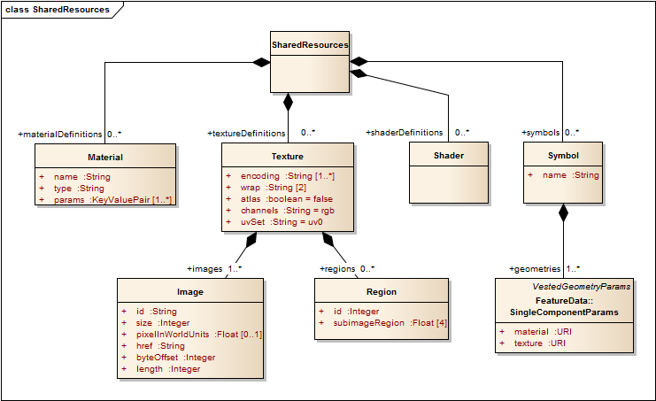
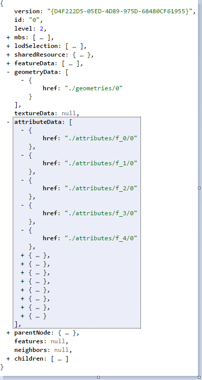
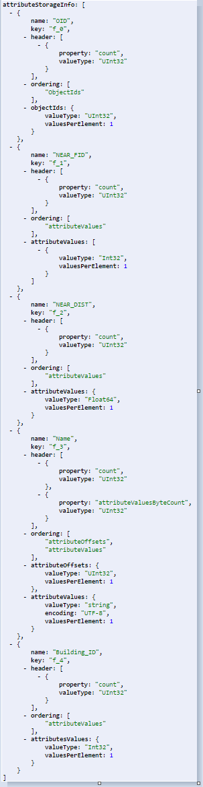
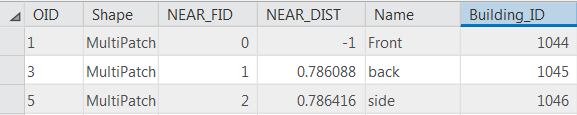
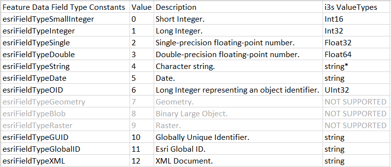
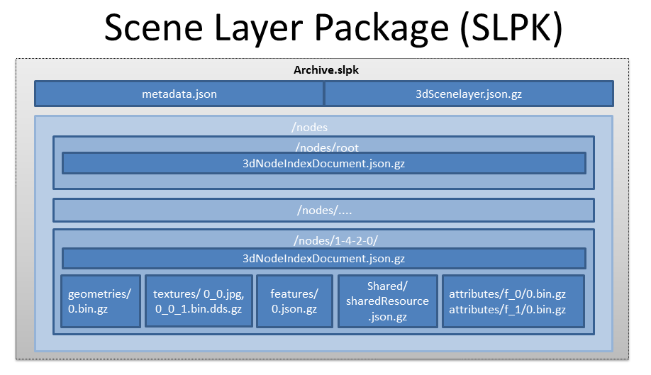

# Esri Indexed 3d Scene Layer (I3S) and Scene Layer Package (*.slpk) Format Specification

Version 1.6, January 02, 2018

*Contributors:* Tamrat Belayneh, Jillian Foster, Javier Gutierrez, Markus Lipp, Sud Menon, Pascal M&uuml;ller, Dragan Petrovic, Johannes Schmid, Ivonne Seler, Chengliang Shan, Simon Reinhard, Thorsten Reitz, Ben Tan, Moxie Zhang

*Acknowledgements:* Bart van Andel, Fabien Dachicourt, Carl Reed 

<hr>


The Indexed 3D Scene Layer (I3S) format is an open 3D content delivery format used to rapidly stream and distribute large volumes of 3D GIS data to mobile, web and desktop clients.  I3S content can be shared across enterprise systems using both physical and cloud servers.  <a href="http://server.arcgis.com/en/server/latest/publish-services/windows/scene-services.htm#">ArcGIS Scene Layers</a> and Scene Services use the I3S infrastructure.


<h2>Table of Contents</h2>

<ol>
	<li><a href="#_1">I3S Design Principles</a></li>
	<li><a href="#_2">3D Scene Layer</a></li>
	<li><a href="#_3">Coordinate Reference Systems</a>
		<ol>
		<li><a href="#_3_1">Height Models</a></li>
		</ol>
	<li><a href="#_4">I3S - Organization and Structure</a></li>
	<ol>
		<li><a href="#_4_1">Indexing Model and Tree Structure</a></li>
		<li><a href="#_4_2">Paged node index</a></li>
		<li><a href="#_4_3">Oriented bounding box</a></li>
		<li><a href="#_4_4">Geometry Model and Storage</a></li>
		<li><a href="#_4_5">Textures</a></li>
		<li><a href="#_4_6">Attribute Model and Storage</a></li>
	</ol>
	<li><a href="#_5">Level of Detail Concept</a>
	<ol>
		<li><a href="#_5_1">LoD Switching</a></li>
		<li><a href="#_5_2">LoD Generation</a></li>
		<li><a href="#_5_3">LoD Selection Metrics</a></li>
	</ol></li>
	<li><a href="#_6">Resources Schema and Documentation</a>
	<ol>
		<li><a href="#_6_1">SceneServiceInfo</a></li>
		<li><a href="#_6_2">3dSceneLayerInfo</a></li>
		<li><a href="#_6_3">3dNodeIndexDocument</a></li>
		<li><a href="#_6_4">FeatureData</a></li>
		<li><a href="#_6_5">SharedResources</a></li>
		<li><a href="#_6_6">Textures</a></li>
		<li><a href="#_6_7">Geometry</a></li>
		<li><a href="#_6_8">AttributeData</a></li>
	</ol></li>
	<li><a href="#_7">I3S Flexibility</a>
	<li><a href="#_8">Persistence</a>
	<ol>
		<li><a href="#_8_1">Scene Layer Packages (*.slpk files)</a></li>
		<li><a href="#_8_2">Key Value Stores</a></li>
	</ol></li>
</ol>


# I3S Design Principles

The Esri Indexed 3d Scene layer (I3S) format and the corresponding Scene Layer Package format (*.slpk) are specified to fulfill this set of design principals:  

- **User Experience First**: Provide a positive user experience, including high interactivity and fast display.
- **Scalability**: Support very large scene layers, including scenes with a global extent and many detailed features.
- **Reusability**: Use as a service delivery format, storage format, and exchange format.
- **Level of Detail**: Support multiple detail levels.
- **Distribution**: Allow efficient distribution of very large data sets.
- **User-controllable symbology**: Support efficient rendering of client-side symbology and styling.
- **Extensibility**: Support new layer types, new geometry types, and new platforms.
- **Web Friendliness**: Provide easy to handle data using JSON and current web standards.
- **Compatibility**: Provide a single structure that is compatible across web, mobile, and desktop clients.  Support is also included for cloud and on-premises servers.
- **Declarative**: Communicate clearly to minimize the amount of required domain knowledge to support the format.
- **Follow REST/JSON API Best Practices:** Provide navigable links to all resources.


# 3D Scene Layer

A single I3S data set is referred to as a Scene Layer.  It is a container for arbitrarily large amounts of heterogeneously distributed 3D geographic data.  Scene Layers provide clients access to data and allow them the flexibility to visualize it according to their needs.  The definition of "data" in this case includes the geometry, attributes, and vertex geometry. 

A Scene Layer is characterized by a combination of layer type and profile. The *layer type* describes the kind of geospatial data stored within it. The *layer profile* is exposed to clients and includes additional details on the specific I3S implementation. 

 The supported layer types are:

* [3D Objects](docs/1.6/3Dobjects.md) (e.g. building exteriors, 3D models in various formats)
* [Integrated Mesh](docs/1.6/integratedMesh.md) (e.g. integrated surface including vegetation, buildings and roads from satellite, aerial or drone imagery) 
* [Points](docs/1.6/points.md) (e.g. hospitals, schools, trees, street furniture, signs)
* [Point Clouds](docs/1.6/pointCloud.md) (e.g. lidar data)
* [Building Scene Layer](docs/1.6/buildingSceneLayer.md) (e.g. building including its components, such as windows, doors, chairs, etc.)


Layer types with the same profile can be leveraged to support different use cases.  Some layer types represent features using an identity instead of a geospatial field (e.g. mesh or cloud).  Some layer types support attribute storage, either as feature attributes or individual geometry elements.  Here are a few examples:

<table>
 <tr>
  <td><strong>Layer Type</strong></td>
  <td><strong>Profile</strong></td>
	<td><strong>Features with Identity</strong></td>
  <td><strong>Attributes</strong></td>	  
 </tr>
 <tr>
  <td><a href="../docs/1.6/3Dobjects.md">3D Objects</a></td>
  <td>mesh-pyramids</td>
  <td>Yes</td>
  <td>Yes</td>
 </tr>
 <tr>
  <td><a href="../docs/1.6/integratedMesh.md">Integrated Mesh</a></td>
  <td>mesh-pyramids</td>
  <td>No</td>
  <td>Triangle Attributes (planned)</td>
 </tr>
  <tr>
  <td><a href="../docs/1.6/points.md">Point</a></td>
  <td>points</td>
  <td>Yes</td>
  <td>Yes</td>
 </tr>
 <tr>
  <td><a href="../docs/1.6/pointCloud.md">Point Cloud</a></td>
  <td>pointclouds</td>
  <td>No</td>
  <td><a href="../docs/1.6/vertexAttribute.cmn.md">Vertex Attributes</a></td>
 </tr>
  <tr>
  <td>Line</td>
  <td>lines</td>
  <td>Yes</td>
  <td>Yes</td>
 </tr>
 <tr>
  <td>Polygon</td>
  <td>polygons</a></td>
  <td>Yes</td>
  <td>Yes</td>
 </tr>
 </table>
*Table 1: Examples of 3D Scene Layer Layer Types and Layer Profiles*


### Coordinate Reference Systems (CRS)

The Coordinate Reference System of the Indexed 3D Scene Layer should be selected with the following considerations:

- Minimize the need for re-projection on the client side
- Render in both projected and geodetic coordinate reference systems
- Support data with a global extent
- Support local and global data with high positional accuracy

To support these considerations, I3S has the following implementation requirements:

1. The location of all index-related data structures, such as node bounding spheres, are specified using a single, global Geographic WGS84 2D CRS. 
   - Coordinate bounds are in the range (-180.0000, -90.0000, 180.0000, 90.0000)
   - Elevation and node minimum bounding sphere radius are specified in meters
   - Allowed coordinate system using European Petroleum Survey Group (EPSG) code 4326
2. All vertex positions are specified using geodetic coordinate reference system
   1.  The X, Y, and Z axes are all in same unit, with a per-node offset for all vertex positions.  The offset is calculated from the center point of the node's minimum bounding sphere.
3. The axis order is independent of the Coordinate Reference System.  It will always use the Easting, Northing, Elevation (X, Y, Z) axis order. The Z axis always points up towards the sky.


All I3S profiles support writing 3D content in two modes: global and local. In global mode, only European Petroleum Survey Group (EPSG) code 4326 (WGS84) is supported for both index and vertex positions.  It is represented using longitude, latitude, elevation. In local mode, all geodetic Coordinate Reference Systems, including cartesian coordinate systems, are allowed. Both index and position vertex must have the same Coordinate Reference System.

All I3S layers indicate the coordinate system via the `spatialReference` property in the <a href="_6_2">3dSceneLayerInfo</a> resource. This property is normative.

The <a href="../profiles/common/docs/spatialReference.md">Spatial Reference</a> object is common to all i3s profile types.

### Height Models

The I3S standard allows either ellipsoidal or orthometeric vertical coordinate systems. This allows I3S to be applied across a diverse range of fields and applications, including those where the definition of elevation and height is important.  

At version 1.5, I3S added support for a vertical coordinate systems. The Well-known Text (WKT) representation of the Coordinate Reference System now includes the vertical coordinate system used by the layer. The `spatialReference` property also includes a Well-known Id (WKID) and a Vertical Coordinate System Well-known ID (VcsWKID).  The client application can consume any of these properties to designate the height model.

The 3dSceneLayerInfo resource includes a coarse metadata property called `heightModelInfo`, which client applications can use to identify if the layer's height model is either orthometric or ellipsoidal.  

See the [3DSceneLayerInfo](docs/1.6/3DSceneLayer.cmn.md) and [heightModelInfo](docs/1.6/heightModelInfo.cmn.md) pages for more details.


## Indexed Scene Layers - Organization and Structure

I3S organizes information using a hierarchical, node-based spatial index.  Each node contains features with geometry, textures and attributes. 

### I3S - Indexing Model and Tree Structure

Indexing allows fast access to data blocks. In an Indexed 3D Scene Layer, the spatial extent of the data is split into regions called *nodes*.  Each node has roughly equivalent amounts of data and is organized hierarchically.  The node index allows clients to efficiently determine which data it needs, and allows the server to quickly locate it.  Node creation is capacity driven. For example, the smaller the node capacity, the smaller the spatial extent of the node. 

Any indexing model can be used to generate indices in I3S.  Both regular partitioning of space (e.g. Quadtrees) and density dependent partitioning of space (e.g. R-Trees) are supported.  The partitioning scheme is not exposed to clients.  This partition results in a hierarchical subdivision of 3D space represented by nodes, which are further organized in a bounding volume tree hierarchy (BVH).

Each node has an ID that is unique within a layer.  I3S supports two types of nodes: *treekeys* and integers.  Treekeys are a string based identifier.  Integer IDs are base on a fixed linearization of the nodes. 

The treekey format is loosely modeled on binary search tree concept.  The key value indicates both the level and sibling association of a given node.  The key also indicates the position of the node in the tree, allowing sorting of all resources on a single dimension. 

Treekeys are strings in which levels are separated by dashes.  The root node is at level 1 always gets ID `root`.  

For example, take the node with treekey "3-1-0".  Since it has 3 numeric elements 3, 1 and 0, it can be concluded that the node is on level 4.  The parent node has Treekey  "3-1". 


*Figure 1: A sample index tree using Treekeys*

Each node covers the set of information covered by the nodes below it and is part of the path of the leaf nodes below it. Interior nodes may have a reduced representation of the information contained in descendant nodes.

Nodes include `NodeIndexDocument`, `FeatureData`, `geometry`, `attribures`, and `SharedResource`.  

- [Node Index Document](docs/1.6/3DSNodeIndexDocument.cmn.md): a lightweight resource that represents a node, its topology, and other sub-resources.
- [Feature Data](docs/1.6/featureData.cmn.md): a text resource that identifies the features within a node. It can store the geometry and attributes for all the features in the node either by value or by reference. 
- [Geometry](docs/1.6/geometry.cmn.md): the geometries of the features, the identifiers of the owning features, the mapping between individual feature their geometry segments
- [Attribute](docs/1.6/attributeStorageInfo.cmn.md): describes the structure of the binary attribute data
- [Texture](docs/1.6/textureDefinition.cmn.md): describes how a feature is to be rendered
- [Shared Resource](docs/1.6/sharedResource.cmn.md): models or textures that can be shared among features within the same layer

An I3S profile uses either a single text-based subresources or separate binary subresources.  The text-based resources contain all the geometry an attribute information (e.g. Point profile).  The separate binary subresources have self-contained geometry and attribute subresources (e.g. mesh pyraminds). Applications that use the separate binary subresources do not need to fetch the feature data in order to interpret them.  

Each node has exactly one `NodeIndexDocument` and one `SharedDescirptors` document. The `FeatureData`, `geometry`, and `attribures` can be bundled to help optimize network transfer and client side reactivity.  This helps balance index size and feature splitting with optimal network usage. 

There are always an equal number of `FeatureData` and `geometry` resources.  Each set contains
the corresponding data elements to render a complete feature.  In order to avoid dependency on the `FeatureData` document, the geometry data is directly available as a binary resource.  The geometry data includes all vertex attributes, feature counts, and mesh segmentation.

Figure 2 below shows the node tree of an 3D Object Indexed Scene Layer with a mesh pyramid profile.

- `Nodes` are in green circles
- `node identifiers` are in dark blue rectangles above each node
- `features` are in orange rectangles within each node.  The numbers in the rectangle are the feature identifiers.
- `geometry` is in turquoise rectangles. Each geometry resource is an array of geometries, which includes mesh-segmentation information and the feature identifier. 
- Each node is connected to its children with a green line. 
- The attribute and texture resources are omitted from the figure for clarity. They follow a similar storage model to geometry.
- Feature "6" has been generalized away at the lower level of detail node (node "3") and is intentionally no longer represented within its payload.


*Figure 2: Example 3D Object Indexed Scene Layer with a mesh pyramid profile*


### Geometry Model and Storage

All Scene Layer types make use of the same fundamental set of geometry types: points, lines and triangles.

The Array Buffer View controls geometry storage and comsumption representation.  For example, the Array Buffer View can be used require per-vertex layout of components.  This orders the vertex position, normal and texture coordinates to ensure the same pattern across the Scene Layer.

Both 3D Object and Integrated Mesh layer types model geometries as triangle meshes using the mesh-pyramids profile. The mesh-pyramids profile uses the triangles geometry type to store triangle meshes.  The meshes have a reduced level of detail, are segmented by features, and available in the interior nodes.

See the [Geometry](docs/1.6/geometry.cmn.md) section for more details.

### Textures

Textures are stored as a binary resource with a node. The texture resource contains the texture images.  I3S supports most commonly used image formats, like JPEG and PNG, and compressed texture formats like S3TC.  Authoring applications can provide additional texture formats using `textureEncoding` declarations. 

See the [Textures](docs/1.6/texture.cmn.md) section for more details.

### Attribute Model and Storage 

I3S supports two ways to access attribute data.  They can be accessed through  

1. Paired services with REST endpoints 
   - Enables direct access to source data
   - The query uses the unique feature ID key
2. Fully cached attribute information within the I3S store
   - Binary storage representation, which provides a significant performance benefit

Clients can use either method if the attributes are cached. The attribute values are stored as a geometry aligned, per field, key-value pair arrays.  

See [Attribute](docs/1.6/attributeStorageInfo.cmn.md) section for more details.


### Oriented Bounding Box (OBB)

See [oriented bounding boxes](docs/1.6/obb.cmn.md) for more details.


## Level of Detail (LoD)

Scene Layers include Levels of Detail that apply to the whole layer and summarize layer information.  They are similar to image pyramids or raster vector tiling schemes.  Scene Layers support levels of detail that preserve the identity of individual features across all detail levels. Levels of Detail can be used to split heavy features, thin or cluster for better visuals, and integrate externally authored files.

### Discrete Level of Detail

Discrete Levels of Detail are used to provide multiple models to display the same object.  A specific detail level is bound to certain levels of the index tree. Leaf nodes typically contain the original feature representation with the most detail.  The closer the node is the the root, the lower the level of detail. The detail is can reduced by texture thinning, down-sampling, feature reduction, mesh reduction, or clustering in order to ensure inner nodes have a balanced weight.  The number of discrete levels of detail for the layer corresponds to the number of levels in the index tree.

When navigating the I3S tree nodes, clients must determine how to interpret an unavailable level of detail.  Using the level of detail selection metrics included in the node, they can:

- Stop traversal to the node's children if the current node is not visible
- Use the data in the node if the quality is appropriate, and then stop traversal to children
- Continue traversal until nodes with higher quality are found. 

I3S supports multiple level of detail selection metrics and switching level of detail models.  Metadata about the level of detail generation processed used can be optionally included in the Scene Layer. 

### Levels of Detail: Multiple Representations 

I3S Layers can be used to represent input data that have multiple levels of detail. The most common method is to represent each input level of detail as its own I3S Layer with visibility thresholds.  The thresholds can capture the range of distances for which the layer should be used.  A set of I3S Layers that represent a single model can be grouped within the same I3S service. For each layer within the set, the features in the leaf nodes represent the modeled features at the level of detail of the input. Additionally automatically generated detail levels can be generated by extending the viewing range of each input level. 

A single I3S Layer can be created by combining all of the input level of detail information.  In this case, the height of the I3S Index Tree is fixed to the number of levels of detail present in the input.  Both the feature identities and geometries in each node are set based on the input data.  Using this strategy depends on the extent and the total number of detail levels.

### Level of Detail: Switching Models

Node switching allows clients to focus on the display of a node as a whole.  A node switch occurs when the content from a node's children is used to replace the content of an existing node.  This can include features, geometry, attributes and textures. Node switching can be helpful when the user needs to see more detailed information. 

Each interior node in the I3S tree has a set of features that represent the reduced level of detail.  This includes the details for all features covered by the node.  Due to generalization at lower levels of detail, not all features are present in reduced level of detail nodes.

The feature IDs link the reduced level of detail feature and an interior node, as well as the descendant nodes.  Applications can determine the visual quality by using the I3S tree to display all of the features in an internal node or use the features found in its descendants. 

### Level of Detail: Generation 

Integrated Mesh layer types typically come with pre-authored levels of detail.  If the desired level of detail does not exist, it can be generated. 

For example, 3D Object Layers based on the mesh-pyramids profile can create a level of detail pyramid for all features based on generalizing, reducing and fusing the geometries of individual features while preserving feature identity. The same approach can also be used with Integrated Mesh Layers based on the mesh-pyramid profile.  In this case, there are no features and each node contains a generalized version of the mesh covered by its descendants.

First, the bounding volume tree hierarchy is built based on the spatial distribution of the features.  The method used to create the levels depend on the Scene Layer type. 

<table>
	<tr>
		<td></td>
		<td><strong>3D Object</strong></td>
		<td><strong>Points</strong></td>
		<td><strong>Lines</strong></td>
		<td><strong>Polygons</strong></td>
		<td><strong>Pointclouds</strong></td>
	</tr>
	<tr>
		<td><strong>Mesh-pyramids</strong></td>
		<td align="middle"></td>
		<td></td>
		<td></td>
		<td></td>
		<td></td>
	</tr>
	<tr>
		<td><strong>Thinning</strong></td>
		<td align="middle"></td>
		<td align="middle"></td>
		<td align="middle"></td>
		<td align="middle"></td>
		<td align="middle"></td>
	</tr>
	<tr>
		<td><strong>Clustering</strong></td>
		<td align="middle"></td>
		<td align="middle"></td>
		<td align="middle"></td>
		<td></td>
		<td align="middle"></td>
	</tr>
	<tr>
		<td><strong>Generalization</strong></td>
		<td align="middle"></td>
		<td></td>
		<td align="middle"></td>
		<td align="middle"></td>
		<td></td>
	</tr>
</table>

*Table 2: Example level of detail generation methods based on Scene Layer type*


### Level of Detail: Selection Metrics

Selection metrics help clients determine the which level of detail to render.  For example, clients need to weigh the options of screen size, resolution, bandwidth, and memory to reach the target quality. 

See the the [Level of Detail Selection](docs/1.6/lodSelection.cmn.md") for more details.


# JSON Resources

### Supported Data Types

A value schema ensures that the JSON properties follow a fixed pattern and support the following data types

- **String**: utf8 string
- **Float**: float64
- **Integer**: int32
- **UUID**: A hexadecimal universally unique identifier
- **Date**: An ISO 8601 timestamp YYYY-MM-DDThh:mm:ss.sTZD
- **URL**: Both relative and absolute
- **Pointer**: Any reference to an object in a JSON document, consisting of a URL and a document path
- **NodeID**: A treekey string that is zero-based (first child is "0", root node is "root")


### Pointers

Pointers are used to reference specific properties in another document.  They consist of two elements

1. **In-document reference** (required): Reference the current property. Absolute references should be used for upstream paths, and relative references should be used for downstream paths.   
2. **URL** (optional): A prefix URL to link to a different document.  Use square brackets

For example, a pointer from FeatureData to 3DSceneLayer.name using a relative URL and an absolute reference would be written as: `[../../]/name`

### SceneServiceInfo

The SceneServiceInfo is a JSON file that describes the capability and data sets offered by an instance of a Scene Service. This file is automatically generated by the Scene Server for each service instance and is not part of a Scene Layer Package (SLPK) file. It is included here only for reference.

The SceneServiceInfo has the following structure: 


*Figure 3: Logical schema of the SceneServiceInfo document*

### Class SceneServiceInfo

The Class SceneServiceInfo describes an active SceneService instance.  There is exactly one SceneServiceInfo object in a document. 


<table>
	<tr>
		<td><strong>Name</strong></td>
		<td><strong>Type</strong></td>
		<td><strong>Description</strong></td>
	</tr>
	<tr>
		<td>serviceName</td>
		<td>String</td>
		<td>The type of the service; always SceneService.</td>
	</tr>
	<tr>
		<td>serviceVersion</td>
		<td>String</td>
		<td>The version of the service protocol/REST endpoint.</td>
	</tr>
	<tr>
		<td>supportedBindings</td>
		<td>String[1..*]</td>
		<td>the list of bindings</td>
	</tr>
	<tr>
		<td>supportedOperations</td>
		<td>String[1..3]</td>
		<td>Supported profiles of the service from the choice {Base, Dynamic, Editing}.</td>
	</tr>
	<tr>
		<td>layers</td>
		<td>3dSceneLayerInfo[1..*]</td>
		<td>The full <a href="#_6_2">3dSceneLayerInfo</a> information.</td>
	</tr>
</table>
*Table 3: Attributes of the Class SceneServiceInfo within the SceneServiceInfo document*

See [scene service](service/SceneService.cmn.md) for service examples.

### 3dSceneLayerInfo

The Class 3dSceneLayerInfo describes the properties of a single layer in a store.  It includes the default symbology, or the stylization information for a layer, which is described in the sub Class <a href="#Class DrawingInfo">DrawingInfo</a>. 

The Class 3dSceneLayerInfo has the following structure:

<div>

</div>

*Figure 4: Logical schema of the 3dSceneLayerInfo document*

### Class 3dSceneLayerInfo

Each 3dSceneLayerInfo object describes a Layer. The 3dSceneLayerInfo is a major object in the 3dSceneLayerInfo document. A SceneServiceInfo document can contain 1...* 3dSceneLayerInfo documents. 

See [3D Scene Layer Info](docs/1.6/3DSceneLayer.cmn.md) for more details.

### Class Store

The Class Store object describes the physical storage of a Layer.  This enables the client to detect when multiple Layers are served from the same Store. Storing multiple layers in a single store allows them to share resources.  When the resources are shared, layers with different attribute schemas or symbology but the same content type can be served efficiently. 

See the [store](docs/1.6/store.cmn.md) for more details.

### Class GeometrySchema

The Class GeometrySchema describes ?. 

It is used in stores where all ArrayBufferView geometry declarations use the same pattern for face and vertex elements.  The Class GeometrySchema reduces redundancy of ArrayBufferView geometry declarations in a store. It reuses the GeometryAttribute type from FeatureData; however, only valueType and valuesPerElement are mandatory.

See the [default geometry schema](docs/1.6/defaultGeometrySchema.cmn.md) for more details.

<h4>Class HeaderAttribute</h4>

Headers to Geometry resources must be uniform across a cache and may only contain fixed-width, single element fields. The HeaderDefinition provides the name of each field for later access and the valueType of that header field.

See [header attribute](docs/1.6/headerAttribute.cmn.md) for more details.

### Class Field

The Field class is used to provide schema information for this 3dSceneLayer.

See [class field](docs/1.6/field.cmn.md) for more details.

### Class AttributeStorageInfo

The attributeStorageInfo is another major object in the 3dSceneLayerInfo document. It describes the structure of the binary attributeData resource of a node.

See [attribute storage info](docs/1.6/attributeStorageInfo.cmn.md) for more details.

### Class IndexScheme

The IndexScheme class declaratively describes computational and structural properties of the index used within an I3S store. This information can be used by clients to better understand how to work with the index.

[Link to general index]

Point clouds have a different index scheme. See [point cloud index scheme](docs/1.6/index.pcsl.md) for more details.

<table>
	<tr>
		<td><strong>Name</strong></td>
		<td><strong>Type</strong></td>
		<td><strong>Description</strong></td>
	</tr>
	<tr>
		<td>name</td>
		<td>String</td>
		<td>Name of the scheme, selected from <code>{esriRTree, QuadTree, AGOLTilingScheme}</code>.</td>
	</tr>
	<tr>
		<td>inclusive</td>
		<td>Boolean</td>
		<td>true indicates that the extent and mbs of all children nodes is fully within their parent nodes' extent/mbs</td>
	</tr>
	<tr>
		<td>dimensionality</td>
		<td>Integer</td>
		<td>The number of dimensions in which this index differentiates.</td>
	</tr>
	<tr>
		<td>childrenCardinality</td>
		<td>Integer[2]</td>
		<td>min/max number of children per node.</td>
	</tr>
	<tr>
		<td>neighborCardinality</td>
		<td>Integer[2]</td>
		<td>min/max number of neighbors per node.</td>
	</tr>
</table>

<p><em>Table 8: Attributes of the Class <strong>IndexScheme</strong> within the 3dSceneLayerInfo document</em></p>

### Class DrawingInfo

DrawingInfo and the associated classes contain the default symbology (drawing information) of an Indexed 3D Scene Layer. 

When the DrawingInfo object is present in the 3dSceneLayerInfo Class, a client can symbolize an I3S layer using the Renderer information.  The DrawingInfo can alternatively be captured in the Scene Layer as part of the binary I3S representation.  This helps support clients that may not be able to override the symbology in a layer.  In this case, the DrawingInfo is described in the CachedDrawingInfo class. 

See [drawing info](docs/1.6/drawingInfo.cmn.md) for more details.

### Class Renderer

The Renderer class contains properties that define the drawing symbology of an Indexed 3D Scene Layer, including its type, symbol, label and descriptions.

<table>
	<tr>
		<td><strong>Name</strong></td>
		<td><strong>Type</strong></td>
		<td><strong>Description</strong></td>
	</tr>
	<tr>
		<td>type</td>
		<td>String</td>
		<td>The renderer type. One of <code>{\*Simple\*, UniqueValue, ClassBreaks}</code>. The default, <code>simple</code> renderer is a renderer that uses one symbol only. </td>
	</tr>
	<tr>
		<td>symbol</td>
		<td>Renderer::Symbol</td>
		<td>An object that represents how all features of this I3S layer will be drawn.</td>
	</tr>
	<tr>
		<td>label</td>
		<td>String</td>
		<td>The text string that may be used to label a symbol when displayed in a table of content of an application.</td>
	</tr>
	<tr>
		<td>description</td>
		<td>String</td>
		<td>The text string that does not appear in the table of contents but may appear in the legend.</td>
	</tr>
</table>
<p><em>Table 10: Attributes of the Class <strong>Renderer</strong> within the 3dSceneLayerInfo document</em></p>

### Class Symbol


The Class Symbol represents the render primitive used to symbolize an Indexed 3D Scene Layer. MeshSymbol3D is the only supported type of Symbol.

<table>
	<tr>
		<td><strong>Name</strong></td>
		<td><strong>Type</strong></td>
		<td><strong>Description</strong></td>
	</tr>
	<tr>
		<td>type</td>
		<td>String</td>
		<td>Specifies the type of symbol used. Value of this property must be <code>{\*MeshSymbol3D\*}</code>. </td>
	</tr>
	<tr>
		<td>symbolLayers</td>
		<td>Renderer::SymbolLayers</td>
		<td>An object that represents how all features of this I3S layer will be drawn.</td>
	</tr>
</table>
<p><em>Table 11: Attributes of the Class <strong>Symbol</strong> within the 3dSceneLayerInfo document</em></p>

### Class SymbolLayers

A collection of symbol objects used to visualize the feature.

<table>
	<tr>
		<td><strong>Name</strong></td>
		<td><strong>Type</strong></td>
		<td><strong>Description</strong></td>
	</tr>
	<tr>
		<td>type</td>
		<td>String</td>
		<td>Specifies the type of symbol used. Value of this property must be <code>{\*Fill\*}</code>.</td>
	</tr>
	<tr>
		<td>material</td>
		<td>SymbolLayers::Material</td>
		<td>The material used to shade the geometry.</td>
	</tr>
	<tr>
		<td>outline</td>
		<td>SymbolLayers::Outline</td>
		<td>The outline of the mesh fill symbol.</td>
	</tr>
</table>
<p><em>Table 12: Attributes of the Class <strong>SymbolLayers</strong> within the 3dSceneLayerInfo document</em></p>

### Class Material

The material used to shade the geometry.

See [material](docs/1.6/material.cmn.md) for more details.


### Class Outline

The Class Outline defines the outline of the mesh fill symbol. 

<table>
	<tr>
		<td><strong>Name</strong></td>
		<td><strong>Type</strong></td>
		<td><strong>Description</strong></td>
	</tr>
	<tr>
		<td>color</td>
		<td>Material::Color</td>
		<td>Color is represented as a three-element array. The three elements represent values for red, green and blue in that order.</td>
	</tr>
	<tr>
		<td>size</td>
		<td>Integer</td>
		<td>Outline size in points, positive only.</td>
	</tr>
	<tr>
		<td>transparency</td>
		<td>Integer</td>
		<td>Indicates the transparency value associated with the outline of the symbol.The value has to lie between 100 (full transparency) and 0 (full opacity).</td>
	</tr>
</table>
<p><em>Table 14: Attributes of the Class <strong>Material</strong> within the 3dSceneLayerInfo document</em></p>

### Class Color

The Color class defines the color of a symbol or the outline. Color is represented as a three-element array representing red, green, and blue.  Values range from 0 through 255. If color is undefined for a symbol or an outline, the color value is null.

The Class Color has the following structure:

<table>
	<tr>
		<td><strong>Name</strong></td>
		<td><strong>Type</strong></td>
		<td><strong>Description</strong></td>
	</tr>
	<tr>
		<td>color</td>
		<td>String</td>
		<td>The renderer type. One of <code>{\*Simple\*, UniqueValue, ClassBreaks}</code>. The default, <code> simple</code> renderer is a renderer that uses one symbol only. </td>
	</tr>
	<tr>
		<td>symbolLayers</td>
		<td>Renderer::Symbol</td>
		<td>An object that represents how all features of this I3S layer will be drawn.</td>
	</tr>
</table>
<p><em>Table 15: Attributes of the Class <strong>Color</strong> within the 3dSceneLayerInfo document</em></p>

### Class CachedDrawingInfo

The Class CachedDrawingInfo is used to indicate if the DrawingInfo object is captured as part of the binary I3S representation.

See [cached drawing info](docs/1.6/cachedDrawingInfo.cmn.md) for more details.

### 3dNodeIndexDocument

The 3dNodeIndexDocument file describes a single index node within a store.  It includdes links to other nodes (children, sibling, and parent), feature data, geometry data, texture data, and other metadata.

Depending on the geometry and level of detail modes, a node document can be tuned to be light-weight or heavy-weight.  Clients decide which data to retrieve.  A simple data visualization can be created using centroids with the details from the node, its parent, its children, and neighbors.

See [3D Node Index Document](docs/1.6/3DSNodeIndexDocument.cmn.md) for more details.

### Class NodeReference

A NodeReference is a pointer to another node.  A node can reference the parent, a child or a neighbor. NodeReferences contain a relative URL pointing to the referenced node ID, and metadata that can be used to determine whether to load the node, as well as maintaining store consistency.

See [node reference](docs/1.6/nodeReference.cmn.md) for more details.

### Class Resource

Resource objects are pointers to different types of resources related to a node, like the feature data, geometry attributes, indices, textures and shared resources.

See [resource](docs/1.6/resource.cmn.md) for more details.


### Class Feature

Features are representations of the geographic objects stored in a layer. In the 3dNodeIndexDocument, these objects define relationships, e.g. for linking feature representations of multiple LoDs.

<table>
	<tr>
		<td><strong>Name</strong></td>
		<td><strong>Type</strong></td>
		<td><strong>Description</strong></td>
	</tr>
	<tr>
		<td>id</td>
		<td>Integer</td>
		<td>An ID of the Feature object, unique within the store (important to note when using Features from multiple stores!). The ID must not be re-used e.g. for multiple representation of an input feature that are present in different nodes.</td>
	</tr>
	<tr>
		<td>mbs</td>
		<td>Float[4]</td>
		<td>An array of four doubles, corresponding to x, y, z and radius of the minimum bounding sphere of the referenced node.</td>
	</tr>
	<tr>
		<td>lodChildFeatures</td>
		<td>Integer[0..*]</td>
		<td>IDs of features in a higher LoD level which together make up this feature.</td>
	</tr>
	<tr>
		<td>lodChildNodes</td>
		<td>String[0..*]</td>
		<td>Tree Key IDs of the nodes in which the lodChildFeatures are found</td>
	</tr>
	<tr>
		<td>rank</td>
		<td>Integer[0..1]</td>
		<td>The LoD level of this feature. Only required for features that participate in a LoD tree. The lowest rank is 1.</td>
	</tr>
	<tr>
		<td>rootFeature</td>
		<td>String</td>
		<td>The Tree Key ID of the root node of a feature LoD tree that this feature participates in. Only required if the feature participates in a LoD tree and if it is not the rootFeature itself.</td>
	</tr>
</table>

<p><em>Table 20: Attributes of the Class <strong>Feature</strong> within the NodeIndexDocument</em></p>

### Class Level of Detail Selection (lodSelection)

A level of detail selection (lodSelection) object provides information on a metric determined during
the cooking process of an I3S store.  Clients can use this metric to determine representation quality.

Cookers can add as many lodSelection objects as desired, but must provide at least one so that the level of detail type (lodType) is not null. Of the three minimum, average, and maximum values, typically only one or two are used.


See [level of detail selection](docs/1.6/drawingInfo.cmn.md) for more details.

### FeatureData

The FeatureData JSON files contain geographical features with a set of attributes, accessors to geometry attributes, and other references to styling or materials.

Features have the following structure:

<div>

<p><em>Figure 8: Logical schema of the FeatureData document</em></p>
</div>

### Class Feature

A Feature is a single object within a GIS data set.  It usually represents a real world feature.

See [feature data](docs/1.6/featureData.cmn.md) for more details.

### Class FeatureAttribute

A FeatureAttribute is a field carrying a value. This value may be a list of complete attributes which are used with reports or metadata.

See [feature attribute](docs/1.6/featureAttribute.cmn.md) for more details.


### Class Geometry

This is the common container class for all types of geometry definitions used in I3S.

See [geometry](docs/1.6/geometry.cmn.md) for more details.

### Class GeometryParams

This is the abstract parent class for all GeometryParams classes (GeometryReferenceParams, VestedGeometryParamas, SingleComponentParams). It does not have properties of its own.

See [geometry params](docs/1.6/geometryParams.cmn.md) for more details.

### Class GeometryReferenceParams

Instead of owning a Geometry exclusively, a Feature can also reference a Geometry defined for the node. This allows to pre-aggregate Geometries for many features. In this case, a GeometryReferenceParams has to be used.

See [geometry reference params](docs/1.6/geometryReferenceParams.cmn.md) for more details.

### Class VestedGeometryParams

This Class extends GeometryParams and is the abstract parent class for all concrete ("vested") GeometryParams classes that directly contain a Geometry definition, either as an ArrayBufferView or as an Embedded Geometry.

See [vested geometry params](docs/1.6/vestedGeometryParams.cmn.md) for more details.

### Class SingleComponentParams

Objects of this type extend VestedGeometryParams and use one texture and one material. They can be used with aggregated LoD geometries.

See [single component params](docs/1.6/singleComponentParams.cmn.md) for more details.

### Class Component

Component objects provide information on parts of the geometry they belong to, specifically with which material and texture to render them.

<table>
	<tr>
		<td><strong>Name</strong></td>
		<td><strong>Type</strong></td>
		<td><strong>Description</strong></td>
	</tr>
	<tr>
		<td>id</td>
		<td>Integer</td>
		<td>The ID of the component, only unique within the Geometry</td>
	</tr>
	<tr>
		<td>materialID</td>
		<td>UUID</td>
		<td>ID of the material, as defined in the shared resources bundle, to use for rendering this component</td>
	</tr>
	<tr>
		<td>textureID</td>
		<td>Long[0..1]</td>
		<td>Optional ID of the texture, as defined in shared resources, to use with the material to render this component</td>
	</tr>
	<tr>
		<td>regionID</td>
		<td>Long[0..1]</td>
		<td>Optional ID of a texture atlas region which to use with the texture to render this component</td>
	</tr>
</table>

<p><em>Table 28: Attributes of the Class <strong>Component</strong> within the FeatureData document</em></p>

### Class GeometryAttribute

Each GeometryAttribute object is an accessor (i.e. a view) into an arraybuffer. There are two types of GeometryAttributes - VertexAttributes and FaceAttributes. VertexAttributes describe valid properties for a single vertex.  FaceAttributes describe faces and other structures by providing a set of indices. For example, the `faces.position` index attribute defines which vertex positions make up a face.

See [geometry attribute](docs/1.6/geometryAttribute.cmn.md) for more details.

## SharedResources

Shared Resources are models or textures stored as a JSON file that can be shared among features within the same layer.  The Shared Resources are stored in the subtree of the current node. This approach ensures an optimal distribution of shared resources across nodes, while maintaining the node-based updating process.  

Shared resources include the [material definition](docs/1.6/materialDefinition.cmn.md) and [texture defintion](docs/1.6/textureDefinition.md) for the resource.

See [shared resources](docs/1.6/sharedResources.cmn.md) for more details.

<div>

<p><em>Figure 9: Logical schema of the SharedResources document</em></p>
</div>

### Class ShaderDefinition

ShaderDefinitions are, in this version of the I3S specification, an optional feature to provide API-dependent shader programs with a layer.

### Class Symbol

Symbols use the same model as in the FeatureData Geometry.


# Textures

The Textures file is a binary resource that contains one or more images that are used as textures for the features in the store. A single Texture.bin file contains 1 to n textures for a single specific texture level of detail. It can contain a single texture atlas or multiple individual textures.  The bundling is determined by the authoring application so that specific aspects of the materials and textures used can be taken into account (e.g. tiling).

## Texture Recommendations and Requirements

The number and volume of textures tends to be the limiting display factor, especially for web and mobile clients.  Here are are few guidelines to get the most out of texture resources.

### Image Formats

I3S supports multiple texture formats.  The format used depends on the use case. For example, a client might choose to consume JPEG in low bandwidth conditions since they are efficient to transmit and widely used. However, clients constrained for memory or computing resources might choose to directly consume compressed textures such for scalability and performance.

I3S supports most commonly used image formats such as JPEG/PNG, as well as rendering optimized compressed texture formats such as S3TC. The authoring application needs to provide the appropriate textureEncoding declaration using MIME types such as “image/jpeg” (for JPEG) and “image/vnd-ms.dds” (for S3TC).

I3S will expand coverage for more compressed texture formats as they become widely adopted.

### Texture Sets

Multiple textures can be combined into a single texture using array buffer views.  Large texture atlases (e.g. 2048 x 2048 px) with one texture per bundle are recommended.

### Atlas Usage and Regions

Individual textures should be aggregated into texture atlases.  Each individual texture becomes a subtexture.  As with all texture resources, the atlas has to be 2^n sized on both dimensions, where n ranges [3,12].  Width and height do not need to be equal.  Subtextures also need to be 2^n sized with n in range [3,12].  Subtextures with other dimensions can cause border artifacts when filtering or MIP-mapping.  A subtexture can be padded to the nearest lower 2^n size by interpolating or scaling pixels.

Subtexture pixels are identified by the subimageRegion attribute: [umin, vmin, umax, vmax].  Region information is passed to the shader using a separate vertex attribute, which converts a UV vertex coordinate to a UVR coordinate.  R encodes the [umin, vmin, umax, vmax] attribute values into 4 UInt16 values.

### Texture coordinates

Texture coordinates are used since client capabilities for handling complex UV cases vary widely. Texture coordinates do not take atlas regions into account directly. They range from 0 to 1 in U and V, except when using the "repeat" wrapping mode.  In repeat mode, U and V  range from 0 to n, where n is the number of repeats. The client is expected to use the subimageRegion values and the texture coordinates to best handle repeating textures in atlases. 


### Generating Image IDs

Generated using the BuildID function

```
UInt64 BuildID(LONG id, int w, int h , int l, int al)
{
    UInt64 l_al = ((UInt64)al)<<60;
    UInt64 l_l = ((UInt64)l)<<56;
    UInt64 l_w = ((UInt64)(w - 1))<<44;
    UInt64 l_h = ((UInt64)(h - 1))<<32;
    UInt64 id64 = l_al + l_l + l_w + l_h + (UInt64)id;
    return id64;
}
```

Usage syntax: `UInt64 image_id = BuildID(id, w, h, l, al);`

**Function Parameters**

<table>
	<tr>
		<td>id</td>
		<td>Index of the texture in the store, start from 1</td>
	</tr>
	<tr>
		<td>w</td>
		<td>Width of the texture</td>
	</tr>
	<tr>
		<td>h</td>
		<td>Height of the texture</td>
	</tr>
	<tr>
		<td>l</td>
		<td>Index of the level that the texture belong to, start from 0</td>
	</tr>
	<tr>
		<td>al</td>
		<td>Level count of the texture</td>
	</tr>
</table>

<h3><a name="_6_7">Geometry.bin</a></h3>

<p>The binary geometry attribute file follows the <a href="http://www.khronos.org/registry/typedarray/specs/latest/">Khronos Typed Array
specification</a> in the Editor's Draft version of 10<sup>th</sup> April 2013.
Citing the overview of that spec:</p>

<blockquote>
<p>This specification defines an ArrayBuffer
type, representing a generic fixed-length binary buffer. It is not possible to
manipulate the contents of an ArrayBuffer directly. Instead, a group of types
are used to create views of the ArrayBuffer. For example, to access the buffer
as an array of 32-bit signed integers, an Int32Array would be created that
refers to the ArrayBuffer.</p>

<p>Multiple typed array views can refer to the
same ArrayBuffer, of different types, lengths, and offsets. This allows for
complex data structures to be built up in the ArrayBuffer. As an example, given
the following code:</p>

<pre><code>
// create an 8-byte ArrayBuffer
var b = new ArrayBuffer(8);

// create a view v1 referring to b, of type Int32, starting at
// the default byte index (0) and extending until the end of the buffer
var v1 = new Int32Array(b);

// create a view v2 referring to b, of type Uint8, starting at
// byte index 2 and extending until the end of the buffer
var v2 = new Uint8Array(b, 2);

// create a view v3 referring to b, of type Int16, starting at
// byte index 2 and having a length of 2
var v3 = new Int16Array(b, 2, 2);
</code></pre>

<p>This defines an 8-byte buffer b, and three
views of that buffer, v1, v2, and v3. Each of the views refers to the same
buffer -- so v1[0] refers to bytes 0..3 as a signed 32-bit integer, v2[0]
refers to byte 2 as a unsigned 8-bit integer, and v3[0] refers to bytes 2..3 as
a signed 16-bit integer. Any modification to one view is immediately visible in
the other: for example, after v2[0] = 0xff; v2[1] = 0xff; then v3[0] == -1
(where -1 is represented as 0xffff)."</p>
</blockquote>

<div>

<p><em>Figure 10: Geometry Buffer Layout with headers</em></p>
</div>

<p>Note: The expected triangle/face winding order in all geometry resources is
counterclockwise (CCW).</p>

<p>Note: If normal vectors are present in a geometry, they need to be calculated based on uniform axis units.
They are always given as if x,y and z axes all had metric units, as a unit vector.
This means that if WGS84 is used as a horizontal CRS, the normal calculation cannot directly use the face's WGS84 coordinates, but needs to convert them to a local cartesian CRS first.</p>

<h3><a name="_6_8">AttributeData</a></h3>  

This section describes the format for storing attribute data within I3S layers as part of the scene service cache along with geometry, texture and material resources, in an optimized renderer friendly format.  

By attribute data we mean the tabular information stored as an attribute of a feature class, which is the primary input source of scene services.  

Attribute data for all features in a node is stored and made available as discrete, per field resource called **_attribute_**. The number of attribute resources correspond to the number of fields the service publisher opted to include in the scene cache.  

A key concept of this storage model is that the order in which attribute values are stored within any _attribute_ resource, is the same as the order in which the feature geometries are stored within the geometry resource of that node. This allows clients who fetch these resources to render each node efficiently - using direct array access to retrieve feature attribute(s) without the need for object-id based attribute lookups.  

For cases where object-id based access to attributes is needed, the _attribute_ resource representing the _object-id_ field stores the object-id values of each feature within the node - in the same storage order as the geometry resource. This facilitates object-id based access. Clients can also build an object-id to array-index dictionary for cases where large numbers of object-id based attribute or geometry look ups within a node are needed. (Note: the following ways of referring to the ObjectId of a feature are equivalent in these and other I3S specifications: ObjectId, object-id, OID, FID).  

When the same feature is included in multiple nodes at different levels of detail, the corresponding attributes for the feature are also included as _attribute_ resource/s of each node it is present in. This redundancy in attribute storage allows each node to be rendered independently of any other node.  

Metadata on each _attribute_ resource is made available to clients via the <a href="../profiles/meshpyramids/examples/3dSceneLayer.js">scene service layer</a>. When attributes are present within the scene cache, the _resourcePattern_ array in the layers store (layers[id].store.resourcePattern) will include a value called _Attributes_, indicating attributes are a required resource, utilized for attribute driven symbolization and rendering. In addition to the _resourcePattern_, additional metadata present in the _fields_ array (_layers[id].fields[id]_) and  _attributeStorageInfo_ array (_layers[id].attributeStorageInfo[id]_), further describe each attribute resource.  

These metadata allow clients to initialize and allocate any required client side resources prior to accessing any attributes of interest.  

<div>

<p>Figure 11: An example of the fields array (layers[id].fields[id]) resource of a scene service layer illustrating different supported types of feature attribute fields. The fields array describes an attribute field with respect to its name, type and alias.</p>
</div>


Once a client application makes a decision regarding the field it is interested in accessing, it can use the _key_ property (_layers[id].attributeStorageInfo[].key_) of the _attributeStorageInfo_ metadata to uniquely identify and request the _attribute_ resource thru a new RESTful API, called **attributes.** The _attributeStorageInfo_ metadata in addtion contains all the information that a client application requires to decode the retrieved _attribute_ binary content.

**The content of this binary attribute resource is made up of :**

- A header section of 4 bytes which indicates the count of features. The count value is present in all _attribute_ resources. For an _attribute_ resource of a string data type, the header has an additional 4 bytes indicating the total byte count of the string attribute values.
- For all numerical field types, the header section will be followed by the attribute values array record. The attribute values must always begin at an offset that is divisible by the byte length of a single value. If the header does not end at such an offset, the necessary amount of padding is inserted between the header and the attribute values.
- For string field types, the header section is followed by a fixed length array whose values are the byte counts of each string data, inclusive of the null termination character. This array is then followed by an array of actual string data. The strings are stored null terminated.


_<a href="../profiles/meshpyramids/examples/3dSceneLayer.js">code 1.</a> A scene layer resource illustrating the metadata information found in the fields (layers[id].fields[id]) and attributeStorageInfo arrays (layers[id].attributeStorageInfo[id])._


A client application will be able to find the URI of any attribute resource through its href reference from the **attributeData** array of the **Node Index Document** (similar access patterns exist for resources such as 'features', 'geometries', etc …). See Figure 12 below:  

<div>

<p>Figure 12: A node resource document illustrating attribute data content access urls (href).</p>
</div>

#### REST API for Accessing Attribute Resources directly from a scene service layer

The **attributes** REST API will allow client apps to fetch the attribute records of a given field as identified by its _Key_ property. As a result, every scene node (with the exception of 'root' node), will expose available attribute fields as discrete _attribute_ resources. These resources are accessible thru a relative URL to any Node Index Document.

The _attributes_ REST api syntax is as follows:  
 URL: **http://&lt;sceneservrice-url&gt;/attributes/&lt;field_key&gt;/&lt;id>**

- _attributes_ -  is the RESTful resource responsible for fetching the binary attribute resource. A client application will be able to decode the content of this _attribute_ resource solely based on the metadata information found in the scene layer _attributeStorageInfo_ array (which adequately describes the content of the binary data).  
- <i>field\_key</i> - is the field key value that will be used to request the desired feature attribute content.
- _id_ - is the bundle id of the _attribute_ binary resource, corresponding to the geometry bundle id. By default this value is 0 (same as the geometry bundle id). If a node has more than 1 geometry resource, then the id of the _attribute_ resource will also match the geometry bundle id.


#### A typical pattern of usage of the _attributes_ REST API includes:  

1. Prior to symbolizing a given node based on attribute information, a client application should get attribute field metadata information by fetching the scene server _layers_ REST resource. The _layers_ resource contain the _fields_ (_layers[Id].Fields[id]_) array, which lists all available attribute fields and types and the _attributeStorageInfo_ (layers[id].attributeStorageInfo[id]) array, which describes the content of each binary _attribute_ resource.  

 The _fields_ array object contains a collection of objects that describe each attribute field regarding its field name ('name'), datatype ('type') and a user friendly name ('alias'). It includes all fields that are present in the source feature layer of the scene service layer.  

 The _attributeStorageInfo_ array contains a collection of objects that describes all _attribute_ binary resources. It includes only fields the publisher/author chose to include as part of the scene cache during publishing time. The  _attributeStorageInfo_, which is metadata information  about the binary _attribute_ resources, is made up of:  

  1. _name_ (_attributeStorageInfo[id].name_) and _key_ (_attributeStorageInfo[id].key_) properties that identify each  resource.
  2. A _header_ (_attributeStorageInfo[id].header_) object, consisting of a _count_ and _valueType_ properties indicating the count of the attributeValue objects. In case of string atttibute values the _header_ consists an additional object, _attributeByteCounts_ property, which indicates the total byte count of the string values.
  3. An _ordering_ (_attributeStorageInfo[id].ordering_) object that indicates the object storage layout.
  4. For string attribute values, an _attributeByteCounts_ object describing each of the string attribute values byte   count.
  5. The _attributeValues_ object describing the attribute value array, which contains member properties such as _valueType_ and _valuesPerElement_. For string attribute values in addition to its _valueType_ ('String'), there is an additional property _encoding_ ('UTF-8') that indicates the unicode enconding type. A String-Array is capable of supporting null attribute values (a 0 byte count value indicates a null string).  

  Note that the _key_ property (with values such as <i>f_0</i>, <i>f_1</i>, etc...) is **automatically** computed and that there shouldn't be any relationship _assumed_ to the field index of the source feature class (especially important when a user adds or deletes fields during the lifetime of a layer).  

	<div>
	
	<p>Figure 13: An expanded view of a scene layer resource showing the content of an attributeStorageInfo resource. The example shows 5 objects each corresponding to the 5 objects of the fields resource (as matched by the 'key' and  'name' properties present in both arrays).The JSON representation of the example is located in <a href="../profiles/meshpyramids/examples/3dSceneLayer.js">3D Scene Layer examples section</a>.</p>
	</div>


2. A client application equipped with the list of available fields and the corresponding attribute-value-array metadata, can then fetch the attribute values of interest just by supplying the desired field _Key_ as part of the **attributes** REST request. Furthermore, it will also be capable of decoding the fetched _attribute_ resource based on the metadata as retrieved in step 1.  

 Note: The geometry buffer contains the _objectIDs_ array as the last section of the geometry layout (layers[id].store.defaultGeometrySchema.featureAttributes). A client application that has a need to access the _ObjectIDs_ array, should first check in the geometry buffer before requesting it from the _attributes_ REST resource.  

 The following example below shows the _attributes_ REST request signature:  

    a.http://&lt;myserver&gt;/arcgis/rest/services/Hosted/SanFran/SceneServer/layers/0/nodes/0-0-0-0/<b>attributes/0/f_1</b>  
    b.http://&lt;myserver&gt;/arcgis/rest/services/Hosted/SanFran/SceneServer/layers/0/nodes/0-0-0-/<b>attributes/0/f_2</b>  
    
    In _Example 1.a_ we will request the attributes of all features for a _field_ named 'NEAR_FID', as identified by its field key (<i>f_1</i>) in Figure 11. This field resource contains the attribute values of all _features_ that are present in node 0-0-0-0. Similarly, _Example 1.b_ will fetch the attributes of all features associated with the field called ('NEAR_DIST') using its key (<i>f_2</i>).

#### Attribute Resource - Details

An _attribute_ resource consists of either a single one dimensional array in the case of numeric fields (including the object-id field) or two one dimensional arrays that sequentially follow each other in the case of variable length string fields.

The structure of each _attribute_ resource is declared upfront in the scene layer resource thru the _attributeStorageInfo_ object. The client application (as stated above in the typical usage pattern) is expected to read the _attributeStorageInfo_ metadata to get the header information, the ordering of the stored records (arrays) as well as their value types before consuming the binary attribute resource.

Lets take a look at a sample scene service layer and its field types ([see Figure 14](images/figure-14.png)). This layer has 6 fields named 'OID', 'Shape', 'NEAR_FID', 'NEAR_DIST', 'Name' and 'Building_ID'.  

<div>

<p>Figure 14: A typical attribute (table) info of a feature class. The fields array that’s shown as an example in Figure 11 and the attributeStorageInfo array in Figure 13 is derived from the attribute value of the above feature class.</p>
</div>  

As it could be inferred from [Figure 11](images/figure-11.png) and [Figure 13](images/figure-13.png), a scene service layer exposes/includes **only** supported attribute field value types of a feature class. As a result, the 'Shape' field ([see Figure 14](images/figure-14.png)), which is of _esriFieldTypeGeometry_ type, will not be included in the attribute cache of a scene layer.

[see Table 24](Table_24.png) below which lists a feature layer's field data types (including its values and description). The I3S valueTypes column indicates the value types of the fields that are supported for attribute based mapping/symbology.

<div>

<p>Table 24: Attribute data types supported by a scene service layer.</p>
</div>  

\* String – using UTF-8 Unicode character encoding scheme.

The following types of attribute value arrays are supported :
_Int32-Array_, _UInt32-Array_, _UInt64-Array_, _Float64-Array_, _Float32-Array_, _String-Array_

Using our example feature class shown in [Figure 14](images/figure-14.png) let's see how it maps to the different types of _attribute_ resources.   

The _'OID'_ field, whose field type is 'esriFieldTypeOID' is by default represented as an _UInt32-Array_. This is a simple 1-d array of _UInt32_ value type.

The next attribute field type in the above example, 'NEAR-FID' which is of field type 'esriFieldTypeInteger' is represented as an _Int32-Array_. This again is also a simple 1-d array of _Int32_ value type.

The 'NEAR_DIST' field is of field type 'esriFieldTypeDouble' field type and is represented as a _Double-Array_, represented as 1-d array of _Float64_ value type.

The 'Name' field is of 'esriFieldTypeString' and is represented as a _String-Array_. A String-Array supports storage of variable length strings and is stored as two arrays in sequence where the first fixed length array has the byte counts of each string (null terminated) in the second array and the second array stores the actual string values as UTF8 encoded strings. The value type of the first array is (_UInt32_) whereas the value type of the second array is _String_.  

The _attributes_ REST api of a scene layer gives access to all scene cache supported feature attribute data as attribute value arrays that are stored in binary format. As a result, the scene cache of the example feature class in [Figure 14](images/figure-14.png) will have 5 binary resources, as identified by keys <i>f_0_, f_1_, f_2_, f_3_ </i> and <i>f_4</i> and accessible by their respective rest resource URLs (_.../nodes/&lt;nodeID&gt;/attributes/0/f\_0, .../nodes/&lt;nodeID&gt;/attributes/0/f_1, etc..).

#### Accessing the legend of a 3D Object Layer

Legends are essential for proper display (complete communication of represented information) of 3D Object Layer (also equally applicable for other layer types).

Clients are responsible for building legend information from the drawingInfo resource for the scene layer.
In this scene layers and scene services behave identically to feature layers and feature services.

<h2><a name="_7">I3S Flexibility</a></h2>


I3S is flexible and allows for different implementation choices for different types of 3D data or even for the same type of 3D data. The profile for a layer indicates the set of choices made. Choices supported by I3S and made use of by different profiles are described below. In each case the profile listed is the canonical profile for the corresponding layer-type.

1. The Minimum Bounding Volume (MBV) property can be represented as:  
 a. Minimum Bounding Sphere (MBS)  
 b. Oriented Bounding Box (OBB)  

2. Node structure  
 a. Expanded – in support of clients that want to gain more complete meta-information about node’s position within BVH topology and its immediate neighborhood  
  - Each index node provides pointers to its parent, all its children, and sibling neighbors (including their MBVs)  
	      Used by: mesh-pyramids and points profiles  

 b. fixed-size in support of paged access pattern  
  - A minimal structure – just the essentials: bounding volume; first-child reference; child-count; LoD selection data; etc.  
	      Used by: the pointclouds profile.  

3. Embedded versus Binary geometry content format  
 a. Embedded geometry: as text (JSON) inlined with other metadata within featureData resource – to support profiles where run-length encoding of feature-IDs along the vertex data is suboptimal
	 	      Used by: the canonical points profile.  

 b. Binary format: for voluminous, ready to render/use geometries and cached attributes. Both typed array buffer views as well as fixed format binary buffers are supported.  
​	-	The mesh-pyramids profile uses ‘array buffer views’ (ArrayBufferView follows the Khronos Typed Array specification)  
​	-	The pointclouds profile uses binary buffers in order to support a domain-specific data compression  

4. LoD Selection based on different metricTypes:  

 1.	maxScreenThreshold – LoD switching based on screen ‘size’ of the node’s MBV  
	 	 ​     Used by: mesh-pyramids profile
 2.	screenSpaceRelative – LoD switching based on screen ‘scale’ of the node’s MBV  
        Used by: points profile
 3.	distancRangeFromDefaultCamera – LoD switching based on normalized distance of the node’s MBV from the camera – used by: points profile
 3.	effectiveDensity – estimation of the point density covered by the node  
        Used by: pointclouds profile  


#### Summary of I3S Defining Characteristics

In summary, here are other characteristics, including content data formats, which the scene layer may include:  

•	Attributes may be included on individual entities, on individual point cloud points, or on partial segments of meshes  
•	Attribute-based stylization may be modified by client software  
•	Multiple, alternative textures may be provided to optimize for per-platform performance and display  
•	JSON format for index and metadata, binary for more voluminous geometry, texture and attribute data  
•	A Scene Layer Package format for distribution, or direct use, of the scene layer as a single file (see SLPK section)  
•	Optional paired services that expose query-able and updatable RESTful endpoints that enable direct access to dynamic source data  
•	Explicit control over bounding index shape and per-node switching behavior to provide for optimized display and query  
• BVH based on bounding spheres (MBS) as well as oriented bounding boxes (OBB) (planned)  
•	Scene layers may be created in Cartesian 3D or in global 3D world coordinate systems  

<h2><a name="_8">Persistence</a></h2>


I3S scene layers can be delivered to web, mobile and desktop clients using a number of different patterns.
Most users will interact with scene layers using applications that access cloud or server based information via RESTful interfaces/services.  In these cases the cache (the I3S nodes and their payloads)  for the scene layer reside on the server and is returned to clients via a RESTful interface that exposes the scene layer, its nodes and  their associated resources (geometries, attributes, textures) as web addressable resources. The I3S specification contains a complete description of the <a href="../service/SceneService.md">web addressable resources</a> and their url scheme.
Some users will also interact with a scene layer delivered to them as a single large Scene Layer Package – this is a single file that packages the complete node tree and its resources into an archive that supports direct access to the individual nodes and resources within it. <a href="#_8_1">Scene Layer Packages (SLPK files)</a> are part of the current I3S implementation with multiple generators and the ability by clients to consume packages containing hundreds of GB of content.  


All storage methods store the Indexed 3D Scene Layers in a simple key-value structure, with the key representing the access URL and the value being the JSON document or other resource type.

<h3><a name="_8_1">Scene Layer Packages (SLPK files)</a></h3>

Scene Layer Packages (SLPK) serve two purposes: They allow a complete I3S layer, with all resources, to be transported or exchanged as a single file,
and they optionally also allow to be directly consumed by applications such as clients or services.

The format of the package itself is defined as follows:

<ul>
	<li>The Archive type is always <a href="https://en.wikipedia.org/wiki/Zip_(file_format)">Zip</a>.</li>
	<li>On this Archive, an overall compression scheme may be applied.
	This compression scheme has to be either STORE or DEFLATE64.
	Standard DEFLATE is acceptable as a fallback if DEFLATE64 is not available, but will only work with smaller SLPKs. </li>
	<li>STORE is the preferred compression schema for an SLPK intended for direct consumption by client application, especially if a resource compression is already applied on the individual resources (as shown in the figure 15 below).</li>
	<li>Every resource except textures may also be individually compressed. Compressed textures (such as S3TC) can additionally have GZIP compression applied to them.	</li>
	<li>For resource compression, only the GZIP scheme is supported, as DEFLATE support is not universally available in all browsers.</li>
</ul>

The layout show in Figure 15 below is referred to as the BASIC folder pattern.
The I3S specification allows also for an EXTENDED folder pattern that uses subtree partitions to avoid problems with very large packages.  

<div>

<p><em>Figure 15: Example of an SLPK with BASIC folder layout.</em></p>   
</div>  

The contents of the archive depicted in Figure 15 shows an SLPK with the BASIC folder pattern. At the top level, it has a <em>nodes</em> subfolder containing all node resources, a <em>metadata.json</em> file that describes the content of the SLPK and a <em>3dSceneLayer.json.gz</em> file that defines the Scene Layer. In the example, the <em>nodes</em> subfolder contains, nodes named <em>root</em>, <em>1-4-2-0</em>, etc. Drilling further into one of the nodes, <em>1-4-2-0</em>, notice that all file resources are individually compressed with GZIP compression (indicated by the file extension .gz), with the exception of the texture resource that is in JPEG format (<em>textures/0_0.jpg</em>). The resources under the sub folders <em>geometries</em> (<em>geometries/0.bin.gz</em>) and <em>attributes</em> (<em>attributes/f_0/bin.gz</em>, <em>attributes/f_1/bin.gz</em>, ...), serialized as binary, correspond to the geometryData, and attributeData resources of a scene layer, respectively. Similarly, <em>3dNodeIndexDocument.json.gz</em>, <em>features/0.json.gz</em> and <em>SharedResource.json.gz</em> correspond to 3dNodeIndexDocument, featureData and SharedResource documents of the Scene Layer, respectively, and are encoded in JSON and are also stored with a GZIP compression.


For the above mentioned two use cases, an SLPK file is employed as follows:

<ol>
	<li>SLPK as a transfer format:
	<ol>
		<li>ArchiveCompressionType: DEFLATE64</li>
		<li>ResourceCompressionType: NONE</li>
	</ol></li>
	<li>SLPK as a serving format:
	<ol>
		<li>ArchiveCompressionType: STORE</li>
		<li>ResourceCompressionType: GZIP</li>
	</ol></li>
</ol>

<h4>Metadata</h4>

The following entries are permitted in the Metadata.json file that is part of every SLPK archive:

<table>
	<tr>
		<th>Property</th>
		<th>Required</th>
		<th>Notes</th>
	</tr>
	<tr>
		<td>folderPattern</td>
		<td>True</td>
		<td>One of {*BASIC*, EXTENDED}</td>
	</tr>
	<tr>
		<td>ArchiveCompressionType</td>
		<td>True</td>
		<td>One of {*STORE*, DEFLATE64[,DEFLATE]}</td>
	</tr>
	<tr>
		<td>ResourceCompressionType</td>
		<td>True</td>
		<td>One of {NONE, *GZIP*}</td>
	</tr>
	<tr>
		<td>I3SVersion</td>
		<td>True</td>
		<td>One of {1.2, 1.3, 1.4, *1.6*}</td>
	</tr>
	<tr>
		<td>nodeCount</td>
		<td>True</td>
		<td>Total number of nodes stored in this SLPK.</td>
	</tr>
</table>

<h3><a name="_8_2">Key Value Stores</a></h3>  

In this persistence schema, all scene layer resources are stored within either key value based cloud blob stores such as Windows Azure Blob Storage or Amazon Simple Storage (S3) or within more general key value stores.
In the case of cloud blob stores, layer resources are stored as either simple objects within containing buckets (S3)  or  blobs within blob containers (Azure). In all cases each resource within a scene layer is identified by a unique key.
<table>
	<tr>
		<th>I3S Resources</th>
		<th>Optional</th>
		<th>Notes</th>
	</tr>
	<tr>
		<td>/SceneServer</td>
		<td>False</td>
		<td>The <a href="#_7_5">SceneServiceInfo</a> JSON that defines the service name and list the layers
		offered by this Scene Service {content type: text/plain, content encoding {NONE, *GZIP*}}</td>
	</tr>
	<tr>
		<td>/SceneServer/layers/0</td>
		<td>False</td>
		<td>The 3dSceneLayer JSON resource. The layer id (e.g. <code>0</code>) is used as the key of the document {content type: text/plain, content encoding {NONE, *GZIP*}}</td>
	</tr>
	<tr>
		<td>/SceneServer/layers/0/nodes/root</td>
		<td>False</td>
		<td>The 3dNodeIndexDocument of the layer as a JSON resource. The node id (e.g. <code>root</code>) is used as the key of the document {content type: text/plain, content encoding: {NONE, *GZIP*}}</td>
	</tr>
	<tr>
		<td>/SceneServer/layers/0/nodes/0</td>
		<td>False</td>
		<td>The 3dNodeIndexDocument of the layer as a JSON resource. The node id (e.g. <code>0</code>) is used as the key of the document {content type: text/plain, content encoding: {NONE, *GZIP*}}</td>
	</tr>
        <tr>
		<td>/SceneServer/layers/0/nodes/0/shared</td>
		<td>False</td>
		<td>The SharedResource of the node as a JSON resource. The keyword <code>shared</code> is used as the key of the document {content type: text/plain, content encoding {NONE, *GZIP*}}</td>
	</tr>
        <tr>
		<td>/SceneServer/layers/0/nodes/0/features/0</td>
		<td>True</td>
		<td>The FeatureData document of the node as a JSON resource. The resource array id (e.g.<code>0</code>) is used as the key of the document {content type: text/plain, content encoding: {NONE, *GZIP*}}</td>
	</tr>
	<tr>
		<td>/SceneServer/layers/0/nodes/0/geometries/0</td>
		<td>False</td>
		<td>The GeometryData of the node as a binary resource. The resource array id  (e.g.<code>0</code>) is used as the key of the resource {content type: application/octet-stream, content encoding {NONE, *GZIP*}}</td>
	</tr>
    <tr>
		<td>/SceneServer/layers/0/nodes/0/textures/0_0</td>
		<td>True</td>
		<td>The Texture of the node as a binary resource. The resource id (e.g.<code>0_0</code>) is used as the key of the resource {content type: image/jpeg, content encoding {*NONE*}}</td>
	</tr>
	<tr>
		<td>/SceneServer/layers/0/nodes/0/textures/0_0_1</td>
		<td>True</td>
		<td>The compressed texture of the node as a binary resource. The resource id (e.g.<code>0_0_1</code>) is used as the key of the resource {content type: image/vnd-ms.dds, content encoding {NONE, *GZIP*}}</td>
	</tr>
	<tr>
		<td>/SceneServer/layers/0/nodes/0/attributes/f_0/0</td>
		<td>True</td>
		<td>The AttributeData as a binary resource. The resource id (e.g.<code>0</code>) is used as the key of the resource  {content type: text/plain, content encoding: {NONE, *GZIP*}} </td>
	</tr>
	<tr>
		<td>/SceneServer/layers/0/nodes/0/attributes/f_1/0</td>
		<td>True</td>
		<td>same as the attributeData resource <code>f_0/0</code> above</td>
	</tr>
	</tr>
		<tr>
		<td>....</td>
		<td>....</td>
		<td>....</td>
	</tr>        
	<tr>
		<td>/SceneServer/layers/0/nodes/1-4-2-0</td>
		<td>False</td>
		<td>same as node resource <code>root</code> and <code>0</code></td>
	</tr>
</table>
<em>Table 25: A typical example showing the layout of a SceneService in a key value store environment. The example illustrates the structure of the service using a 3D Object scene layer containing textured geometries as well as attribute data.</em>
