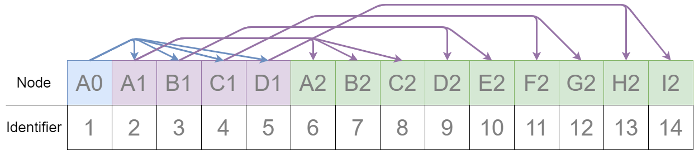

# Esri Indexed 3d Scene Layer (I3S) and Scene Layer Package (*.slpk) Format Specification

Version 1.8. June 30, 2019

*Contributors:* Chris Andrews, Tamrat Belayneh, Jillian Foster, Javier Gutierrez, Markus Lipp, Sud Menon, Pascal Müller, Dragan Petrovic, Ronald Poirrier, Simon Reinhard, Juan Ruiz, Johannes Schmid, Ivonne Seler, Chengliang Shan,Thorsten Reitz, Ben Tan, Richard Vargas, Moxie Zhang 

*Acknowledgements:* Bart van Andel, Fabien Dachicourt, Carl Reed

---

The Indexed 3D Scene Layer (I3S) format is an open 3D content delivery format used to rapidly stream and distribute large volumes of 3D GIS data to mobile, web and desktop clients.  I3S content can be shared across enterprise systems using both physical and cloud servers.  ArcGIS Scene Layers and [Scene Services](http://server.arcgis.com/en/server/latest/publish-services/windows/scene-services.htm) use the I3S infrastructure.  See the [version history on the main ReadMe](../README.md) for more details about previous versions of I3S as well as information on compatability with the OGC I3S Community Standard. 

# Table of Contents

[Introduction to Scene Layers](#introduction) <br />
[Organization and Structure](#structure)  <br />
&emsp;[Tree Structure](#Tree) <br />
&emsp;&emsp;[Nodes](#Nodes)  <br />
&emsp;&emsp;&emsp;[Feature](#Feature) <br />
&emsp;&emsp;&emsp;[Node resources](#NodeResources) <br />
&emsp;&emsp;&emsp;&emsp;[Geometry](#Geometry) <br />
&emsp;&emsp;&emsp;&emsp;[Attributes](#Attributes) <br />
&emsp;&emsp;&emsp;&emsp;[Textures](#Textures) <br />
&emsp;&emsp;&emsp;&emsp;[Node resources for I3S 1.6 and earlier](#NodeResources1.6) <br />
&emsp;&emsp;[Node Page](#NodePages)  <br />
&emsp;[Statistics](#statistics)<br />
&emsp;[Coordinate Reference Systems](#CRS)  <br />
&emsp;[Height Models](#heightModels) <br />
[I3S Services](#i3s-services) <br />
[I3S Formats](#i3s-scene-layer-packages) <br />
&emsp;[I3SREST](#i3sREST)  <br />
&emsp;[Extracted Scene Layer Package](#ESLPK)  <br />
&emsp;[Scene Layer Packages](#SLPK)  <br />
&emsp;&emsp;[1.7 SLPK Structure](#1.7-SLPK-Structure)  <br />
&emsp;&emsp;[1.6 SLPK Structure](#1.6-SLPK-Structure)  <br />
&emsp;&emsp;[Metadata](#metadata)<br />

# Introduction to Scene Layers <a name="introduction"></a>

Scene Layers provide a structured way for clients to store and visualize large volumes of 3D data.  I3S organizes information into node hierarchies that contain features with geometry, textures and attributes.

 The current scene layer profile types are:

* [3D Object](../docs/1.7/3Dobject_ReadMe.md) (e.g. 3D models in various formats)
* [Integrated Mesh](../docs/1.7/IntegratedMesh_ReadMe.md) - An integrated surface that may include vegetation, buildings and roads.
* [Point](../docs/1.7/Point_ReadMe.md) - A collection of point data, like individual trees in a forest.
* [Point Cloud](../docs/2.0/pcsl_ReadMe.md) - A volumetric collection of point data, like lidar data.
* [Building](../docs/1.7/BSL_ReadMe.md) - A building including its components, such as windows, doors, chairs, etc.

I3S is designed to support large datasets of 3D content ranging from local to global extent containing detailed features. Clients can visualize scene layers by taking advantage of the multi-LoD (level of detail) representation and symbology to create the right user experience for visualizing the 3D content. The I3S format continues to evolve and new functionality continues to be added. Previous versions of I3S (SLPK) can be converted and validated using the [I3S Converter](../i3s_converter/i3s_converter_ReadMe.md). You can find an overview of the[Version History of I3S](../README.md).

I3S is organized as [nodes](#Nodes), which are structured into [node pages](#NodePages). The node page includes the bounding volume, child reference, count and the [level of detail selection](LevelofDetail.md). Nodes contain all the information to describe features including [geometry](#Geometry), [attributes](#Attributes) and [textures](#textures). Scene Layers can be created in cartesian 3D or in global 3D world [coordinate reference systems](#CRS). I3S Scene Layers can be delivered to web, mobile and desktop clients. Most users will interact with Scene Layers using applications with cloud or server-based information. In these cases, the scene layer content is on the server and is provided to clients through a RESTful interface. These web addressable resources provide access to the scene layer, nodes, and associated resources. Alternatively, a scene layer can be delivered as a Scene Layer Package. This is a single file that includes the complete node tree and all necessary resources in an archive. 

# Organization and Structure <a name="structure"></a>

## Tree Structure <a name="Tree"></a>

To ensure high performance when visualizing 3D content, data are spatially grouped into [nodes](#Nodes). The grouping process is repeated recursively to create a tree of nodes. The spatial extent of a given node encompasses all its children to create a bounding volume hierarchy. Both spatially regular (e.g. quadtree) as well as spatially irregular (e.g. R-tree) organizations of data are supported.

The bounding volume is defined either as minimum bounding sphere (MBS) or oriented bounding box (OBB) representation.  

 
 
 *3D objects enclosed in minimum bounding spheres.*

   

 *3D objects enclosed in the smallest bounding box.*  

OBB is the more optimal representation and implementers are encouraged to output node bounding volumes in OBB format. Point cloud profile supports OBB representation only.

In order to provide a scalable representation of the original data, parent nodes contain a simplified representation of their children creating [Level of Details](LevelofDetail.md).


*Schematic view of spatially distributed data and recursive grouping of nodes into a bounding volume hierarchy.*


*Example of bounding volume hierarchy represented as a tree of nodes.*

## Nodes <a name="Nodes"></a>

In a Scene Layer, data are spatially grouped into nodes. The nodes contain node resources for the bounding volume. Each node has a unique identifier, which allows clients to efficiently locate and load the resources. 

### Feature <a name="Feature"></a>

A feature represents a real-world object within a node. For example, an individual point in a point scene layer or a building within a 3D object scene layer. Node resources such as geometry buffer and attributes can belong to a feature and can be accessed by an object-ID.  

When the same feature is included in more than one node at different [Levels of Detail](LevelofDetail.md), the corresponding attributes for the feature are included as attribute resources in each node. This redundancy in attribute storage allows each node to be rendered independently of other nodes. The following scene layer types support features:

| Feature |Integrated Mesh  | 3D Object                    | Points                       | Point Clouds                 | Building Scene Layer         |
| -------------- | ----------------|---------------------------- | ---------------------------- | ---------------------------- | ---------------------------- |
|support| &nbsp;  |||&nbsp; ||


### Node resources <a name="NodeResources"></a>

In addition to a bounding volume, each node contains references to node resources. The type of resource available, such as geometry buffer, texture and attribute, depends on the original data and layer type. Clients must use the resource identifiers (id) written in each node to access the resources. While content creators may choose to match a resource id with the node id this is not required by the I3S specification. As such, clients should not make this assumption.

| Node Resources |Integrated Mesh  | 3D Object                    | Points                       | Point Clouds                 | Building Scene Layer         |
| -------------- | ----------------|---------------------------- | ---------------------------- | ---------------------------- | ---------------------------- |
| geometry buffer   |  | |&nbsp;| |  |
| attribute    | &nbsp; | |  |  |  |
| texture       |  | | &nbsp; | &nbsp; |  |

*Node resource for backward compatibility with 1.6*

| Node Resources |Integrated Mesh  | 3D Object                    | Building Scene Layer         |
| -------------- | ----------------|---------------------------- | ---------------------------- | 
| sharedResources   |  | | |
| 3dNodeIndexDocument| | |  | 


*Note: All binary data is stored in little endian.*

#### Geometry <a name="Geometry"></a>

Depending on the scene layer type and the version of I3S, different geometry representations are used. For example, an integrated mesh scene layer geometry data includes all vertex attributes, feature counts, and mesh segmentation.

In I3S version 1.7 3D Objects and Integrated Mesh scene layer are using [geometryBuffer](../docs/1.7/geometryBuffer.cmn.md) with draco compression to describe the geometry. Previous versions of 3D Object and Integrated Mesh scene layers (1.6 and earlier) define geometry in the [defaultGeometrySchema](../docs/1.6/defaultGeometrySchema.cmn.md). The expected triangle/face winding order in all geometry resources is counterclockwise. 

Point and Point cloud layers model geometries as points. Point scene layer define the geometry in [featureData](../docs/1.6/featureData.cmn.md). For a Point Cloud Scene Layer the binary [geometry](../docs/2.0/defaultGeometrySchema.pcsl.md") is lepcc-xyz compressed.

#### Attributes <a name="Attributes"></a>

Attribute data for all features in a node are represented as discrete, per field resource called attribute. Attributes are used to visualize or query features within a scene layer. For example, each attribute resource, such as land use codes, can be assigned to a unique color to visualize the different types of land use in the scene layer. The number of attribute resources corresponds to the number of fields in the scene layer.

Attributes values are stored in the attribute resource in the same order as feature geometries are in the geometry buffer. This allows clients to render each node efficiently through direct array access instead of object-id based attribute lookups.

Metadata on each attribute resource is made available to clients via the scene service layer. When attributes are present within the scene layer, additional metadata in the [fields](../docs/1.7/field.cmn.md) array and [attributeStorageInfo](../docs/1.7/attributeStorageInfo.cmn.md) array further describe each attribute resource. The [attributeInfo](../docs/2.0/attributeInfo.pcsl.md) of the Point Cloud scene layer contains the description of the attributes.


#### Textures <a name="Textures"></a>

The texture resource contains texture image files. Textures are stored as a binary resource. Individual textures should be aggregated into texture atlases (An image containing a collection of smaller images.). Client capabilities for handling complex UV cases may vary, so texture coordinates are used. Texture coordinates do not take atlas regions into account directly. The client is expected to use the sub-image region values and the texture coordinates to best handle repeating textures in atlases. The recommended texture is [Basis Universal](https://github.com/BinomialLLC/basis_universal) as of 1.8. 

For more details, see the [texture](../docs/1.8/texture.cmn.md) and [textureSetDefinition](../docs/1.8/textureSetDefinition.cmn.md).  

### Node resources for I3S 1.6 and earlier <a name="NodeResources1.6"></a>

To ensure backward compatibility with 1.6 clients, a 1.7 scene layer needs to also include the [3dNodeIndexDocument](../docs/1.7/3DNodeIndexDocument.cmn.md) resource as well as the [sharedResources](../docs/1.7/sharedResource.cmn.md) available for any node. SharedResource includes the material definition of the node.

## Node Page <a name="NodePages"></a>
In version 1.6 and earlier, each node is stored individually as a 3DNodeIndexDocument, causing the tree traversal performance to be negatively impacted due to the large number of small resource requests required. Version 1.7 packs many nodes into a single resource called a node page. 
These node pages are created by representing the tree as a flat array of nodes where internal nodes reference their children by their array indices.

I3S creators are free to use any ordering (e.g. breadth first, depth first) of the nodes into a flat array of nodes. In version 1.7, the ID for a node is an integer that represents the index of the node within this flattened array. 




*Example of breadth first ordering of nodes in a flat array. Children nodes are addressed by their index in the array.*

## Statistics <a name="Statistics"></a>
[Statistics](../docs/1.7/stats.cmn.md) are used by clients to define symbology without having to read all data. For example, if you want to define a unique value symbology, statistics are used to collect all unique values within the layer and calculate the number of features that are included in a unique value. Beside symbology, statistics are also used to filter data.   

## Coordinate Reference Systems <a name="CRS"></a>

The I3S specification supports specifying the Coordinate Reference System (CRS) as a Well Known Text, as defined in clause 6.4 in OGC Simple Features [99-036/ISO 19125](http://portal.opengeospatial.org/files/?artifact_id=13227) standard. I3S also supports specifying CRS in the WKT standard [CRS/ISO 19162:2015](http://docs.opengeospatial.org/is/12-063r5/12-063r5.html), Geographic information – Well-known text representation of coordinate reference systems, which provided an update to the original WKT representation. The two standards are referred to as WKT1 and WKT2 respectively.

In I3S implementation the CRS may be represented using either WKT1 or WKT2. While WKT1 has been in use for many years, WKT1 has been superseded by WKT2. Although implementations of OGC standards using WKT2 are not yet widely available, the guidance from the OGC/ISO community is to implement WKT2. 

WKT1 does not support explicit definition of axis order.
Therefore, I3S implementers need to note for their implementations if they support WKT1 only or both (as WKT2 requires continued support of WKT1). In addition, please note that not all ArcGIS clients support WKT2 yet.  

The Coordinate Reference System (CRS) of the Indexed 3D Scene Layer should be selected with the following considerations:

- Minimize the need for re-projection on the client side.
- Render in both geographic and projected coordinate reference systems.
- Support data with a global extent.
- Support local and global data with high positional accuracy.

All I3S profiles support writing 3D content in two modes: *global* and *local*. In global mode, only the geographic CRS WGS84, as identified by its EPSG code 4326, and GCS China Geodetic Coordinate System 2000, as identified by its EPSG code 4490, are supported for both index and vertex positions. It is represented using longitude, latitude and elevation. In local mode, all other geodetic CRS, including projected coordinate systems, are allowed.

In both modes, node index and position vertex must have the same CRS. In addition, all vertex positions are specified as an *offset* from a node's Minimum Bounding Volume (MBV) center. The MBV could be specified as a Minimum Bounding Sphere (MBS) or as an Oriented Bounding Box (OBB).

All vertex positions SHALL be specified using a geodetic CRS (including Cartesian coordinate reference systems), where x,y,z axes are all in same unit, and with a per-node offset (from the center point of the node's minimum bounding sphere) for all vertex positions. 

Axis Order: Axis order explicitly defined by the CRS SHALL be used when present. When the axis order is not defined by the CRS, Easting, Northing, Height axis order SHALL be used. The Height axis SHALL always point upwards towards the sky (away from the center of the earth).

As a result, for an I3S layer to be in a *global* mode the following requirements must be met:

The location of all vertex positions and index-related data structures, such as the nodes minimum bounding volume, are specified using the geographic CRS WGS84 or CGCS 2000, where:

- The only supported CRS in this mode is EPSG code, 4326 and 4490.
- X and Y coordinate bounds of the layer and XY components of the vertex position are specified in decimal degrees.
- Elevation (the z component of the vertex position) is specified in meters.
- The Minimum Bounding Volume (MBV) radius unit (for MBS) or halfSize unit (for OBB) is specified in meters.

For an I3S layer to be in a *local* mode the following requirements must be met:

All vertex positions are specified using geodetic CRS, identified by an EPSG code. Any CRS with an EPSG code *other* than 4326 or 4490 will be treated as in a local mode. 

- All three components of a vertex position (XYZ) and the Minimum Bounding Volume (MBV) radius (for MBS) or halfSize (for OBB) need to be in the same unit.

The [spatial reference](../docs/1.7/spatialReference.cmn.md) object is common to all I3S profile types.

## Height Models <a name="heightModels"></a>

I3S supports either ellipsoidal (height defined with respect to a reference ellipsoid) or gravity-related (height defined with respect to a reference geoid) vertical coordinate systems. This allows I3S to be applied across a diverse range of fields and applications.

At version 1.5, I3S added support for vertical coordinate systems. The Well Known Text (WKT) representation of the Coordinate Reference System now includes the vertical coordinate system used by the layer. The [spatial reference](../docs/1.7/spatialReference.cmn.md) object also includes a Well-known ID (WKID) and a Vertical Coordinate System Well-known ID (VcsWKID).  The client can consume any of these properties to designate the height model.

The heightModelInfo, included in the 3DSceneLayerInfo resource, is used by clients to determine if the layer's height model is orthometric or gravity-related.

# I3S Services <a name="i3s-services"></a>

A RESTful API allows access to I3S scene layers.  Each scene layer profile has different components and features.  For details on the API of a specific profile and version, refer to the individual README documents. 

Version 1.7 support for [3D Objects](../docs/1.7/3Dobject_ReadMe.md), [Integrated Mesh](../docs/1.7/IntegratedMesh_ReadMe.md), [Building](../docs/1.7/BSL_ReadMe.md), and [Point](../docs/1.7/Point_ReadMe.md)<a name="service1.7"></a>

Version 1.6 support for [3D Objects](../docs/1.6/3Dobject_ReadMe.md), [Integrated Mesh](../docs/1.6/IntegratedMesh_ReadMe.md), [Building](../docs/1.6/BSL_ReadMe.md), and [Point](../docs/1.6/Point_ReadMe.md).

Version 2.0 support for [Point Cloud](../docs/2.0/pcsl_ReadMe.md).<a name= "service2.0"></a>

# I3S Formats <a name = "i3s-scene-layer-packages"></a>

### Indexed 3D Scene Layer REST (i3sREST) <a name="i3sREST"></a>

This format is based on JSON, REST, and modern web standards making it easy to handle, parse, and render by web clients when stored in cloud stores such as Amazon S3, Azure Blob stores or Alibaba OSS. Use this storage format if you would like to store and serve the scene layer content from a cloud object store.

You can follow the I3S service definition ([2.0](#service2.0) for Point Cloud or [1.7](#service1.7) for others) to write into the cloud store or use the [i3s converter tool](../i3s_converter/i3s_converter_ReadMe.md) to create a Indexed 3D scene layer REST storage format.

### Extracted Scene Layer Package (ESLPK) <a name="ESLPK"></a>

ESLPK is a non-archived folder directory structure of SLPK. This format can be served using a tile handler designed specifically for handling file extensions. This format is suitable for file systems. You can additionally store it in S3 compatible blob stores on file systems such as MinIO which provide data resiliency, sharding, and failover support. Use ESLPK storage format if you would like to use a file system as a folder data store for storing and serving your scene layer content.

When creating an ESLPK you need to use the same structure and file extensions as defined in a Scene Layer Package (SLPK), version 1.7,  without using the archiving option or you can use the [i3s converter](../i3s_converter/i3s_converter_ReadMe.md) to convert an SLPK into an ESLPK.

### Scene Layer Packages <a name="SLPK"></a>

Scene Layer Package (SLPK) consolidates an I3S layer into a single file.  SLPKs are designed to be directly consumed by applications.


An SLPK is a [zip](https://en.wikipedia.org/wiki/Zip_(file_format)) archive containing compressed files and resources. The compression level for a SLPK file is not compressed. For example, if using 7-zip to create a scene layer package the compression level is `STORE`. The individual resources within the SLPK may be compressed using the compression method `GZIP`. For example, `.json.gz`. The exception is for jpg and png files.  We recommend compressing all resources.

Both 64-bit and 32-bit zip archives are supported.  64-bit is required for datasets larger than 2GB.

Please note that this method is slightly different than a typical zip archive.  In general, when a file is added to a zip archive, the new file is individually compressed, and the overall archive is compressed. **That is not the case for SLPK.**  When adding files to an SLPK, the new file is compressed, but the overall archive remains uncompressed and is archived using compression level not compressed (`STORE`). 

This is an example of a geometry resource opened in 7-zip.  Notice that both the Size and the Packed Size are equal.  The method is `STORE`.

 *Compressed geometry resource with size and method.*

**File Extensions**

SLPK require file extensions to determine the file type. 

Here are a few examples of SLPK file extensions:

- .jpg
- .png
- .bin.dds
- .json

**Hash**

In I3S verison 1.7, an [MD5](https://en.wikipedia.org/wiki/MD5) [hash](../docs/1.7/slpk_hashtable.cmn.md) is used to improve loading time.  The hash must be the last item at the end of the central directory and named `@specialIndexFileHASH128@`.  

#### Example 1.7 SLPK Structure Summary for 3D Objects <a name="1.7-SLPK-Structure"></a>

```
.\example_17.slpk
	+--nodePages
	|  +--0.json.gz
	|  +-- (...)
	+--nodes
	|  +--root
	|  |  +--3dNodeIndexDocument.json.gz
	|  +--0
	|  |  +--attributes
	|  |  |  +--f_0
	|  |  |  |  +--0.bin.gz
	|  |  |  +--(...)
	|  |  +--features
	|  |  |  +-- 0.json.gz
	|  |  |  +--(...)
	|  |  +--geometries
	|  |  |  +-- 0.bin.gz
	|  |  |  +--(...)
	|  |  +--textures
	|  |  |  +--0.jpg
	|  |  |  +--0_0_1.bin.dds.gz
	|  |  |  +--(...)
	|  |  +--shared 
	|  |  |  +--sharedResource.json.gz
	|  |  + 3dNodeIndexDocument.json.gz
	|  +--(...)
	+--statistics
	|  +--f_1
	|  |  +--0.json.gz
	|  +--(...)
	+--3dSceneLayer.json.gz
	+--@specialIndexFileHASH128@
```
Paths are the same as in the API, but without the `layers/0` prefix. Exceptions are:

|Resource|SLPK|Service|
|-----|---|------|
|Scene layer document|3dSceneLayer.json.gz|layers/0|
|Legacy node resource|/nodes/4/3dNodeIndexDocument.json.gz|layers/0/nodes/4|
|Legacy shared resource|/nodes/4/shared/sharedResource.json.gz|layers/0/nodes/4/shared| 

<br />
#### Example 1.6 Structure Summary for 3D Objects <a name="1.6-SLPK-Structure"></a>

```
.\example_16.slpk
	+--nodes
	|  +--root
	|  |  +--3dNodeIndexDocument.json.gz
	|  +--0
	|  |  +--attributes
	|  |  |  +--f_0
	|  |  |  |  +--0.bin.gz
	|  |  |  +--(...)
	|  |  +--features
	|  |  |  +--0.json.gz
	|  |  |  +--(...)
	|  |  +--geometries
	|  |  |  +--0.bin.gz
	|  |  |  +--(...)
	|  |  +--textures
	|  |  |  +--0.jpg
	|  |  |  +--0_0_1.bin.dds.gz
	|  |  |  +--(...)
	|  |  +--shared 
	|  |  |  +--sharedResource.json.gz
	|  |  +--3dNodeIndexDocument.json.gz
	|  +--0-0
	|  |  +--(...)
	|  +--0-0-0
	|  |  +--(...)
	|  +--1 
	|  |  +--(...)
	|  +--1-0
	|  |  +--(...)
	|  +--1-0-0
	|  |  +--(...)
	|  +--(...)
	+--statistics
	|  +--f_1
	|  |  +--0.json.gz
	|  +-- (...)
	+--3dSceneLayer.json.gz
	+--metadata.json
```

**Metadata**<a name="metadata"></a>

Scene layer packages (SLPK) contain metadata information regarding its content in the metadata.json file. The following entries are required and must be of the specified type.

|Property|Details|
|--------|-------|
|<b>folderPattern</b> |	One of {BASIC, EXTENDED},<br> Default is {EXTENDED} |
|<b>archiveCompressionType</b>	| One of {STORE, DEFLATE64, [DEFLATE]},<br>Default is {STORE} |
|<b>resourceCompressionType</b> |	One of {GZIP, NONE}, Default is {GZIP} |
|<b>I3SVersion</b> |	One of {1.2, 1.3, 1.4, 1.6, 1.7, 2.0},<br>Default is {1.7} (Point cloud is {2.0}) |
|<b>nodeCount</b> |	Total number of nodes in the SLPK |

<br />

**Example of 1.7 Metadata json**
```
.\metadata.json
{
	"folderPattern":"BASIC",
	"archiveCompressionType":"STORE",
	"resourceCompressionType":"GZIP",
	"I3SVersion":"1.7",
	"nodeCount":62
}
```

**Example of 2.0 Metadata json**
```
.\metadata.json
{
	"folderPattern":"BASIC",
	"archiveCompressionType":"STORE",
	"resourceCompressionType":"GZIP",
	"I3SVersion":"2.0",
	"nodeCount":1156
}
```

