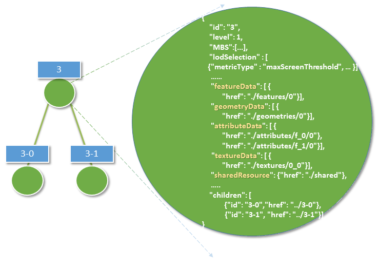
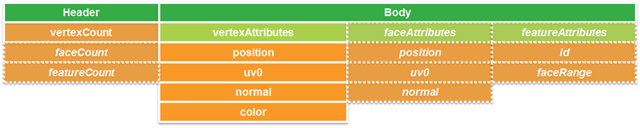

<h2>Esri Indexed 3d Scene Layer (I3S) and  
Scene Layer Package (*.slpk) Format Specification</h2>

Version 1.6, March 02, 2017

<em>Contributors:</em> Tamrat Belayneh, Javier Gutierrez, Markus Lipp, Johannes Schmid, Simon Reinhard, Thorsten Reitz, Chengliang Shan, Ben Tan, Moxie Zhang, Pascal M&uuml;ller, Dragan Petrovic, Sud Menon 
<em>Acknowledgements:</em> Bart van Andel, Fabien Dachicourt, Carl Reed 

This document specifies the Indexed 3D Scene layer (I3S) format, an open 3d content delivery
format used to disseminate 3D GIS data to mobile, web and desktop clients. I3S is the choice of format used by <a href="http://server.arcgis.com/en/server/latest/publish-services/windows/scene-services.htm#">ArcGIS Scene Layers</a> and the Scene Services that deliver them. The first sections of
this specification explain the conceptual structure of I3S, while the latter
sections provide a detailed implementation-level view.

<h2>Table of Contents</h2>

<ol>
	<li><a href="#_1">I3S Design Principals</a></li>
	<li><a href="#_2">3D Scene Layer</a></li>
	<li><a href="#_3">Coordinate Reference Systems</a>
		<ol>
		<li><a href="#_3_1">Height Models</a></li>
		</ol>
	<li><a href="#_4">I3S - Organization and Structure</a></li>
	<ol>
		<li><a href="#_4_1">Indexing Model and Tree Structure</a></li>
		<li><a href="#_4_2">Geometry Model and Storage</a></li>
		<li><a href="#_4_3">Textures</a></li>
		<li><a href="#_4_4">Attribute Model and Storage</a></li>
	</ol>
	<li><a href="#_5">Level of Detail Concept</a>
	<ol>
		<li><a href="#_5_1">LoD Switching</a></li>
		<li><a href="#_5_2">LoD Generation</a></li>
		<li><a href="#_5_3">LoD Selection Metrics</a></li>
	</ol></li>
	<li><a href="#_6">Resources Schema and Documentation</a>
	<ol>
		<li><a href="#_6_1">SceneServiceInfo</a></li>
		<li><a href="#_6_2">3dSceneLayerInfo</a></li>
		<li><a href="#_6_3">3dNodeIndexDocument</a></li>
		<li><a href="#_6_4">FeatureData</a></li>
		<li><a href="#_6_5">SharedResources</a></li>
		<li><a href="#_6_6">Textures</a></li>
		<li><a href="#_6_7">Geometry</a></li>
		<li><a href="#_6_8">AttributeData</a></li>
	</ol></li>
	<li><a href="#_7">I3S Flexibility</a>
	<li><a href="#_8">Persistence</a>
	<ol>
		<li><a href="#_8_1">Scene Layer Packages (*.slpk files)</a></li>
		<li><a href="#_8_2">Key Value Stores</a></li>
	</ol></li>
</ol>

<h2><a name="_1">I3S Design Principals</a></h2>

The Esri Indexed 3d Scene layer (I3S) format and the corresponding Scene Layer Package format (*.slpk) are specified to fulfill this set of design principals:  

<ol>
	<li><strong>User Experience first:</strong> Support a positive user experience - high interactivity, fast display, support rendering of visually relevant features first;</li>
	<li><strong>Scalability:</strong> Support very large scene layers, with global extent and large amounts of features - as well as the ability to handle highly detailed features;</li>
	<li><strong>Reusability:</strong> Be usable both as a service delivery format as well as a storage/exchange format;</li>
	<li><strong>Level of Detail:</strong> Have intrinsic support for representing level of detail;</li>
	<li><strong>Distribution:</strong> Allow efficient distribution of very large data sets;</li>
	<li><strong>User-controllable symbology:</strong> Support client-side symbology/styling and its efficient rendering;</li>
	<li><strong>Extensibility:</strong> Be extensible to support new layer and geometry types as well as new platforms;</li>
	<li><strong>Web Friendliness:</strong> Easy to handle and parse by web clients by using JSON and current web standards;</li>
	<li><strong>Compatibility:</strong> Have a single structure that is usable across a modern platform spanning web, mobile and desktop clients and cloud and on-premises servers;</li>
	<li><strong>Declarative:</strong> Limit how much specific knowledge is needed by clients for format support;</li>
	<li><strong>Follow REST/JSON API best practices:</strong> "Hypertext as the Engine of Application State" - make all resources navigable using hrefs from relevant other resources.</li>
</ol>

<h2><a name="_2">3D Scene Layer</a></h2>

I3S originated from investigations into technologies for rapidly streaming and distributing large volumes of 3D content across enterprise systems that may consist of server components, cloud hosted components, and a variety of client software from desktop to web and mobile applications.
A single I3S data set, referred to as a Scene Layer is a container for arbitrarily large amounts of heterogeneously distributed 3D geographic data.  

I3S Scene Layers are designed to provide clients access to data. Clients have the ability to then visualize the data for the layer independently according to their needs. Data here refers to both the geometry as well as the attributes for 3D Object, Point, Line and Polygon Features as well as  vertex geometry and attributes for Integrated Meshes and Point Cloud layers representing continuous or variable density geographic fields.  

An I3S Layer is characterized by a combination of layer type and profile that fully describes the behavior of the layer and the manner in which it is realized within the standard.

The requirements specified below apply to the following layer types:
<ul>
<li> 3D Objects (e.g., building Exteriors from GIS data  as well as 3D models in various formats)</li>
<li> Integrated Mesh (e.g., an integrated surface representing the skin of the earth including vegetation, buildings and roads from satellite, aerial or drone imagery via dense matching photogrammetry) </li>
<li> Points (e.g. hospitals or schools, trees, street furniture, signs, etc. from GIS data)</li>
<li> <a href="../profiles/pointclouds/docs/Documentation.md">point clouds </a> (lidar data) </li>
</ul>

The following layer types are planned for future inclusion in the I3S standard (future work):
<ul>
<li>Line Features (e.g. from GIS data)</li>
<li>Polygon Features (e.g. from GIS data)</li>
</ul>

Layers are described using two properties, type and profile. The type of a layer describes the type of geospatial data stored within it drawing from terms including 3D Objects, Points, Lines, Polygons and Pointclouds. The profile for a layer includes additional detail on the specific I3S implementation for the layer that is exposed to clients. Each layer has a canonical profile, but in certain cases multiple layers that represent semantically different types of information can make use of the same underlying profile. In other cases the same layer type can support multiple profiles optimized for different use cases. The following table shows the layer types and profiles.  For each row the table indicates if the layer type represents features (geographic entities) with identity (as opposed to a geospatial field described by a mesh or cloud of geometry elements) and if the specific profile for the layer supports storage of attributes (either feature attributes or attributes of individual geometry elements, depending on the type of the layer).
<table>
 <tr>
  <td><strong>Layer Type <em>(example)</em></strong></td>
  <td><strong>Profile</strong></td>
	<td><strong>Features with Identity</strong></td>
  <td><strong>Attributes</strong></td>	  
 </tr>
 <tr>
  <td>3D Object</td>
  <td><a href="../profiles/meshpyramids/meshpyramids.md">mesh-pyramids</a></td>
  <td>Yes</td>
  <td>Yes</td>
 </tr>
 <tr>
  <td>Integrated Mesh</td>
  <td><a href="../profiles/meshpyramids/meshpyramids.md">mesh-pyramids</a></td>
  <td>No</td>
  <td>Triangle Attributes (planned)</td>
 </tr>
  <tr>
  <td>Point</td>
  <td><a href="../profiles/points/points.md">points</a></td>
  <td>Yes</td>
  <td>Yes</td>
 </tr>
 <tr>
  <td>Pointcloud</td>
  <td><a href="../profiles/pointclouds/docs/Documentation.md">pointclouds</td>
  <td>No</td>
  <td>Vertex Attributes</td>
 </tr>
  <tr>
  <td>Line</td>
  <td>lines</td>
  <td>Yes</td>
  <td>Yes</td>
 </tr>
 <tr>
  <td>Polygon</td>
  <td>polygons</a></td>
  <td>Yes</td>
  <td>Yes</td>
 </tr>
 </table>

<em>Table 1: 3D Layer Types supported in I3S</em>

<h2><a name="_3">Coordinate Reference Systems (CRS)</a></h2>

Indexed 3D Scene Layers have to fulfill several use cases when selecting the coordinate reference systems to use:

<ul>
	<li>Minimize the need for re-projection on the client side</li>
	<li>Support data sets with global extent</li>
	<li>Render easily in coordinate systems for projected CRSs as well as coordinate systems for geodetic CRSs</li>
	<li>Support local data with very high positional accuracy</li>
	<li>Support global data sets with high positional accuracy</li>
</ul>

These use cases lead to the following implementation requirements.

<ol>
	<li>The location of all index-related data structures such as node bounding spheres SHALL be specified using a single, global Geographic WGS84 2d CRS. Coordinate bounds for such structures are in the range (-180.0000, -90.0000, 180.0000, 90.0000), Elevation and node minimum bounding sphere radius are specified in meters. Allowed coordinate system using EPSG code includes:
		<ol>
			<li>EPSG: 4326</li>
		</ol>
	</li>
	<li> All vertex positions SHALL be specified using geodetic CRS (including cartesian coordinate systems), where x,y,z axes are all in same unit, and with a per-node offset (from the center point of the node's minimum bounding sphere) for all vertex positions.
	</li>
	<li>Axis Order: All positions, independent of the CRS used, use the Easting, Northing, Elevation (x,y,z) axis order. The Z axis SHALL always point upwards towards the sky.
</ol>

All I3S profiles support outputting 3d content in two modes - <i>Global</i> or  <i>Local</i> modes. In <i>Global</i> mode only EPSG code 4326 (WGS84) is the supported coordinate system for both index and vertex positions and SHALL be represented as longitude, latitude, elevation. In <i>Local</i> mode all geodetic CRS (including cartesian coordinate systems) are allowed. The only requirement is that both index and position vertex SHALL have the same CRS.

 All I3S layers indicate the coordinate system via the <code>spatialReference</code> property in the <a href="_6_2">3dSceneLayerInfo</a> resource. This property is normative.

<h3><a name="_3_1">Height Models</a></h3>

The I3S standard accommodates declaration of a vertical coordinate system that may either be ellipsoidal (elevation/height defined with respect to a reference ellipsoid) or orthometric (elevation/height defined with respect to a reference geoid/gravity surface). This allows the I3S approach to be applied across a diverse range of fields and applications where the particular definition of elevation/height is of importance.  

At version 1.5 I3S has added support for a vertical coordinate systems. The Well-known Text (wkt) string representation of the CRS now includes the vertical coordinate system utilized by the layer. The spatialReference property also includes a Well-known Id (wkid) and a Vertical Coordinate System Well-known ID (vcsWkid) representations, which could alternatively be utilized by a client applicaiton consuming the layer instead of the wkt.

In addition to the detailed spatialReference property that describes the layers horizontal and vertical CRSs, the 3dSceneLayerInfo resource also includes a coarse metadata property called *heightModelInfo*, which can be used by a client application to quickly identify if the layers' height model is either orthometric or ellipsoidal.  

<pre><code>
	"spatialReference": // the horizontal and vertical coordinate system of the layer
	{
		"wkid": 4326,
		"latestWkid": 4326,
		"vcsWkid": 3855,
		"latestVcsWkid": 3855,
		"wkt": "GEOGCS[\"GCS_WGS_1984\",DATUM[\"D_WGS_1984\",SPHEROID[\"WGS_1984\",6378137,298.257223563]],PRIMEM[\"Greenwich\",0],UNIT[\"Degree\",0.017453292519943295]],
		VERTCS[\"EGM2008_Geoid\",VDATUM[\"EGM2008_Geoid\"],PARAMETER[\"Vertical_Shift\",0.0],PARAMETER[\"Direction\",1.0],UNIT[\"Meter\",1.0]]}"
	},
	"heightModelInfo":  // a coarse metadata indicating the layers height Model
	{
		"heightModel": "orthometric", //one of {*"orthometric"*, "ellipsoidal"};
		"ellipsoid": "wgs84 (G1674)/", //datum realization
		"heightUnit": "meter" //units
		}
</code></pre>

The above example illustrates the coordinate system and height information model of a layer in I3S. The spatialReference object includes a Well-known Text (wkt) string representation of the CRS for both horizontal and vertical coordinate systems. The heightModelInfo object is a coarse metadata that could be used by client application to quickly determine if the the layers' horizontal and vertical coordinate systems align with that of any base map data used by the application. See Class <a href="_6_2">3dSceneLayerInfo</a> for more information.

<h2><a name="_4">Indexed Scene Layers - Organization and Structure</a></h2>

 I3S organizes information using a hierarchical, node-based spatial index structure in which each node’s payload may contain features with associated geometry, textures and attributes. The following sections define this structure.

<h3><a name="_4_1">I3S - Indexing Model and Tree Structure</a></h3>

The purpose of any index is to allow fast access to blocks of
relevant data. In an Indexed 3D Scene layer, the spatial extent of the data is split into regions, called <code>nodes</code>,
with roughly equal amounts of data, and organized into a hierarchical and navigable data structure - the
index - that allows  the client to quickly discover which data it
actually needs and the server to quickly locate the data requested by any client.
Node creation is capacity driven - the smaller the node capacity is, typically the smaller
the spatial extent of each node will be.  

I3S is agnostic with respect to the model used to index objects/features in 3D space. Both regular partitions of space (e.g. Quadtrees and Octrees) as well as density dependent partitioning of space (e.g. R-Trees) are supported. The specific partitioning scheme is hidden from clients who navigate the nodes in the tree exposed as web resources. The partitioning results in a hierarchical subdivision of 3D space into regions represented by nodes, organized in a bounding volume tree hierarchy (BVH). Each node has an address and nodes may be thought of as equivalent to tiles.  

All Nodes have an ID that is unique within a layer. There are two types of Node ID formats supported by I3S: As string based identifier, referred here to as <i>treekeys</i>, or as integers based on a fixed linearization of the nodes.  

In the <i>treekey</i> format, which is loosely modeled on binary search tree concept, the key value is used to indicate both the level and sibling association of a given node, the key directly indicates the position of the node in the tree, allowing sorting of all resources on a single dimension. Treekeys are strings in which levels are separated by dashes:
"3-1-0" has 3 numeric elements, hence the node is on level 4 ("root" node is at level 1) and the node "3-1" is its parent.  
The root node always gets ID <code>"root"</code>. An example of this numbering pattern is shown in Figure 1 below.

<em>Figure 1: A sample Index Tree with Treekeys</em>

The information for a node is stored in multiple individually accessible resources. The node index document is a lightweight resource that captures the BVH tree topology for the node, in addition to the node’s bounding volume and meta-data used for [LoD Switching](<a name="_4_1">LoD Switching Models</a>) metrics. This resource allows for tree traversal without the need to  access the more voluminous content associated with a node (geometry, texture, attributes). The decision to render a node by the client application is based on its bounding-volume visibility in the current 3D view. Once the node's bounding volume is determined to be within the current 3D view of the application, then further evaluation is performed by the client app to determine the visual quality of the node. The node’s quality is estimated as a function of current view parameters, node’s bounding volume and LoD selection metric value of the node.

The standard supports both minimum bounding spheres (MBS) and oriented bounding boxes (OBB) as a node’s bounding volume.

Each interior node logically contains or covers the set of information covered by the nodes below it and participates in a path to the leaf nodes below it. Interior nodes may contain generalized or reduced representation of the information contained in descendant nodes.

The I3S format models node information using a set of resources - Node Index Documents, Feature Data, Geometry, Attributes, Textures and Shared Descriptors, all of which together represent the set of features or data elements for a given node. These resources are always attached to a node.

<ul>
<li>The Node Index Document is a lightweight resource representing a node, its topology within the tree and includes references to other sub-resources. </li>
<li> The Feature Data sub-resource for a node is a text resource that contains the identifiers for the set of features within a node. It can store the geometry and attributes for all of the features in the node either by value or as references into the geometry and attribute sub-resources for the node.</li>
<li> The Geometry, Attribute and Texture sub-resources describe the geometry, attribute and texture for the node.  Geometry and attribute sub-resources represent the geometries and attributes of all of the features within the node and include the identifiers of the owning features within the node as well as the mapping between individual feature identifiers and their geometry segments.  Vertices within the geometry contain the appropriate texture coordinates. </li>
</ul>

An I3S profile can choose between a single text-based feature-data sub-resource that contains all geometry and attribute information (e.g. <em>Point</em> profile), or separate, binary and self-contained geometry and attribute sub-resources (e.g. <em>mesh-pyramids</em> profile). Applications accessing the latter do not need to first fetch the feature-data resource in order to interpret them.

Figure 2: Nodes and their attached resources.

Per node, there is exactly one Node Index Document and one Shared Descriptors resource document. FeatureData, Geometry, Texture and Attribute resources can be split into bundles for optimal network transfer and client-side reactivity. This allows balancing between index size, feature splitting (with a relatively large node capacity between 1MB and 10MB)
and optimal network usage (with a smaller bundle size, usually in the range of
64kB to 512kB).

There are always an equal number <em>n</em> of FeatureData and Geometry resources, and each set contains
the corresponding data elements to be able to render a complete feature.  Optimal access to all required properties of the geometry data, including the feature to geometry mapping, is available directly from the binary <em>geometry</em> data resource, avoiding unnecessary dependency on the FeatureData document. All vertexAttributes (including position, normal, texture coordinates and color), vertex and feature counts, and mesh segmentation information (faceRanges) are also readily accessible from the <em>geometry</em> resource. 

Figure 3: This diagram illustrates the content of an I3S node as stored in its node index document. 

Figure 4 below shows the node tree of an Indexed Scene Layer whose layer type is 3D Object and whose profile is mesh-pyramids. In the figure:

<ul>
<li><code>Nodes</code> are in green, where the hyphenated numbers within the blue boxes represent the identifier or address for each node.</li>
<li>The orange boxes indicate the <code>features</code> explicitly represented within the node, where the numbers within the box represent feature identifiers.</li>
<li>Each node has associated geometry, texture and attribute resources that compactly store the <code>geometries</code>, <code>attributes</code> and <code>textures</code> of all of the features explicitly represented by the node, as typed arrays and texture atlases.</li>
<li>The turquoise boxes show the <code>geometry</code> resource associated with each node. Each geometry resource is an array of geometries. The same resource also stores the mesh-segmentation information, where each individual feature's range of triangles is stored along with the feature identifier (the values in the orange boxes) in a compact form similar to a run length encoding.</li>
<li>Though both attribute and texture resources are omitted from the figure for clarity, it is worth noting that the attribute of all features of a given node are also stored as <code>attribute</code> resource of the node, following a similar storage model.</li>
<li>Each node contains explicit references (the green lines) to the child nodes below it in the bounding volume hierarchy. Each node logically covers all of the features covered by the nodes in its sub-tree, though only some of them may be explicitly represented within the node. Applications make the decision (based on the nodes LoD Selection Metrics) on using the representation within the node versus descending to more detailed nodes. </li>
<li>The figure also illustrates the case where feature "6" has been generalized away at the lower level of detail node (node "3") and is intentionally no longer explicitly represented within its payload.</li>
</ul>

<em>Figure 4: Example Nodes in a Mesh Pyramid.  Orange boxes represent features stored explicitly within the node, the numbers represent feature identifiers. Turquoise boxes represent the geometry instances associated with each node – each geometry instance is an aggregate geometry (a geometry collection) that covers all the features in the node. Blue boxes represent the node ids, the hyphenated numbers represent node ids as string based treekeys.</em>

<h3><a name="_4_2">Geometry Model and Storage</a></h3>

 All Scene Layer types make use of the same fundamental set of geometry types: 

<ul>
<li> points </li>
<li> lines </li>
<li> triangles </li>
</ul>

Geometries use binary storage and consumption representation, controlled by Array Buffer View geometry property declarations. I3s provides full control over those properties, such as per-vertex layout of components (e.g. position, normal and texture coordinates), in order to ensure the same pattern for face and vertex elements across the Scene Layer.

I3S supports storage of triangle meshes via <em>triangles</em> geometry type.

Both 3D Object as well as Integrated Mesh layer types model geometries as triangle meshes using the mesh-pyramids profile. The mesh-pyramids profile uses the triangles geometry type to store triangle meshes with reduced level of detail representations of the mesh, segmented by features, available in the interior nodes as described above.

See <a href="#_6_7">Geometry</a> section for more discussion on the geometry format and storage models.

<h3><a name="_4_3">Textures</a></h3>

Textures are stored as a binary resource associated with a node. The texture resource for a node contains the images that are used as textures for the features stored in the node. The mesh-pyramids profile supports either a single texture or a texture atlas per node.

By default, mesh-pyramids profile allow/support encoding the same texture resource in multiple formats, catering for bandwidth, memory consumption and optimal performance consideration on different platforms. As a result, the I3S specification supports most commonly used image formats such as JPEG/PNG as well as rendering optimized compressed texture formats such as S3TC. In all cases, the specification provides flexibility by allowing authoring applications to provide additional texture formats via the <code>textureEncoding</code> declarations that use MIME types. For example, most existing I3S services provide “image/vnd-ms.dds” (for S3TC compressed texture) in addition to the default “image/jpeg” encoding.  

See <a href="#_6_6">Textures</a> section for more on texture format, texture coordinate, texture atlas usage and regions discussion.

<h3><a name="_4_4">Attribute Model and Storage </a></h3>  

I3S supports the following two patterns of accessing the attribute data:  

<ol>
	<li>From optional paired services that expose query-able and updatable RESTful endpoints that enable direct access to dynamic source data, including attributes. The query in this case uses the unique feature-ID key – which is always maintained within each node and is also available as part of the descriptor for any segmented geometry.</li>
	<li>From fully cached attribute information, in binary form, within I3S store.
	I3S clients can still choose to use both of these modes even if the attributes are fully cached within I3S store.</li>
</ol>

Cached Attributes use binary storage representation based on Array Buffers which provide significant performance benefits relative to method 1. The attribute values are stored as a geometry aligned, per field (column), key-value pair arrays.  

See <a href="#_6_8">AttributeData</a> section for more on texture format, texture coordinate, texture atlas usage and regions discussion.  

<h2><a name="_5">Level of Detail Concept</a></h2>

The concept of Level of Detail (LoD) is intrinsic to the specification. Scene Layers may include levels of detail that apply to the layer as whole and serve to generalize or summarize information for the layer, similar to image pyramids and also similar to raster and vector tiling schemes. A node in the I3S scene layer tree could be considered the analog of a tile in a raster or vector tiling scheme. Scene layers support levels of detail in a manner that preserves the identity of the individual features that are retained within any level of detail.

Level of Detail with this format specification covers several use cases,
including, splitting up very heavy features such as detailed building or very large features (coastlines, rivers, infrastructure), thinning/clustering for optimized visualization as well as support for representing externally authored multiple LoDs.

Note that the I3S Level of Detail concept  is orthogonal to the concept of consolidated storage for a set of geometries within a level of detail, based on for example the concatenation of geometries/meshes into larger geometry collections/meshes to assist in optimal rendering. In all such cases the consolidated storage makes use of Geometry Array Buffers that provide access to individual geometries when needed, and include the preservation of feature to geometry element mapping within the consolidated geometries.

<h4>Discrete LoDs</h4>

I3S supports the <em>Discrete</em> LoD approach, where different Level of Details are bound to the different levels of the index tree. Typically, leaf nodes of such LoD schema contain the original (feature/object) representation with the highest detail. The closer nodes are to the root, the lower the level of detail will be. For each next lower level, the amount of data is typically reduced by employing methods such as texture down-sampling, feature reduction/generalization, mesh reduction/generalization, clustering or thinning, so that all inner nodes also have a balanced weight. Generalization applies to the Scene Layer as a whole and the number of discrete levels of detail for the layer corresponds to the number of levels in the index tree for the scene layer. Here, level of detail concept is analogous to the level of detail concepts for image pyramids as well as for standard raster and vector tiling schemes.

During navigation and traversal of the I3S tree nodes, clients must decide to either

<ol>
<li>discontinue traversal to node’s children if the node is not visible in the current 3D view; or</li>
<li>use/render the data within a node if its quality is appropriate to the current 3D view and discontinue further traversal to children nodes; or to </li>
<li>continue traversal until children nodes with better quality are found.</li>
</ol>

These decisions are made using the advertised values for lod selection metrics that are part of the information payload of the node. The I3S specification supports multiple <a href="#_4_4">LoD Selection Metrics</a> and permits different <a href="#_4_1">LoD Switching Models</a>. An example lod selection metric is the maximum screen size that the node may occupy before it must be replaced with data from more detailed nodes. This model of discrete LoD rendering (LoD Switching Model) is referred to in I3S as <code>node-switching</code>.

I3S Scene Layers also include additional optional metadata on the LoD generation process (e.g. thinning, clustering and generalization) as non-actionable (to clients) information that is of interest to some service consumers.  

<h4>Representation of input data that already has explicitly authored multiple representations</h4>  

I3S Layers can  be used to represent input data that already have multiple, semantically authored, levels of detail.

The most common method for doing so is to represent each semantically authored input level of detail as its own I3S Layer with visibility thresholds on the layer that capture the range of distances (from the 3D location of the camera) at which the layer should be used. At further or closer distances applications switch to using a different I3S layer representing a different input semantically authored level of detail. The set of such I3S Layers representing a single modeled real world phenomena (such as buildings for a city) can be grouped within the same I3S service. For each I3S Layer within the set, the features in the leaf nodes of the index tree represent the modeled features at the level of detail presented in the input. Additional automatically generated levels of detail can optionally be generated extending the viewing range of each semantically input level of detail if so desired.

Tools can also be developed that load all of the input semantical level of detail information for the modeled entities in the input into a single I3S layer. In this case the height of the I3S index tree is fixed to the number of levels of detail present in the input and both the feature identities and geometries in each node are set based upon the input data. 

The specific approach taken is influenced by the extent of the data, the number of levels of detail actually present in the input and the need for further additional automatically generated levels of detail.  

<h3><a name="_5_1">LoD Switching Models</a></h3>

Depending on the properties of a 3D layer, a good user experience will necessitate
switching out the content for a node with the content of more detailed nodes.

<h4>Node Switching</h4>

Node switching means that the content (features, geometry, attributes, textures) from child nodes is loaded to replace the content of an existing node as the user needs to be presented with more detailed information 

As shown in Figure 4 above, each interior node in the I3S tree has a set of features that represent the reduced LoD representation of all of the features covered by that interior node. Not all features may be present in reduced LoD nodes - omission of a feature at a reduced LoD node indicates that the entire feature has been intentionally generalized away at this level of detail.

The correspondence between a reduced LoD feature in an interior node and the same feature in descendant (children) nodes is based on by feature IDs which are a key part of the storage model. Applications accessing the I3S tree can display all of the features in an internal node and stop there or instead descend further and use the features found in its child nodes,  based on desired quality.

The main advantage of this mechanism is that clients can focus on the display criterion associated with nodes as a whole in making the decision to switch representations. <code>node-switching</code> is the default Lod Switching model for layer types that implement <code>Mesh-pyramids</code> profile.

<h3><a name="_5_2">Levels of Detail - Generation </a></h3>

Integrated Mesh layer types typically come with pre-authored Levels of Detail. For input data that does not come with pre-authored LoDs, different LoD generation models can be employed. For example, 3D Object layers based on the <code>Mesh-pyramids</code> profile may choose to create an LoD pyramid for all features based on generalizing, reducing and fusing the geometries (meshes) for individual features while preserving feature identity. The same approach can also be used with Integrated Mesh layers based on the <code>mesh-pyramid</code> profile - in this case there are no features and each node contains a generalized version of the mesh covered by its descendants.

The first step in the automatic LoD generation process is to build the I3S bounding volume tree hierarchy based on the spatial distribution of the 3D features. Once this has been completed generation of the reduced LoD content for interior nodes can proceed.

As shown in Table 2 below, different models of LoD generation are applicable to different 3D layers.

<table>
	<tr>
		<td></td>
		<td><strong>3D Object</strong></td>
		<td><strong>Points</strong></td>
		<td><strong>Lines</strong></td>
		<td><strong>Polygons</strong></td>
		<td><strong>Pointclouds</strong></td>
	</tr>
	<tr>
		<td><strong>Mesh-pyramids</strong></td>
		<td>yes</td>
		<td></td>
		<td></td>
		<td></td>
		<td></td>
	</tr>
	<tr>
		<td><strong>Thinning</strong></td>
		<td>yes</td>
		<td>yes</td>
		<td>yes</td>
		<td>yes</td>
		<td>yes</td>
	</tr>
	<tr>
		<td><strong>Clustering</strong></td>
		<td>yes</td>
		<td>yes</td>
		<td>yes</td>
		<td></td>
		<td>yes</td>
	</tr>
	<tr>
		<td><strong>Generalization</strong></td>
		<td>yes</td>
		<td></td>
		<td>yes</td>
		<td>yes</td>
		<td></td>
	</tr>
</table>

<em>Table 2: Different 3D Layer Types and the various models of LoD generation they can employ.</em>

<h3><a name="_5_3">LoD Selection Metrics</a></h3>

A client needs information to determine whether a node's contents are "good enough" to
render in the current 3D view under constraints such as resolution, screen size, bandwidth and available memory and target minimum quality goals. Multiple LoD selection metrics can be included, as in the following example:

<pre><code>
"lodSelection": [
	{
		"metricType": "maxScreenThreshold",
		"maxError": 486.00
	},
	{
		"metricType": "screenSpaceRelative",
		"maxError": 0.0034  
	},
	{
		"metricType": "distanceRangeFromDefaultCamera",
		"maxError": 750.00  
	}
]
</code></pre>

These metrics are used by clients to determine the optimal resource access patterns. Each I3S profile definition provides additional details on LoD Selection.

<code> maxScreenThreshold</code>, the default lodSelection metric used for meshpyramids profile, is a per-node value for the maximum pixel size as measured in screen pixels. This value indicates the upper limit for the screen size of the diameter of the node's minimum bounding sphere (MBS). In other words, the content referenced by this node will qualify to be rendered only when the screen size is below the maximum screen threshold value. 

<h2><a name="_6">JSON Resources Schema and Documentation</a></h2>

This section provides a detailed, logical-level specification for each of the
resource types.   

<h4>Basic value types</h4>

Value schemas are used to ensure that the content of a JSON property follows a fixed pattern. The set of schemas that currently need to be supported is:

<ul>
<li><strong>String</strong>: An utf8 String.</li>
<li><strong>Float</strong>: A Float64 number with an optional fractional component, such as "1.02" or "1.0".</li>
<li><strong>Integer</strong>: An Int32 number without a fractional component, such as "234".</li>
<li><strong>UUID</strong>: A canonical hexadecimal UUID, such as "550e8400-e29b-41d4-a716-446655440000".</li>
<li><strong>Date</strong>: An ISO 8601 timestamp YYYY-MM-DDThh:mm:ss.sTZD, with a fixed "Z" timezone, such as "2009-01-01T12:00:00.000Z".</li>
<li><strong>URL</strong>: Any resolvable, relative or absolute, URL, such as "../Node/51/sharedResource".</li>
<li><strong>Pointer</strong>: Any resolvable reference to an object in a JSON document, consisting of a relative or absolute URL and a document path, such as [../Node/51/sharedResource]/materialDefinitions/Mat01 .</li>
<li><strong>NodeID</strong>: A treekey string such as “3-0-34-234-2” that is zero-based (first child is "0", root node is "root").</li>
</ul>

<h4>Pointers</h4>

I3S uses the following Pointer syntax whenever a specific property in the current or another document is to be referenced.
The Pointer consists of two elements :

<ol>
	<li><strong>mandatory in-document reference:</strong> Relative to the currently evaluated property, or document absolute, reference to a property. References are always slash-separated paths through a document tree and can contain wildcards (\*) to indicate that a set or list of properties is to be matched instead of a single property.
		<ul>
			<li><em>Absolute</em> references start with a slash (/). Absolute references may only contain upstream path elements, i.e. they may only point to properties of objects enclosing the property that is being evaluated and indicated by a name.
				<ul>
					<li>Example: <code>/materialDefinitions/*/type</code></li>
				</ul>
			</li>
		</ul>
		<ul>
			<li><em>Relative</em> references start with a property key (e.g. type). Relative properties may only contain downstream path elements and are evaluated from the value being tested. They may not contain wildcards, as appropriate context is already given through the current element being evaluated. In the case of a property that has containerType set to Array or Object, the reference point for a relative path is the individual value element in the container.
				<ul>
					<li>Example: <code>params/ambient/0</code></li>
				</ul>
			</li>
		</ul>
	</li>
	<li><strong>optional URL:</strong> The pointer may be prefixed with a URL to a different document. This URL may be relative to the document that is being evaluated or absolute. To identify the URL element of a pointer, it is given in square brackets. Examples:
		<ul>
			<li><em>relative URL + absolute reference:</em> From FeatureData to 3dSceneLayer.name: <code>[../../]/name</code></li>
		</ul>
		<ul>
			<li><em>absolute URL + absolute reference:</em> <code>[http://tiles.arcgis.com/arcgis/rest/services/Buildings_Portland/SceneServer/layers/0/nodes/68](http://tiles.arcgis.com/tiles/P3ePLMYs2RVChkJx/arcgis/rest/services/Buildings_Portland/SceneServer/layers/0/nodes/68)</code></li>
		</ul>
	</li>
</ol>

<h3><a name="_6_1">SceneServiceInfo</a></h3>

The SceneServiceInfo file is a JSON file that describes the capability and data
sets offered by an instance of a Scene Service.
The SceneServiceInfo has the following structure:

<em>Figure 5: Logical schema of the SceneServiceInfo document</em>

This file is automatically generated by the Scene Server for each service instance and is not part of a Scene Layer Package (SLPK) file. It is included here only for reference.

<h4>Class SceneServiceInfo</h4>

The Class SceneServiceInfo is the major object in the SceneServiceInfo document.
There SHALL always be exactly one SceneServiceInfo object in the document, which
describes a an active SceneService instance.  

<table>
	<tr>
		<td><strong>Name</strong></td>
		<td><strong>Type</strong></td>
		<td><strong>Description</strong></td>
	</tr>
	<tr>
		<td>serviceName</td>
		<td>String</td>
		<td>The type of the service; always SceneService.</td>
	</tr>
	<tr>
		<td>serviceVersion</td>
		<td>String</td>
		<td>The version of the service protocol/REST endpoint.</td>
	</tr>
	<tr>
		<td>supportedBindings</td>
		<td>String[1..*]</td>
		<td>the list of bindings, should we ever need to add new bindings in addition to the REST binding initially supported</td>
	</tr>
	<tr>
		<td>supportedOperations</td>
		<td>String[1..3]</td>
		<td>Supported profiles of the service from the choice {Base, Dynamic, Editing}.</td>
	</tr>
	<tr>
		<td>layers</td>
		<td>3dSceneLayerInfo[1..*]</td>
		<td>The full <a href="#_6_2">3dSceneLayerInfo</a> information.</td>
	</tr>
</table>

<em>Table 3: Attributes of the Class <strong>SceneServiceInfo</strong> within the SceneServiceInfo document</em>

<h3><a name="_6_2">3dSceneLayerInfo</a></h3>

The Class 3dSceneLayerInfo describes the properties of a single
layer in a store, including the default symbology, as specified in the sub Class <a href="#Class DrawingInfo">DrawingInfo</a>, which contains stylization information for a feature layer.
The Class 3dSceneLayerInfo has the following structure:

<em>Figure 6: Logical schema of the 3dSceneLayerInfo document</em>

<h4>Class 3dSceneLayerInfo</h4>

The 3dSceneLayerInfo is a major object in the 3dSceneLayerInfo document. A
SceneServiceInfo document can contain 1...* 3dSceneLayerInfo documents. Each 3dSceneLayerInfo object describes a Layer.

<table>
	<tr>
		<td><strong>Name</strong></td>
		<td><strong>Type</strong></td>
		<td><strong>Description</strong></td>
	</tr>
	<tr>
		<td>id</td>
		<td>Integer</td>
		<td>Unique numeric ID of the Layer.</td>
	</tr>
	<tr>
		<td>href</td>
		<td>URL</td>
		<td>The relative URL to the 3dSceneLayerResource. Only present as part of the SceneServiceInfo resource.</td>
	</tr>
	<tr>
		<td>layerType</td>
		<td>String</td>
		<td>The user-visible type of this layer, one of {Point, Line, Polygon, *3DObject*, IntegratedMesh, Pointcloud}</td>
	</tr>
	<tr>
		<td>spatialReference</td>
		<td>spatialReference</td>
		<td>The spatialReference of the layer including the vertical coordinate system. wkt is included to support custom spatial references. <code>{wkid, latestWkid, vcsWkid, latestVcsWkid, wkt}</code></td>
	</tr>
	<tr>
		<td>heightModelInfo</td>
		<td>heightModelInfo</td>
		<td>Enables consuming clients to perform quick test to determine whether this layer is compatible (with respect to its horizontal and vertical CRS) with existing content.<code>{heightModel, geoid, heightUnit}</code></td>
	</tr>
	<tr>
		<td>version</td>
		<td>String</td>
		<td>The ID of the last update session in which any resource belonging to this layer has been updated.</td>
	</tr>
	<tr>
		<td>name</td>
		<td>String</td>
		<td>The name of this layer.</td>
	</tr>
	<tr>
		<td>alias</td>
		<td>String[0..1]</td>
		<td>The display alias to be used for this layer.</td>
	</tr>
	<tr>
		<td>description</td>
		<td>String[0..1]</td>
		<td>Description string for this layer.</td>
	</tr>
	<tr>
		<td>copyrightText</td>
		<td>String[0..1]</td>
		<td>Copyright and usage information for the data in this layer.</td>
	</tr>
	<tr>
		<td>capabilities</td>
		<td>String[1..3]</td>
		<td>Capabilities from the Set <code>{View, Query, Edit}</code> that are possible on this layer.</td>
	</tr>
	<tr>
		<td>cachedDrawingInfo</td>
		<td>cachedDrawingInfo</td>
		<td>Indicates if any stylization infomraton represented as <code>drawingInfo</code> is addtionally captured as part of the binnary mesh representation for optimal client side access. Currently <code>color</code> component of the <code>drawingInfo</code> is supported.</td>
	</tr>
	<tr>
		<td>drawingInfo</td>
		<td>drawingInfo</td>
		<td>Represents the stylization infomraton of the layer.</td>
	</tr>
	<tr>
		<td>fields</td>
		<td>fields</td>
		<td>A collection of objects that describe each attribute field regarding its field name, datatype and a user friendly name {<code>name,type,alias</code>}. It includes all fields that are included as part of the I3S layer as derived from a source input feature layer.  </td>
	</tr>
	<tr>
		<td>attributeStorageInfo</td>
		<td>attributeStorageInfo</td>
		<td>Provides the schema and layout used for storing attribute content in binary format  in I3S.</td>
	</tr>

</table>

<em>Table 4: Attributes of the Class <strong>3dSceneLayerInfo</strong> within the 3dSceneLayerInfo document</em>

<h4>Class Store</h4>

The Class Store object describes the exact physical storage of
a Layer and enables the client to detect when multiple Layers are served from
the same Store. Storing multiple layers in a single store - and thus having
them share resources - enables efficient serving of many layers of the same
content type, but with different attribute schemas or different symbology
applied.

<table>
	<tr>
		<td><strong>Name</strong></td>
		<td><strong>Type</strong></td>
		<td><strong>Description</strong></td>
	</tr>
	<tr>
		<td>id</td>
		<td>UUID</td>
		<td>A Store ID, unique across a SceneServer. Enables the client to discover which layers a part of a common store, if any.</td>
	</tr>
	<tr>
		<td>profile</td>
		<td>String</td>
		<td>Indicates which profile this scene store fulfills.
		One of <code>{meshes, polygons, points, lines, analytics, meshpyramids, pointclouds, symbols}</code>.</td>
	</tr>
	<tr>
		<td>resourcePattern</td>
		<td>String [1..5]</td>
		<td>Indicates the resources needed for rendering and the required order in which the client should load them.
		Each value is one of <code>{3dNodeIndexDocument, SharedResource, FeatureData, Geometry, Texture}</code>.</td>
	</tr>
	<tr>
		<td>rootNode</td>
		<td>URL</td>
		<td>Relative URL to root node resource.</td>
	</tr>
	<tr>
		<td>version</td>
		<td>String</td>
		<td>Format version of this resource; used here again if this store hasn't been served by a 3D Scene Server.</td>
	</tr>
	<tr>
		<td>extent</td>
		<td>Float[4]</td>
		<td>The 2D spatial extent (xmin, ymin, xmax, ymax) of this store, in the horizontal indexCRS</td>
	</tr>
	<tr>
		<td>indexCRS</td>
		<td>URL</td>
		<td>The horizontal CRS used for all minimum bounding spheres (mbs) in this store, identified by an OGC URL.</td>
	</tr>
	<tr>
		<td>vertexCRS</td>
		<td>URL</td>
		<td>The horizontal CRS used for all "vertex positions" in this store, identified by an OGC URL.</td>
	</tr>
	<tr>
		<td>normalReferenceFrame</td>
		<td>String</td>
		<td>Describes the coordinate reference frame used for storing normals. One of <code>{east-north-up, \*earth-centered\*, vertex-reference-frame}</code>. A value of *east-north-up* indicates that normals are stored in a node local reference frame defined by the easting, northing and up directions at the MBS center, and is only valid for geographic (WGS84) vertexCRS. A value of *earth-centered* indicates that normals are stored in a global earth-centered, earth-fixed (ECEF) reference frame where the x-axis points towards Prime meridian (lon = 0°) and Equator (lat = 0°), the y-axis points East towards lon = +90 and lat = 0 and the z-axis points North. It is only valid for geographic vertexCRS. A value of *vertex-reference-frame* indicates that normals are stored in the same reference frame as vertices and is only valid for projected vertexCRS. </td>
	</tr>
	<tr>
		<td>nidEncoding</td>
		<td>MIMEType</td>
		<td>MIME type for the encoding used for the Node Index Documents; format: 
		<code>application/vnd.esri.I3S.json+gzip; version=1.6</code></td>
	</tr>
	<tr>
		<td>featureEncoding</td>
		<td>MIMEType</td>
		<td>MIME type for the encoding used for the Feature Data Resources; format: 
		<code>application/vnd.esri.I3S.json+gzip; version=1.6</code></td>
	</tr>
	<tr>
		<td>geometryEncoding</td>
		<td>MIMEType</td>
		<td>MIME type for the encoding used for the Geometry Resources; format: 
		<code>application/octet-stream; version=1.6</code></td>
	</tr>
	<tr>
		<td>textureEncoding</td>
		<td>MIMEType[1..*]</td>
		<td>MIME type(s) for the encoding used for the Texture Resources</td>
	</tr>
	<tr>
		<td>lodType</td>
		<td>String</td>
		<td>optional field to indicate which LoD Generation Scheme is used in this store. One of <code>{*MeshPyramid*, Thinning, Clustering, Generalizing}</code>.</td>
	</tr>
	<tr>
		<td>lodModel</td>
		<td>String</td>
		<td>optional field to indicate which LoD Switching mode clients have to use. One of <code>{*node-switching*, none}</code>.</td>
	</tr>
	<tr>
		<td>indexingScheme</td>
		<td>IndexScheme</td>
		<td>Information on the Indexing Scheme (QuadTree, R-Tree, Octree, ...) used.</td>
	</tr>
	<tr>
		<td>defaultGeometrySchema</td>
		<td>GeometrySchema[0..1]</td>
		<td>A common, global ArrayBufferView definition that can be used if the schema of vertex attributes and face attributes is consistent in an entire cache; this is a requirement for meshpyramids caches.</td>
	</tr>
	<tr>
		<td>defaultTextureDefinition</td>
		<td>TextureDefinition[0..1]</td>
		<td>A common, global TextureDefinition (see <a href="#_7_5">SharedResources</a>) to be used for all textures in this store. The default texture definition uses a reduced profile of the full TextureDefinition, with the following attributes being mandatory: <code>encoding</code>, <code>uvSet</code>, <code>wrap</code> and <code>channels</code>.</td>
	</tr>
	<tr>
		<td>defaultMaterialDefinition</td>
		<td>MaterialDefinition[0..1]</td>
		<td>If a store uses only one material, it can be defined here entirely as a MaterialDefinition (see <a href="#_7_5">SharedResources</a>).</td>
	</tr>
</table>

<em>Table 5: Attributes of the Class <strong>Store</strong> within the 3dSceneLayerInfo document</em>

<h4>Class GeometrySchema</h4>

Used in stores where all ArrayBufferView geometry declarations use the same pattern for face and vertex elements.
Reduces redundancies of ArrayBufferView geometry declarations in a store. Reuses the GeometryAttribute type from FeatureData; however, only valueType and valuesPerElement are mandatory.

<table>
	<tr>
		<td><strong>Name</strong></td>
		<td><strong>Type</strong></td>
		<td><strong>Description</strong></td>
	</tr>
	<tr>
		<td>geometryType</td>
		<td>String</td>
		<td>Low-level default geometry type, one of <code>{triangles, lines, points}</code>; if defined, all geometries in the store are expected to have this type.</td>
	</tr>
	<tr>
		<td>topology</td>
		<td>String[0..1]</td>
		<td>one of <code>{*PerAttributeArray*, Indexed}</code>. When "Indexed", the indices must also be declared in the geometry schema ("faces") and precede the vertexAttribute data.</td>
	</tr>
	<tr>
		<td>header</td>
		<td>HeaderAttribute[0..\*]</td>
		<td>Defines header fields in the Geometry resources of this store that precede the vertex (and index) data</td>
	</tr>
	<tr>
		<td>ordering</td>
		<td>String[1..\*]</td>
		<td>Provides the order of the keys in vertexAttributes and faceAttributes, if present.</td>
	</tr>
	<tr>
		<td>vertexAttributes</td>
		<td>FeatureData::GeometryAttribute[1..\*]</td>
		<td>Declaration of the attributes per vertex in the geometry, such as position, normals or texture coordinates</td>
	</tr>
	<tr>
		<td>faces</td>
		<td>FeatureData::GeometryAttribute[0..\*]</td>
		<td>Declaration of the indices into vertex attributes that define faces in the geometry, such as position, normals or texture coordinates</td>
	</tr>
	<tr>
		<td>featureAttributeOrder</td>
		<td>String[1..\*]</td>
		<td>Provides the order of the keys in featureAttributes, if present.</td>
	</tr>
	<tr>
		<td>featureAttributes</td>
		<td>FeatureData::GeometryAttribute[0..\*]</td>
		<td>Declaration of the attributes per feature in the geometry, such as feature ID or face range</td>
	</tr>
</table>

<em>Table 5a: Attributes of the Class <strong>GeometrySchema</strong> within the 3dSceneLayerInfo document</em>

<h4>Class HeaderAttribute</h4>

Headers to Geometry resources must be uniform across a cache and may only contain fixed-width, single element fields. The HeaderDefinition provides the name of each field for later access and the valueType of that header field.

<table>
	<tr>
		<td><strong>Name</strong></td>
		<td><strong>Type</strong></td>
		<td><strong>Description</strong></td>
	</tr>
	<tr>
		<td>property</td>
		<td>String</td>
		<td>The name of the property in the header</td>
	</tr>
	<tr>
		<td>type</td>
		<td>String</td>
		<td>The element type of the header property, from <code>{UInt8, UInt16, UInt32, UInt64, Int16, Int32, Int64 or Float32, Float64}</code></td>
	</tr>
</table>

<em>Table 5b: Attributes of the Class <strong>HeaderAttribute</strong> within the 3dSceneLayerInfo document</em>

<h4>Class Field</h4>

The Field class is used to provide schema information for this 3dSceneLayer.

<table>
	<tr>
		<td><strong>Name</strong></td>
		<td><strong>Type</strong></td>
		<td><strong>Description</strong></td>
	</tr>
	<tr>
		<td>name</td>
		<td>String</td>
		<td>The name of the field.</td>
	</tr>
	<tr>
		<td>type</td>
		<td>String</td>
		<td>The type of the field, from this enum: <code>{esriFieldTypeBlob, esriFieldTypeGeometry, esriFieldTypeDate, esriFieldTypeFloat, esriFieldTypeDouble, esriFieldTypeGeometry,
		esriFieldTypeGlobalID, esriFieldTypeGUID, esriFieldTypeInteger, esriFieldTypeOID,
		esriFieldTypeSmallInteger, esriFieldTypeString, esriFieldTypeGroup}</code></td>
	</tr>
	<tr>
		<td>alias</td>
		<td>String[0..1] </td>
		<td>The display alias to be used for this field.</td>
	</tr>
</table>

<em>Table 6: Attributes of the Class <strong>Field</strong> within the 3dSceneLayerInfo document</em>

<h4>Class AttributeStorageInfo</h4>

The attributeStorageInfo is another major object in the 3dSceneLayerInfo document. An object that describes the structure of the binary attributeData resource of a node.

<table>
	<tr>
		<td><strong>Name</strong></td>
		<td><strong>Type</strong></td>
		<td><strong>Description</strong></td>
	</tr>
	<tr>
		<td>key</td>
		<td>string</td>
		<td> The unique field identifier key.</td>
	</tr>
	<tr>
		<td>name</td>
		<td>string</td>
		<td>The name of the field.</td>
	</tr>
	<tr>
		<td>header</td>
		<td>String[1..\*]</td>
		<td>Declares the headers of the binary attribute data. One of {<code>count</code>, <code>attributeValuesByteCount</code>}. <code>count</code>, should always be present and indicates the count of features in the attribute storage. <code>attributeValuesByteCount</code> will only be present for strings data type and indicates the total byte count of the string data for all features in the binary attribute buffer.</td>
	</tr>
	<tr>
		<td>ordering</td>
		<td>String[1..*\]</td>
		<td>Declares the ordering indicating the order in which the array of attribute byte counts and the array of attribute values are stored in the binary attribute data. One of {<code>attributeByteCounts</code>, <code>attributeValues</code>}. <code>attributeValues</code>, should always be present. <code>attributeByteCounts</code> should only be present when working with string data types.</td>
	</tr>
	<tr>
		<td>attributeByteCounts</td>
		<td>String</td>
		<td>The element type of the attributeByteCounts property, from <code>{UInt32}</code>.</td>
	</tr>
	<tr>
		<td>attributeValues</td>
		<td>String</td>
		<td>The element type of the attributeValues property, from <code>{UInt8, UInt16, UInt32, UInt64, Int16, Int32, Int64 or Float32, Float64}</code></td>
	</tr>
</table>

<em>Table 7: Attributes of the Class <strong>attributeStorageInfo</strong> within the 3dSceneLayerInfo document</em>

<h4>Class IndexScheme</h4>

The IndexScheme class declaratively describes computational and structural
properties of the index used within an I3S store. This information can be used
by clients to better understand how to work with the index.

<table>
	<tr>
		<td><strong>Name</strong></td>
		<td><strong>Type</strong></td>
		<td><strong>Description</strong></td>
	</tr>
	<tr>
		<td>name</td>
		<td>String</td>
		<td>Name of the scheme, selected from <code>{esriRTree, QuadTree, AGOLTilingScheme}</code>.</td>
	</tr>
	<tr>
		<td>inclusive</td>
		<td>Boolean</td>
		<td>true indicates that the extent and mbs of all children nodes is fully within their parent nodes' extent/mbs</td>
	</tr>
	<tr>
		<td>dimensionality</td>
		<td>Integer</td>
		<td>The number of dimensions in which this index differentiates.</td>
	</tr>
	<tr>
		<td>childrenCardinality</td>
		<td>Integer[2]</td>
		<td>min/max number of children per node.</td>
	</tr>
	<tr>
		<td>neighborCardinality</td>
		<td>Integer[2]</td>
		<td>min/max number of neighbors per node.</td>
	</tr>
</table>

<em>Table 8: Attributes of the Class <strong>IndexScheme</strong> within the 3dSceneLayerInfo document</em>

<h4>Class DrawingInfo</h4>

DrawingInfo and the associated classes contain the default symbology (drawing information) of an Indexed 3D Scene Layer. When the *DrawingInfo* object is present in the <code>3dSceneLayerInfo</code> Class, a client application may symbolize an I3S layer by utilizing the *Renderer* information. Indexed 3d Scene Layers, also allow capturing the *DrawingInfo* object as part of the binary I3S representation, in support of applications that may not be able to dynamically symbolize/override a given I3S layer based on its drawing information. Such a behavior, when present, is indicated by the <code>CachedDrawingInfo</code> Class, indicating the component of the *DrawingInfo* object that's captured as part of the binary I3S representation.  

The Class DrawingInfo has the following structure:
<table>
	<tr>
		<td><strong>Name</strong></td>
		<td><strong>Type</strong></td>
		<td><strong>Description</strong></td>
	</tr>
	<tr>
		<td>renderer</td>
		<td>DrawingInfo::Renderer</td>
		<td>The renderer object encapsulates the drawing information of the layer.</td>
	</tr>
</table>

<em>Table 9: Attributes of the Class <strong>DrawingInfo</strong> within the 3dSceneLayerInfo document</em>

<h4>Class Renderer</h4>

The Renderer class contains properties that define the drawing symbology of an Indexed 3D Scene Layer, including its type, symbol and any label or descriptions associated with it.

The Class Renderer has the following structure:

<table>
	<tr>
		<td><strong>Name</strong></td>
		<td><strong>Type</strong></td>
		<td><strong>Description</strong></td>
	</tr>
	<tr>
		<td>type</td>
		<td>String</td>
		<td>The renderer type. One of <code>{\*Simple\*, UniqueValue, ClassBreaks}</code>. The default, <code>simple</code> renderer is a renderer that uses one symbol only. </td>
	</tr>
	<tr>
		<td>symbol</td>
		<td>Renderer::Symbol</td>
		<td>An object that represents how all features of this I3S layer will be drawn.</td>
	</tr>
	<tr>
		<td>label</td>
		<td>String</td>
		<td>The text string that may be used to label a symbol when displayed in a table of content of an application.</td>
	</tr>
	<tr>
		<td>description</td>
		<td>String</td>
		<td>The text string that does not appear in the table of contents but may appear in the legend.</td>
	</tr>
</table>

<em>Table 10: Attributes of the Class <strong>Renderer</strong> within the 3dSceneLayerInfo document</em>

<h4>Class Symbol</h4>

The Class Symbol represents the render primitive used to symbolize an Indexed 3D Scene Layer. MeshSymbol3D is the only supported type of Symbol.

The Class Symbol has the following structure:

<table>
	<tr>
		<td><strong>Name</strong></td>
		<td><strong>Type</strong></td>
		<td><strong>Description</strong></td>
	</tr>
	<tr>
		<td>type</td>
		<td>String</td>
		<td>Specifies the type of symbol used. Value of this property must be <code>{\*MeshSymbol3D\*}</code>. </td>
	</tr>
	<tr>
		<td>symbolLayers</td>
		<td>Renderer::SymbolLayers</td>
		<td>An object that represents how all features of this I3S layer will be drawn.</td>
	</tr>
</table>

<em>Table 11: Attributes of the Class <strong>Symbol</strong> within the 3dSceneLayerInfo document</em>

<h4>Class SymbolLayers</h4>

A Collection of symbol objects used to visualize the feature.

The Class SymbolLayers has the following structure:

<table>
	<tr>
		<td><strong>Name</strong></td>
		<td><strong>Type</strong></td>
		<td><strong>Description</strong></td>
	</tr>
	<tr>
		<td>type</td>
		<td>String</td>
		<td>Specifies the type of symbol used. Value of this property must be <code>{\*Fill\*}</code>.</td>
	</tr>
	<tr>
		<td>material</td>
		<td>SymbolLayers::Material</td>
		<td>The material used to shade the geometry.</td>
	</tr>
	<tr>
		<td>outline</td>
		<td>SymbolLayers::Outline</td>
		<td>The outline of the mesh fill symbol.</td>
	</tr>
</table>

<em>Table 12: Attributes of the Class <strong>SymbolLayers</strong> within the 3dSceneLayerInfo document</em>

<h4>Class Material</h4>

The material used to shade the geometry.

The Class Material has the following structure:
<table>
	<tr>
		<td><strong>Name</strong></td>
		<td><strong>Type</strong></td>
		<td><strong>Description</strong></td>
	</tr>
	<tr>
		<td>color</td>
		<td>Material::Color</td>
		<td>Color is represented as a three-element array (RGB).</td>
	</tr>
	<tr>
		<td>transparency</td>
		<td>Integer</td>
		<td>Indicates the transparency value associated with the symbol.The value has to lie between 100 (full transparency) and 0 (full opacity).</td>
	</tr>
</table>

<em>Table 13: Attributes of the Class <strong>Material</strong> within the 3dSceneLayerInfo document</em>

<h4>Class Outline</h4>

The Class Outline defines the outline of the mesh fill symbol. It has properties such as color, size and transparency.

The Class Outline has the following structure:

<table>
	<tr>
		<td><strong>Name</strong></td>
		<td><strong>Type</strong></td>
		<td><strong>Description</strong></td>
	</tr>
	<tr>
		<td>color</td>
		<td>Material::Color</td>
		<td>Color is represented as a three-element array. The three elements represent values for red, green and blue in that order.</td>
	</tr>
	<tr>
		<td>size</td>
		<td>Integer</td>
		<td>Outline size in points, positive only.</td>
	</tr>
	<tr>
		<td>transparency</td>
		<td>Integer</td>
		<td>Indicates the transparency value associated with the outline of the symbol.The value has to lie between 100 (full transparency) and 0 (full opacity).</td>
	</tr>
</table>

<em>Table 14: Attributes of the Class <strong>Material</strong> within the 3dSceneLayerInfo document</em>

<h4>Class Color</h4>

The Color class defines the color of a symbol or the outline. Color is represented as a three-element array. The three elements represent values for red, green and blue in that order. Values range from 0 through 255. If color is undefined for a symbol or an outline, the color value is null.

The Class Color has the following structure:

<table>
	<tr>
		<td><strong>Name</strong></td>
		<td><strong>Type</strong></td>
		<td><strong>Description</strong></td>
	</tr>
	<tr>
		<td>color</td>
		<td>String</td>
		<td>The renderer type. One of <code>{\*Simple\*, UniqueValue, ClassBreaks}</code>. The default, <code> simple</code> renderer is a renderer that uses one symbol only. </td>
	</tr>
	<tr>
		<td>symbolLayers</td>
		<td>Renderer::Symbol</td>
		<td>An object that represents how all features of this I3S layer will be drawn.</td>
	</tr>
</table>

<em>Table 15: Attributes of the Class <strong>Color</strong> within the 3dSceneLayerInfo document</em>

<h4>Class CachedDrawingInfo</h4>

 The Class CachedDrawingInfo is used to indicate if the *DrawingInfo* object is captured as part of the binary I3S representation.

The Class CachedDrawingInfo has the following structure:
<table>
	<tr>
		<td><strong>Name</strong></td>
		<td><strong>Type</strong></td>
		<td><strong>Description</strong></td>
	</tr>
	<tr>
		<td>color</td>
		<td>Boolean</td>
		<td>Indicates if the color component of the <code>drawingInfo</code> object is captured as part of the binary I3S representation.</td>
	</tr>
</table>

<em>Table 16: Attributes of the Class <strong>CachedDrawingInfo</strong> within the 3dSceneLayerInfo document</em>

<h3><a name="_6_3">3dNodeIndexDocument</a></h3>

The 3dNodeIndexDocument JSON file describes a single index node within a store, with links to other
nodes (children, sibling, and parent), links to feature data, geometry data and
texture data resources, metadata such as metrics used for LoD selection, its
spatial extent.

Depending on the geometry and <code>lodModel</code> used, a node document can be tuned towards being light-weight or more heavy-weight. It is the means clients have to further
decide which data to retrieve. The bounding volume information provided for the node, its parent, any neighbors and children present, already provides sufficient data for simple visualization by rendering the centroids as point features for example.

The 3dNodeIndexDocument has the following structure:

<em>Figure 7: Logical schema of the 3dNodeIndexDocument</em>

<h4>Class Node</h4>

The Node is the root object in the 3dNodeIndexDocument. There is always exactly one Node
object in a 3dNodeIndexDocument.

<table>
	<tr>
		<td><strong>Name</strong></td>
		<td><strong>Type</strong></td>
		<td><strong>Description</strong></td>
	</tr>
	<tr>
		<td>id</td>
		<td>String (TreeKey)</td>
		<td>Tree Key ID, unique within the store. The root node is always "root", all others follow the pattern "2-4-0-15-2". At each level in a subtree, numbering starts at 0.</td>
	</tr>
	<tr>
		<td>level</td>
		<td>Integer</td>
		<td>Explicit level of this node within the index tree. The lowest level is 1.</td>
	</tr>
	<tr>
		<td>version</td>
		<td>UUID</td>
		<td>The version (store update session ID) of this node.</td>
	</tr>
	<tr>
		<td>mbs</td>
		<td>Float[4]</td>
		<td>An array of four doubles, corresponding to x, y, z and radius of the minimum bounding sphere of a node.</td>
	</tr>
	<tr>
		<td>created</td>
		<td>Date[0..1]</td>
		<td>Creation date of this node in UTC, presented as a string in the format YYYY-MM-DDThh:mm:ss.sTZD, with a fixed "Z" timezone (see <a href="http://www.w3.org/TR/NOTE-datetime">http://www.w3.org/TR/NOTE-datetime</a>).</td>
	</tr>
	<tr>
		<td>expires</td>
		<td>Date[0..1]</td>
		<td>Expiration date of this node in UTC, presented as a string in the format YYYY-MM-DDThh:mm:ss.sTZD, with a fixed "Z" timezone (see <a href="http://www.w3.org/TR/NOTE-datetime">http://www.w3.org/TR/NOTE-datetime</a>).</td>
	</tr>
	<tr>
		<td>transform</td>
		<td>Float[16]</td>
		<td>Optional, 3D (4x4) transformation matrix expressed as a linear array of 16 values.</td>
	</tr>
	<tr>
		<td>parentNode</td>
		<td>NodeReference[0..1]</td>
		<td>Reference to the parent Node of a Node.</td>
	</tr>
	<tr>
		<td>children</td>
		<td>NodeReference[0..*]</td>
		<td>Reference to the child Nodes of a Node.</td>
	</tr>
	<tr>
		<td>neighbors</td>
		<td>NodeReference[0..*]</td>
		<td>Reference to the neighbor (same level, spatial proximity) Nodes of a Node.</td>
	</tr>
	<tr>
		<td>sharedResource</td>
		<td>Resource[0..1]</td>
		<td>Resource reference describing a shared resource document.</td>
	</tr>
	<tr>
		<td>featureData</td>
		<td>Resource[0..*]</td>
		<td>Resource reference describing a FeatureData document.</td>
	</tr>
	<tr>
		<td>geometryData</td>
		<td>Resource[0..*]</td>
		<td>Resource reference describing a geometry resource.</td>
	</tr>
	<tr>
		<td>textureData</td>
		<td>Resource[0..*]</td>
		<td>Resource reference describing a texture resource.</td>
	</tr>
	<tr>
		<td>lodSelection</td>
		<td>LodSelection[0..*]</td>
		<td>Metrics for LoD Selection, to be evaluated by the client.</td>
	</tr>
	<tr>
		<td>features</td>
		<td>Feature[1..*]</td>
		<td>A list of summary information on the features present in this Node, used for pre-visualisation and LoD switching in featureTree LoD stores.</td>
	</tr>
</table>

<em>Table 17: Attributes of the Class <strong>Node</strong> within the NodeIndexDocument</em>

<h4>Class NodeReference</h4>

A NodeReference is a pointer to another node - the parent, a child or a
neighbor. NodeReferences contain a relative URL pointing to the referenced NID,
as well as a set of meta information that can be used by the client to determine
whether to load that node or not, as well as maintaining store consistency.

<table>
	<tr>
		<td><strong>Name</strong></td>
		<td><strong>Type</strong></td>
		<td><strong>Description</strong></td>
	</tr>
	<tr>
		<td>id</td>
		<td>String</td>
		<td>Tree Key ID (e.g. "1-3-0-5") of the referenced node.</td>
	</tr>
	<tr>
		<td>mbs</td>
		<td>Float[4]</td>
		<td>An array of four doubles, corresponding to x, y, z and radius of the minimum bounding sphere of the referenced node.</td>
	</tr>
	<tr>
		<td>href</td>
		<td>URL</td>
		<td>The relative URL to the referenced node resource.</td>
	</tr>
	<tr>
		<td>version</td>
		<td>UUID</td>
		<td>Version (store update session ID) of the referenced node.</td>
	</tr>
	<tr>
		<td>featureCount</td>
		<td>Integer</td>
		<td>Number of features in the referenced node and its descendants, down to the leaf nodes.</td>
	</tr>
</table>

<em>Table 18: Attributes of the Class <strong>NodeReference</strong> within the NodeIndexDocument</em>

<h4>Class Resource</h4>

Resource objects are pointers to different types of resources related to a node, such as
the feature data, the geometry attributes and indices, textures and shared
resources.

<table>
	<tr>
		<td><strong>Name</strong></td>
		<td><strong>Type</strong></td>
		<td><strong>Description</strong></td>
	</tr>
	<tr>
		<td>href</td>
		<td>String</td>
		<td>The relative URL to the referenced resource.</td>
	</tr>
	<tr>
		<td>layerContent</td>
		<td>String[1..*]</td>
		<td>The list of layer names that indicates which layer features in the bundle belongs to. The client can use this information to selectively download bundles.</td>
	</tr>
	<tr>
		<td>featureRange</td>
		<td>Integer[2]</td>
		<td>Only applicable for featureData resources. Provides inclusive indices of the features list in this node that indicate which features of the node are located in this bundle.</td>
	</tr>
	<tr>
		<td>multiTextureBundle</td>
		<td>Boolean</td>
		<td>Only applicable for textureData resources. <code>true</code> if the bundle contains multiple textures. If <code>false</code> or not set, clients can interpret the entire bundle as a single image. </td>
	</tr>
	<tr>
		<td>vertexElements</td>
		<td>Integer[0..1]</td>
		<td>Only applicable for geometryData resources. Represents the Count of elements in vertexAttributes; multiply by the sum of bytes required for each element as defined in the defaultGeometrySchema.</td>
	</tr>
	<tr>
		<td>faceElements</td>
		<td>Integer[0..1]</td>
		<td>Only applicable for geometryData resources. Represents the Count of elements in faceAttributes; multiply by the sum of bytes required for each element as defined in the defaultGeometrySchema.</td>
	</tr>
</table>

<em>Table 19: Attributes of the Class <strong>Resource</strong> within the NodeIndexDocument</em>

<h4>Class Feature</h4>

Features are representations of the geographic objects stored in a layer.
In the 3dNodeIndexDocument, these objects define relationships, e.g. for linking feature representations of multiple LoDs.

<table>
	<tr>
		<td><strong>Name</strong></td>
		<td><strong>Type</strong></td>
		<td><strong>Description</strong></td>
	</tr>
	<tr>
		<td>id</td>
		<td>Integer</td>
		<td>An ID of the Feature object, unique within the store (important to note when using Features from multiple stores!). The ID must not be re-used e.g. for multiple representation of an input feature that are present in different nodes.</td>
	</tr>
	<tr>
		<td>mbs</td>
		<td>Float[4]</td>
		<td>An array of four doubles, corresponding to x, y, z and radius of the minimum bounding sphere of the referenced node.</td>
	</tr>
	<tr>
		<td>lodChildFeatures</td>
		<td>Integer[0..*]</td>
		<td>IDs of features in a higher LoD level which together make up this feature.</td>
	</tr>
	<tr>
		<td>lodChildNodes</td>
		<td>String[0..*]</td>
		<td>Tree Key IDs of the nodes in which the lodChildFeatures are found</td>
	</tr>
	<tr>
		<td>rank</td>
		<td>Integer[0..1]</td>
		<td>The LoD level of this feature. Only required for features that participate in a LoD tree. The lowest rank is 1.</td>
	</tr>
	<tr>
		<td>rootFeature</td>
		<td>String</td>
		<td>The Tree Key ID of the root node of a feature LoD tree that this feature participates in. Only required if the feature participates in a LoD tree and if it is not the rootFeature itself.</td>
	</tr>
</table>

<em>Table 20: Attributes of the Class <strong>Feature</strong> within the NodeIndexDocument</em>

<h4>Class LodSelection</h4>

A LodSelection object provides information on a given metric determined during
the cooking process of an I3S store. This metric can be used by the client to
determine whether a representation is of the right quality level for rendering
or whether a different representation is needed. 

Cookers can add as many <code>LodSelection</code> objects as desired but must provide
one as soon as the layer's <code>lodType</code> is not null. Of the three
min/avg/max values, typically only one or two are used.

<table>
	<tr>
		<td><strong>Name</strong></td>
		<td><strong>Type</strong></td>
		<td><strong>Description</strong></td>
	</tr>
	<tr>
		<td>metricType</td>
		<td>String</td>
		<td>The name of the error metric, one of <code>{maxScreenThreshold, screenSpaceRelative, ...}</code></td>
	</tr>
	<tr>
		<td>maxValue</td>
		<td>Float[0..1]</td>
		<td>maximum metric value, expressed in the CRS of the vertex coordinates or in reference to other constants such as screen size</td>
	</tr>
	<tr>
		<td>avgValue</td>
		<td>Float[0..1]</td>
		<td>average metric value, expressed in the CRS of the vertex coordinates or in reference to other constants such as screen size</td>
	</tr>
	<tr>
		<td>minValue</td>
		<td>Float[0..1]</td>
		<td>minimum metric value, expressed in the CRS of the vertex coordinates or in reference to other constants such as screen size</td>
	</tr>
</table>

<em>Table 21: Attributes of the Class <strong>LodSelection</strong> within the NodeIndexDocument</em>

<h3><a name="_6_4">FeatureData</a></h3>

The FeatureData JSON file(s) contain geographical features with a set of attributes, accessors
to geometry attributes and other references to styling or materials.

Features have the following structure: 

<em>Figure 8: Logical schema of the FeatureData document</em>

<h4>Class Feature</h4>

A Feature is a single object within a GIS data set, usually
representative of a feature present in the real, geographic world.

<table>
	<tr>
		<td><strong>Name</strong></td>
		<td><strong>Type</strong></td>
		<td><strong>Description</strong></td>
	</tr>
	<tr>
		<td>id</td>
		<td>Integer</td>
		<td>Feature ID, unique within the Node. If <code>lodType</code> is <code>FeatureTree</code>, the ID must be unique in the store.</td>
	</tr>
	<tr>
		<td>position</td>
		<td>Float[2..3]</td>
		<td>An array of two or three doubles, giving the x,y(,z) (easting/northing/elevation) position of this feature's minimum bounding sphere center, in the vertexCRS.</td>
	</tr>
	<tr>
		<td>pivotOffset</td>
		<td>Float[3]</td>
		<td>An array of three doubles, providing an optional, "semantic" pivot offset that can be used to e.g. correctly drape tree symbols.</td>
	</tr>
	<tr>
		<td>mbb</td>
		<td>Float[6]</td>
		<td>An array of six doubles, corresponding to xmin, ymin, zmin, xmax, ymax and zmax of the minimum bounding box of the feature, expressed in the vertexCRS, without offset. The mbb can be used with the Feature’s Transform to provide a LOD0 representation without loading the GeometryAttributes.</td>
	</tr>
	<tr>
		<td>layer</td>
		<td>String</td>
		<td>The name of the Feature Class this feature belongs to.</td>
	</tr>
	<tr>
		<td>attributes</td>
		<td>FeatureAttribute[0..*]</td>
		<td>The list of GIS attributes the feature has.</td>
	</tr>
	<tr>
		<td>geometries</td>
		<td>Geometry[1..*]</td>
		<td>The list of geometries the feature has. A feature always has at least one Geometry.</td>
	</tr>
</table>

<em>Table 22: Attributes of the Class <strong>Feature</strong> within the FeatureData document</em>

<h4>Class FeatureAttribute</h4>

A FeatureAttribute is a field carrying a value. This value may also be a list of complete attributes, to be used with reports or metadata.

<table>
	<tr>
		<td><strong>Name</strong></td>
		<td><strong>Type</strong></td>
		<td><strong>Description</strong></td>
	</tr>
	<tr>
		<td>name</td>
		<td>String</td>
		<td>The name of the attribute.</td>
	</tr>
	<tr>
		<td>value</td>
		<td>String</td>
		<td>The value of the attribute. If group is set and the type of this attribute is set to esriFieldTypeGroup, the value may be used as a label.</td>
	</tr>
	<tr>
		<td>group</td>
		<td>FeatureAttribute[0..*]</td>
		<td>A list of FeatureAttributes belonging to a attribute value group.</td>
	</tr>
</table>

<em>Table 23: Attributes of the Class <strong>FeatureAttribute</strong> within the FeatureData document</em>

<h4>Class Geometry</h4>

This is the common container class for all types of geometry definitions used in I3S.

<table>
	<tr>
		<td><strong>Name</strong></td>
		<td><strong>Type</strong></td>
		<td><strong>Description</strong></td>
	</tr>
	<tr>
		<td>id</td>
		<td>Integer</td>
		<td>Reference-able, unique ID of the Geometry in this store.</td>
	</tr>
	<tr>
		<td>type</td>
		<td>String</td>
		<td>The type denotes whether the following geometry is defined by using array buffer views (ArrayBufferView), as an internal reference (GeometryReference), as a reference to a shared Resource (SharedResourceReference) or embedded (Embedded).</td>
	</tr>
	<tr>
		<td>transformation</td>
		<td>Float[16]</td>
		<td>3D (4x4) transformation matrix expressed as a linear array of 16 values.</td>
	</tr>
	<tr>
		<td>params</td>
		<td>GeometryParams</td>
		<td>The parameters for a geometry, as an Embedded GeometryParams object, an ArrayBufferView, a GeometryReference object, or a SharedResourceReference object.</td>
	</tr>
</table>

<em>Table 24: Attributes of the Class <strong>Geometry</strong> within the FeatureData document</em>

<h4>Class GeometryParams</h4>

This is the abstract parent class for all GeometryParams classes (GeometryReferenceParams, VestedGeometryParamas, SingleComponentParams). It does not have properties of its own.

<h4>Class GeometryReferenceParams</h4>

Instead of owning a Geometry exclusively, a Feature can also reference a (part of a) Geometry defined for the node. This allows to pre-aggregate Geometries for many features. In this case, a GeometryReferenceParams has to be used.

<table>
	<tr>
		<td><strong>Name</strong></td>
		<td><strong>Type</strong></td>
		<td><strong>Description</strong></td>
	</tr>
	<tr>
		<td>$ref</td>
		<td>Pointer</td>
		<td>In-document absolute reference to full geometry definition (Embedded or ArrayBufferView) using the <a href="#_6">I3S json pointer</a> syntax.</td>
	</tr>
	<tr>
		<td>faceRange</td>
		<td>Integer[2]</td>
		<td>Inclusive range of faces in this geometry that belongs to this feature.</td>
	</tr>
	<tr>
		<td>lodGeometry</td>
		<td>Boolean</td>
		<td>True if this geometry participates in an LoD tree. Always true in mesh-pyramids profile.</td>
	</tr>
</table>

<em>Table 25: Attributes of the Class <strong>GeometryReferenceParams</strong> within the FeatureData document</em>

<h4>Class VestedGeometryParams</h4>

This Class extends GeometryParams and is the abstract parent class for all concrete ("vested") GeometryParams classes that directly contain a Geometry definition, either as an ArrayBufferView or as an Embedded Geometry.

<table>
	<tr>
		<td><strong>Name</strong></td>
		<td><strong>Type</strong></td>
		<td><strong>Description</strong></td>
	</tr>
	<tr>
		<td>type</td>
		<td>String</td>
		<td>The primitive type of the geometry defined through a VestedGeometryParams object. One of {*triangles*, lines, points}</td>
	</tr>
	<tr>
		<td>topology</td>
		<td>TopologyType</td>
		<td>Declares the typology of embedded geometry attributes or those in a geometry resources. One of {"PerAttributeArray", "InterleavedArray", "Indexed"}. When "Indexed", the indices (faces) must also be declared.</td>
	</tr>
	<tr>
		<td>vertexAttributes</td>
		<td>VertexAttribute[1..*]</td>
		<td>A list of Vertex Attributes, such as Position, Normals, UV coordinates, and their definitions.
		While there are standard keywords such as <code>position</code>, <code>uv0..uv9</code>, <code>normal</code> and <code>color</code>, this is an open, extendable list.</td>
	</tr>
	<tr>
		<td>faces</td>
		<td>FaceAttribute[0..*]</td>
		<td>A list of Face Attributes, such as indices to build faces, and their definitions.
		While there are standard keywords such as <code>position</code>, <code>uv0..uv9</code>, <code>normal</code> and <code>color</code>, this is an open, extendable list.</td>
	</tr>
</table>

<em>Table 26: Attributes of the Class <strong>VestedGeometryParams</strong> within the FeatureData document</em>

<h4>Class SingleComponentParams</h4>

Objects of this type extend VestedGeometryParams and use one texture and one material. They can be used with aggregated LoD geometries.

<table>
	<tr>
		<td><strong>Name</strong></td>
		<td><strong>Type</strong></td>
		<td><strong>Description</strong></td>
	</tr>
	<tr>
		<td>material</td>
		<td>URI</td>
		<td>I3S Pointer reference to the material definition in this node's shared resource, from its root element. If present, used for the entire geometry.</td>
	</tr>
	<tr>
		<td>texture</td>
		<td>URI</td>
		<td>I3S Pointer reference to the material definition in this node's shared resource, from its root element. If present, used for the entire geometry.</td>
	</tr>
</table>

<em>Table 27: Attributes of the Class <strong>SingleComponentParams</strong> within the FeatureData document</em>

<h4><Class Component</a></h4>

Component objects provide information on parts of the geometry they
belong to, specifically with which material and texture to render them.

<table>
	<tr>
		<td><strong>Name</strong></td>
		<td><strong>Type</strong></td>
		<td><strong>Description</strong></td>
	</tr>
	<tr>
		<td>id</td>
		<td>Integer</td>
		<td>The ID of the component, only unique within the Geometry</td>
	</tr>
	<tr>
		<td>materialID</td>
		<td>UUID</td>
		<td>ID of the material, as defined in the shared resources bundle, to use for rendering this component</td>
	</tr>
	<tr>
		<td>textureID</td>
		<td>Long[0..1]</td>
		<td>Optional ID of the texture, as defined in shared resources, to use with the material to render this component</td>
	</tr>
	<tr>
		<td>regionID</td>
		<td>Long[0..1]</td>
		<td>Optional ID of a texture atlas region which to use with the texture to render this component</td>
	</tr>
</table>

<em>Table 28: Attributes of the Class <strong>Component</strong> within the FeatureData document</em>

<h4>Class GeometryAttribute</h4>

Each GeometryAttribute object is an accessor, i.e. a view, into an arraybuffer. There are two types of GeometryAttributes - VertexAttributes and
FaceAttributes. While the first describe properties that are valid for a single
vertex, the second are used to describe faces and other structures by providing
a set of indices. As an example, the <code>faces.position</code> index attribute is used to define
which vertex positions make up a face.

<table>
	<tr>
		<td><strong>Name</strong></td>
		<td><strong>Type</strong></td>
		<td><strong>Description</strong></td>
	</tr>
	<tr>
		<td>byteOffset</td>
		<td>Integer</td>
		<td>The starting byte position where the required bytes begin. Only used with the Geometry <code>"type": "ArrayBufferView"</code>.</td>
	</tr>
	<tr>
		<td>count</td>
		<td>Integer</td>
		<td>The number of elements. Multiply by number of bytes used for valueType to know how many bytes need to be read. Only used with the Geometry <code>"type": "ArrayBufferView"</code>.</td>
	</tr>
	<tr>
		<td>valueType</td>
		<td>String</td>
		<td>The element type, from <code>{UInt8, UInt16, Int16, Int32, Int64 or Float32, Float64}</code></td>
	</tr>
	<tr>
		<td>valuesPerElement</td>
		<td>short</td>
		<td>The number of values need to make a valid element (such as 3 for a xyz position)</td>
	</tr>
	<tr>
		<td>values</td>
		<td>Float[*]</td>
		<td>The actual values. Only used with the Geometry <code>"type": "Embedded"</code></td>
	</tr>
	<tr>
		<td>componentIndices</td>
		<td>Integer[0...*]</td>
		<td>An optional array that indicates how many of the elements in this view belong to the first, second and consecutive components of the geometry. The number of entries in this array, when present, has to be equal to the number of entries in the components List of the enclosing Geometry object. The entire field is optional when no components have been declared for this Geometry.</td>
	</tr>
</table>

<em>Table 29: Attributes of the Class <strong>GeometryAttribute</strong> within the FeatureData document</em>

<h3><a name="_6_5">SharedResources</a></h3>

Shared resources are models or textures that can be shared among features within the
same layer. They are stored as a JSON file entirely. Each node has a shared
resource which contains materials and symbols used by more than a single
feature in that node or in features which are stored in the subtree of the
current node. This approach ensures an optimal distribution of shared resources
across nodes, while maintaining the node-based updating process.

<em>Figure 9: Logical schema of the SharedResources document</em>

<h4>Class SharedResource</h4>

The <code>SharedResource</code> class collects Material definitions, Texture definitions, Shader definitions and geometry
symbols that need to be instanced.

<h4>Class Material</h4>

Materials describe how a Feature or a set of Features is to be rendered. This includes
which shading and which colors to use. The following table provides the set of
attributes and params for the <code>"type": "standard"</code> material.

<table>
	<tr>
		<td><strong>Name</strong></td>
		<td><strong>Type</strong></td>
		<td><strong>Description</strong></td>
	</tr>
	<tr>
		<td>name</td>
		<td>String</td>
		<td>A name for the material as assigned in the creating application.</td>
	</tr>
	<tr>
		<td>type</td>
		<td>String</td>
		<td>Indicates the material type, chosen from the supported values <code>{standard, water, billboard, leafcard, reference}</code></td>
	</tr>
	<tr>
		<td>$ref</td>
		<td>JSONPointer</td>
		<td>The href that resolves to the shared resource bundle in which the material definition is contained.</td>
	</tr>
	<tr>
		<td>params.vertexRegions</td>
		<td>Boolean[0..1]</td>
		<td>Indicates whether this Material uses per-vertex regions. Defaults to <code>false</code>.</td>
	</tr>
	<tr>
		<td>params.vertexColors</td>
		<td>Boolean[0..1]</td>
		<td>Indicates whether this Material use Vertex Colors. Defaults to <code>false</code>.</td>
	</tr>
	<tr>
		<td>params.useVertexColorAlpha</td>
		<td>Boolean[0..1]</td>
		<td>Indicates whether Vertex Colors also contain a transparency channel. Defaults to <code>false</code>.</td>
	</tr>
	<tr>
		<td>params.transparency</td>
		<td>Float </td>
		<td>Indicates whether the transparency of this material; 0 = opaque, 1 = fully transparent.</td>
	</tr>
	<tr>
		<td>params.reflectivity</td>
		<td>Float</td>
		<td>Indicates reflectivity of this Material.</td>
	</tr>
	<tr>
		<td>params.shininess</td>
		<td>Float</td>
		<td>Indicates shininess of this Material.</td>
	</tr>
	<tr>
		<td>params.ambient</td>
		<td>Float[3]</td>
		<td>Ambient color of this Material.</td>
	</tr>
	<tr>
		<td>params.diffuse</td>
		<td>Float[3]</td>
		<td>Diffuse color of this Material.</td>
	</tr>
	<tr>
		<td>params.specular</td>
		<td>Float[3]</td>
		<td>Specular color of this Material.</td>
	</tr>
	<tr>
		<td>params.renderMode</td>
		<td>String</td>
		<td>Rendering mode, any one of <code>{textured, solid, untextured, wireframe}</code></td>
	</tr>
	<tr>
		<td>params.castShadows</td>
		<td>Boolean</td>
		<td><code>true</code> if features with this material should cast shadows</td>
	</tr>
	<tr>
		<td>params.receiveShadows</td>
		<td>Boolean</td>
		<td><code>true</code> if features with this material should receive shadows</td>
	</tr>
	<tr>
		<td>params.cullFace</td>
		<td>String</td>
		<td>Indicates the material culling options {back, front, *none*}. Default being <code>none</code>.</td>
	</tr>
</table>

<em>Table 30: Attributes of the Class <strong>Material</strong> within the SharedResources document</em>

<h4>Class Texture</h4>

A Texture is a set of images, with some parameters specific to the texture/uv mapping to
geometries.

<table>
	<tr>
		<td><strong>Name</strong></td>
		<td><strong>Type</strong></td>
		<td><strong>Description</strong></td>
	</tr>
	<tr>
		<td>encoding</td>
		<td>MIMEtype[1..*]</td>
		<td>The encoding/content type that is used by all images in this map</td>
	</tr>
	<tr>
		<td>wrap</td>
		<td>String[2] </td>
		<td>UV wrapping modes, from <code>{none, repeat, mirror}</code></td>
	</tr>
	<tr>
		<td>atlas</td>
		<td>Boolean</td>
		<td>true if the Map represents a texture atlas.</td>
	</tr>
	<tr>
		<td>uvSet</td>
		<td>String</td>
		<td>The name of the UV set to be used as texture coordinates.</td>
	</tr>
	<tr>
		<td>channels</td>
		<td>String[1..*]</td>
		<td>indicates which channels are stored in which channel of this map. Possible values: h=brightness, r=red, g=green, b=blue, a=alpha, n=bump, d=displacement, ...</td>
	</tr>
</table>

<em>Table 31: Attributes of the Class <strong>Texture</strong> within the SharedResources document</em>

<h4>Class Image</h4>

An image is a binary resource, containing a single raster that can be used to texture a
feature or symbol. It represents one specific texture LoD.
For details on texture organization, please refer to the section on <a href="#_7_6">Texture resources</a>.

<table>
	<tr>
		<td><strong>Name</strong></td>
		<td><strong>Type</strong></td>
		<td><strong>Description</strong></td>
	</tr>
	<tr>
		<td>id</td>
		<td>String</td>
		<td>A unique ID for each image. Generated using the <a href="#_7_6_GenerateID">BuildID</a> function.</td>
	</tr>
	<tr>
		<td>size</td>
		<td>Integer</td>
		<td>x size of this image.</td>
	</tr>
	<tr>
		<td>pixelInWorldUnits</td>
		<td>Float</td>
		<td>maximum size of a single pixel in world units (used by the renderer to pick the image to load/map)</td>
	</tr>
	<tr>
		<td>href</td>
		<td>URL[1..*]</td>
		<td>The href to the image(s), one per encoding, in the same order as the encodings.</td>
	</tr>
	<tr>
		<td>byteOffset</td>
		<td>Integer[0..*]</td>
		<td>The byte offset of this image's encodings (one per encoding, in the same order as the encodings.) in the block in which this texture image resides.</td>
	</tr>
	<tr>
		<td>length</td>
		<td>Integer[0..*]</td>
		<td>The length in bytes of this image's encodings (one per encoding, in the same order as the encodings).</td>
	</tr>
</table>

<em>Table 32: Attributes of the Class <strong>Image</strong> within the SharedResources document</em>

<h4>Class ShaderDefinition</h4>

ShaderDefinitions are, in this version of the I3S specification, an optional feature to provide
API-dependent shader programs with a layer.

<h4>Class Symbol</h4>

For Symbols, the same model is used as in the FeatureData Geometry.

<h3><a name="_6_6">Textures.bin</a></h3>

The Textures file is a binary resource that contains one or multiple images that
are used as textures of features in the store. A single Texture.bin file
contains 1...n textures for a single specific texture LoD. It can contain a
single texture atlas or multiple individual textures; the decision how this is
bundled is left to the authoring application so that specific aspects of the
materials and textures used can be taken into account, such as tiling.

<h3><a name="_Toc367801583">Texture Recommendations and Requirements</a></h3>

Especially for Web and Mobile clients, the number of textures and their volume is the
limiting factor in how much data can be displayed at any given time, Thus, this
specification provides several recommendations and requirements on texture
resources that are delivered as part of an Indexed 3D Scene.

<h4>Image Formats</h4>

I3S supports multiple texture formats which are suitable for different scenarios. For example, a client application might prefer consuming the more compact JPEG (and/or PNG) formats over low bandwidth conditions since they are very efficient to transmit and have a widespread adoption. However, client applications that might be constrained for memory or computing resource might prefer to directly consume compressed textures such as S3TC for scalability and performance reasons.

As a result, the I3S specification supports most commonly used image formats such as JPEG/PNG as well as rendering optimized compressed texture formats such as S3TC. The only requirement is the authoring application needs to provide the appropriate <code>textureEncoding</code> declaration by using MIME types such as, “image/jpeg” (for Jpeg) and “image/vnd-ms.dds” (for S3TC) etc...

With more wide-spread client support for next-generation texture compression formats such as ASTC, ETC2, PVRTC etc..., I3S will include support for more compressed texture formats in the future to enable specific platforms.

<h4>Texture Sets</h4>

While this specification allows the combination of multiple textures into a single
resource by using array buffer views, we generally recommend to use large
atlases (e.g. 2048x2048px) and then to use exactly one texture per bundle.

<h4>Atlas usage and Regions</h4>

Individual textures should be aggregated into texture atlases, where they become subtextures. Just as
all texture resources, the atlas has to be 2n-sized on both
dimensions, with n being in the range [3,12]. Width and height dimensions do
not have to be equal, e.g. 512px x 256px. Subtextures contained within an atlas
also need to be 2n-sized, with n being in the range [3,12].
Otherwise if their width or height dimension is not 2n, border
artifacts are likely to appear when filtering or MIP-mapping. If source subtexture
dimensions do not match this requirement, they need to be padded (with nearest/interpolated
pixels) or scaled to the nearest lower 2n size. An image that is
140px x 90px would thus be rescaled to 128px x 64px before being inserted into
the atlas or padded to 256px x 128px.

The pixels belonging to a subtexture are identified by the <code>subimageRegion: [umin, vmin, umax, vmax]</code> attribute.
Region information is passed on to the shader using a separate vertex attribute so that every vertex UV coordinate becomes a UVR coordinate,
with the R encoding the <code>[umin, vmin, umax, vmax]</code> of the region in 4 <code>UInt16</code> values.

<h4>Texture coordinates</h4>

Texture coordinates do not take atlas regions into account directly. They always range from <code>0...1</code> in U and V, except when using the
"repeat" wrapping mode, where they may range from <code>0...n</code> (n being the number of repeats). The client is expected to use the <code>subimageRegion</code> values and the texture coordinates to best handle repeating textures in atlases. This approach has been selected since client capabilities in dealing with more complex UV cases vary greatly.

<h4>Generating Image IDs</h4>

The Id of an image is generated using the following method:

<pre><code>
UInt64 BuildID(LONG id, int w, int h , int l, int al)
{
    UInt64 l_al = ((UInt64)al)<<60;
    UInt64 l_l = ((UInt64)l)<<56;
    UInt64 l_w = ((UInt64)(w - 1))<<44;
    UInt64 l_h = ((UInt64)(h - 1))<<32;
    UInt64 id64 = l_al + l_l + l_w + l_h + (UInt64)id;
    return id64;
}
</code></pre>

Usage syntax:  
<code>UInt64 image_id = BuildID(id, w, h, l, al);</code> 

<h5>Function Parameters</h5>

<table>
	<tr>
		<td>id</td>
		<td>Index of the texture in the store, start from 1</td>
	</tr>
	<tr>
		<td>w</td>
		<td>Width of the texture</td>
	</tr>
	<tr>
		<td>h</td>
		<td>Height of the texture</td>
	</tr>
	<tr>
		<td>l</td>
		<td>Index of the level that the texture belong to, start from 0</td>
	</tr>
	<tr>
		<td>al</td>
		<td>Level count of the texture</td>
	</tr>
</table>

<h3><a name="_6_7">Geometry.bin</a></h3>

The binary geometry attribute file follows the <a href="http://www.khronos.org/registry/typedarray/specs/latest/">Khronos Typed Array
specification</a> in the Editor's Draft version of 10th April 2013.
Citing the overview of that spec:

<blockquote>

This specification defines an ArrayBuffer
type, representing a generic fixed-length binary buffer. It is not possible to
manipulate the contents of an ArrayBuffer directly. Instead, a group of types
are used to create views of the ArrayBuffer. For example, to access the buffer
as an array of 32-bit signed integers, an Int32Array would be created that
refers to the ArrayBuffer.

Multiple typed array views can refer to the
same ArrayBuffer, of different types, lengths, and offsets. This allows for
complex data structures to be built up in the ArrayBuffer. As an example, given
the following code:

<pre><code>
// create an 8-byte ArrayBuffer
var b = new ArrayBuffer(8);

// create a view v1 referring to b, of type Int32, starting at
// the default byte index (0) and extending until the end of the buffer
var v1 = new Int32Array(b);

// create a view v2 referring to b, of type Uint8, starting at
// byte index 2 and extending until the end of the buffer
var v2 = new Uint8Array(b, 2);

// create a view v3 referring to b, of type Int16, starting at
// byte index 2 and having a length of 2
var v3 = new Int16Array(b, 2, 2);
</code></pre>

This defines an 8-byte buffer b, and three
views of that buffer, v1, v2, and v3. Each of the views refers to the same
buffer -- so v1[0] refers to bytes 0..3 as a signed 32-bit integer, v2[0]
refers to byte 2 as a unsigned 8-bit integer, and v3[0] refers to bytes 2..3 as
a signed 16-bit integer. Any modification to one view is immediately visible in
the other: for example, after v2[0] = 0xff; v2[1] = 0xff; then v3[0] == -1
(where -1 is represented as 0xffff)."

</blockquote>

<em>Figure 10: Geometry Buffer Layout with headers</em>

Note: The expected triangle/face winding order in all geometry resources is
counterclockwise (CCW).

Note: If normal vectors are present in a geometry, they need to be calculated based on uniform axis units.
They are always given as if x,y and z axes all had metric units, as a unit vector.
This means that if WGS84 is used as a horizontal CRS, the normal calculation cannot directly use the face's WGS84 coordinates, but needs to convert them to a local cartesian CRS first.

<h3><a name="_6_8">AttributeData</a></h3>  

This section describes the format for storing attribute data within I3S layers as part of the scene service cache along with geometry, texture and material resources, in an optimized renderer friendly format.  

By attribute data we mean the tabular information stored as an attribute of a feature class, which is the primary input source of scene services.  

Attribute data for all features in a node is stored and made available as discrete, per field resource called **_attribute_**. The number of attribute resources correspond to the number of fields the service publisher opted to include in the scene cache.  

A key concept of this storage model is that the order in which attribute values are stored within any _attribute_ resource, is the same as the order in which the feature geometries are stored within the geometry resource of that node. This allows clients who fetch these resources to render each node efficiently - using direct array access to retrieve feature attribute(s) without the need for object-id based attribute lookups.  

For cases where object-id based access to attributes is needed, the _attribute_ resource representing the _object-id_ field stores the object-id values of each feature within the node - in the same storage order as the geometry resource. This facilitates object-id based access. Clients can also build an object-id to array-index dictionary for cases where large numbers of object-id based attribute or geometry look ups within a node are needed. (Note: the following ways of referring to the ObjectId of a feature are equivalent in these and other I3S specifications: ObjectId, object-id, OID, FID).  

When the same feature is included in multiple nodes at different levels of detail, the corresponding attributes for the feature are also included as _attribute_ resource/s of each node it is present in. This redundancy in attribute storage allows each node to be rendered independently of any other node.  

Metadata on each _attribute_ resource is made available to clients via the <a href="../profiles/meshpyramids/examples/3dSceneLayer.js">scene service layer</a>. When attributes are present within the scene cache, the _resourcePattern_ array in the layers store (layers[id].store.resourcePattern) will include a value called _Attributes_, indicating attributes are a required resource, utilized for attribute driven symbolization and rendering. In addition to the _resourcePattern_, additional metadata present in the _fields_ array (_layers[id].fields[id]_) and  _attributeStorageInfo_ array (_layers[id].attributeStorageInfo[id]_), further describe each attribute resource.  

These metadata allow clients to initialize and allocate any required client side resources prior to accessing any attributes of interest.  

Figure 11: An example of the fields array (layers[id].fields[id]) resource of a scene service layer illustrating different supported types of feature attribute fields. The fields array describes an attribute field with respect to its name, type and alias.

Once a client application makes a decision regarding the field it is interested in accessing, it can use the _key_ property (_layers[id].attributeStorageInfo[].key_) of the _attributeStorageInfo_ metadata to uniquely identify and request the _attribute_ resource thru a new RESTful API, called **attributes.** The _attributeStorageInfo_ metadata in addtion contains all the information that a client application requires to decode the retrieved _attribute_ binary content.

**The content of this binary attribute resource is made up of :**

- A header section of 4 bytes which indicates the count of features. The count value is present in all _attribute_ resources. For an _attribute_ resource of a string data type, the header has an additional 4 bytes indicating the total byte count of the string attribute values.
- For all numerical field types, the header section will be followed by the attribute values array record. The attribute values must always begin at an offset that is divisible by the byte length of a single value. If the header does not end at such an offset, the necessary amount of padding is inserted between the header and the attribute values.
- For string field types, the header section is followed by a fixed length array whose values are the byte counts of each string data, inclusive of the null termination character. This array is then followed by an array of actual string data. The strings are stored null terminated.

_<a href="../profiles/meshpyramids/examples/3dSceneLayer.js">code 1.</a> A scene layer resource illustrating the metadata information found in the fields (layers[id].fields[id]) and attributeStorageInfo arrays (layers[id].attributeStorageInfo[id])._

A client application will be able to find the URI of any attribute resource through its href reference from the **attributeData** array of the **Node Index Document** (similar access patterns exist for resources such as 'features', 'geometries', etc …). See Figure 12 below:  

Figure 12: A node resource document illustrating attribute data content access urls (href).

#### REST API for Accessing Attribute Resources directly from a scene service layer

The **attributes** REST API will allow client apps to fetch the attribute records of a given field as identified by its _Key_ property. As a result, every scene node (with the exception of 'root' node), will expose available attribute fields as discrete _attribute_ resources. These resources are accessible thru a relative URL to any Node Index Document.

The _attributes_ REST api syntax is as follows:  
 URL: **http://&lt;sceneservrice-url&gt;/attributes/&lt;field_key&gt;/&lt;id>**

- _attributes_ -  is the RESTful resource responsible for fetching the binary attribute resource. A client application will be able to decode the content of this _attribute_ resource solely based on the metadata information found in the scene layer _attributeStorageInfo_ array (which adequately describes the content of the binary data).  
- <i>field\_key</i> - is the field key value that will be used to request the desired feature attribute content.
- _id_ - is the bundle id of the _attribute_ binary resource, corresponding to the geometry bundle id. By default this value is 0 (same as the geometry bundle id). If a node has more than 1 geometry resource, then the id of the _attribute_ resource will also match the geometry bundle id.

#### A typical pattern of usage of the _attributes_ REST API includes:  

1. Prior to symbolizing a given node based on attribute information, a client application should get attribute field metadata information by fetching the scene server _layers_ REST resource. The _layers_ resource contain the _fields_ (_layers[Id].Fields[id]_) array, which lists all available attribute fields and types and the _attributeStorageInfo_ (layers[id].attributeStorageInfo[id]) array, which describes the content of each binary _attribute_ resource.  

 The _fields_ array object contains a collection of objects that describe each attribute field regarding its field name ('name'), datatype ('type') and a user friendly name ('alias'). It includes all fields that are present in the source feature layer of the scene service layer.  

 The _attributeStorageInfo_ array contains a collection of objects that describes all _attribute_ binary resources. It includes only fields the publisher/author chose to include as part of the scene cache during publishing time. The  _attributeStorageInfo_, which is metadata information  about the binary _attribute_ resources, is made up of:  

  1. _name_ (_attributeStorageInfo[id].name_) and _key_ (_attributeStorageInfo[id].key_) properties that identify each  resource.
  2. A _header_ (_attributeStorageInfo[id].header_) object, consisting of a _count_ and _valueType_ properties indicating the count of the attributeValue objects. In case of string atttibute values the _header_ consists an additional object, _attributeByteCounts_ property, which indicates the total byte count of the string values.
  3. An _ordering_ (_attributeStorageInfo[id].ordering_) object that indicates the object storage layout.
  4. For string attribute values, an _attributeByteCounts_ object describing each of the string attribute values byte   count.
  5. The _attributeValues_ object describing the attribute value array, which contains member properties such as _valueType_ and _valuesPerElement_. For string attribute values in addition to its _valueType_ ('String'), there is an additional property _encoding_ ('UTF-8') that indicates the unicode enconding type. A String-Array is capable of supporting null attribute values (a 0 byte count value indicates a null string).  

  Note that the _key_ property (with values such as <i>f_0</i>, <i>f_1</i>, etc...) is **automatically** computed and that there shouldn't be any relationship _assumed_ to the field index of the source feature class (especially important when a user adds or deletes fields during the lifetime of a layer).  

	

	
	
Figure 13: An expanded view of a scene layer resource showing the content of an attributeStorageInfo resource. The example shows 5 objects each corresponding to the 5 objects of the fields resource (as matched by the 'key' and  'name' properties present in both arrays).The JSON representation of the example is located in <a href="../profiles/meshpyramids/examples/3dSceneLayer.js">3D Scene Layer examples section</a>.

	

2. A client application equipped with the list of available fields and the corresponding attribute-value-array metadata, can then fetch the attribute values of interest just by supplying the desired field _Key_ as part of the **attributes** REST request. Furthermore, it will also be capable of decoding the fetched _attribute_ resource based on the metadata as retrieved in step 1.  

 Note: The geometry buffer contains the _objectIDs_ array as the last section of the geometry layout (layers[id].store.defaultGeometrySchema.featureAttributes). A client application that has a need to access the _ObjectIDs_ array, should first check in the geometry buffer before requesting it from the _attributes_ REST resource.  

 The following example below shows the _attributes_ REST request signature:  

    a.http://&lt;myserver&gt;/arcgis/rest/services/Hosted/SanFran/SceneServer/layers/0/nodes/0-0-0-0/<b>attributes/0/f_1</b>  
    b.http://&lt;myserver&gt;/arcgis/rest/services/Hosted/SanFran/SceneServer/layers/0/nodes/0-0-0-/<b>attributes/0/f_2</b>  

	In _Example 1.a_ we will request the attributes of all features for a _field_ named 'NEAR_FID', as identified by its field key (<i>f_1</i>) in Figure 11. This field resource contains the attribute values of all _features_ that are present in node 0-0-0-0. Similarly, _Example 1.b_ will fetch the attributes of all features associated with the field called ('NEAR_DIST') using its key (<i>f_2</i>).

#### Attribute Resource - Details

An _attribute_ resource consists of either a single one dimensional array in the case of numeric fields (including the object-id field) or two one dimensional arrays that sequentially follow each other in the case of variable length string fields.

The structure of each _attribute_ resource is declared upfront in the scene layer resource thru the _attributeStorageInfo_ object. The client application (as stated above in the typical usage pattern) is expected to read the _attributeStorageInfo_ metadata to get the header information, the ordering of the stored records (arrays) as well as their value types before consuming the binary attribute resource.

Lets take a look at a sample scene service layer and its field types ([see Figure 14](images/figure-14.png)). This layer has 6 fields named 'OID', 'Shape', 'NEAR_FID', 'NEAR_DIST', 'Name' and 'Building_ID'.  

Figure 14: A typical attribute (table) info of a feature class. The fields array that’s shown as an example in Figure 11 and the attributeStorageInfo array in Figure 13 is derived from the attribute value of the above feature class.

  

As it could be inferred from [Figure 11](images/figure-11.png) and [Figure 13](images/figure-13.png), a scene service layer exposes/includes **only** supported attribute field value types of a feature class. As a result, the 'Shape' field ([see Figure 14](images/figure-14.png)), which is of _esriFieldTypeGeometry_ type, will not be included in the attribute cache of a scene layer.

[see Table 24](Table_24.png) below which lists a feature layer's field data types (including its values and description). The I3S valueTypes column indicates the value types of the fields that are supported for attribute based mapping/symbology.

Table 24: Attribute data types supported by a scene service layer.

  

\* String – using UTF-8 Unicode character encoding scheme.

The following types of attribute value arrays are supported :
_Int32-Array_, _UInt32-Array_, _UInt64-Array_, _Float64-Array_, _Float32-Array_, _String-Array_

Using our example feature class shown in [Figure 14](images/figure-14.png) let's see how it maps to the different types of _attribute_ resources.   

The _'OID'_ field, whose field type is 'esriFieldTypeOID' is by default represented as an _UInt32-Array_. This is a simple 1-d array of _UInt32_ value type.

The next attribute field type in the above example, 'NEAR-FID' which is of field type 'esriFieldTypeInteger' is represented as an _Int32-Array_. This again is also a simple 1-d array of _Int32_ value type.

The 'NEAR_DIST' field is of field type 'esriFieldTypeDouble' field type and is represented as a _Double-Array_, represented as 1-d array of _Float64_ value type.

The 'Name' field is of 'esriFieldTypeString' and is represented as a _String-Array_. A String-Array supports storage of variable length strings and is stored as two arrays in sequence where the first fixed length array has the byte counts of each string (null terminated) in the second array and the second array stores the actual string values as UTF8 encoded strings. The value type of the first array is (_UInt32_) whereas the value type of the second array is _String_.  

The _attributes_ REST api of a scene layer gives access to all scene cache supported feature attribute data as attribute value arrays that are stored in binary format. As a result, the scene cache of the example feature class in [Figure 14](images/figure-14.png) will have 5 binary resources, as identified by keys <i>f_0_, f_1_, f_2_, f_3_ </i> and <i>f_4</i> and accessible by their respective rest resource URLs (_.../nodes/&lt;nodeID&gt;/attributes/0/f\_0, .../nodes/&lt;nodeID&gt;/attributes/0/f_1, etc..).

#### Accessing the legend of a 3D Object Layer

Legends are essential for proper display (complete communication of represented information) of 3D Object Layer (also equally applicable for other layer types).

Clients are responsible for building legend information from the drawingInfo resource for the scene layer.
In this scene layers and scene services behave identically to feature layers and feature services.

<h2><a name="_7">I3S Flexibility</a></h2>

I3S is flexible and allows for different implementation choices for different types of 3D data or even for the same type of 3D data. The profile for a layer indicates the set of choices made. Choices supported by I3S and made use of by different profiles are described below. In each case the profile listed is the canonical profile for the corresponding layer-type.

1. The Minimum Bounding Volume (MBV) property can be represented as:  
 a. Minimum Bounding Sphere (MBS)  
 b. Oriented Bounding Box (OBB)  

2. Node structure  
 a. Expanded – in support of clients that want to gain more complete meta-information about node’s position within BVH topology and its immediate neighborhood  
  - Each index node provides pointers to its parent, all its children, and sibling neighbors (including their MBVs)  
	      Used by: mesh-pyramids and points profiles  

 b. fixed-size in support of paged access pattern  
  - A minimal structure – just the essentials: bounding volume; first-child reference; child-count; LoD selection data; etc.  
	      Used by: the pointclouds profile.  

3. Embedded versus Binary geometry content format  
 a. Embedded geometry: as text (JSON) inlined with other metadata within featureData resource – to support profiles where run-length encoding of feature-IDs along the vertex data is suboptimal
 	      Used by: the canonical points profile.  

 b. Binary format: for voluminous, ready to render/use geometries and cached attributes. Both typed array buffer views as well as fixed format binary buffers are supported.  
	-	The mesh-pyramids profile uses ‘array buffer views’ (ArrayBufferView follows the Khronos Typed Array specification)  
	-	The pointclouds profile uses binary buffers in order to support a domain-specific data compression  

4. LoD Selection based on different metricTypes:  

 1.	maxScreenThreshold – LoD switching based on screen ‘size’ of the node’s MBV  
 	      Used by: mesh-pyramids profile
 2.	screenSpaceRelative – LoD switching based on screen ‘scale’ of the node’s MBV  
        Used by: points profile
 3.	distancRangeFromDefaultCamera – LoD switching based on normalized distance of the node’s MBV from the camera – used by: points profile
 3.	effectiveDensity – estimation of the point density covered by the node  
        Used by: pointclouds profile  

#### Summary of I3S Defining Characteristics

In summary, here are other characteristics, including content data formats, which the scene layer may include:  

•	Attributes may be included on individual entities, on individual point cloud points, or on partial segments of meshes  
•	Attribute-based stylization may be modified by client software  
•	Multiple, alternative textures may be provided to optimize for per-platform performance and display  
•	JSON format for index and metadata, binary for more voluminous geometry, texture and attribute data  
•	A Scene Layer Package format for distribution, or direct use, of the scene layer as a single file (see SLPK section)  
•	Optional paired services that expose query-able and updatable RESTful endpoints that enable direct access to dynamic source data  
•	Explicit control over bounding index shape and per-node switching behavior to provide for optimized display and query  
• BVH based on bounding spheres (MBS) as well as oriented bounding boxes (OBB) (planned)  
•	Scene layers may be created in Cartesian 3D or in global 3D world coordinate systems  

<h2><a name="_8">Persistence</a></h2>

I3S scene layers can be delivered to web, mobile and desktop clients using a number of different patterns.
Most users will interact with scene layers using applications that access cloud or server based information via RESTful interfaces/services.  In these cases the cache (the I3S nodes and their payloads)  for the scene layer reside on the server and is returned to clients via a RESTful interface that exposes the scene layer, its nodes and  their associated resources (geometries, attributes, textures) as web addressable resources. The I3S specification contains a complete description of the <a href="../service/SceneService.md">web addressable resources</a> and their url scheme.
Some users will also interact with a scene layer delivered to them as a single large Scene Layer Package – this is a single file that packages the complete node tree and its resources into an archive that supports direct access to the individual nodes and resources within it. <a href="#_8_1">Scene Layer Packages (SLPK files)</a> are part of the current I3S implementation with multiple generators and the ability by clients to consume packages containing hundreds of GB of content.  

All storage methods store the Indexed 3D Scene Layers in a simple key-value structure, with the key representing the access URL and the value being the JSON document or other resource type.

<h3><a name="_8_1">Scene Layer Packages (SLPK files)</a></h3>

Scene Layer Packages (SLPK) serve two purposes: They allow a complete I3S layer, with all resources, to be transported or exchanged as a single file,
and they optionally also allow to be directly consumed by applications such as clients or services.

The format of the package itself is defined as follows:

<ul>
	<li>The Archive type is always <a href="https://en.wikipedia.org/wiki/Zip_(file_format)">Zip</a>.</li>
	<li>On this Archive, an overall compression scheme may be applied.
	This compression scheme has to be either STORE or DEFLATE64.
	Standard DEFLATE is acceptable as a fallback if DEFLATE64 is not available, but will only work with smaller SLPKs. </li>
	<li>STORE is the preferred compression schema for an SLPK intended for direct consumption by client application, especially if a resource compression is already applied on the individual resources (as shown in the figure 15 below).</li>
	<li>Every resource except textures may also be individually compressed. Compressed textures (such as S3TC) can additionally have GZIP compression applied to them.	</li>
	<li>For resource compression, only the GZIP scheme is supported, as DEFLATE support is not universally available in all browsers.</li>
</ul>

The layout show in Figure 15 below is referred to as the BASIC folder pattern.
The I3S specification allows also for an EXTENDED folder pattern that uses subtree partitions to avoid problems with very large packages.  

<em>Figure 15: Example of an SLPK with BASIC folder layout.</em>
   

  

The contents of the archive depicted in Figure 15 shows an SLPK with the BASIC folder pattern. At the top level, it has a <em>nodes</em> subfolder containing all node resources, a <em>metadata.json</em> file that describes the content of the SLPK and a <em>3dSceneLayer.json.gz</em> file that defines the Scene Layer. In the example, the <em>nodes</em> subfolder contains, nodes named <em>root</em>, <em>1-4-2-0</em>, etc. Drilling further into one of the nodes, <em>1-4-2-0</em>, notice that all file resources are individually compressed with GZIP compression (indicated by the file extension .gz), with the exception of the texture resource that is in JPEG format (<em>textures/0_0.jpg</em>). The resources under the sub folders <em>geometries</em> (<em>geometries/0.bin.gz</em>) and <em>attributes</em> (<em>attributes/f_0/bin.gz</em>, <em>attributes/f_1/bin.gz</em>, ...), serialized as binary, correspond to the geometryData, and attributeData resources of a scene layer, respectively. Similarly, <em>3dNodeIndexDocument.json.gz</em>, <em>features/0.json.gz</em> and <em>SharedResource.json.gz</em> correspond to 3dNodeIndexDocument, featureData and SharedResource documents of the Scene Layer, respectively, and are encoded in JSON and are also stored with a GZIP compression.

For the above mentioned two use cases, an SLPK file is employed as follows:

<ol>
	<li>SLPK as a transfer format:
	<ol>
		<li>ArchiveCompressionType: DEFLATE64</li>
		<li>ResourceCompressionType: NONE</li>
	</ol></li>
	<li>SLPK as a serving format:
	<ol>
		<li>ArchiveCompressionType: STORE</li>
		<li>ResourceCompressionType: GZIP</li>
	</ol></li>
</ol>

<h4>Metadata</h4>

The following entries are permitted in the Metadata.json file that is part of every SLPK archive:

<table>
	<tr>
		<th>Property</th>
		<th>Required</th>
		<th>Notes</th>
	</tr>
	<tr>
		<td>folderPattern</td>
		<td>True</td>
		<td>One of {*BASIC*, EXTENDED}</td>
	</tr>
	<tr>
		<td>ArchiveCompressionType</td>
		<td>True</td>
		<td>One of {*STORE*, DEFLATE64[,DEFLATE]}</td>
	</tr>
	<tr>
		<td>ResourceCompressionType</td>
		<td>True</td>
		<td>One of {NONE, *GZIP*}</td>
	</tr>
	<tr>
		<td>I3SVersion</td>
		<td>True</td>
		<td>One of {1.2, 1.3, 1.4, *1.6*}</td>
	</tr>
	<tr>
		<td>nodeCount</td>
		<td>True</td>
		<td>Total number of nodes stored in this SLPK.</td>
	</tr>
</table>

<h3><a name="_8_2">Key Value Stores</a></h3>  

In this persistence schema, all scene layer resources are stored within either key value based cloud blob stores such as Windows Azure Blob Storage or Amazon Simple Storage (S3) or within more general key value stores.
In the case of cloud blob stores, layer resources are stored as either simple objects within containing buckets (S3)  or  blobs within blob containers (Azure). In all cases each resource within a scene layer is identified by a unique key.
<table>
	<tr>
		<th>I3S Resources</th>
		<th>Optional</th>
		<th>Notes</th>
	</tr>
	<tr>
		<td>/SceneServer</td>
		<td>False</td>
		<td>The <a href="#_7_5">SceneServiceInfo</a> JSON that defines the service name and list the layers
		offered by this Scene Service {content type: text/plain, content encoding {NONE, *GZIP*}}</td>
	</tr>
	<tr>
		<td>/SceneServer/layers/0</td>
		<td>False</td>
		<td>The 3dSceneLayer JSON resource. The layer id (e.g. <code>0</code>) is used as the key of the document {content type: text/plain, content encoding {NONE, *GZIP*}}</td>
	</tr>
	<tr>
		<td>/SceneServer/layers/0/nodes/root</td>
		<td>False</td>
		<td>The 3dNodeIndexDocument of the layer as a JSON resource. The node id (e.g. <code>root</code>) is used as the key of the document {content type: text/plain, content encoding: {NONE, *GZIP*}}</td>
	</tr>
	<tr>
		<td>/SceneServer/layers/0/nodes/0</td>
		<td>False</td>
		<td>The 3dNodeIndexDocument of the layer as a JSON resource. The node id (e.g. <code>0</code>) is used as the key of the document {content type: text/plain, content encoding: {NONE, *GZIP*}}</td>
	</tr>
        <tr>
		<td>/SceneServer/layers/0/nodes/0/shared</td>
		<td>False</td>
		<td>The SharedResource of the node as a JSON resource. The keyword <code>shared</code> is used as the key of the document {content type: text/plain, content encoding {NONE, *GZIP*}}</td>
	</tr>
        <tr>
		<td>/SceneServer/layers/0/nodes/0/features/0</td>
		<td>True</td>
		<td>The FeatureData document of the node as a JSON resource. The resource array id (e.g.<code>0</code>) is used as the key of the document {content type: text/plain, content encoding: {NONE, *GZIP*}}</td>
	</tr>
	<tr>
		<td>/SceneServer/layers/0/nodes/0/geometries/0</td>
		<td>False</td>
		<td>The GeometryData of the node as a binary resource. The resource array id  (e.g.<code>0</code>) is used as the key of the resource {content type: application/octet-stream, content encoding {NONE, *GZIP*}}</td>
	</tr>
    <tr>
		<td>/SceneServer/layers/0/nodes/0/textures/0_0</td>
		<td>True</td>
		<td>The Texture of the node as a binary resource. The resource id (e.g.<code>0_0</code>) is used as the key of the resource {content type: image/jpeg, content encoding {*NONE*}}</td>
	</tr>
	<tr>
		<td>/SceneServer/layers/0/nodes/0/textures/0_0_1</td>
		<td>True</td>
		<td>The compressed texture of the node as a binary resource. The resource id (e.g.<code>0_0_1</code>) is used as the key of the resource {content type: image/vnd-ms.dds, content encoding {NONE, *GZIP*}}</td>
	</tr>
	<tr>
		<td>/SceneServer/layers/0/nodes/0/attributes/f_0/0</td>
		<td>True</td>
		<td>The AttributeData as a binary resource. The resource id (e.g.<code>0</code>) is used as the key of the resource  {content type: text/plain, content encoding: {NONE, *GZIP*}} </td>
	</tr>
	<tr>
		<td>/SceneServer/layers/0/nodes/0/attributes/f_1/0</td>
		<td>True</td>
		<td>same as the attributeData resource <code>f_0/0</code> above</td>
	</tr>
	</tr>
		<tr>
		<td>....</td>
		<td>....</td>
		<td>....</td>
	</tr>        
	<tr>
		<td>/SceneServer/layers/0/nodes/1-4-2-0</td>
		<td>False</td>
		<td>same as node resource <code>root</code> and <code>0</code></td>
	</tr>
</table>
<em>Table 25: A typical example showing the layout of a SceneService in a key value store environment. The example illustrates the structure of the service using a 3D Object scene layer containing textured geometries as well as attribute data.</em>
