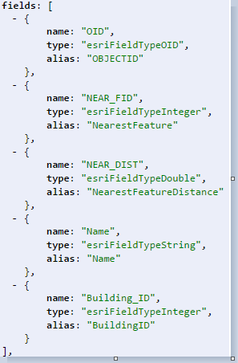

# Esri Indexed 3d Scene Layer (I3S) and Scene Layer Package (*.slpk) Format Specification

Version 1.6, January 02, 2018

*Contributors:* Tamrat Belayneh, Jillian Foster, Javier Gutierrez, Markus Lipp, Sud Menon, Pascal M&uuml;ller, Dragan Petrovic, Simon Reinhard, Juan Ruiz, Johannes Schmid, Ivonne Seler, Chengliang Shan,Thorsten Reitz, Ben Tan, Moxie Zhang

*Acknowledgements:* Bart van Andel, Fabien Dachicourt, Carl Reed

---

The Indexed 3D Scene Layer (I3S) format is an open 3D content delivery format used to rapidly stream and distribute large volumes of 3D GIS data to mobile, web and desktop clients.  I3S content can be shared across enterprise systems using both physical and cloud servers.  ArcGIS Scene Layers and [Scene Services](http://server.arcgis.com/en/server/latest/publish-services/windows/scene-services.htm) use the I3S infrastructure.

# Table of Contents

[Introduction to 3D Scene Layer](#introduction-to-3D-scene-layer)  

​		[Coordinate Reference Systems](#coordinate-reference-systems)  
​		[Height Models](#height-models)  

​	[Indexed Scene Layer - Organization and Structure](#indexed-scene-layer)  

​		[I3S - Indexing Model and Tree Structure](#i3s-indexing-model-and-tree-structure)  
​		[Geometry Model and Storage](#geometry-model-and-storage)  
​		[Textures](#textures-structure)  
​		[Attribute Model and Storage](#attribute-model-and-storage)  

​	[Oriented Bounding Box](#oriented-bounding-box)  

​	[Level of Detail](#level-of-detail)  
​		[Discrete Level of Detail](#discrete-level-of-detail)  
​		[Multiple Representations](#multiple-representations)  
​		[Switching Models](#switching-models)  
​		[Level of Detail Generation](#level-of-detail-generation)  
​		[Selection Metrics](#selection-metrics)  

​	[Scene Layer Package](#scene-layer-packages)  
​		[Metadata](#metadata)  
​		[Key Value Stores](#key-value-stores)  

​	[REST API for Attribute Resources](#rest-api-for-attribute-resources)  
​		[Usage pattern of the *attributes* REST API](#usage-pattern-of-the-attributes-REST-API)  
​		[Attribute Resource - Details](#attribute-resource-details)  

[JSON Resources](#json-resources)  

​	[Supported Data Types](#supported-data-types)  
​	[Pointers](#pointers)  
​	[SceneServiceInfo](#sceneServiceInfo)  
​	[Class Scene Service Info](#class-SceneServiceInfo)  
​	[Class 3dSceneLayerInfo](#class-3dSceneLayerInfo)  
​	[Class Store](#class-store)  
​	[Class Geometry Schema](#class-geometry-schema)  
​	[Class HeaderAttribute](#class-headerAttribute)  
​	[Class Field](#class-field)  
​	[Class AttributeStorageInfo](#class-attributestorageinfo)  
​	[Class IndexScheme](#class-indexscheme)  
​	[Class DrawingInfo](#class-drawinginfo)  
​       [Class StatisticsInfo](#class-statisticsInfo)  
​       [Class Domains](#class-domains)  
​	[Class Material](#class-material)  
​	[Class CachedDrawingInfo](#class-cacheddrawinginfo)  
​	[3dNodeIndexDocument](#3dNodeIndexDocument)  
​	[Class NodeReference](#class-nodereference)  
​	[Class Resource](#class-resource)  
​	[Class Level of Detail Selection](#class-level-of-detail-selection)  
​	[FeatureData](#FeatureData)  
​	[Class Feature](#class-feature)  
​	[Class FeatureAttribute](#class-featureAttribute)  
​	[Class Geometry](#class-geometry)  
​	[Class GeometryParams](#class-geometryparams)  
​	[Class GeometryReferenceParams](#class-geometryreferenceparams)  
​	[Class VestedGeometryParams](#class-vestedgeometryparams)  
​	[Class SingleComponentParmas](#class-singlecomponentparams)  
​	[Class Geometry Attribute](#class-GeometryAttribute)  
[Shared Resources](#shared-resources)  
​	[Class Component](#class-component)  
​	[Class Feature](#class-feature)  
​	[Class Outline](#class-outline)  
​	[Class Color](#class-color)  
​	[Class Renderer](#class-renderer)  
​	[Class Symbol](#class-symbol)  

[Textures](#textures)  

​	[Texture Recommendations and Requirements](#texture-recommendations-and-requirements)  
​	[Generating Image IDs](#generating-image-ids)  
​	[Geometry](#geometry)  
​	[Attribute Data](#attribute-data)  
​	[Accessing the Legend of a 3D Object Layer](#accessing-the-legend-of-a-3d-object-layer)  


[I3S Flexbility](#i3s-flexibility)  

​	[I3S Defining Characteristics](#i3s-defining-characteristics)  
​	[Persistence](#persistence)  

# I3S Design Principles

The Esri Indexed 3d Scene layer (I3S) format and the corresponding Scene Layer Package format (*.slpk) are specified to fulfill this set of design principles:  

- **User Experience First**: Provide a positive user experience, including high interactivity and fast display.
- **Scalability**: Support very large scene layers, including scenes with a global extent and many detailed features.
- **Reusability**: Use as a service delivery format, storage format, and exchange format.
- **Level of Detail**: Support multiple detail levels.
- **Distribution**: Allow efficient distribution of very large data sets.
- **User-controllable symbology**: Support efficient rendering of client-side symbology and styling.
- **Extensibility**: Support new layer types, new geometry types, and new platforms.
- **Web Friendliness**: Provide easy to handle data using JSON and current web standards.
- **Compatibility**: Provide a single structure that is compatible across web, mobile, and desktop clients.  Support is also included for cloud and servers.
- **Declarative**: Communicate clearly to minimize the amount of required domain knowledge to support the format.
- **Follow REST/JSON API Best Practices:** Provide navigable links to all resources.

# <a name="introduction-to-3D-scene-layer">Introduction to 3D Scene Layer</a>

A single I3S data set is referred to as a Scene Layer.  It is a container for arbitrarily large amounts of heterogeneously distributed 3D geographic data.  Scene Layers provide clients access to data and allow them to visualize it according to their needs.  The definition of "data" in this case includes the geometry, attributes, and vertex geometry. 

A Scene Layer is characterized by a combination of layer type and profile. The *layer type* describes the kind of geospatial data stored within it. The *layer profile* includes additional details on the specific I3S implementation. 

 The supported layer types are:

* [3D Objects](../docs/1.6/3Dobject_ReadMe.md) (e.g. building exteriors, 3D models in various formats)
* [Integrated Mesh](../docs/1.6/IntegratedMesh_ReadMe.md) (e.g. integrated surface including vegetation, buildings and roads) 
* [Points](../docs/1.6/Point_ReadMe.md) (e.g. hospitals, schools, trees, street furniture, signs)
* [Point Clouds](../docs/2.0/PointCloud_ReadMe.md) (e.g. lidar data)
* [Building Scene Layer](../docs/1.6/BSL_ReadMe.md) (e.g. building including its components, such as windows, doors, chairs, etc.)

Layer types with the same profile can be leveraged to support different use cases.  Some layer types represent features using an identity instead of a geospatial field (e.g. mesh or cloud).  Other layer types support attribute storage, either as feature attributes or individual geometry elements.  Here are a few examples:

| Layer Type                                             | Profile       | Features with Identity | Attributes                                              |
| ------------------------------------------------------ | ------------- | ---------------------- | ------------------------------------------------------- |
| [3D Objects](../docs/1.6/3Dobject_ReadMe.md)           | mesh-pyramids | Yes                    | Yes                                                     |
| [Integrated Mesh](../docs/1.6/IntegratedMesh_ReadMe.md) | mesh-pyramids | No                     | Triangle Attributes (planned)                           |
| [Point](../docs/1.6/Point_ReadMe.md)                   | points        | Yes                    | Yes                                                     |
| [Point Cloud](../docs/2.0/pcsl_ReadMe.md)        | pointclouds   | No                     | [Vertex Attributes](../docs/1.6/vertexAttribute.cmn.md) |
| Line                                                   | lines         | Yes                    | Yes                                                     |
| Ploygon                                                | ploygons      | Yes                    | Yes                                                     |
| Building Scene Layer                                   |      &nbsp;     |       &nbsp;           |                &nbsp;                                 |

*Table 1: Examples of 3D Scene Layer Layer Types and Layer Profiles*

### <a name="coordinate-reference-systems"> Coordinate Reference Systems

The Coordinate Reference System of the Indexed 3D Scene Layer should be selected with the following considerations:

- Minimize the need for re-projection on the client side
- Render in both projected and geodetic coordinate reference systems
- Support data with a global extent
- Support local and global data with high positional accuracy

To support these considerations, I3S has the following implementation requirements:

1. The location of all index-related data structures, such as node bounding spheres, are specified using a single, global Geographic WGS84 2D Coordinate Reference System
   - Coordinate bounds are in the range (-180.0000, -90.0000, 180.0000, 90.0000)
   - Elevation and node minimum bounding sphere radius are specified in meters
   - Allowed coordinate system using European Petroleum Survey Group (EPSG) code 4326
2. All vertex positions are specified using geodetic coordinate reference system
   - The X, Y, and Z axes are all in same unit, with a per-node offset for all vertex positions.  The offset is calculated from the center point of the node's minimum bounding sphere.
3. The axis order is independent of the Coordinate Reference System.  It will always use the Easting, Northing, Elevation (X, Y, Z) axis order. The Z axis always points up towards the sky.


All I3S profiles support writing 3D content in two modes: global and local. In global mode, only European Petroleum Survey Group (EPSG) code 4326 (WGS84) is supported for both index and vertex positions.  It is represented using longitude, latitude, elevation. In local mode, all geodetic Coordinate Reference Systems, including Cartesian coordinate systems, are allowed. Both index and position vertex must have the same Coordinate Reference System.

All I3S layers indicate the coordinate system with the spatialReference property in the [3dSceneLayerInfo](../docs/1.6/3DSceneLayer.cmn.md) resource. This property is normative.

The [spatial reference](../docs/1.6/spatialReference.cmn.md) object is common to all i3s profile types.

### <a name="height-models">Height Models</a>

The I3S standard allows either ellipsoidal or gravity-related vertical coordinate systems. This allows I3S to be applied across a diverse range of fields and applications. 

At version 1.5, I3S added support for a vertical coordinate systems. The Well-known Text (WKT) representation of the Coordinate Reference System now includes the vertical coordinate system used by the layer. The spatialReference property also includes a Well-known ID (WKID) and a Vertical Coordinate System Well-known ID (VcsWKID).  The client application can consume any of these properties to designate the height model.

The heightModelInfo, included in the 3DSceneLayerInfo resource, is used by clients to determine if the layer's height model is orthometric or gravity-related. 

See the [3DSceneLayerInfo](../docs/1.6/3DSceneLayer.cmn.md) and [heightModelInfo](../docs/1.6/heightModelInfo.cmn.md) pages for more details.

## <a name="indexed-scene-layer">Indexed Scene Layers - Organization and Structure</a>

I3S organizes information using a hierarchical, node-based spatial index.  Each node contains features with geometry, textures and attributes. 

### <a name="i3s-indexing-model-and-tree-structure">I3S - Indexing Model and Tree Structure</a>

Indexing allows fast access to data blocks. In an Indexed 3D Scene Layer, the spatial extent of the data is split into regions called *nodes*.  Each node has roughly equivalent amounts of data and is organized hierarchically.  The node index allows clients to efficiently determine which data it needs, and allows the server to quickly locate it.  Node creation is capacity driven. For example, the smaller the node capacity, the smaller the spatial extent of the node. 

Any indexing model can be used to generate indices in I3S.  Both regular partitioning of space (e.g. Quadtrees) and density dependent partitioning of space (e.g. R-Trees) are supported.  The partitioning scheme is not exposed to clients.  This partition results in a hierarchical subdivision of 3D space represented by nodes, which are further organized in a bounding volume tree hierarchy.

Each node has an ID that is unique within a layer.  I3S supports two types of nodes: *treekeys* and integers.  Treekeys are a string based identifier.  Integer IDs are base on a fixed linearization of the nodes.

The treekey format is loosely modeled on binary search tree concept.  The key value indicates both the level and sibling association of a given node.  The key also indicates the position of the node in the tree, which allows all resources to be stored in a single dimension.

Treekeys are strings in which levels are separated by dashes.  The root node is at level 1 always gets ID `root`.  

For example, take the node with treekey "3-1-0".  Since it has 3 numeric elements 3, 1 and 0, it can be concluded that the node is on level 4.  The parent node has treekey  "3-1". 


*Figure 1: A sample index tree using Treekeys*

Each node includes the set of information covered by the nodes below it and is part of the path of the leaf nodes below it. Interior nodes may have a reduced representation of the information contained in descendant nodes.

Nodes include `NodeIndexDocument`, `FeatureData`, `geometry`, `attribures`, and `SharedResource`.  

- [Node Index Document](../docs/1.6/3DSNodeIndexDocument.cmn.md): A lightweight resource that represents a node, its topology, and other sub-resources.
- [Feature Data](../docs/1.6/featureData.cmn.md): A text resource that identifies the features within a node. It can store the geometry and attributes for all the features in the node either by value or by reference. 
- [Geometry](../docs/1.6/geometry.cmn.md): The geometries of the features, the identifiers of the owning features, the mapping between individual feature their geometry segments.
- [Attribute](../docs/1.6/attributeStorageInfo.cmn.md): Describes the structure of the binary attribute data.
- [Texture](../docs/1.6/textureDefinition.cmn.md): Describes how a feature is to be rendered.
- [Shared Resource](../docs/1.6/sharedResource.cmn.md): Models or textures that can be shared among features within the same layer.

An I3S profile uses either a single text-based subresource or separate binary subresources.  The text-based resources contain all the geometry and attribute information (e.g. Point profile).  The separate, binary subresources have self-contained geometry and attribute subresources (e.g. mesh pyramids). Applications that use the separate binary subresources do not need to fetch the feature data in order to interpret them.  

Each node has exactly one `NodeIndexDocument` and one `SharedDescriptors` document. The `FeatureData`, `geometry`, and `attributes` can be bundled to help optimize network transfer and client side reactivity.  This helps balance index size and feature splitting with optimal network usage. 

There are always an equal number of `FeatureData` and `geometry` resources.  Each set contains
the corresponding data elements to render a complete feature.  In order to avoid dependency on the `FeatureData` document, the geometry data is directly available as a binary resource.  The geometry data includes all vertex attributes, feature counts, and mesh segmentation.

Figure 2 below shows the node tree of an 3D Object Indexed Scene Layer with a mesh pyramid profile.

- `Nodes` are in green circles.
- `Node identifiers` are in dark blue rectangles above each node.
- `Features` are in orange rectangles within each node.  The numbers in the rectangle are the feature identifiers.
- `Geometry` is in turquoise rectangles. Each geometry resource is an array of geometries, which includes mesh-segmentation information and the feature identifier. 
- Each node is connected to its children with a green line. 
- The attribute and texture resources are omitted from the figure for clarity. They follow a similar storage model to geometry.
- Feature "6" has been generalized away at the lower level of detail node (node "3") and is intentionally no longer represented within its payload.


*Figure 2: Example 3D Object Indexed Scene Layer with a mesh pyramid profile*

### <a name="geometry-model-and-storage">Geometry Model and Storage</a>

All Scene Layer types make use of the same fundamental set of geometry types: points, lines and triangles.

The Array Buffer View controls geometry storage and consumption representation.  For example, the Array Buffer View can require per-vertex layout of components.  This orders the vertex position, normal and texture coordinates to ensure the same pattern across the Scene Layer.

Both 3D Object and Integrated Mesh layer types model geometries as triangle meshes using the mesh-pyramids profile. The mesh-pyramids profile uses the triangles geometry type to store triangle meshes.  The meshes have a reduced level of detail, are segmented by features, and available in the interior nodes.

For more details regarding 3D objects and point scene layer, see [Geometry](../docs/1.6/geometry.cmn.md).

For more details regarding point cloud scene layer, see [defaultGeometryShema](../docs/2.0/defaultGeometrySchema.pcsl.md).

### <a name="textures-structure">Textures</a>

Textures are stored as a binary resource with a node. The texture resource contains the texture images.  I3S supports most commonly used image formats, like JPEG and PNG, and compressed texture formats like ETC2.  Both integrated mesh and 3D object profile support textures. Authoring applications can provide additional texture formats using `textureEncoding` declarations. 

See the [Textures](../docs/1.6/texture.cmn.md) section for more details.

### <a name="attribute-model-and-storage">Attribute Model and Storage</a>

I3S supports two ways to access attribute data.  They can be accessed through:

1. Paired services with RESTful endpoints. 
   - Enables direct access to source data.
   - The query uses the unique feature ID key.

2. Fully cached attribute information within the I3S store.
   - Binary storage representation, which provides a significant performance benefit.

Clients can use either method if the attributes are cached. The attribute values are stored as a geometry aligned, per field, key-value pair arrays.  

See [AttributeInfo](../docs/2.0/attributeInfo.pcsl.md) for details regarding point cloud scene layer.

See [Attribute](../docs/1.6/attributeStorageInfo.cmn.md) for details on all other scene layer types.

## <a name="oriented-bounding-box">Oriented Bounding Box</a>

An oriented bounding box (OBB) represents the bounding volume of each node in the scene layer. 

See [oriented bounding box](../docs/1.6/obb.cmn.md) for more details regarding all scene layer types.

## <a name="level-of-detail">Level of Detail</a>

Scene Layers include Levels of Detail (LoD) that apply to the whole layer and summarize layer information.  They are similar to image pyramids or raster vector tiling schemes.  Scene Layers support Levels of Detail that preserve the identity of individual features across all detail levels. Levels of Detail can be used to split heavy features, thin or cluster for better visuals, and integrate externally authored files.

### <a name="discrete-level-of-detail">Discrete Level of Detail</a>

Discrete Levels of Detail provide multiple models to display the same object.  A specific detail level is bound to certain levels of the index tree. Leaf nodes typically contain the original feature representation with the most detail.  The closer the node is the the root, the lower the level of detail. The detail is can reduced by texture thinning, down-sampling, clustering, or a number of methods in order to ensure inner nodes have a balanced weight.  The number of discrete Levels of Detail for the layer corresponds to the number of levels in the index tree.

When navigating the I3S tree nodes, clients must determine how to interpret an unavailable level of detail.  Using the level of detail selection metrics included in the node, they can:

- Stop traversal to the node's children if the current node is not visible.
- Use the data in the node if the quality is appropriate, and then stop traversal to children.
- Continue traversal until nodes with higher quality are found.

I3S supports multiple level of detail selection metrics and switching level of detail models.  Details about the level of detail generation process can be optionally included in the Scene Layer's metadata.

### <a name="multiple-representations">Multiple Representations</a>

I3S Layers can be used to represent input data with multiple Levels of Detail. The most common method is to represent each input level of detail as its own I3S Layer with visibility thresholds.  The thresholds capture the range of distances for which the layer should be used.  A set of I3S Layers that represent a single model can be grouped within the same I3S service. For each layer within the set, the features in the leaf nodes represent the modeled features at the level of detail of the input. Additional detail levels can be generated automatically by extending the viewing range of each input level. 

Depending on the extent and the total number of detail levels, a single I3S Layer can be created by combining all of the input level of detail information.  In this case, the height of the I3S Index Tree is fixed to the number of Levels of Detail present in the input.  Both the feature identities and geometries in each node are set based on the input data. 

### <a name="switching-models">Switching Models</a>

Node switching lets clients focus on the display of a node as a whole.  A node switch occurs when the content from a node's children is used to replace the content of an existing node.  This can include features, geometry, attributes and textures. Node switching can be helpful when the user needs to see more detailed information. 

Each interior node in the I3S tree has a set of features that represent the reduced level of detail.  This includes the details for all features covered by the node.  Due to generalization at lower Levels of Detail, not all features are present in reduced level of detail nodes.

The feature IDs link the reduced level of detail feature and an interior node, as well as the descendant nodes.  Applications can determine the visual quality by using the I3S tree to display all of the features in an internal node or use the features found in its descendants. 

### <a name="level-of-detail-generation">Level of Detail Generation</a>

Integrated Mesh layer types typically come with pre-authored Levels of Detail.  If the desired level of detail does not exist, it can be generated. 

For example, 3D Object Layers based on the mesh-pyramids profile can create a level of detail pyramid for all features based on generalizing, reducing and fusing the geometries of individual features while preserving feature identity. The same approach can also be used with Integrated Mesh Layers based on the mesh-pyramid profile.  In this case, there are no features, and each node contains a generalized version of the mesh covered by its descendants.

The bounding volume tree hierarchy is built based on the spatial distribution of the features.  The method used to create the levels depends on the Scene Layer type.

|    &nbsp;        | 3D Object                    | Points                       | Lines                        | Polygons                     | Point Clouds                 | Building Scene Layer |
| -------------- | ---------------------------- | ---------------------------- | ---------------------------- | ---------------------------- | ---------------------------- | -------------------- |
| Mesh-pyramids  |  |           &nbsp;             |           &nbsp;             |           &nbsp;             |             &nbsp;           |                      |
| Thinning       |  |  |  |  |  |                      |
| Clustering     |  |  |  |           &nbsp;             |  |                      |
| Generalization |  |             &nbsp;           |  |  |             &nbsp;           |                      |

*Example Level of Detail generation methods based on Scene Layer type*

### <a name="selection-metrics">Selection Metrics</a>

Selection metrics help clients determine the which level of detail to render.  For example, clients need to weigh the options of screen size, resolution, bandwidth, and memory to reach the target quality.  

See the the [Level of Detail Selection](../docs/1.6/lodSelection.cmn.md") for more details regarding Integrated Mesh, 3D objects and point scene layer.

## <a name="scene-layer-packages">Scene Layer Packages</a>

Scene Layer Packages (SLPK) allow a complete I3S layer, with all resources, to be transported or exchanged as a single file.  It can be consumed by applications directly.

A Scene Layer Package is

- Always archived using [zip](https://en.wikipedia.org/wiki/Zip_(file_format)) compression
  - STORE is the preferred compression schema since an SLPK is intended for direct consumption by clients, especially if a resource compression is already applied on the individual resources.
  - This compression scheme has to be either STORE or DEFLATE64.Standard.  DEFLATE is acceptable as a fallback if DEFLATE64 is not available, but will only work with smaller SLPKs.
- Every resource, except textures, can be individually compressed. Compressed textures can have additional GZIP compression applied. Only the GZIP scheme is supported, since DEFLATE is not universally supported by all browsers.

Figure 10 below shows a Scene Layer Package archive with the BASIC folder pattern.  The I3S specification also allows an EXTENDED folder pattern, that uses subtree partitions to avoid problems with very large packages.  The top level includes a <em>nodes</em> folder with  

- A subfolder that contains all node resources
- A *metadata.json* file that describes the content of the SLPK
- A *3dSceneLayer.json.gz* file that defines the Scene Layer


*Example of an SLPK with BASIC folder layout.*

The *3dNodeIndexDocument.json.gz*, *features/0.json.gz* and *SharedResource.json.gz* correspond to 3dNodeIndexDocument, featureData and SharedResource documents of the Scene Layer, and are JSON with GZIP compression.

The *nodes* subfolder contains, nodes named *root*, *1-4-2-0*, and other nodes not pictured.  All file resources within a particular node (e.g. *1-4-2-0*), can be individually compressed with GZIP (indicated by the file extension *.gz*).  Note, the texture resource is not compressed because it is an image (JPEG *textures/0_0.jpg*).

Resources in subfolders, like *geometries* and *attributes*, are serialized as binary, and correspond to the geometryData and attributeData (e.g. *geometries/0.bin.gz* and *attributes/f_0/bin.gz*)

For the above example, an SLPK file is employed as follows:

1. SLPK as a transfer format
   - Archive Compression Type: DEFLATE64
   - Resource Compression Type: None
2. SLPK as a serving format
   - Archive Compression Type: STORE
   - Resource Compression Type: GZIP

### <a name="metadata">Metadata</a>

Every SLPK archive has a *metadata.json* file. The following entries are required and must be of the specified type.  The default is in **bold**.

| Property                | Details                                  |
| ----------------------- | ---------------------------------------- |
| folderPattern           | One of {**BASIC**, EXTENDED}             |
| ArchiveCompressionType  | One of {**STORE**, DEFLATE64, [DEFLATE]} |
| ResourceCompressionType | One of {**GZIP**, NONE}                  |
| I3SVersion              | One of {1.2, 1.3, 1.4, **1.6**}          |
| nodeCount               | Total number of nodes in the SLPK        |

*Metadata properties*

### <a name="key-value-stores">Key Value Stores</a>

In this persistence schema, all Scene Layer resources are stored within either key value based cloud blob stores (e.g. Amazon Simple Storage (S3), Windows Azure Blob Storage) or with more general key value stores. In cloud blob stores, layer resources are stored as either simple objects within containing buckets (S3) or blobs within blob containers (Azure). In all cases, each resource is identified by a unique key.  The default is in **bold**.

*Table 14: Example SceneService in a key value store environment with textured geometries and attribute data*

| I3S Resource                                   | Required                          | Details                                                      |
| ---------------------------------------------- | --------------------------------- | ------------------------------------------------------------ |
| /SceneServer                                   |  | The SceneServiceInfo JSON file that defines the service name and the list of layers included with the Scene Service.<br />Content type: plain text<br />Encoding: {**GZIP**, NONE} |
| /SceneServer/layers/0                          |  | The 3D Scene Layer JSOn resource.  The layer ID is used as the document key (e.g. `0`).<br />Content type: plain text<br />Encoding: {**GZIP**, NONE} |
| /SceneServer/layers/nodes/root                 |  | The 3D Node Index Document of the layer as a JSON resource.  The node ID is used as the document key (e.g. `root`)<br />Content type: plain text<br />Encoding: {**GZIP**, NONE} |
| /SceneServer/layers/nodes/0                    |  | The 3D Node Index Document of the layer as a JSON resource.  The node ID is used as the document key (e.g. `0`)<br />Content type: plain text<br />Encoding: {**GZIP**, NONE} |
| /SceneServer/layers/0/nodes/0/shared           |  | The Shared Resource of the node as a JSON resource. The keyword "shared" is used as the document key.<br />Content type: plain text<br />Encoding: {**GZIP**, NONE} |
| /SceneServer/layers/0/nodes/0/features/0       |          &nbsp;                   | The FeatureData document of the node as a JSON resource. The resource array id (e.g. `0`) is used as the document key.<br />Content type: plain text<br />Encoding: {**GZIP**, NONE} |
| /SceneServer/layers/0/nodes/0/geometries/0     |  | The GeometryData of the node as a binary resource. The resource array id  (e.g. `0`) is used as the resource key<br />Content type: application/octet-stream <br />Encoding: {**GZIP**, NONE} |
| /SceneServer/layers/0/nodes/0/textures/0_0     |             &nbsp;                | The Texture of the node as a binary resource. The resource id (e.g. `0_0`) is used as the resource key of the resource <br />Content type: image/jpeg<br />Encoding: {**NONE**} |
| /SceneServer/layers/0/nodes/0/textures/0_0_1   |               &nbsp;              | The compressed texture of the node as a binary resource. The resource id (e.g. `0_0_1`) is used as the resource key<br />Content type: image/vnd-ms.dds<br />Encoding: {**GZIP**, NONE} |
| /SceneServer/layers/0/nodes/0/attributes/f_0/0 |            &nbsp;                 | The AttributeData as a binary resource. The resource id (e.g. `0`) is used as the resource key of the resource<br />Content type: plain text<br />Encoding: {**GZIP**, NONE} |
| /SceneServer/layers/0/nodes/0/attributes/f_1/0 |              &nbsp;               | Same as resource `f_0/0` above                               |
| ...                                            | ...          &nbsp;               | ...                                                          |
| /SceneServer/layers/0/nodes/1-4-2-0            |  | Same as node resource `root` and `0`                         |

## <a name="rest-api-for-attribute-resources">REST API for Attribute Resources</a>

The attributes REST API allows client apps to fetch the attribute records of a field using its _key_ property directly from a scene service layer.  Every scene node (with the exception of `root` node), exposes attribute fields as discrete _attribute_ resources. These resources are accessible through a relative URL to any Node Index Document.

The Attributes REST API syntax:
 URL: **http://&lt;sceneservrice-url&gt;/attributes/&lt;field_key&gt;/&lt;id>**

- *attributes*: the RESTful resource responsible for fetching the binary attribute. Clients will decode the content based on the metadata found in the scene layer _attributeStorageInfo_ array
- *field\_key*: the key value used to request the feature attribute content
- _id_: the bundle ID of the _attribute_ binary resource, corresponding to the geometry bundle id. By default, this value is 0 (same as the geometry bundle id). If a node has more than 1 geometry resource, then the id of the _attribute_ resource will also match the geometry bundle id.

### <a name="usage-pattern-of-the-attributes-REST-API">Usage pattern of the _attributes_ REST API</a>

1. A client should get the attribute field from the metadata by fetching the scene server layers REST resource prior to symbolizing the node base on attribute information.  The layers resource contains the files array, which lists all available attribute fields, types, and the Attribute Storage Info array.  

   - The fields array object contains a collection of objects that describe each attribute, including its name ('name'), datatype ('type') and a user friendly name ('alias'). It includes all fields in the source feature layer of the scene service layer.  
   - The attributeStorageInfo array contains a collection of objects that describes all attribute binary resources. It includes only fields the publisher chose to include as part of the scene cache during publishing time.

   See the [attribute storage info model](../docs/1.6/attributeStorageInfo.cmn.md) for more details.

1. A client application equipped with the list of available fields and the corresponding attribute-value-array metadata, can then fetch the attribute values by using the _key_ as part of the attributes REST request. Furthermore, it is capable of decoding the fetched _attribute_ resource based on the metadata as retrieved in step 1.  

   Note: The geometry buffer contains the _objectIDs_ array as the last section of the geometry layout (layers[id].store.defaultGeometrySchema.featureAttributes). A client application that has a need to access the _ObjectIDs_ array should first check in the geometry buffer before requesting it from the _attributes_ REST resource.

### <a name="attribute-resource-details">Attribute Resource - Details</a>

A numeric attribute resource is a singe, one dimensional array.  A string attribute resource is two, sequential, one dimensional arrays.

The structure of each attribute resource is declared upfront in the scene layer resource through the Attribute Storage Info. The client is reads the Attribute Storage Info metadata to get the header information, the order, and the value types before consuming the binary attribute resource.

Lets take a look at a sample scene service layer and its field types ([see Figure 9](images/figure-14.png)). This layer has 6 fields named 'OID', 'Shape', 'NEAR_FID', 'NEAR_DIST', 'Name' and 'Building_ID'.  

<div>

<p>Figure 9: Typical attribute info of a feature class.</p>
</div>  

A scene service layer includes only supported attribute field value types of a feature class. As a result, the 'Shape' field in Figure 9 is not included in the attribute cache of a scene layer.

Figure 9 shows how the feature class maps to different attribute resources. 

- **OID** (type: `esriFieldTypeOID`) is by default represented as an _UInt32-Array_, with a 1-d array of _UInt32_ value type.
- **NEAR-FID** (type: `esriFieldTypeInteger`) is represented as an _Int32-Array_, with a 1-d array of _Int32_ value type.
- **NEAR_DIST** (type: `esriFieldTypeDouble`) is represented as a _Double-Array_, with a 1-d array of _Float64_ value type.
- **Name** (type: `esriFieldTypeString`) is represented as a _String-Array_. A String-Array supports storage of variable length strings and is stored as two arrays in sequence.  The first fixed length array has the byte counts of each string (null terminated).  The second array stores the actual string values as UTF8 encoded strings. The value type of the first array is _UInt32_ and the value type of the second array is _String_.

The _attributes_ REST API of a scene layer gives access to all scene cache feature attribute data as binary attribute value arrays.  For example, Figure 9 has 5 binary resources, identified by keys *f_0_, f_1_, f_2_, f_3_*  and *f_4*, and are accessible by the respective rest resource URLs (e.g. .../nodes/&lt;nodeID&gt;/attributes/0/f\_0, .../nodes/&lt;nodeID&gt;/attributes/0/f_1, etc.)

[Table 12](Table_24.png) below lists a feature layer's field data types. The valueTypes column indicates the supported types for attribute based mapping and symbology.

The following types of attribute value arrays are supported :

- _Int32-Array_, _UInt32-Array_, _UInt64-Array_, _Float64-Array_, _Float32-Array_, _String-Array_

<div>

<p>Attribute data types supported by a scene service layer.</p>
</div>

# <a name="json-resources">JSON Resources</a>

### <a name="supported-data-types">Supported Data Types</a>

A value schema ensures that the JSON properties follow a fixed pattern and support the following data types:

- **String**: utf8 string
- **Float**: float64
- **Integer**: int32
- **UUID**: A hexadecimal universally unique identifier
- **Date**: An ISO 8601 timestamp YYYY-MM-DDThh:mm:ss.sTZD
- **URL**: Both relative and absolute
- **Pointer**: Any reference to an object in a JSON document, consisting of a URL and a document path
- **NodeID**: A treekey string that is zero-based (first child is "0", root node is "root")

### <a name="pointers">Pointers</a>

Pointers are used to reference specific properties in another document.  They consist of two elements:

1. **In-document reference** (required): References the current property. Absolute references should be used for upstream paths, and relative references should be used for downstream paths.   
2. **URL** (optional): A prefix URL to link to a different document. Use square brackets.

For example, a pointer from FeatureData to `3DSceneLayer.name` using a relative URL and an absolute reference would be written as: `[../../]/name`

### <a name="sceneServiceInfo">SceneServiceInfo</a>

The SceneServiceInfo is a JSON file that describes the capability and data sets offered by an instance of a Scene Service. This file is automatically generated by the Scene Server for each service instance and is not part of a Scene Layer Package (SLPK) file. 

### <a name="class-SceneServiceInfo">Class SceneServiceInfo</a>

The Class SceneServiceInfo describes an active SceneService instance.  There is exactly one SceneServiceInfo object in a document. 

See [scene service](service/SceneService.cmn.md) for service examples.

### <a name="class-3dSceneLayerInfo">Class 3dSceneLayerInfo</a>

The Class 3dSceneLayerInfo describes the properties of a single layer in a store.  It includes the default symbology, or the stylization information, for a layer.  The symbology is further described in the sub Class <a href="#Class DrawingInfo">DrawingInfo</a>.

For more details regarding Integrated Mesh, 3D objects and point scene layer, see [3D Scene Layer Info](../docs/1.6/3DSceneLayer.cmn.md).

For more details regarding point scene layer, see [Layer description](../docs/2.0/layer.pcsl.md).

### <a name="class-store">Class Store</a>

The Class Store object describes the physical storage of a layer.  This enables the client to detect when multiple layers are served from the same store. Including multiple layers in a single store allows them to share resources.  When the resources are shared, layers with different attribute schemas or symbology, but the same content type, can be served efficiently. 

For more details regarding Integrated Mesh, 3D objects and point scene layer, see the [store](../docs/1.6/store.cmn.md) <br/>
For more details regarding point scene layer, see the [store point cloud scene layer](../docs/2.0/store.pcsl.md).

### <a name="class-geometry-schema">Class Geometry Schema</a>

The defaultGeometry schema is used in stores where all ArrayBufferView geometry declarations use the same pattern for face and vertex elements. It reduces redundancies of ArrayBufferView geometry declarations in a store, and reuses the GeometryAttribute type from FeatureData. Only valueType and valuesPerElement are required. 

For more details regarding Integrated Mesh, 3D objects and point scene layer, see the [default geometry schema](../docs/1.6/defaultGeometrySchema.cmn.md).

For more details regarding point scene layer, see the [default geometry schema point cloud scene layer](../docs/2.0/defaultGeometrySchema.pcsl.md).

### <a name="class-headerAttribute">Class HeaderAttribute</a>

Headers to Geometry resources must be uniform across a cache and may only contain fixed-width, single element fields. The HeaderDefinition provides the name of each field and the header valueType.

For more details regarding 3D objects and point scene layer, see [header attribute](../docs/1.6/headerAttribute.cmn.md).

### <a name="class-field">Class Field</a>

The Field class is used to provide schema information for a 3dSceneLayer.

For more details regarding Integrated Mesh, 3D objects and point scene layer, see the [class field](../docs/1.6/field.cmn.md).

For more details regarding point scene layer, See the [class field](../docs/1.6/field.pcsl.md).

### <a name="class-attributestorageinfo">Class AttributeStorageInfo</a>

The attributeStorageInfo is a major object in the 3dSceneLayerInfo document. It describes the structure of a node's binary attributeData resource.

For more details regarding 3D objects and point scene layer, see [attribute storage info](../docs/1.6/attributeStorageInfo.cmn.md).

For more details regarding point cloud scene layer, see [attributeInfo](../docs/2.0/attributeInfo.pcsl.md).

### <a name="class-indexscheme">Class IndexScheme</a>

The IndexScheme class describes the computational and structural properties of the index used within an I3S store.

Point clouds have a different index scheme. See [point cloud index scheme](../docs/2.0/index.pcsl.md) for more details.

### <a name="class-drawinginfo">Class DrawingInfo</a>

DrawingInfo and the associated classes contain the default symbology (drawing information) of an Indexed 3D Scene Layer. 

When the DrawingInfo object is present in the 3dSceneLayerInfo Class, a client can symbolize an I3S layer using the Renderer information.  The DrawingInfo can alternatively be captured in the Scene Layer as part of the binary I3S representation.  This helps support clients that may not be able to override the symbology in a layer.  In this case, the DrawingInfo is described in the CachedDrawingInfo class. 

For more details regarding 3D objects and point scene layer, see [drawing info](../docs/1.6/drawingInfo.cmn.md).

For more details regarding point cloud scene, see [drawing info point cloud scene layer](../docs/2.0/drawingInfo.pcsl.md).

### <a name="class-statisticsInfo">Class StatisticsInfo</a>

Statistical information help clients to define symbology, definition queries or other functionality which is depending on statistical information. 

For more details regarding 3D objects and point scene layer, see [statisticsInfo](../docs/1.6/statisticsInfo.cmn.md)

For more details regarding point cloud scene layers, see [statistics](../docs/2.0/statistics.pcsl.md).

### <a name="class-domains">Class Domains</a>

Attribute domains are rules that describe the legal values of a field type, providing a method for enforcing data integrity. Attribute domains are used to constrain the values allowed in any particular attribute for a table or feature class. If the features in a feature class or non-spatial objects in a table have been grouped into subtypes, different attribute domains can be assigned to each of the subtypes. A domain is a declaration of acceptable attribute values. Whenever a domain is associated with an attribute field, only the values within that domain are valid for the field. In other words, the field will not accept a value that is not in that domain. Using domains helps ensure data integrity by limiting the choice of values for a particular field.

See [domains](../docs/1.6/domain.cmn.md) for more details regarding 3D objects scene layer and point scene layer.

### <a name="class-material">Class Material</a>

The material used to shade the geometry.

See [material](../docs/1.6/material.cmn.md) for more details regarding Integrated Mesh and 3D object scene layer.

### <a name="class-cacheddrawinginfo">Class CachedDrawingInfo</a>

The Class CachedDrawingInfo is used to indicate if the DrawingInfo object is captured as part of the binary I3S representation.

See [cached drawing info](../docs/1.6/cachedDrawingInfo.cmn.md) for more details Integrated Mesh and 3D object scene layer.

### <a name="3dNodeIndexDocument"></a>3dNodeIndexDocument

The 3dNodeIndexDocument file describes a single index node within a store.  It includes links to other nodes (children, siblings, and parent), feature data, geometry data, texture data, and other metadata.

Depending on the geometry and level of detail, a node document can be tuned to be light-weight or heavy-weight.  Clients decide which data to retrieve.  A simple data visualization can be created using centroids with the details from the node, its parent, its children, and neighbors to help the client understand the overall distribution of the data.

See [3D Node Index Document](../docs/1.6/3DSNodeIndexDocument.cmn.md) for more details Integrated Mesh, 3D objects and point scene layer.

Point cloud scene layer define indexed page nodes. See [page node](docs/2.0/nodepage.pcsl.md) for more details.

### <a name="class-nodereference"></a> Class NodeReference

A NodeReference is a pointer to another node.  A node can reference the parent, a child or a neighbor. Node references contain a relative URL and metadata.  The URL points to the node ID.  The metadata is used to determine which nodes to load and helps maintain store consistency. 

See [node reference](../docs/1.6/nodeReference.cmn.md) for more details Integrated Mesh, 3D objects and point scene layer.

### <a name="class-resource"></a> Class Resource

Resource objects are pointers to resources related to a node, like the feature data, geometry attributes, indices, textures and shared resources.

See [resource](../docs/1.6/resource.cmn.md) for more details regarding Integrated Mesh, 3D objects and point scene layer.

### <a name="class-level-of-detail-selection"></a> Class Level of Detail Selection

A level of detail selection (lodSelection) object provides information about a metrics determined during
the cooking process.  Clients use these metrics to determine representation quality.

Cookers can add as many lodSelection objects as desired, but must provide at least one so that the level of detail type (lodType) is not null. Typically, minimum, average, or maximum value is used.


See [level of detail selection](../docs/1.6/lodSelection.cmn.md) for more details Integrated mesh, 3D objects and point scene layer.

### <a name="featureData"></a>FeatureData

The FeatureData JSON files contain geographical features with a set of attributes, accessors to geometry attributes, and other references to styling or materials.  

Point Clouds do not have feature data.

See [feature data](../docs/1.6/featureData.cmn.md) for details on all  other layer types.

### <a name="class-feature"></a> Class Feature

A Feature is a single object within a GIS data set.  It usually represents a real world feature.

See [feature data](../docs/1.6/featureData.cmn.md) for more details 3D objects and point scene layer.

### <a name="class-featureAttribute"></a> Class FeatureAttribute

A FeatureAttribute is a field carrying a value. This value may be a list of complete attributes used with reports or metadata.

See [feature attribute](../docs/1.6/featureAttribute.cmn.md) for 3D Objects and Point Scene Layers. 

### <a name="class-geometry"></a> Class Geometry

This is the common container class for all types of geometry definitions used in I3S.

See [geometry](../docs/1.6/geometry.cmn.md) for more details Integrated mesh and 3D objects scene layer.

### <a name="class-geometryparams"></a> Class GeometryParams

This is the abstract parent class for all GeometryParams classes (GeometryReferenceParams, VestedGeometryParamas, SingleComponentParams). It does not have properties of its own.

See [geometry params](../docs/1.6/geometryParams.cmn.md) for more details Integrated mesh and 3D objects scene layer.

### <a name="class-geometryreferenceparams"></a> Class GeometryReferenceParams

Instead of owning a geometry exclusively, a feature can reference a Geometry defined for the node.  Using GeometryReferenceParameters allows clients to pre-aggregate geometries for many features. 

See [geometry reference params](../docs/1.6/geometryReferenceParams.cmn.md) for more details Integrated mesh and 3D objects scene layer.

### <a name="class-vestedgeometryparams"></a> Class VestedGeometryParams

VestedGeometryParams extends GeometryParams.  It is the abstract parent class for all concrete ("vested") GeometryParams classes that directly contain a Geometry definition.  The definition can be either an ArrayBufferView or an Embedded Geometry.

See [vested geometry params](../docs/1.6/vestedGeometryParams.cmn.md) for more details Integrated Mesh and 3D objects scene layer.

### <a name="class-singlecomponentparams"></a> Class SingleComponentParams

SingleCompenentParams extends VestedGeometryParams.  It uses one texture and one material, and can be used with aggregated geometries.

See [single component params](../docs/1.6/singleComponentParams.cmn.md) for more details Integrated mesh and 3D objects scene layer.

### <a name="class-GeometryAttribute"></a>Class GeometryAttribute

For more details regarding 3D objects scene layer and point scene layer, see [domains](../docs/1.6/domain.cmn.md).

See [geometry attribute](../docs/1.6/geometryAttribute.cmn.md) for more details Integrated mesh and 3D objects scene layer.

## <a name="shared-resources"></a>Shared Resources

Shared Resources are models or textures stored as a JSON file that can be shared among features within the same layer.  The Shared Resources are stored in the subtree of the current node. This approach ensures an optimal distribution of shared resources across nodes, while maintaining the node-based updating process.  

Shared resources include the [material definition](../docs/1.6/materialDefinition.cmn.md) and [texture defintion](../docs/1.6/textureDefinition.md) for the resource regarding Integrated mesh and 3D objects scene layer.

See [shared resources](../docs/1.6/sharedResources.cmn.md) for more details regarding Integrated mesh and 3D objects scene layer.

### <a name="class-component"></a> Class Component

*Note: Class Component is not used by ArcGIS Clients. [DrawingInfo](../docs/1.6/drawingInfo.cmn.md) is used instead.* Component objects provide specific geometry information.  This is used to determine which material to use during rendering.

<table>
	<tr>
		<td><strong>Name</strong></td>
		<td><strong>Type</strong></td>
		<td><strong>Description</strong></td>
	</tr>
	<tr>
		<td>id</td>
		<td>Integer</td>
		<td>The ID of the component, only unique within the Geometry</td>
	</tr>
	<tr>
		<td>materialID</td>
		<td>UUID</td>
		<td>ID of the material, as defined in the shared resources bundle, to use for rendering this component</td>
	</tr>
	<tr>
		<td>textureID</td>
		<td>Long[0..1]</td>
		<td>Optional ID of the texture, as defined in shared resources, to use with the material to render this component</td>
	</tr>
	<tr>
		<td>regionID</td>
		<td>Long[0..1]</td>
		<td>Optional ID of a texture atlas region which to use with the texture to render this component</td>
	</tr>
</table>
<p><em>Attributes of the Class Component within the FeatureData document</em></p>

### <a name="class-feature"></a> Class Feature

*Note: Class Feature is not used by ArcGIS Clients. Instead, they use feature binaries.* Features are representations of the geographic objects stored in a layer. In the 3dNodeIndexDocument, these objects define relationships.  For example, the features can be used for linking feature representations of multiple Levels of Detail. 

<table>
	<tr>
		<td><strong>Name</strong></td>
		<td><strong>Type</strong></td>
		<td><strong>Description</strong></td>
	</tr>
	<tr>
		<td>id</td>
		<td>Integer</td>
		<td>An ID of the Feature object, unique within the store (important to note when using Features from multiple stores!). The ID must not be re-used e.g. for multiple representation of an input feature that are present in different nodes.</td>
	</tr>
	<tr>
		<td>mbs</td>
		<td>Float[4]</td>
		<td>An array of four doubles, corresponding to x, y, z and radius of the minimum bounding sphere of the referenced node.</td>
	</tr>
	<tr>
		<td>lodChildFeatures</td>
		<td>Integer[0..*]</td>
		<td>IDs of features in a higher LoD level which together make up this feature.</td>
	</tr>
	<tr>
		<td>lodChildNodes</td>
		<td>String[0..*]</td>
		<td>Tree Key IDs of the nodes in which the lodChildFeatures are found</td>
	</tr>
	<tr>
		<td>rank</td>
		<td>Integer[0..1]</td>
		<td>The LoD level of this feature. Only required for features that participate in a LoD tree. The lowest rank is 1.</td>
	</tr>
	<tr>
		<td>rootFeature</td>
		<td>String</td>
		<td>The Tree Key ID of the root node of a feature LoD tree that this feature participates in. Only required if the feature participates in a LoD tree and if it is not the rootFeature itself.</td>
	</tr>
</table>
<p><em>Attributes of the Class Feature within the NodeIndexDocument</em></p>

### <a name="class-outline"></a> Class Outline

*Note: Class Outline is not used by ArcGIS Clients. [DrawingInfo](../docs/1.6/drawingInfo.cmn.md) is used instead.* The Class Outline defines the outline of the mesh fill symbol. 

<table>
	<tr>
		<td><strong>Name</strong></td>
		<td><strong>Type</strong></td>
		<td><strong>Description</strong></td>
	</tr>
	<tr>
		<td>color</td>
		<td>Material::Color</td>
		<td>Color is represented as a three-element array. The three elements represent values for red, green and blue in that order.</td>
	</tr>
	<tr>
		<td>size</td>
		<td>Integer</td>
		<td>Outline size in points, positive only.</td>
	</tr>
	<tr>
		<td>transparency</td>
		<td>Integer</td>
		<td>Indicates the transparency value associated with the outline of the symbol.The value has to lie between 100 (full transparency) and 0 (full opacity).</td>
	</tr>
</table>
<p><em>Attributes of the Class Material within the 3dSceneLayerInfo document</em></p>

### <a name="class-color"></a> Class Color

*Note: Class Outline is not used by ArcGIS Clients. [DrawingInfo](../docs/1.6/drawingInfo.cmn.md) is used instead.*The Color class defines the color of a symbol or the outline. Color is represented as a three-element array representing red, green, and blue.  Values range from 0 through 255. If color is undefined for a symbol or an outline, the color value is null. 

<table>
	<tr>
		<td><strong>Name</strong></td>
		<td><strong>Type</strong></td>
		<td><strong>Description</strong></td>
	</tr>
	<tr>
		<td>color</td>
		<td>String</td>
		<td>The renderer type. One of <code>{\*Simple\*, UniqueValue, ClassBreaks}</code>. The default, <code> simple</code> renderer is a renderer that uses one symbol only. </td>
	</tr>
	<tr>
		<td>symbolLayers</td>
		<td>Renderer::Symbol</td>
		<td>An object that represents how all features of this I3S layer will be drawn.</td>
	</tr>
</table>
<p><em>Attributes of the Class Color within the 3dSceneLayerInfo document</em></p> 

### <a name="class-renderer"></a> Class Renderer

*Note: Class Renderer is not used by ArcGIS Clients.  [Drawing Info](../docs/1.6/drawingInfo.cmn.md) is used instead.* The Renderer class contains properties that define the drawing symbology of an Indexed 3D Scene Layer including its type, symbol, label and descriptions.  

<table>
	<tr>
		<td><strong>Name</strong></td>
		<td><strong>Type</strong></td>
		<td><strong>Description</strong></td>
	</tr>
	<tr>
		<td>type</td>
		<td>String</td>
		<td>The renderer type. One of <code>{\*Simple\*, UniqueValue, ClassBreaks}</code>. The default, <code>simple</code> renderer is a renderer that uses one symbol only. </td>
	</tr>
	<tr>
		<td>symbol</td>
		<td>Renderer::Symbol</td>
		<td>An object that represents how all features of this I3S layer will be drawn.</td>
	</tr>
	<tr>
		<td>label</td>
		<td>String</td>
		<td>The text string that may be used to label a symbol when displayed in a table of content of an application.</td>
	</tr>
	<tr>
		<td>description</td>
		<td>String</td>
		<td>The text string that does not appear in the table of contents but may appear in the legend.</td>
	</tr>
</table>
<p><em>Attributes of the Class Renderer within the 3dSceneLayerInfo document</em></p>

### <a name="class-symbol"></a> Class Symbol

*Note: Class Symbol is not used by ArcGIS Clients.  [Drawing Info](../docs/1.6/drawingInfo.cmn.md) is used instead.* The Class Symbol represents the render primitive used to symbolize an Indexed 3D Scene Layer. MeshSymbol3D is the only symbol supported type.

<table>
	<tr>
		<td><strong>Name</strong></td>
		<td><strong>Type</strong></td>
		<td><strong>Description</strong></td>
	</tr>
	<tr>
		<td>type</td>
		<td>String</td>
		<td>Specifies the type of symbol used. Value of this property must be <code>{\*MeshSymbol3D\*}</code>. </td>
	</tr>
	<tr>
		<td>symbolLayers</td>
		<td>Renderer::SymbolLayers</td>
		<td>An object that represents how all features of this I3S layer will be drawn.</td>
	</tr>
</table>
<p><em>Attributes of the Class Symbol within the 3dSceneLayerInfo document</em></p>

For more details, see [feature attribute](../docs/1.6/featureAttribute.cmn.md).

*Note: Class SymbolLayers is not used by ArcGIS Clients.  [Drawing Info](../docs/1.6/drawingInfo.cmn.md) is used instead.* A collection of symbol objects used to visualize the feature.

<table>
	<tr>
		<td><strong>Name</strong></td>
		<td><strong>Type</strong></td>
		<td><strong>Description</strong></td>
	</tr>
	<tr>
		<td>type</td>
		<td>String</td>
		<td>Specifies the type of symbol used. Value of this property must be <code>{\*Fill\*}</code>.</td>
	</tr>
	<tr>
		<td>material</td>
		<td>SymbolLayers::Material</td>
		<td>The material used to shade the geometry.</td>
	</tr>
	<tr>
		<td>outline</td>
		<td>SymbolLayers::Outline</td>
		<td>The outline of the mesh fill symbol.</td>
	</tr>
</table>
<p><em>Attributes of the Class SymbolLayers within the 3dSceneLayerInfo document</em></p>

# <a name="textures"></a> Textures

The Textures file is a binary resource that contains images to be used as textures for the features in the store.  A single Texture.bin file contains 1 to n textures for a single specific texture level of detail. It can contain a single texture atlas or multiple individual textures.  The bundling is determined by the authoring application so that specific aspects of the materials and textures used can be taken into account (e.g. tiling).

## <a name="texture-recommendations-and-requirements"></a> Texture Recommendations and Requirements

The number and volume of textures tends to be the limiting display factor, especially for web and mobile clients.  Here are are few guidelines to get the most out of texture resources.

**Image Formats**

I3S supports multiple texture formats.  The format used depends on the use case. For example, a client might choose to consume JPEG in low bandwidth conditions since they are efficient to transmit and widely used. However, clients constrained for memory or computing resources might choose to directly consume compressed textures such for scalability and performance.

I3S supports most commonly used image formats such as JPEG/PNG, as well as rendering optimized compressed texture formats such as S3TC. The authoring application needs to provide the appropriate texture encoding declaration using MIME types such as “image/jpeg” (for JPEG) and “image/vnd-ms.dds” (for S3TC).

**Texture Sets**

Multiple textures can be combined into a single texture using array buffer views.  Large texture atlases (e.g. 2048 x 2048 px) with one texture per bundle are recommended.

**Atlas Usage and Regions**

Individual textures should be aggregated into texture atlases.  Each individual texture becomes a subtexture.  As with all texture resources, the atlas has to be 2^n sized on both dimensions, where n ranges [3,12].  Width and height do not need to be equal.  Subtextures also need to be 2^n sized with n in range [3,12].  Subtextures with other dimensions can cause border artifacts when filtering or MIP-mapping.  A subtexture can be padded to the nearest lower 2^n size by interpolating or scaling pixels.

Subtexture pixels are identified by the subimageRegion attribute: [umin, vmin, umax, vmax].  Region information is passed to the shader using a separate vertex attribute, which converts a UV vertex coordinate to a UVR coordinate.  R encodes the [umin, vmin, umax, vmax] attribute values into 4 UInt16 values.

**Texture coordinates**

Client capabilities for handling complex UV cases vary widely, so texture coordinates are used. Texture coordinates do not take atlas regions into account directly. They range from 0 to 1 in U and V, except when using the "repeat" wrapping mode.  In repeat mode, U and V  range from 0 to n, where n is the number of repeats. The client is expected to use the subimage region values and the texture coordinates to best handle repeating textures in atlases. 


### <a name="generating-image-ids"></a> Generating Image IDs

Generated using the BuildID function

```
UInt64 BuildID(LONG id, int w, int h , int l, int al)
{
    UInt64 l_al = ((UInt64)al)<<60;
    UInt64 l_l = ((UInt64)l)<<56;
    UInt64 l_w = ((UInt64)(w - 1))<<44;
    UInt64 l_h = ((UInt64)(h - 1))<<32;
    UInt64 id64 = l_al + l_l + l_w + l_h + (UInt64)id;
    return id64;
}
```

Usage syntax: `UInt64 image_id = BuildID(id, w, h, l, al);`

**Build ID Function Parameters**

<table>
	<tr>
		<td>id</td>
		<td>Index of the texture in the store, start from 1</td>
	</tr>
	<tr>
		<td>w</td>
		<td>Width of the texture</td>
	</tr>
	<tr>
		<td>h</td>
		<td>Height of the texture</td>
	</tr>
	<tr>
		<td>l</td>
		<td>Index of the level that the texture belong to, start from 0</td>
	</tr>
	<tr>
		<td>al</td>
		<td>Level count of the texture</td>
	</tr>
</table>

### <a name="geometry"></a> Geometry

The binary geometry attribute file follows the <a href="http://www.khronos.org/registry/typedarray/specs/latest/">Khronos Typed Array
specification</a> in the Editor's Draft version of 10<sup>th</sup> April 2013.

Citing the overview of that spec:

> This specification defines an ArrayBuffer type, representing a generic fixed-length binary buffer. It is not possible to manipulate the contents of an ArrayBuffer directly. Instead, a group of types are used to create views of the ArrayBuffer. For example, to access the buffer as an array of 32-bit signed integers, an Int32Array would be created that refers to the ArrayBuffer.  
>Multiple typed array views can refer to the same ArrayBuffer, of different types, lengths, and offsets. This allows for complex data structures to be built up in the ArrayBuffer. For example:

```
// create an 8-byte ArrayBuffer
var b = new ArrayBuffer(8);
// create a view v1 referring to b, of type Int32, starting at
// the default byte index (0) and extending until the end of the buffer
var v1 = new Int32Array(b);

// create a view v2 referring to b, of type Uint8, starting at
// byte index 2 and extending until the end of the buffer
var v2 = new Uint8Array(b, 2);

// create a view v3 referring to b, of type Int16, starting at
// byte index 2 and having a length of 2
var v3 = new Int16Array(b, 2, 2);
```

>This defines an 8-byte buffer b, and three views of that buffer, v1, v2, and v3. Each of the views refers to the same buffer -- so v1[0] refers to bytes 0..3 as a signed 32-bit integer, v2[0]
refers to byte 2 as a unsigned 8-bit integer, and v3[0] refers to bytes 2..3 as a signed 16-bit integer. Any modification to one view is immediately visible in the other: for example, after v2[0] = 0xff; v2[1] = 0xff; then v3[0] == -1 (where -1 is represented as 0xffff).

<div>

<p><em>Geometry Buffer Layout with headers</em></p>
</div>
The expected triangle/face winding order in all geometry resources is counterclockwise.

If normal vectors are present in a geometry, they need to be calculated based on uniform axis units. They are always given as if x, y and z axes all had metric units, as a unit vector. This means that if WGS84 is used as a horizontal Coordinate Reference System, the normal calculation cannot directly use the face's WGS84 coordinates, but needs to convert them to a local Cartesian Coordinate Reference System first.

### <a name="attribute-data"></a> Attribute Data

Attribute data is stored within I3S layers as part of the Scene Service cache along with geometry, texture, and material resources in an optimized, render friendly format. 

Attribute data is the primary input source for scene services. The tabular information is stored as an attribute of a feature class. 

Attribute data for all features in a node are stored and available as discrete, per field resource called *attribute*. The number of attribute resources corresponds to the number of fields in the scene cache.  

Attributes values are stored in the attribute resource in the same order as feature geometries are in the geometry resource. This allows clients to render each node efficiently through direct array access instead of object-id based attribute lookups.  

When access to the object-id is needed, the _attribute_ resource represents the object-id field stores the object-id values of each feature within the node.  This facilitates object-id based access. Clients can also build an object-id to array-index dictionary for cases where large numbers of object-id based attribute or geometry look ups within a node are needed.

When the same feature is included in more than one node at different Levels of Detail, the corresponding attributes for the feature are included as attribute resources in each node. This redundancy in attribute storage allows each node to be rendered independently of any other node.  

Metadata on each _attribute_ resource is made available to clients via the scene service layer. When attributes are present within the scene cache, the resourcePattern array in the layers store will include a value called attributes.  The attributes value indicates that attributes are a required resource, utilized for attribute driven symbolization and rendering. In addition to the resourcePattern, additional metadata in the fields array and attributeStorageInfo array further describe each attribute resource.  

These metadata allow clients to initialize and allocate any required client side resources prior to accessing any attributes of interest.  

<div>

<p>An example of the fields array (layers[id].fields[id]) resource of a scene service layer illustrating different supported types of feature attribute fields. The fields array describes an attribute field with respect to its name, type and alias.</p>
</div>
Clients can use the key property (layers[id].attributeStorageInfo[].key) of the attributeStorageInfo to uniquely identify and request the attribute resource through a RESTful API, called attributes. Clients use the attributeStorageInfo metadata to decode the retrieved attribute binary content.

The attribute resource header contains:

- A header section of 4 bytes with the count of features. The count value is present in all attribute resources.  For attributes with string resources, header has an additional 4 bytes indicating the total byte count of the string attribute values.
- For all numerical field types, the header section is followed by the attribute values array record. The attribute values must always begin at an offset that is divisible by the byte length of a single value. If the header does not end at such an offset, the necessary amount of padding is inserted between the header and the attribute values.
- For string field types, the header section is followed by a fixed length array whose values are the byte counts of each string data, inclusive of the null termination character. This array is then followed by an array of actual string data. The strings are stored null terminated.

A client application will be able to find the URI of any attribute resource through its reference from the attributeData array of the Node Index Document (similar access patterns exist for resources such as 'features', 'geometries', etc.). See Figure 9 below:  

<div>

<p>A node resource document illustrating attribute data content access urls (href).</p>
</div>

### <a name="accessing-the-legend-of-a-3d-object-layer"></a> Accessing the legend of a 3D Object Layer

Legends are essential for proper display and complete communication of represented information of a 3D Object Layer.

Clients are responsible for building legend information from the *drawingInfo* resource for the scene layer.
Scene layers and scene services behave identically to feature layers and feature services.

# <a name="i3s-flexibility"></a> I3S Flexibility

I3S supports many different implementations.  The implementation decisions can be made based on the type of 3D data and the layer profile. Here are a few implementation options:

**The Minimum Bounding Volume (MBV)**

- Minimum Bounding Sphere (MBS)
- Oriented Bounding Box (OBB)

**Node Structure**

- Expanded: Supports clients that want to get more complete metadata about a node's position in the bounding volume hierarchy (BVH) and its immediate neighborhood.  Each node index provides pointers to its parent, children, and sibling.  Used by mesh-pyramids and points profiles.
- Fixed-size: Supports paged access. Minimal structural elements: only the bounding volume, first child reference, child count, level of detail selection data, etc.  Used by the Point Cloud profile. 

**Embedded Geometry**

- Included as text (JSON) with other metadata within a feature data resource.  Supports profiles where run-length encoding of feature IDs along the vertex data is suboptimal.  Typed array buffer and fixed format binary buffers are supported.  Used by the points profile. 

**Binary Geometry**

- For Voluminous, ready to render geometries and cached attributes.  Typed array buffer and fixed format binary buffers are supported.  Used by mesh pyramids (array buffer views using the Khronos Types Array specification) and Point Clouds (to support domain specific data compression).

**Level of Detail Selection**

Level of detail switch based on:

- maxScreenThreshold: The screen size of the node's minimum bounding volume.  Used by mesh pyramids
- screenSpaceRelative: The scale of the node's minimum bounding volume.  Use by the points profile.
- distanceRangeFromDefaultCamera: Normalized distance of the node's minimum bounding volume from the camera.  Used by the points profile.
- effectiveDensity: Estimation of the point density covered by the node.  Use by Point Clouds. 

### <a name="i3s-defining-characteristics"></a> I3S Defining Characteristics

- Attributes may be included on individual entities, on individual point cloud points, or on partial segments of meshes 
- Attribute based stylization may be modified by client software 
- Multiple, alternative textures may be provided to optimize for per-platform performance and display 
- Texture and attribute data be created as JSON for index and metadata, and binary for large geometries
- A Scene Layer Package format for distribution, or direct use, of the scene layer as a single file (see SLPK section) 
- Direct access is enabled through optional paired services that expose query-able and updatable RESTful endpoints
- Explicit control over bounding index shape and per-node switching allows for optimized display and query 
- Bounding volume hierarchy (BVH) is based on minimum bounding spheres (MBS) and oriented bounding boxes (OBB)
- Scene Layers may be created in Cartesian 3D or in global 3D world coordinate systems 

### <a name="persistence"></a> Persistence

I3S Scene Layers can be delivered to web, mobile and desktop clients using a number of patterns. Most users will interact with Scene Layers using applications with cloud or server based information.  In these cases, the scene layer cache is on the server and is provided to clients through a RESTful interface.  These web addressable resources provide access the scene layer, nodes, and associated resources.  

Alternatively, a scene layer can be delivered as a Scene Layer Package.  This is a single file that includes the complete node tree and all necessary resources in an archive.  It allows direct access to individual nodes and their resources.  


All storage methods store the Indexed 3D Scene Layers in a key-value structure, where the key is the access URL and the value is resource (e.g. JSON document).
