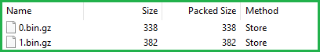

# Esri Indexed 3d Scene Layer (I3S) and Scene Layer Package (*.slpk) Format Specification

Version 1.7. June 30, 2019

*Contributors:* Chris Andrews, Tamrat Belayneh, Jillian Foster, Javier Gutierrez, Markus Lipp, Sud Menon, Pascal M&uuml;ller, Dragan Petrovic, Ronald Poirrier, Simon Reinhard, Juan Ruiz, Johannes Schmid, Ivonne Seler, Chengliang Shan,Thorsten Reitz, Ben Tan, Moxie Zhang

*Acknowledgements:* Bart van Andel, Fabien Dachicourt, Carl Reed

---

The Indexed 3D Scene Layer (I3S) format is an open 3D content delivery format used to rapidly stream and distribute large volumes of 3D GIS data to mobile, web and desktop clients.  I3S content can be shared across enterprise systems using both physical and cloud servers.  ArcGIS Scene Layers and [Scene Services](http://server.arcgis.com/en/server/latest/publish-services/windows/scene-services.htm) use the I3S infrastructure.  See the [version history on the main ReadMe](../README.md) for more details about previous versions and OGC specification compatibility. 

# Table of Contents

[Introduction to Scene Layers](#introduction-to-scene-layers) <br />
[Organization and Structure](#organization-and-structure)  <br />
&emsp;[Indexing Model and Tree Structure](#Indexing-Model-and-Tree-Structure) <br />
&emsp;&emsp;[Node Page Index](#Node-Page-Index)  <br />
&emsp;&emsp;[Node Index for I3S 1.6 and earlier](#Node-Index-for-I3S-1.6-and-earlier)  <br />
&emsp;&emsp;[3D Node Index Document](#3D-Node-Index-Document)  <br />
&emsp;&emsp;[Bounding Volume Hierarchy](#Bounding-Volume-Hierarchy)  <br />
&emsp;[Nodes](#nodes)  <br />
&emsp;&emsp;[Node resources](#Node-resources) <br />
&emsp;&emsp;&emsp;[Geometry](#Geometry) <br />
&emsp;&emsp;&emsp;[Example geometry buffer](#Example_Geometry_Buffer) <br />
&emsp;&emsp;&emsp;[Attributes](#Attributes) <br />
&emsp;&emsp;&emsp;[Textures](#Textures) <br />
&emsp;&emsp;&emsp;[Materials](#Materials) <br />
&emsp;&emsp;[Node resources for I3S 1.6 and earlier](#Node resources for I3S 1.6 and earlier) <br />
&emsp;&emsp;&emsp;[Shared](#Shared) <br />
&emsp;[Statistics](#statistics)<br />
&emsp;[Coordinate Reference Systems](#coordinate-reference-systems)  <br />
&emsp;[Height Models](#height-models) <br />
&emsp;[Level of Detail](#level-of-detail)  <br />
&emsp;&emsp;[Discrete Level of Detail](#discrete-level-of-detail)  <br />
&emsp;&emsp;[Multiple Representations](#multiple-representations) <br /> 
&emsp;&emsp;[Switching Models](#switching-models)  <br />
&emsp;&emsp;[Level of Detail Generation](#level-of-detail-generation)  <br />
&emsp;&emsp;[Selection Metrics](#selection-metrics)  <br />
[I3S services and Packages](#i3s-services-and-scene-layer-packages) <br />
&emsp;&emsp;[REST API](#rest-API)  <br />
&emsp;&emsp;[1.7 SLPK Structure](#1.7-SLPK-Structure)  <br />
&emsp;&emsp;[1.6 SLPK Structure](#1.6-SLPK-Structure)  <br />

# Introduction to Scene Layers

An I3S Scene Layer is a file format which stores 3D geographic data.  Scene Layers provide a structured way for clients to store and visualize large amounts of data.  I3S organizes information using nodes that contain features with geometry, textures and attributes.

 There are several Scene Layer profile types:

* [3D Object](../docs/1.7/3Dobject_ReadMe.md) (e.g. 3D models in various formats)
* [Integrated Mesh](../docs/1.7/IntegratedMesh_ReadMe.md) - An integrated surface that may include vegetation, buildings and roads.
* [Point](../docs/1.6/Point_ReadMe.md) - A collection of point data, like individual trees in a forest.
* [Point Cloud](../docs/2.0/pcsl_ReadMe.md) - A volumetric collection of point data, like lidar data.
* [Building](../docs/1.7/BSL_ReadMe.md) - A building including its components, such as windows, doors, chairs, etc.

I3S is designed to support large 3D content of global extent with containing detailed features. Clients can visualize scene layers takign advantage of the multi-LOD (level of detail) representation and symbology to create the right experience for 3D content. The I3S format continues to evolve adding more functionality. Previous versions of I3S (SLPK) can be converted and validated using the [I3S Converter](../i3s_converter/i3s_converter_ReadMe.md). You can find an overview of [Version History of I3S](../README.md).

I3S is organized in [nodes](#Nodes), which are structured into [node pages](#Node_Page_Index). The node page includes the [bounding volume](#Bounding-Volume-Hierarchy), child reference, count and the [level of detail selection](#Level_of_Detail). Nodes contain all the information to describe features including [geometry](#Geometry), [attributes](#Attributes), [textures](#textures) and [material](#Material). Scene Layers can be created in Cartesian 3D or in global 3D world [coordinate systems](#Coordinate_Reference_Systems). I3S Scene Layers can be delivered to web, mobile and desktop clients. Most users will interact with Scene Layers using applications with cloud or server-based information. In these cases, the scene layer cache is on the server and is provided to clients through a RESTful interface. These web addressable resources provide access to the scene layer, nodes, and associated resources. Alternatively, a scene layer can be delivered as a Scene Layer Package. This is a single file that includes the complete node tree and all necessary resources in an archive. 

# Organization and Structure

## Indexing Model and Tree Structure

Depending on the I3S version, the indexing model can vary. In I3S version 1.7, nodes are indexed using a [node page index](#Node_Page_Index). In I3S version 1.6 and earlier, nodes can be indexed using most common indexing models (e.g. [treekeys](indexing-for-I3S-1.6-and-earlier), quadtrees, R-trees).  Within the indexing scheme, the regions are organized in a [bounding volume hierarchy](##Bounding-Volume-Hierarchy).(#Bounding-Volume-Hierarchy).  The specific indexing scheme is hidden from clients since they only need to load resources.

### Node Page Index

Nodes represent the spatial index of the data as a [bounding-volume hierarchy](#bounding-volume-hierarchy). To reduce the number of requests required to traverse the tree, they are organized into pages. Loading a page of nodes instead of an individual node allows clients to get more data with a single round-trip.  This structure reduces the overall number of round-trips and increases performance.  One node page is considered one resource.

Nodes are stored in a flat array and divided by a fixed size page. Each node references its children using their index in this array. To traverse the tree, clients start by loading the node page that contains the root. Then, clients identify the pages required to access its children within the view. The process is repeated until the desired nodes have been discovered.   

Note that for backward compatibility reasons, the node index must be a **stringified integer**.   This index must be unique and is used for identification only.  It has no other semantic meaning in I3S. 

For more details regarding 3D Objects and Integrated Mesh in 1.7, see [nodePages](../docs/1.7/nodePageDefinition.cmn.md).

For more details regarding Point Cloud in 2.0, see [nodePages](../docs/2.0/nodePageDefinition.pcsl.md).

**Access node page from REST API** <br />

<table>
<tr>
    <td>Type</td>
    <td>JSON</td>
</tr>
<tr>
    <td>URL Templace</td>
    <td>`http://serviceURL/layers/{layerID}/nodepages/{nodePageID}/`</td>
</tr>
<tr>
    <td>Example</td>
    <td>http://my.server.com/3DObjectSceneLayer/SceneServer/layers/0/nodepages/8</td>
</tr>
<tr>
    <td>Description</td>
    <td>`layerID`: Integer. ID of the associated layer. Esri products expect this to be `0`. `nodePageID`: Integer. ID of the associated node page.</td>
</tr>
</table>


### Node Index for I3S 1.6 and earlier

Prior to the introduction of node paging, any indexing scheme can be used for I3S version 1.6 and earlier.  This is a brief example for "treekeys". 

The treekey format is loosely modeled on binary search trees. The key value indicates the level and sibling association of a given node.  Since the key directly indicates the position of the node in the tree, it allows the nodes to be sorted in a single dimension.  Treekeys are stringified integers.

Treekeys contain levels which are separated by dashes.  The root node is at level 1 and should always be indicated by the ID `root`.


*A sample index tree using Treekeys.*

#### 3D Node Index Document

The [3D Node Index Document](../docs/1.7/3DNodeIndexDocument.cmn.md) is used in I3S version 1.6 and earlier. For backward compatability with older clients this document needs to be included in 1.7 as well. This JSON resource describes the nodes, its index, and information about other sub-resources. These resources include the bounding-volume information, LoD selection criteria, and parent-child relationships, which allows for paging or tree traversal without the need to access the more voluminous content within a node.

**Access 3D Node Index Document from REST API**

<table>
<tr>
    <td>Type</td>
    <td>JSON</td>
</tr>
<tr>
    <td>URL Templace</td>
    <td>http://serviceURL/layers/{layerID}/nodes/{resourceID}</td>
</tr>
<tr>
    <td>Example</td>
    <td>http://my.server.com/3DObjectSceneLayer/SceneServer/layers/0/nodes/98</td>
</tr>
<tr>
    <td>Description</td>
    <td>Description of the node. layerID: Integer. ID of the associated layer. Esri clients expect this to be `0`. resourceID: Integer. ID of the associated resource.</td>
</tr>
</table>

### Bounding Volume Hierarchy

Within the node structure all nodes belong to a bounding volume. When zooming into a scene layer the bounding volume exceeds the maxScreenThreshold and the client switches to the next higher LoD (Level of Detail) by loading the children nodes belonging to the next bounding volume. The root node contains the entiry bounding volume of the layer.

The meshpyramid profile supports the bounding volume in either minimum bounding sphere (MBS) or oriented bounding box (OBB) representation. OBB is the more optimal representation and implementers are encouraged to output node bounding volume in OBB format. Point cloud profile supports OBB representation only.

For more details regarding the two types of bounding volumes see [minimum bounding box](../docs/1.7/mbs.cmn.md) and [oriented bounding box](../docs/1.7/obb.cmn.md) sections.

## Nodes 

In a Scene Layer, the spatial extent of the data is split into regions called *nodes*.  The nodes contain resources like texture, geometry, and attribute information for the region.  Each node has a unique index, which allows clients to efficiently locate and load the resources. 

### Node resources

Nodes have different resources describing its elements. Depending on the profile type a different set of resources are needed to describe the node. For example, only point and 3D object scene layers include attributes.

Note: All binary data is stored in little endian. 

Features, attributes, and geometry are bundled.  This balances the node size, which helps optimize network transfer and client-side reactivity. 

Each set of features and geometries contains all the data elements to render a complete feature.  In order to avoid dependency on the features, the geometries are available as a separate binary resource. The geometry data includes all vertex attributes, feature counts, and mesh segmentation.    

A node's bounding-volume determines if a node is within the current 3D view. If a node is in view, then the client determines the level of detail to display based on the view parameters, the node's bounding volume, and the [level of detail selection metrics](../docs/1.7/lodSelection.cmn.md).  Nodes are loaded according to their indexing model.

A node may contain the following resources.

#### Geometry

All Scene Layer types make use of the same fundamental set of geometry types: points and triangles.

The Array Buffer View controls geometry storage and consumption representation. The binary geometry attribute file follows the <a href="http://www.khronos.org/registry/typedarray/specs/latest/">Khronos Typed Array
specification</a> in the Editor's Draft version of 10<sup>th</sup> April 2013. For example, the Array Buffer View can require per-vertex layout of components.  This orders the vertex position, normal and texture coordinates to ensure the same pattern across the scene layer.

The expected triangle/face winding order in all geometry resources is counterclockwise.

If normal vectors are present in a geometry, they need to be calculated based on uniform axis units. They are always given as if x, y and z axes all had metric units, as a unit vector. This means that if WGS84 is used as a horizontal Coordinate Reference System, the normal calculation cannot directly use the face's WGS84 coordinates, but needs to convert them to a local Cartesian Coordinate Reference System first.


Both 3D Object and Integrated Mesh layer types model geometries as triangle meshes using the meshpyramid profile. The meshpyramid profile uses the triangles geometry type to store triangle meshes.  

Point and Point cloud layers model geometries as points. 

For more details regarding Integrated Mesh and 3D objects in 1.7, see the [geometryDefinition](../docs/1.7/geometryDefinition.cmn.md).

For more details regarding point cloud scene layer, see [defaultGeometryShema](../docs/2.0/defaultGeometrySchema.pcsl.md).

**Access geometry from REST API**
<table>
<tr>
    <td>Type</td>
    <td>bin, draco</td>
</tr>
<tr>
    <td>URL Templace</td>
    <td>http://serviceURL/layers/{layerID}/nodes/{resourceID}/geometries/{geometry ID}</td>
</tr>
<tr>
    <td>Example</td>
    <td>http://my.server.com/3DObjectSceneLayer/SceneServer/layers/0/nodes/98/geometries/1 </td>
</tr>
<tr>
    <td>Description</td>
    <td>The geometry resource (mesh information). layerID: Integer. ID of the associated layer. Esri products expect this to be `0`. resourceID: Integer. ID of the associated node.
geometryID: Integer. This ID returns one of the geometries available for this node. The same geometry may be available in a different format. </td>
</tr>
</table>

##### Example geometry buffer

The Khronos Typed Array specification defines an ArrayBuffer type, representing a generic fixed-length binary buffer. It is not possible to manipulate the contents of an ArrayBuffer directly. Instead, a group of types are used to create views of the ArrayBuffer. For example, to access the buffer as an array of 32-bit signed integers, an Int32Array would be created that refers to the ArrayBuffer.  
>Multiple typed array views can refer to the same ArrayBuffer, of different types, lengths, and offsets. This allows for complex data structures to be built up in the ArrayBuffer. For example:

```
// create an 8-byte ArrayBuffer
var b = new ArrayBuffer(8);
// create a view v1 referring to b, of type Int32, starting at
// the default byte index (0) and extending until the end of the buffer
var v1 = new Int32Array(b);

// create a view v2 referring to b, of type Uint8, starting at
// byte index 2 and extending until the end of the buffer
var v2 = new Uint8Array(b, 2);

// create a view v3 referring to b, of type Int16, starting at
// byte index 2 and having a length of 2
var v3 = new Int16Array(b, 2, 2);
```

>This defines an 8-byte buffer b, and three views of that buffer, v1, v2, and v3. Each of the views refers to the same buffer -- so v1[0] refers to bytes 0..3 as a signed 32-bit integer, v2[0]
refers to byte 2 as a unsigned 8-bit integer, and v3[0] refers to bytes 2..3 as a signed 16-bit integer. Any modification to one view is immediately visible in the other: for example, after v2[0] = 0xff; v2[1] = 0xff; then v3[0] == -1 (where -1 is represented as 0xffff).

<div>

<p><em>Geometry Buffer Layout with headers</em></p>
</div>

#### Attributes

Attribute data for all features in a node are stored and available as discrete, per field resource called *attribute*. The number of attribute resources corresponds to the number of fields in the scene cache.  

Attributes values are stored in the attribute resource in the same order as feature geometries are in the geometry resource. This allows clients to render each node efficiently through direct array access instead of object-id based attribute lookups.  

When access to the object-id is needed, the _attribute_ resource represents the object-id field stores the object-id values of each feature within the node.  This facilitates object-id based access. Clients can also build an object-id to array-index dictionary for cases where large numbers of object-id based attribute or geometry look ups within a node are needed.

When the same feature is included in more than one node at different levels of detail, the corresponding attributes for the feature are included as attribute resources in each node. This redundancy in attribute storage allows each node to be rendered independently of any other node.  

Metadata on each _attribute_ resource is made available to clients via the scene service layer. When attributes are present within the scene cache, the resourcePattern array in the layers store will include a value called attributes.  The attributes value indicates that attributes are a required resource, utilized for attribute driven symbolization and rendering. In addition to the resourcePattern, additional metadata in the fields array and attributeStorageInfo array further describe each attribute resource.  

These metadata allow clients to initialize and allocate any required client-side resources prior to accessing any attributes of interest.  

<div>

<p>An example of the fields array (layers[id].fields[id]) resource of a scene service layer illustrating different supported types of feature attribute fields. The fields array describes an attribute field with respect to its name, type and alias.</p>
</div>
Clients can use the key property (layers[id].attributeStorageInfo[].key) of the attributeStorageInfo to uniquely identify and request the attribute resource through a RESTful API, called attributes. Clients use the attributeStorageInfo metadata to decode the retrieved attribute binary content.

The attribute resource header contains:

- A header section of 4 bytes with the count of features. The count value is present in all attribute resources.  For attributes with string resources, header has an additional 4 bytes indicating the total byte count of the string attribute values.
- For all numerical field types, the header section is followed by the attribute values array record. The attribute values must always begin at an offset that is divisible by the byte length of a single value. If the header does not end at such an offset, the necessary amount of padding is inserted between the header and the attribute values.
- For string field types, the header section is followed by a fixed length array whose values are the byte counts of each string data, inclusive of the null termination character. This array is then followed by an array of actual string data. The strings are stored null terminated.

A client will be able to find the URI of any attribute resource through its reference from the attributeData array of the Node Index Document (similar access patterns exist for resources such as 'features', 'geometries', etc.). See the figure below:  

<div>

<p>A node resource document illustrating attribute data content access urls (href).</p>
</div>

I3S supports two ways to access attribute data.  They can be accessed through:

1. Paired services with RESTful endpoints.
   - Enables direct access to source data.
   - The query uses the unique feature ID key.
2. Fully cached attribute information within the I3S store.
   - Binary storage representation, which provides a significant performance benefit.

Clients can use either method if the attributes are cached. The attribute values are stored as a geometry aligned, per field, key-value pair arrays.  

For more details regarding point cloud scene layer, see [AttributeInfo](../docs/2.0/attributeInfo.pcsl.md).

For more details on all other scene layer types, see [Attribute](../docs/1.7/attributeStorageInfo.cmn.md).

**Access attribute from REST API**
<table>
<tr>
    <td>Type</td>
    <td>bin</td>
</tr>
<tr>
    <td>URL Templace</td>
    <td>http://serviceURL/layers/{layerID}/nodes/{resourceID}/attributes/f_{attributeID}/0</td>
</tr>
<tr>
    <td>Example</td>
    <td>http://my.server.com/3DObjectSceneLayer/SceneServer/layers/0/nodes/2/attributes/f_48/0  </td>
</tr>
<tr>
    <td>Description</td>
    <td>The value for a specific  attribute within a node. layerID: Integer. ID of the associated layer. Esri products expect this to be `0`. attributeID: Integer.  ID of the specific attribute for the layer. </td>
</tr>
</table>

#### Textures

The texture resource contains texture image files.  Textures are stored as a binary resource within a node.  I3S supports the image formats JPEG and PNG, as well as compressed texture formats S3TC and ETC2.  The authoring application needs to provide the appropriate texture encoding declaration, using MIME types such as “image/jpeg” (for JPEG) and “image/vnd-ms.dds” (for S3TC).   Textures should be in RGBA format. The integrated mesh and 3D object profile types support textures.  

The textures file is a binary resource that contains images to be used as textures for the features in the node.  A single texture file contains 1 to n textures for a single specific texture level of detail. It can contain a single texture or multiple individual textures, as part of a texture atlas.  

Textures are expected in the following formats: 0_0.jpg for JPEG, 0.bin for PNG, 0_0_1.dds for S3TC, and 0_0_2.ktx for ETC2. The texture resource must include either a JPEG or PNG texture file for proper drawing.

In 1.6, the size property will give you the width of a texture. In 1.7, the texelCountHint can be used to determine the cost of loading a node as well as for use in texel-resolution based LOD switching. Compressed textures such as S3TC and ETC may contain mipmaps. When compressing textures with mipmaps,  the texture dimensions must 2^n sized and the smallest size allowed is 4x4.  

The number and volume of textures tends to be the limiting display factor, especially for web and mobile clients.  The format used depends on the use case. For example, a client might choose to consume JPEG in low bandwidth conditions since they are efficient to transmit and widely used. Clients constrained for memory or computing resources might choose to directly consume compressed textures for performance reasons.

For more details, see the [Textures](../docs/1.7/texture.cmn.md) section or in 1.7, see the [textureSetDefinition](../docs/1.7/textureSetDefinition.cmn.md).  

**Atlas Usage and Regions**

Individual textures should be aggregated into texture atlases (e.g. 2048 x 2048 px). A node can only have one texture. Each individual texture becomes a subtexture.  As with all texture resources, the atlas has to be 2^n sized on both dimensions, where n ranges from 3 until 12.  Width and height do not need to be equal.  Subtextures also need to be 2^n sized with n in range from 3 until 12.  Subtextures with other dimensions can cause border artifacts when filtering or MIP-mapping.  A subtexture can be padded to the nearest greater 2^n size by interpolating or scaling pixels.

Subtexture pixels are identified by the subimageRegion attribute: [umin, vmin, umax, vmax].  Region information is passed to the shader using a separate vertex attribute, which converts a UV vertex coordinate to a UVR coordinate.  R encodes the [umin, vmin, umax, vmax] attribute values into 4 UInt16 values.

**Texture Coordinates**

Client capabilities for handling complex UV cases vary widely, so texture coordinates are used. Texture coordinates do not take atlas regions into account directly. They range from 0 to 1 in U and V, except when using the 'repeat' wrapping mode.  In repeat mode, U and V  range from 0 to n, where n is the number of repeats. Repeating textures may repeat vertically, horizontally, or both. The client is expected to use the sub-image region values and the texture coordinates to best handle repeating textures in atlases.

**Access textures from REST API**
<table>
<tr>
    <td>Type</td>
    <td>JPG, PNG, DDS, KTX </td>
</tr>
<tr>
    <td>URL Templace</td>
    <td>http://serviceURL/layers/{layerID}/nodes/{resourceID}/textures/{texture ID}</td>
</tr>
<tr>
    <td>Example</td>
    <td>http://my.server.com/3DObjectSceneLayer/SceneServer/layers/0/nodes/98/textures/1  </td>
</tr>
<tr>
    <td>Description</td>
    <td>The texture resource (image). layerID: Integer. ID of the associated layer. Esri products expect this to be `0`. resourceID: Integer. ID of the associated node. textureID: String. This ID returns one of the textures available for this node. The same texture may be available in different formats.</td>
</tr>
</table>

#### Materials

A scene layer can have multiple materials defined, which are physically based materials that are feature-compatible with glTF materials.  

For more details regarding Integrated Mesh and 3D objects in 1.7, see the [material definition](../docs/1.7/materialDefinitions.cmn.md).

### Node resources for I3S 1.6 and earlier

To assure backward compatibility with 1.6 clients a scene layers needs to have the Node index document as well as the shared resources available.

#### Shared resources

Shared resource includes the material definition of the node. 

**Access shared resources from REST API**
<table>
<tr>
    <td>Type</td>
    <td>JSON</td>
</tr>
<tr>
    <td>URL Templace</td>
    <td>http://serviceURL/layers/{layerID}/nodes/{resourceID}/shared</td>
</tr>
<tr>
    <td>Example</td>
    <td>http://my.server.com/3DObjectSceneLayer/SceneServer/layers/0/nodes/98/shared  </td>
</tr>
<tr>
    <td>Description</td>
    <td>Legacy texture and material description. **Not used in 1.7.**. layerID: Integer. ID of the associated layer. ArcGIS clients expect this to be `0`. resourceID: Integer. ID of the associated node.  </td>
</tr>
</table>

## Statistics
Statistics are used by clients to define symbology without having to read all data. For example, if you want to define a unique value symbology, statistics are used to collect all unique values within the layer and calculate the number features that are included in a unique value. Beside symbology, statistics are also used to filter data.   

**Access statistics from REST API**
<table>
<tr>
    <td>Type</td>
    <td>JSON</td>
</tr>
<tr>
    <td>URL Templace</td>
    <td>http://serviceURL/layers/{layerID}/statistics/f_{attributeID}/0</td>
</tr>
<tr>
    <td>Example</td>
    <td>http://my.server.com/3DObjectSceneLayer/SceneServer/layers/0/statistics/f_48/0  </td>
</tr>
<tr>
    <td>Description</td>
    <td>The statistics for the entire layer for a specific attribute. layerID: Integer. ID of the associated layer. Esri products expect this to be `0`. attributeID: Integer.  ID of the specific attribute for the layer. </td>
</tr>
</table>

## Coordinate Reference Systems

The I3S specification supports specifying the Coordinate Reference System (CRS) as a Well Known Text, as defined in clause 6.4 in OGC Simple Features [99-036/ISO 19125](http://portal.opengeospatial.org/files/?artifact_id=13227) standard. I3S also supports specifying CRS in the WKT standard [CRS/ISO 19162:2015](http://docs.opengeospatial.org/is/12-063r5/12-063r5.html), Geographic information – Well-known text representation of coordinate reference systems, which provided an update to the original WKT representation. The two standards are referred to as WKT1 and WKT2 respectively.

In I3S implementation the CRS may be represented using either WKT1 or WKT2. While WKT1 has been in use for many years, WKT1 has been superseded by WKT2. Although implementations of OGC standards using WKT2 are not yet widely available the guidance from the OGC/ISO community is to implement WKT2. 

WKT1 does not support explicit definition of axis order.
Therefore, I3S implementers need to note for their implementations if they support WKT1 only or both (as WKT2 requires continued support of WKT1). In addition, please note that not all ArcGIS clients support WKT2 yet.  

The Coordinate Reference System (CRS) of the Indexed 3D Scene Layer should be selected with the following considerations:

- Minimize the need for re-projection on the client side
- Render in both geographic and projected coordinate reference systems
- Support data with a global extent
- Support local and global data with high positional accuracy

All I3S profiles support writing 3D content in two modes: *global* and *local*. In global mode, only the geographic CRS WGS84 ,as identified by its EPSG code 4326 and GCS China Geodetic Coordinate System 2000, as identified by its EPSG 4490 is supported for both index and vertex positions. It is represented using longitude, latitude and elevation. In local mode, all other geodetic CRS, including projected coordinate systems, are allowed.

In both modes, node index and position vertex must have the same CRS. In addition, all vertex positions are specified as an *offset* from a node's Minimum Bounding Volume (MBV) center. The MBV could be specified as a Minimum Bounding Sphere (MBS) or as an Oriented Bounding Box (OBB).

As a result, for an I3S layer to be in a *global* mode the following requirements must be met:

The location of all vertex positions and index-related data structures, such as the nodes minimum bounding volume, are specified using the geographic CRS WGS84 or CGCS 2000, where:

- The only supported CRS in this mode is EPSG code, 4326 and 4490.
- X and Y coordinate bounds of the layer and XY components of the vertex position are specified in decimal degrees.
- Elevation (the z component of the vertex position) is specified in meters.
- The Minimum Bounding Volume (MBV) radius unit (for MBS) or halfSize unit (for OBB) is specified in meters.

For an I3S layer to be in a *local* mode the following requirements must be met:

All vertex positions are specified using geodetic CRS, identified by an EPSG code. Any CRS with an EPSG code *other* than 4326 or 4490 will be treated as in a local mode. 

- All three components of a vertex position (XYZ) and the Minimum Bounding Volume (MBV) radius (for MBS) or halfSize (for OBB) need to be in the same unit.

All I3S layers indicate the coordinate system used by the layer with the spatialReference property in the [3dSceneLayer](../docs/1.6/3DSceneLayer.cmn.md) resource. This property is normative.

The [spatial reference](../docs/1.6/spatialReference.cmn.md) object is common to all i3s profile types.

## Height Models

The I3S standard allows either ellipsoidal or gravity-related vertical coordinate systems. This allows I3S to be applied across a diverse range of fields and applications.

At version 1.5, I3S added support for vertical coordinate systems. The Well known Text (WKT) representation of the Coordinate Reference System now includes the vertical coordinate system used by the layer. The [spatial reference](../docs/1.6/spatialReference.cmn.md) object also includes a Well-known ID (WKID) and a Vertical Coordinate System Well-known ID (VcsWKID).  The client can consume any of these properties to designate the height model.

The heightModelInfo, included in the 3DSceneLayerInfo resource, is used by clients to determine if the layer's height model is orthometric or gravity-related.

For more details, see the [3DSceneLayerInfo-common](../docs/1.6/3DSceneLayer.cmn.md), [3DSceneLayerInfo-point](../docs/1.6/3DSceneLayer.psl.md) and [heightModelInfo](../docs/1.6/heightModelInfo.cmn.md) pages.

## Level of Detail

Scene Layers include Levels of Detail (LoD) that apply to the whole layer and serve to generalize the layer. They are similar to image pyramids or raster vector tiling schemes. A node in the I3S scene layer tree could be considered the analog of a tile in a raster or vector tiling scheme. Scene Layers support Levels of Detail in a manner that preserves the identity of the individual features that are retained within any level of detail. Levels of Detail can be used to split heavy features, thin or cluster for better visuals, and integrate externally authored multiple LOD files.

Note that the I3S Level of Detail concept is orthogonal to the concept of consolidated storage (batches) for a set of geometries within a level of detail. Batching  of geometries into larger geometry collection assists in optimal rendering. Geometry Array Buffers can be used to provide access to the individual geometries when needed, preserving the feature to geometry element mapping within the consolidated geometries.

### Discrete Level of Detail

Discrete Levels of Detail provide multiple models to display the same object.  A specific detail level is bound to certain levels of the index tree. Leaf nodes typically contain the original feature representation with the most detail.  The closer a node is to the root (in the BVH tree), the lower the level of detail. The detail is reduced by texture down-sampling, feature reduction/generalization, mesh reduction/generalization, clustering or thinning in order to ensure inner nodes have a balanced weight. The number of discrete Levels of Detail for the layer corresponds to the number of levels in the index tree.

By using only information found in the node index document, such as bounding volume and level of detail selection metrics, a client traversing an I3S tree can readily decide if it needs to:

- Stop traversal to the node's children if the current node bounding volume is not visible.
- Use the data in the node if the quality is appropriate, and then stop traversal to children.
- Continue traversal until nodes with higher quality are found.

I3S supports multiple level of detail selection metrics and switching level of detail models.  Details about the level of detail generation process can be optionally included in the Scene Layer's metadata.

### Multiple Representations

I3S Layers can be used to represent input data that already have multiple, semantically authored, levels of detail. The most common method is to represent each  semantically authored input level of detail as its own I3S Layer with visibility thresholds. The thresholds capture the range of distances for which the layer should be used.

A set of I3S Layers that represent a single level of detail can be grouped within the same I3S service. For each layer within the set, the features in the leaf nodes represent the modeled features at the level of detail of the input data. Additional levels of detail can be generated automatically by extending the viewing range of each input level.

Tools can also be developed to load a semantically authored levels of detail input data into a single I3S layer. In this case, the depth of the I3S index tree is fixed to the number of levels of detail present in the input data. Feature identities and geometries in each node are set based upon the input data.

### Switching Models

Node switching lets clients focus on the display of a node as a whole.  A node switch occurs when the content from a node's children is used to replace the content of an existing node.  This can include features, geometry, attributes and textures. Node switching can be helpful when the user needs to see more detailed information.

Each interior node in the I3S tree has a set of features that represent the reduced level of detail.  This includes the details for all features covered by the node.  Due to generalization at lower Levels of Detail, not all features are present in reduced level of detail nodes.

The feature IDs link the reduced level of detail feature and an interior node, as well as the descendant nodes.  Applications can determine the visual quality by using the I3S tree to display all of the features in an internal node or use the features found in its descendants.

### Level of Detail Generation

Integrated Mesh layer types typically come with pre-authored Levels of Detail.  If the desired level of detail does not exist, it can be generated.

For example, 3D Object Layers based on the meshpyramids profile can create a level of detail pyramid for all features based on generalizing, reducing and fusing the geometries of individual features while preserving feature identity. The same approach can also be used with Integrated Mesh Layers based on the meshpyramid profile.  In this case, there are no features, and each node contains a generalized version of the mesh covered by its descendants.

The bounding volume hierarchy tree is built based on the spatial distribution of the features.  The method used to create the levels depends on the Scene Layer type.

| &nbsp;         |Integrated Mesh  | 3D Object                    | Points                       | Point Clouds                 | Building Scene Layer         |
| -------------- | ----------------|---------------------------- | ---------------------------- | ---------------------------- | ---------------------------- |
| meshpyramids   |  | | &nbsp;                       | &nbsp;                       |  |
| Thinning       |  | |  |  |  |
| Clustering     |  | |  |  |  |
| Generalization |  | | &nbsp;                       | &nbsp;                       |  |

*Example Level of Detail generation methods based on Scene Layer type*

### Selection Metrics

Selection metrics help clients determine which level of detail to render.  For example, clients need to weigh the options of screen size, resolution, bandwidth, and memory to reach the target quality.  

For more details regarding Integrated Mesh, 3D objects and point scene layer, see the [Level of Detail Selection](../docs/1.7/lodSelection.cmn.md).

# I3S services and Packages

### REST API 

I3S is a REST API.  Each scene layer profile has different components and features.  For details on a specific profile and version, refer to the individual README documents. 

Version 1.7 support for [3D Objects](../docs/1.7/3Dobjects_ReadMe.md), [Integrated Mesh](../docs/1.7/IntegratedMesh_ReadMe.md) and [Building](../docs/1.7/BSL_ReadMe.md).

Version 1.6 support for [3D Objects](../docs/1.6/3Dobjects_ReadMe.md), [Integrated Mesh](../docs/1.6/IntegratedMesh_ReadMe.md), [Building](../docs/1.6/BSL_ReadMe.md), and [Point](../docs/1.6/Point_ReadMe.md).

Version 2.0 support for [Point Cloud](../docs/2.0/pcsl_ReadMe.md).

The following examples are included to provide a structural overview. 

**REST API 1.7: 3D Object Example**

```
.<host>/SceneServer/layers
	+--0 // Scene Layer Document
	+-- nodePages
	|  +-- 0
	|  +-- (...)
	+-- nodes
	|  +--0
	|  |  +-- attributes
	|  |  |  +--f_2
	|  |  |  +--f_4
	|  |  |  +--(...)
	|  |  +-- geometries
	|  |  |  +-- 0
	|  |  |  +-- 1
	|  |  |  +--(...)
	|  |  +-- textures
	|  |  |  +-- 0
	|  |  |  +-- 0_0_1
	|  |  |  +--(...)
	|  |  +-- shared 
	|  |  (...) 
	+--statistics
	|  +-- f_2
	|  +-- f_4
	|  +-- (...)
```


**REST API 1.6: 3D Object Example**

```
.<host>/SceneServer/layers
	+--0 // scene layer document
	+-- nodes
	|  +--0
	|  |  +-- attributes
	|  |  |  +--f_2
	|  |  |  +--f_4
	|  |  |  +--(...)
	|  |  +-- geometries
	|  |  |  +-- 0
	|  |  +-- textures
	|  |  |  +-- 0
	|  |  |  +-- 0_0_1
	|  |  |  +--(...)
	|  |  +-- shared 
	|  |  (...) 
	+--statistics
	|  +-- f_2
	|  |  | +--0
	|  +-- f_4
	|  |  | +--0
	|  +-- (...)
```

### Scene Layer Packages

Scene Layer Packages (SLPK) consolidate an I3S layer into a single file.  It is designed to be directly consumed by applications.

An SLPK is a [zip](https://en.wikipedia.org/wiki/Zip_(file_format)) archive containing compressed files and resources.  The archiving method for SLPK is `STORE`, meaning that the archive itself is not compressed.  The individual resources within the SLPK may be compressed.  Resource compression is recommended but not required.

Both 64-bit and 32-bit zip archives are supported.  64-bit is required for data larger than 2GB.

Please note that this method is slightly different than a typical zip archive.  In general, when a file is added to a zip archive, the new file is individually compressed and the overall archive is compressed. **That is not the case for SLPK.**  When adding files to an SLPK, the new file is compressed, but the overall archive remains uncompressed and is archived using `STORE`. 

This is an example of a geometry resource opened in 7-zip.  Notice that both the Size and the Packaged Size are equal.  The method is `STORE`.

 *Compressed geometry resource with size and method.*

**Resource Compression** 

Resources may be individually compressed before they are added to the archive. Compression is not mandatory, but recommended for resource types that would benefit from additional compression. In the case of an SLPK, all resources should be compressed except for PNG and JPG.  

`GZIP` is the only supported compression scheme.

**File Extensions**

SLPK require file extensions to determine the file type.  In a scene service, no file extensions are needed because the are provided by the http protocol request. 

Here are a few examples of SLPK file extensions:

- .jpg
- .bin (PNG)
- .bin.dds
- .json

These file types can be compressed with `GZIP`, which includes the previous extension followed by `.gz`.  For example, `.json.gz`.

**Hash**

In 1.7, an M5D [hash](../docs/1.7/slpk_hashtable.cmn.md) is used to improve loading time.  The hash must be the last item at the end of the central directory and named `@specialIndexFileHASH128@`.  


#### 1.7 SLPK Structure

**Example 1.7 SLPK Structure Summary for 3D Objects**

```
.\example_17.slpk
	+--nodePages
	|  +--0.json.gz
	|  +-- (...)
	+--nodes
	|  +--root
	|  |  +--3dNodeIndexDocument.json.gz
	|  +--0
	|  |  +--attributes
	|  |  |  +--f_0
	|  |  |  |  +--0.bin.gz
	|  |  |  +--(...)
	|  |  +--features
	|  |  |  +-- 0.json.gz
	|  |  |  +--(...)
	|  |  +--geometries
	|  |  |  +-- 0.bin.gz
	|  |  |  +--(...)
	|  |  +--textures
	|  |  |  +--0.jpg
	|  |  |  +--0_0_1.bin.dds.gz
	|  |  |  +--(...)
	|  |  +--shared 
	|  |  |  +--sharedResource.json.gz
	|  |  + 3dNodeIndexDocument.json.gz
	|  +--(...)
	+--statistics
	|  +--f_1
	|  |  +--0.json.gz
	|  +--(...)
	+--3dSceneLayer.json.gz
	+--@specialIndexFileHASH128@
```

The central directory includes: 

- A folder "nodepages" that contains the [node pages](../docs/1.7/nodePageDefinition.cmn.md)
- A folder "nodes" that contains the [node](../docs/1.7/nodePageDefinition.cmn.md) resources
- A folder "statistics" that contains the [statistical](../docs/1.7/statsInfo.cmn.md) summary of the nodes
- A *3dSceneLayer.json.gz* file that defines the [Scene Layer](../docs/1.7/3DSceneLayer.cmn.md)
- An MD5 [hash](../docs/1.7/slpk_hashtable.cmn.md) to improve loading time

The nodepages folder contains the list of nodes in each page.  Nodes are stored fixed-size pages in contiguously in a flat array. The nodes folder contains the full list of nodes.  

Each node contains its own resources including [attributes](../docs/1.7/attributeStorageInfo.cmn.md), [features](../docs/1.7/featureAttribute.cmn.md), [geometries](../docs/1.7/geometryAttribute.cmn.md), [shared resources](../docs/1.7/sharedResource.cmn.md), [textures](../docs/1.7/texture.cmn.md), and a [3DNodeIndexDocument](../docs/1.7/3DNodeIndexDocument.cmn.md).  The shared resources are included for backwards compatibility with 1.6 and are not used in 1.7.


Each resource can be individually compressed with `GZIP`.

#### 1.6 SLPK Structure

**Example 1.6 Structure Summary for 3D Objects**

```
.\example_16.slpk
	+--nodes
	|  +--root
	|  |  +--3dNodeIndexDocument.json.gz
	|  +--0
	|  |  +--attributes
	|  |  |  +--f_0
	|  |  |  |  +--0.bin.gz
	|  |  |  +--(...)
	|  |  +--features
	|  |  |  +--0.json.gz
	|  |  |  +--(...)
	|  |  +--geometries
	|  |  |  +--0.bin.gz
	|  |  |  +--(...)
	|  |  +--textures
	|  |  |  +--0.jpg
	|  |  |  +--0_0_1.bin.dds.gz
	|  |  |  +--(...)
	|  |  +--shared 
	|  |  |  +--sharedResource.json.gz
	|  |  +--3dNodeIndexDocument.json.gz
	|  +--0-0
	|  |  +--(...)
	|  +--0-0-0
	|  |  +--(...)
	|  +--1 
	|  |  +--(...)
	|  +--1-0
	|  |  +--(...)
	|  +--1-0-0
	|  |  +--(...)
	|  +--(...)
	+--statistics
	|  +--f_1
	|  |  +--0.json.gz
	|  +-- (...)
	+--3dSceneLayer.json.gz
	+--metadata.json
```

The central directory includes:

- A folder "nodes" that contains all [node](../docs/1.6/nodeReference.cmn.md) resources
- A folder "statistics" that includes a [statistical](../docs/1.6/statisticsInfo.cmn.md) summary of the nodes
- A *3dSceneLayer.json.gz* file that defines the [Scene Layer](../docs/1.6/3DSceneLayer.cmn.md)
- A *metadata.json* file that describes the content of the SLPK

The *nodes* folder contains each node in a folder in a tree structure. 

Each node contains its own resources including [attributes](../docs/1.6/attributeStorageInfo.cmn.md), [features](../docs/1.6/featureData.cmn.md), [geometries](../docs/1.6/geometryAttribute.cmn.md), [shared resources](../docs/1.6/sharedResource.cmn.md), [textures](../docs/1.6/texture.cmn.md), and a [3DNodeIndexDocument](../docs/1.6/3DNodeIndexDocument.cmn.md).

Each resource can be individually compressed with `GZIP`.


