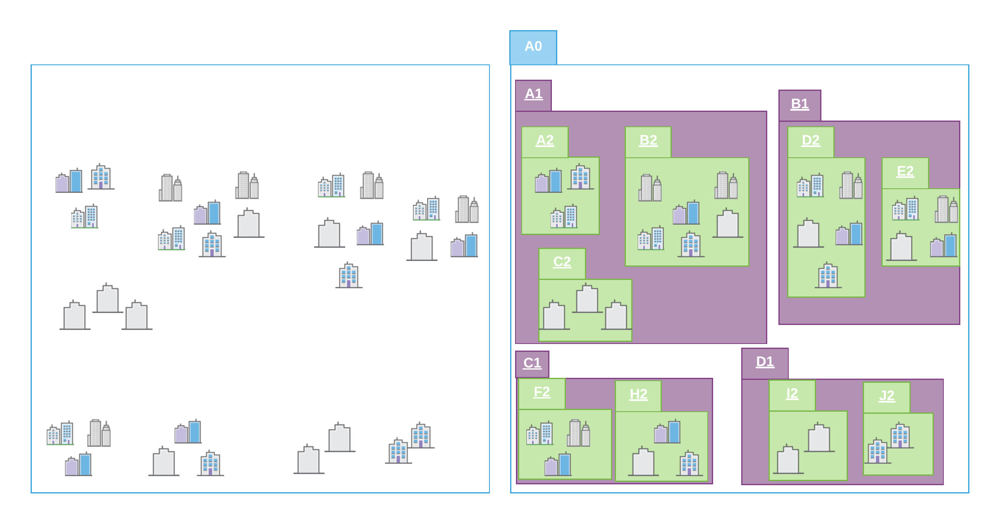
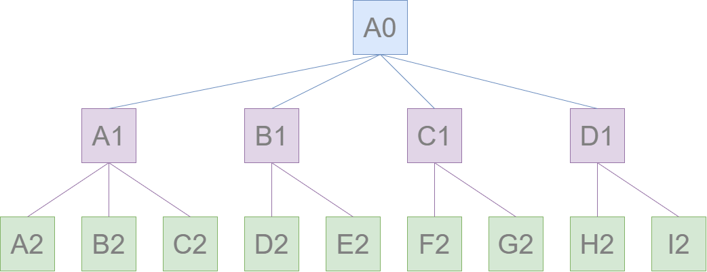
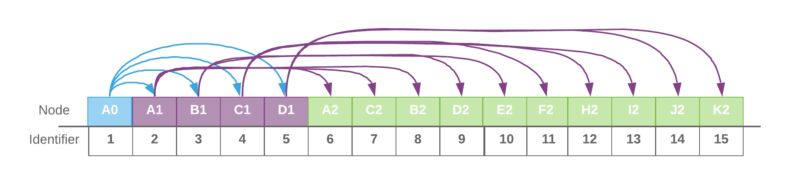

# Esri Indexed 3d Scene Layer (I3S) and Scene Layer Package (*.slpk) Format Specification

Version 1.7. June 30, 2019

*Contributors:* Chris Andrews, Tamrat Belayneh, Jillian Foster, Javier Gutierrez, Markus Lipp, Sud Menon, Pascal M&uuml;ller, Dragan Petrovic, Ronald Poirrier, Simon Reinhard, Juan Ruiz, Johannes Schmid, Ivonne Seler, Chengliang Shan,Thorsten Reitz, Ben Tan, Moxie Zhang

*Acknowledgements:* Bart van Andel, Fabien Dachicourt, Carl Reed

---

The Indexed 3D Scene Layer (I3S) format is an open 3D content delivery format used to rapidly stream and distribute large volumes of 3D GIS data to mobile, web and desktop clients.  I3S content can be shared across enterprise systems using both physical and cloud servers.  ArcGIS Scene Layers and [Scene Services](http://server.arcgis.com/en/server/latest/publish-services/windows/scene-services.htm) use the I3S infrastructure.  See the [version history on the main ReadMe](../README.md) for more details about previous versions and OGC specification compatibility. 

# Table of Contents

[Introduction to Scene Layers](#introduction-to-scene-layers) <br />
[Organization and Structure](#organization-and-structure)  <br />
&emsp;[Tree Structure](#Tree-Structure) <br />
&emsp;&emsp;[Nodes](#Nodes)  <br />
&emsp;&emsp;&emsp;[Node resources](#Node-resources) <br />
&emsp;&emsp;&emsp;&emsp;[Feature](#Feature) <br />
&emsp;&emsp;&emsp;&emsp;[Geometry buffer](#Geometry-buffer) <br />
&emsp;&emsp;&emsp;&emsp;[Attributes](#Attributes) <br />
&emsp;&emsp;&emsp;&emsp;[Textures](#Textures) <br />
&emsp;&emsp;&emsp;&emsp;[Materials](#Materials) <br />
&emsp;&emsp;&emsp;&emsp;[Node resources for I3S 1.6 and earlier](#Node-resources-for-I3S-1.6-and-earlier) <br />
&emsp;[Statistics](#statistics)<br />
&emsp;[Coordinate Reference Systems](#coordinate-reference-systems)  <br />
&emsp;[Height Models](#height-models) <br />
[I3S services and Packages](#i3s-services-and-scene-layer-packages) <br />
&emsp;[REST API](#rest-API)  <br />
&emsp;[1.7 SLPK Structure](#1.7-SLPK-Structure)  <br />
&emsp;[1.6 SLPK Structure](#1.6-SLPK-Structure)  <br />

# Introduction to Scene Layers

An I3S Scene Layer is a file format which stores 3D geographic data.  Scene Layers provide a structured way for clients to store and visualize large amounts of data.  I3S organizes information using nodes that contain features with geometry, textures and attributes.

 There are several Scene Layer profile types:

* [3D Object](../docs/1.7/3Dobject_ReadMe.md) (e.g. 3D models in various formats)
* [Integrated Mesh](../docs/1.7/IntegratedMesh_ReadMe.md) - An integrated surface that may include vegetation, buildings and roads.
* [Point](../docs/1.6/Point_ReadMe.md) - A collection of point data, like individual trees in a forest.
* [Point Cloud](../docs/2.0/pcsl_ReadMe.md) - A volumetric collection of point data, like lidar data.
* [Building](../docs/1.7/BSL_ReadMe.md) - A building including its components, such as windows, doors, chairs, etc.

I3S is designed to support large 3D content of global extent with containing detailed features. Clients can visualize scene layers takign advantage of the multi-LOD (level of detail) representation and symbology to create the right experience for 3D content. The I3S format continues to evolve adding more functionality. Previous versions of I3S (SLPK) can be converted and validated using the [I3S Converter](../i3s_converter/i3s_converter_ReadMe.md). You can find an overview of [Version History of I3S](../README.md).

I3S is organized in [nodes](#Nodes), which are structured into [node pages](#Node_Page_Index). The node page includes the [bounding volume](#Bounding-Volume-Hierarchy), child reference, count and the [level of detail selection](#Level_of_Detail). Nodes contain all the information to describe features including [geometry](#Geometry), [attributes](#Attributes), [textures](#textures) and [material](#Material). Scene Layers can be created in Cartesian 3D or in global 3D world [coordinate systems](#Coordinate_Reference_Systems). I3S Scene Layers can be delivered to web, mobile and desktop clients. Most users will interact with Scene Layers using applications with cloud or server-based information. In these cases, the scene layer cache is on the server and is provided to clients through a RESTful interface. These web addressable resources provide access to the scene layer, nodes, and associated resources. Alternatively, a scene layer can be delivered as a Scene Layer Package. This is a single file that includes the complete node tree and all necessary resources in an archive. 

# Organization and Structure

## Tree Structure

To assure high performance when visualizing 3D content, spatially close data are grouped into [nodes](#Nodes). The process is repeated recursively to create a tree of nodes. Each spatial extent of a node encompasses all its children to create a bounding volume hierarchy. 

The bounding volume is captured in either minimum bounding sphere (MBS) or oriented bounding box (OBB) representation. OBB is the more optimal representation and implementers are encouraged to output node bounding volume in OBB format. Point cloud profile supports OBB representation only.

In order to provide a scalable representation of the original data, parent nodes contain a simplified representation of their children creating [Level of Details](LevelofDetail.md).



*Schematic view of spatially distributed data and recursive grouping of nodes into a bounding volume hierarchy.*



*Bonding volume hierarchy represented as a tree of nodes.*

## Nodes 

In a Scene Layer, data are spatially grouped into nodes. The nodes contain node resources for the bounding volume. Each node has a unique identifier, which allows clients to efficiently locate and load the resources. 

### Node resources

In addition to a bounding volume each node contains references to node resources. The type of resource available, such as geometry buffer, texture and attribute, depends on the original data and layer type. 3D object and point scene layer can define features within the geometry buffer and attributes.

| Node Resources |Integrated Mesh  | 3D Object                    | Points                       | Point Clouds                 | Building Scene Layer         |
| -------------- | ----------------|---------------------------- | ---------------------------- | ---------------------------- | ---------------------------- |
| geometry buffer   |  | |&nbsp;| |  |
| texture       |  | | &nbsp; | &nbsp; |  |
| attribute    | &nbsp; | |  |  |  |
|feature| &nbsp;  |||&nbsp; ||

*Note: All binary data is stored in little endian.*

#### Feature

A feature represents a real-world object within a node. For example, an individual point in a point scene layer or a building within a 3D object scene layer. Node resources such as geometry buffer and attributes can belong to a feature and accessed by object-ID.  

When the same feature is included in more than one node at different [Levels of Detail](LevelofDetail.md), the corresponding attributes for the feature are included as attribute resources in each node. This redundancy in attribute storage allows each node to be rendered independently of other nodes.

#### Geometry buffer

Depending on the scene layer type and the version of I3S different geometry representations are used. For example, for an integrated mesh scene layer geometry data includes all vertex attributes, feature counts, and mesh segmentation.

In version 1.7 3D object and Integrated Mesh scene layer are using [geometryBuffer](../docs/1.7/geometryBuffer.cmn.md) with draco compression. Previous version of 3D object and Integrated Mesh scene layers like 1.6 and earlier define geometry in the [defaultGeometrySchema](../docs/1.6/defaultGeometrySchema.cmn.md). The expected triangle/face winding order in all geometry resources is counterclockwise. 

Point and Point cloud layers model geometries as points. Point scene layer define the geometry in [featureData](../docs/1.6/featureData.cmn.md). For Point Cloud Scene Layer the binary [geometry](../docs/2.0/defaultGeometrySchema.pcsl.md") is lepcc-xyz compressed.

#### Attributes

Attribute data for all features in a node represented as discrete, per field resource called attribute. Attributes are used to visualize or query features within a scene layer. For example, each attribute resource such as land use a unique color could be used to visualize the different types of land use captured in the attribute.  A column in a table that stores the values for a single attribute. The number of attribute resources corresponds to the number of fields in the scene layer.

Attributes values are stored in the attribute resource in the same order as feature geometries are in the geometry buffer. This allows clients to render each node efficiently through direct array access instead of object-id based attribute lookups.

Metadata on each attribute resource is made available to clients via the scene service layer. When attributes are present within the scene layer, additional metadata in the [fields](../docs/1.7/field.cmn.md) array and [attributeStorageInfo](../docs/1.7/attributeStorageInfo.cmn.md) array further describe each attribute resource. The [attributeInfo](../docs/2.0/attributeInfo.pcsl.md) of the point cloud scene layer contains the description of the attributes.


#### Textures

The texture resource contains texture image files. Textures are stored as a binary resource within a node. Individual textures should be aggregated into texture atlases. Client capabilities for handling complex UV cases may vary, so texture coordinates are used. Texture coordinates do not take atlas regions into account directly. The client is expected to use the sub-image region values and the texture coordinates to best handle repeating textures in atlases.

For more details, see the [Textures](../docs/1.7/texture.cmn.md) section or in 1.7, see the [textureSetDefinition](../docs/1.7/textureSetDefinition.cmn.md).  

#### Materials

A scene layer can have multiple materials defined, which are physically based materials that are feature-compatible with glTF materials.  

For more details regarding Integrated Mesh and 3D objects in 1.7, see the [material definition](../docs/1.7/materialDefinitions.cmn.md).

### Node resources for I3S 1.6 and earlier

To assure backward compatibility with 1.6 clients a scene layers needs to have the [3dNodeIndexDocument](../docs/1.7/3DNodeIndexDocument.cmn.md) as well as the [sharedResources](../docs/1.7/sharedResource.cmn.md) available. SharedResource includes the material definition of the node.

## Node Page 
In version 1.6 and earlier, each node is stored individually within the 3DNodeIndexDocument, causing the tree traversal performance to be negatively impacted because of the large number of small resource requests required. Version 1.7 packs many nodes into a single resource called a node page. 
These node pages are created by representing the tree as a flat array of nodes where internal nodes reference their children by array indices.




*Flat array representation of the tree. Children nodes are address by their index in the array.*

## Statistics
[Statistics](../docs/1.7/stats.cmn.md) are used by clients to define symbology without having to read all data. For example, if you want to define a unique value symbology, statistics are used to collect all unique values within the layer and calculate the number features that are included in a unique value. Beside symbology, statistics are also used to filter data.   

## Coordinate Reference Systems

The I3S specification supports specifying the Coordinate Reference System (CRS) as a Well Known Text, as defined in clause 6.4 in OGC Simple Features [99-036/ISO 19125](http://portal.opengeospatial.org/files/?artifact_id=13227) standard. I3S also supports specifying CRS in the WKT standard [CRS/ISO 19162:2015](http://docs.opengeospatial.org/is/12-063r5/12-063r5.html), Geographic information – Well-known text representation of coordinate reference systems, which provided an update to the original WKT representation. The two standards are referred to as WKT1 and WKT2 respectively.

In I3S implementation the CRS may be represented using either WKT1 or WKT2. While WKT1 has been in use for many years, WKT1 has been superseded by WKT2. Although implementations of OGC standards using WKT2 are not yet widely available the guidance from the OGC/ISO community is to implement WKT2. 

WKT1 does not support explicit definition of axis order.
Therefore, I3S implementers need to note for their implementations if they support WKT1 only or both (as WKT2 requires continued support of WKT1). In addition, please note that not all ArcGIS clients support WKT2 yet.  

The Coordinate Reference System (CRS) of the Indexed 3D Scene Layer should be selected with the following considerations:

- Minimize the need for re-projection on the client side
- Render in both geographic and projected coordinate reference systems
- Support data with a global extent
- Support local and global data with high positional accuracy

All I3S profiles support writing 3D content in two modes: *global* and *local*. In global mode, only the geographic CRS WGS84 ,as identified by its EPSG code 4326 and GCS China Geodetic Coordinate System 2000, as identified by its EPSG 4490 is supported for both index and vertex positions. It is represented using longitude, latitude and elevation. In local mode, all other geodetic CRS, including projected coordinate systems, are allowed.

In both modes, node index and position vertex must have the same CRS. In addition, all vertex positions are specified as an *offset* from a node's Minimum Bounding Volume (MBV) center. The MBV could be specified as a Minimum Bounding Sphere (MBS) or as an Oriented Bounding Box (OBB).

As a result, for an I3S layer to be in a *global* mode the following requirements must be met:

The location of all vertex positions and index-related data structures, such as the nodes minimum bounding volume, are specified using the geographic CRS WGS84 or CGCS 2000, where:

- The only supported CRS in this mode is EPSG code, 4326 and 4490.
- X and Y coordinate bounds of the layer and XY components of the vertex position are specified in decimal degrees.
- Elevation (the z component of the vertex position) is specified in meters.
- The Minimum Bounding Volume (MBV) radius unit (for MBS) or halfSize unit (for OBB) is specified in meters.

For an I3S layer to be in a *local* mode the following requirements must be met:

All vertex positions are specified using geodetic CRS, identified by an EPSG code. Any CRS with an EPSG code *other* than 4326 or 4490 will be treated as in a local mode. 

- All three components of a vertex position (XYZ) and the Minimum Bounding Volume (MBV) radius (for MBS) or halfSize (for OBB) need to be in the same unit.

All I3S layers indicate the coordinate system used by the layer with the spatialReference property in the [3dSceneLayer](../docs/1.6/3DSceneLayer.cmn.md) resource. This property is normative.

The [spatial reference](../docs/1.6/spatialReference.cmn.md) object is common to all i3s profile types.

## Height Models

The I3S standard allows either ellipsoidal or gravity-related vertical coordinate systems. This allows I3S to be applied across a diverse range of fields and applications.

At version 1.5, I3S added support for vertical coordinate systems. The Well known Text (WKT) representation of the Coordinate Reference System now includes the vertical coordinate system used by the layer. The [spatial reference](../docs/1.6/spatialReference.cmn.md) object also includes a Well-known ID (WKID) and a Vertical Coordinate System Well-known ID (VcsWKID).  The client can consume any of these properties to designate the height model.

The heightModelInfo, included in the 3DSceneLayerInfo resource, is used by clients to determine if the layer's height model is orthometric or gravity-related.

For more details, see the [3DSceneLayerInfo-common](../docs/1.6/3DSceneLayer.cmn.md), [3DSceneLayerInfo-point](../docs/1.6/3DSceneLayer.psl.md) and [heightModelInfo](../docs/1.6/heightModelInfo.cmn.md) pages.

# I3S services and Packages

### REST API 

I3S is a REST API.  Each scene layer profile has different components and features.  For details on a specific profile and version, refer to the individual README documents. 

Version 1.7 support for [3D Objects](../docs/1.7/3Dobjects_ReadMe.md), [Integrated Mesh](../docs/1.7/IntegratedMesh_ReadMe.md) and [Building](../docs/1.7/BSL_ReadMe.md).

Version 1.6 support for [3D Objects](../docs/1.6/3Dobjects_ReadMe.md), [Integrated Mesh](../docs/1.6/IntegratedMesh_ReadMe.md), [Building](../docs/1.6/BSL_ReadMe.md), and [Point](../docs/1.6/Point_ReadMe.md).

Version 2.0 support for [Point Cloud](../docs/2.0/pcsl_ReadMe.md).

The following examples are included to provide a structural overview. 

**REST API 1.7: 3D Object Example**

```
.<host>/SceneServer/layers
	+--0 // Scene Layer Document
	+-- nodePages
	|  +-- 0
	|  +-- (...)
	+-- nodes
	|  +--0
	|  |  +-- attributes
	|  |  |  +--f_2
	|  |  |  +--f_4
	|  |  |  +--(...)
	|  |  +-- geometries
	|  |  |  +-- 0
	|  |  |  +-- 1
	|  |  |  +--(...)
	|  |  +-- textures
	|  |  |  +-- 0
	|  |  |  +-- 0_0_1
	|  |  |  +--(...)
	|  |  +-- shared 
	|  |  (...) 
	+--statistics
	|  +-- f_2
	|  +-- f_4
	|  +-- (...)
```


**REST API 1.6: 3D Object Example**

```
.<host>/SceneServer/layers
	+--0 // scene layer document
	+-- nodes
	|  +--0
	|  |  +-- attributes
	|  |  |  +--f_2
	|  |  |  +--f_4
	|  |  |  +--(...)
	|  |  +-- geometries
	|  |  |  +-- 0
	|  |  +-- textures
	|  |  |  +-- 0
	|  |  |  +-- 0_0_1
	|  |  |  +--(...)
	|  |  +-- shared 
	|  |  (...) 
	+--statistics
	|  +-- f_2
	|  |  | +--0
	|  +-- f_4
	|  |  | +--0
	|  +-- (...)
```

### Scene Layer Packages

Scene Layer Packages (SLPK) consolidate an I3S layer into a single file.  It is designed to be directly consumed by applications.

An SLPK is a [zip](https://en.wikipedia.org/wiki/Zip_(file_format)) archive containing compressed files and resources.  The archiving method for SLPK is `STORE`, meaning that the archive itself is not compressed.  The individual resources within the SLPK may be compressed.  Resource compression is recommended but not required.

Both 64-bit and 32-bit zip archives are supported.  64-bit is required for data larger than 2GB.

Please note that this method is slightly different than a typical zip archive.  In general, when a file is added to a zip archive, the new file is individually compressed and the overall archive is compressed. **That is not the case for SLPK.**  When adding files to an SLPK, the new file is compressed, but the overall archive remains uncompressed and is archived using `STORE`. 

This is an example of a geometry resource opened in 7-zip.  Notice that both the Size and the Packaged Size are equal.  The method is `STORE`.

 *Compressed geometry resource with size and method.*

**Resource Compression** 

Resources may be individually compressed before they are added to the archive. Compression is not mandatory, but recommended for resource types that would benefit from additional compression. In the case of an SLPK, all resources should be compressed except for PNG and JPG.  

`GZIP` is the only supported compression scheme.

**File Extensions**

SLPK require file extensions to determine the file type.  In a scene service, no file extensions are needed because the are provided by the http protocol request. 

Here are a few examples of SLPK file extensions:

- .jpg
- .bin (PNG)
- .bin.dds
- .json

These file types can be compressed with `GZIP`, which includes the previous extension followed by `.gz`.  For example, `.json.gz`.

**Hash**

In 1.7, an M5D [hash](../docs/1.7/slpk_hashtable.cmn.md) is used to improve loading time.  The hash must be the last item at the end of the central directory and named `@specialIndexFileHASH128@`.  


#### 1.7 SLPK Structure

**Example 1.7 SLPK Structure Summary for 3D Objects**

```
.\example_17.slpk
	+--nodePages
	|  +--0.json.gz
	|  +-- (...)
	+--nodes
	|  +--root
	|  |  +--3dNodeIndexDocument.json.gz
	|  +--0
	|  |  +--attributes
	|  |  |  +--f_0
	|  |  |  |  +--0.bin.gz
	|  |  |  +--(...)
	|  |  +--features
	|  |  |  +-- 0.json.gz
	|  |  |  +--(...)
	|  |  +--geometries
	|  |  |  +-- 0.bin.gz
	|  |  |  +--(...)
	|  |  +--textures
	|  |  |  +--0.jpg
	|  |  |  +--0_0_1.bin.dds.gz
	|  |  |  +--(...)
	|  |  +--shared 
	|  |  |  +--sharedResource.json.gz
	|  |  + 3dNodeIndexDocument.json.gz
	|  +--(...)
	+--statistics
	|  +--f_1
	|  |  +--0.json.gz
	|  +--(...)
	+--3dSceneLayer.json.gz
	+--@specialIndexFileHASH128@
```

The central directory includes: 

- A folder "nodepages" that contains the [node pages](../docs/1.7/nodePageDefinition.cmn.md)
- A folder "nodes" that contains the [node](../docs/1.7/nodePageDefinition.cmn.md) resources
- A folder "statistics" that contains the [statistical](../docs/1.7/statsInfo.cmn.md) summary of the nodes
- A *3dSceneLayer.json.gz* file that defines the [Scene Layer](../docs/1.7/3DSceneLayer.cmn.md)
- An MD5 [hash](../docs/1.7/slpk_hashtable.cmn.md) to improve loading time

The nodepages folder contains the list of nodes in each page.  Nodes are stored fixed-size pages in contiguously in a flat array. The nodes folder contains the full list of nodes.  

Each node contains its own resources including [attributes](../docs/1.7/attributeStorageInfo.cmn.md), [features](../docs/1.7/featureAttribute.cmn.md), [geometries](../docs/1.7/geometryAttribute.cmn.md), [shared resources](../docs/1.7/sharedResource.cmn.md), [textures](../docs/1.7/texture.cmn.md), and a [3DNodeIndexDocument](../docs/1.7/3DNodeIndexDocument.cmn.md).  The shared resources are included for backwards compatibility with 1.6 and are not used in 1.7.


Each resource can be individually compressed with `GZIP`.

#### 1.6 SLPK Structure

**Example 1.6 Structure Summary for 3D Objects**

```
.\example_16.slpk
	+--nodes
	|  +--root
	|  |  +--3dNodeIndexDocument.json.gz
	|  +--0
	|  |  +--attributes
	|  |  |  +--f_0
	|  |  |  |  +--0.bin.gz
	|  |  |  +--(...)
	|  |  +--features
	|  |  |  +--0.json.gz
	|  |  |  +--(...)
	|  |  +--geometries
	|  |  |  +--0.bin.gz
	|  |  |  +--(...)
	|  |  +--textures
	|  |  |  +--0.jpg
	|  |  |  +--0_0_1.bin.dds.gz
	|  |  |  +--(...)
	|  |  +--shared 
	|  |  |  +--sharedResource.json.gz
	|  |  +--3dNodeIndexDocument.json.gz
	|  +--0-0
	|  |  +--(...)
	|  +--0-0-0
	|  |  +--(...)
	|  +--1 
	|  |  +--(...)
	|  +--1-0
	|  |  +--(...)
	|  +--1-0-0
	|  |  +--(...)
	|  +--(...)
	+--statistics
	|  +--f_1
	|  |  +--0.json.gz
	|  +-- (...)
	+--3dSceneLayer.json.gz
	+--metadata.json
```

The central directory includes:

- A folder "nodes" that contains all [node](../docs/1.6/nodeReference.cmn.md) resources
- A folder "statistics" that includes a [statistical](../docs/1.6/statisticsInfo.cmn.md) summary of the nodes
- A *3dSceneLayer.json.gz* file that defines the [Scene Layer](../docs/1.6/3DSceneLayer.cmn.md)
- A *metadata.json* file that describes the content of the SLPK

The *nodes* folder contains each node in a folder in a tree structure. 

Each node contains its own resources including [attributes](../docs/1.6/attributeStorageInfo.cmn.md), [features](../docs/1.6/featureData.cmn.md), [geometries](../docs/1.6/geometryAttribute.cmn.md), [shared resources](../docs/1.6/sharedResource.cmn.md), [textures](../docs/1.6/texture.cmn.md), and a [3DNodeIndexDocument](../docs/1.6/3DNodeIndexDocument.cmn.md).

Each resource can be individually compressed with `GZIP`.


