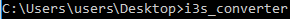
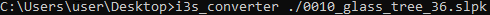
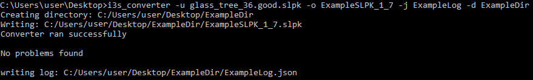
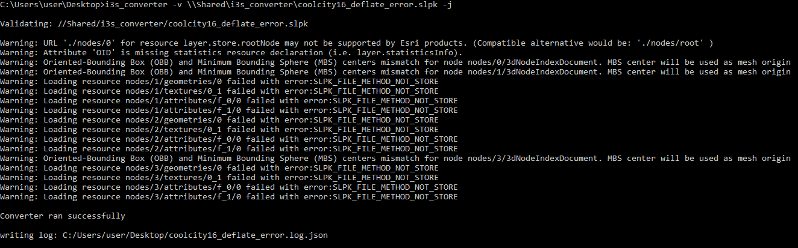
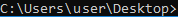

# i3s_converter.exe

Command line tool for
- Validate a 1.6 Scene Layer Package (slpk)
- Convert a 1.4-1.6 slpk to 1.7
- Extract a 1.7 slpk or an slpk with layer type of Point Cloud (Version 2.0 only for Point Cloud).


|      &nbsp;     | Validate | Convert | Extract |
|-----------------|----------|---------|---------|
| 3DObject        |         |        |  |
| Integrated Mesh |         |        |  |
| Point           |         |        |
| Pointcloud      |         | &nbsp;  |  |
| Building        |         |        |  |

*Note:* 1.7 maintains backwards compatibility with 1.6. The resultant 1.7 slpk will be larger in size than the input slpk. This is due to the creation of Draco-compressed geometries and DXT-compressed textures.  All of these features are important for increased performance. If output slpk size is a limiting factor, the `-x` option can be used to skip writing DXT textures, but this may result in slower drawing performance.  

When extracing or converting, the following formats are available:
- Archived: *.slpk
- Filesystem : *.eslpk
- Cloud : *.i3srest

Cloud storage options supported:
- Microsoft Azure
- AWS S3
- Alibaba OSS

## Running the executable

#### Open Command Prompt

1. Win+R

2. Enter __cmd__ into pop-up window

#### Run the executable

1. Specify the .exe path

  - Drag and drop the .exe into the command prompt window (absolute path).  
    

  - _cd_ into the directory that contains the .exe (relative path)
    - Use: i3s_converter  
    

2. Specify the slpk path

    - Use relative path if executable is in same directory as slpk

    - Otherwise use absolute path

  

  This is the minumum required to use the converter with an slpk.

## Subcommands

| Subcommand   | Action          |
|--------------|-----------------|
| -b           | Show converter version    |
| -h           | Show usage      |
| -u infile.slpk | Convert slpk to 1.7   |
| -v infile.slpk | Validate slpk |
| -i infile.slpk | Show basic layer info |

## Options

| Option         | Action                  |
|----------------|-------------------------|
| -d dir         | Change output directory. Create it if it doesn't exist|
| -j \[log_name] | Set log name    |
| -e             | Create ETC2 texture from input \(slow) |
| -o outfile   | 1.7 slpk name   |
| -x             | Don't write DXT textures |

## Examples
In the following example, the .exe and input slpk are in the current working directory.  
It uses:

- -u to convert slpk from 1.6 to 1.7
- -o to the set the name of the new slpk to ExampleSLPK_1_7.slpk
- -j set the log name to ExampleLog
- -d to set the output directory to C:\Users\juan9976\Desktop\ExampleDir


The following example validates a 1.6 slpk. There errors are output to the console.
It uses:
- -v to validate the slpk
- -j to write a json log. (The name of the input slpk is used for the log name)  


## Conversion and Extraction
#### Filesystem
To convert an slpk to filesystem (*.eslpk)
- ```i3s_converter.exe --convert <path-to-slpk> -d <output-directory> -t <num-threads>```

To extract an slpk to filesystem (*.eslpk)
- ```i3s_converter.exe --extract <path-to-slpk> -d <output-directory>```

#### Cloud
To convert an slpk to cloud (*.i3srest)
 - ```  i3s_converter.exe --convert <path-to-slpk> -d <scheme>://<bucket-or-container> -a <access-key> -s <secret-key> -r <s3-or-alibaba-region> -t <num-threads>```

Usage for converting an slpk to cloud
- ```i3s_converter.exe --extract <path-to-slpk> -d <scheme>://<bucket-or-container> -a <access> -s <secret-key> -r <s3-or-alibaba-region>```

Supported schemes:
- AWS S3:          s3
- Microsoft Azure: az
- Alibaba OSS:     oss


## Notes

- Only works with __local__ files

- Only the first 10 warnings/errors are output to the command line.

- Any output files are written out relative to the current working directory, unless _-d_ flag is used.  


- To avoid having to specify the absolute path to the .exe
  - _cd_ to the directory that contains the .exe
  - add the .exe as a PATH environment variable

- 1.7 slpks and log files will be overwritten when tool is re-run with the same input

## Licensing
   Copyright 2020 ESRI

   Licensed under the Apache License, Version 2.0 (the "License");
   you may not use this file except in compliance with the License.
   You may obtain a copy of the License at

       http://www.apache.org/licenses/LICENSE-2.0

   Unless required by applicable law or agreed to in writing, software
   distributed under the License is distributed on an "AS IS" BASIS,
   WITHOUT WARRANTIES OR CONDITIONS OF ANY KIND, either express or implied.
   See the License for the specific language governing permissions and
   limitations under the License.