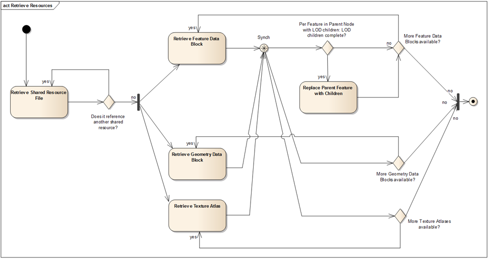
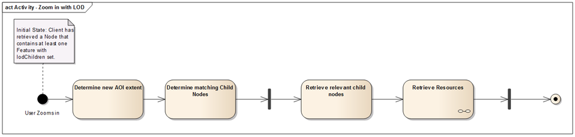

# i3s profile: Features-Meshes (FM)

## Summary

*What this profile is for:* Implements 3DObject, 3DObjectMultiRep and 3DObjectVisualization layer types. Support for all geometry types and a wide feature set including symbolisation and feature-tree-based LoD.

## Access Pattern

This section describes how a client is expected to load and handle resources from an Indexed 3D Scene. 
The general pattern consists of these phases:

1.	Handshake & capabilities negotiation – ensure that the service has the expected resources, that client and server have a common set of formats for these that can be used and inform the client which capabilities can be used, such as editing. Within this phase, the client utilizes the following resources:
    1.	SceneServiceInfo: General service information
    1.	3dSceneLayer: Information on available layers, including symbology and encoding
2.	Identify suitable entry points into the Indexed 3D Scene data – in this optional phase, the client asks a service to identify the node covering the clients’ Area of interest best. In this phase, none of the i3s resources are utilized, only an operation that the scene server provides:
    1.	FindNode – Find the Node that best matches the client’s AOI.
3.	Retrieve index – either starting from the root node or from the identified node, the client retrieves Node Index Documents and decides – based on properties such as the precision value and the feature locations in the node – whether it wants to download and render their attached resources. Within this phase, the client utilizes the following resource:
    1.	NodeIndexDocument: Summary of the content of a single node of the index, references children, parent and neighbor nodes, indicating what can be found there
4.	Retrieve resources – when a client has decided that it wants to render the content of a node, it starts to retrieve the attached resources:
    1.	FeatureData: Attributes of GIS features, accessors to GeometryData and TextureData
    1.	SharedData: Material defintions, shared geometries for instancing
    1.	GeometryData: Geometry attributes such as positions and indices
    1.	TextureData: Images used as texture maps

The retrieval of resources belonging to a node should happen as outlined in the activity diagram shown in the figure below. 
Whenever a FeatureData bundle, the associated Geometry and the Textures are retrieved, they can be rendered by the client. 

 
 

<em>Figure FM-1: UML activity diagram showing the retrieval of i3s resources.</em>

The Figure above also shows one aspect of the handling of LoD children in the resource loading process: When a feature that had 
previously already been sent to the rendering pipeline participates in a LoD tree, it can be replaced as soon as all 
its LoD children have been loaded. Figure 9 provides the context for this operation, also as an UML activity diagram. 
When LoD trees are used in an i3s store, the general pattern is extended to check and replace features with their coarser or 
finer representations:

 
 

<em>Figure FM-2: UML activity diagram showing LoD feature replacement.</em>

## Schema

The features-meshes profile makes use of all 7 main resource types and allows most properties.

### SceneServiceInfo

No specific profile.

### 3dSceneLayer

[features-meshes 3dSceneLayer](./rules/docs/3dSceneLayerRules.html)

### 3dNodeIndexDocument

[features-meshes 3dNodeIndexDocument](./rules/docs/3dNodeIndexDocumentRules.html)

### FeatureData

[features-meshes FeatureData](./rules/docs/FeatureDataRules.html)

### SharedResources

[features-meshes SharedResources](./rules/docs/SharedResourceRules.html)
