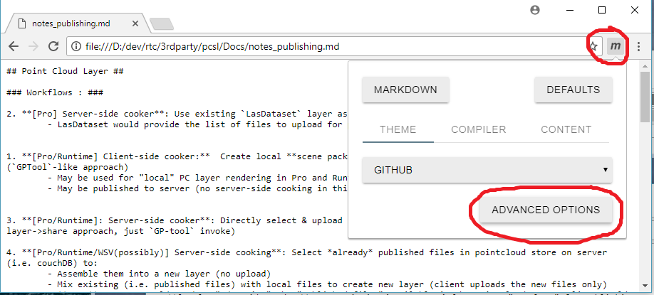

## How to setup Chrome markdown extension

1. Inside a chrome tab, google "chrome markdow viewer extension" and install it: 

1. Click on [M] button to bring up to options and click "advanced options" 

1. In the advanced option click "enable access to file://" 

1.  Enabled it:
2. Local *.md should now render correctly:

[ Back to getting started](getting_started.md)
