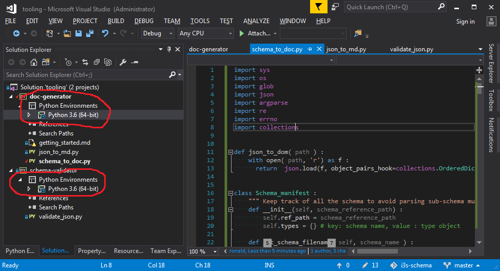
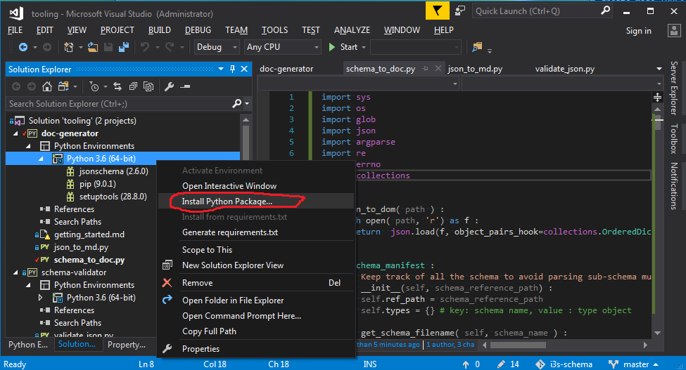
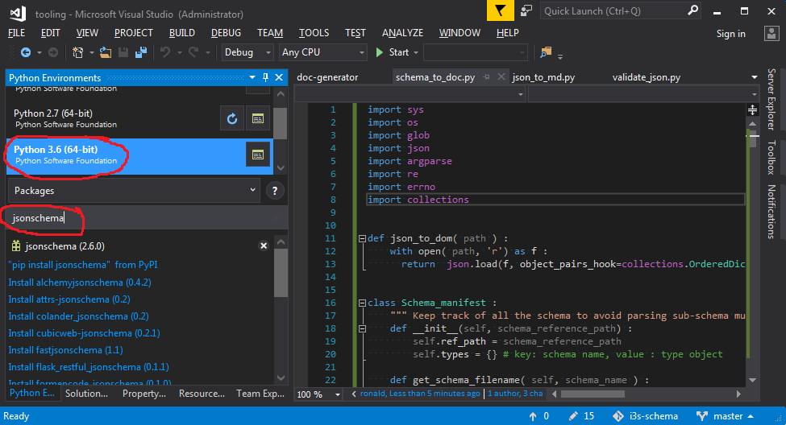
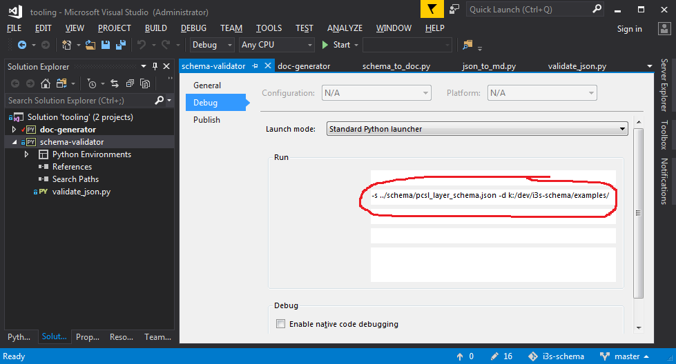

# Getting started

This repo contains python scripts to:

1. validate i3s json documents against their schema
2. generate i3s dev documention from the annoted schema in markdown format. 

Please note that this repo includes an **improved doc generator** ( *different* from web-spec  with the following enhancements:

1. improved `json type` documentation (added "type" column in propery table )
1. Mark "required" properties in **bold**
2. support for external example ( `example-href` ) to keep the schema JSON compact
3. support for external markdown description ( `description-href`). support full markdown with cluttering the schema files
4. build dependency tree from schema reference ($ref) to create document navigation links ("related" section)
5. improved array documention (specify the type of the item and the valid range of the array)  

see [auto-generated doc example](../docs/pcsl_layer.md)

## Prerequisites:

1. Setup [Chrome with markdown viewer](chrome_markdown.md)
2. Setup [Python for visual studio 2017](vs_py.md)

## Setup:

1. Clone  [i3s-schema repo](https://devtopia.esri.com/rona7954/i3s-schema) locally
2. Open `tooling.sln`
3. Make sure `python 3.6` is selected: 
4. Use the build package managed to install `jsonschema` python package 

## Schema validation:

1. right-click on the project "schema-validator"->"properties" in the solution explorer to bring the property page and make sure the script arguments setup 
2. right-click on the project "schema-validator"->"Set as startup project" in the solution manager
2. "Start" -> run the script to validate the input provided in the script argument

## Documentation generation from schema:

1. right-click on the project "doc-generator"->"Set as startup project" in the solution manager
2. Provide the script arguments if needed: 
3. 
