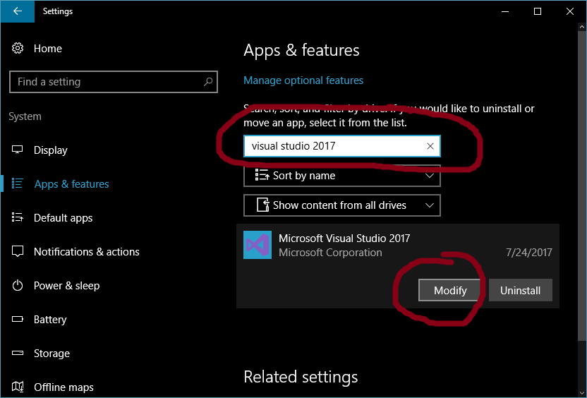
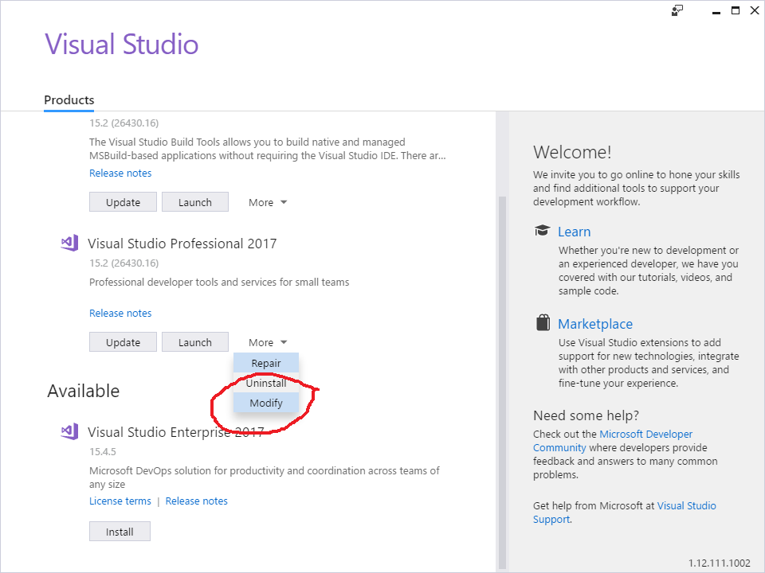
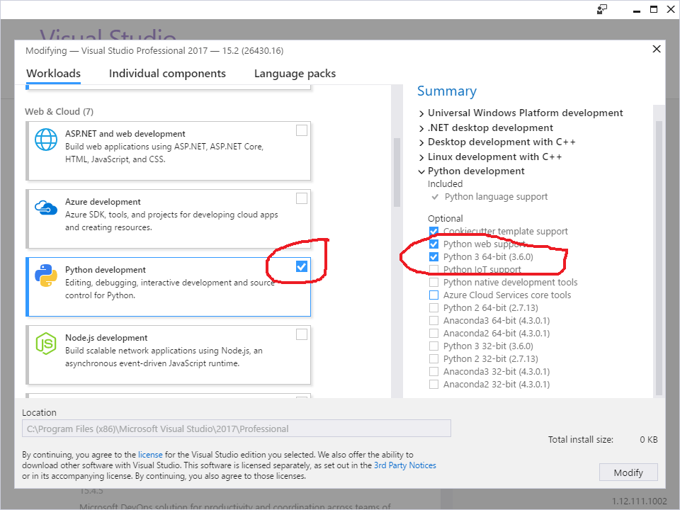

# Setup Python dev env for VS2017

1. In window add/remove program panel, find vs2017 and click "modify" 

2.Check Python and make sure Python 3.6 env is selected. 

[ Back to getting started]( getting_started.md )