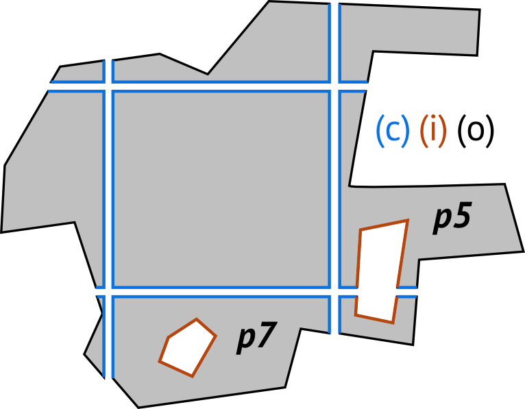

# i3s profile: features-polygons

## Summary

*What this profile is for:* Support for polylines (no multilines) with symbolisation and feature-tree-based LoD.
Uses embedded geometries or ArrayBuffer views - encoders are encouraged to optimize for size (small lines go to Embedded, larger one to ArrayBufferViews).

## Access Pattern

The access pattern is identical to that of the Features-Meshes profile.

## Schema

The features-meshes profile makes use of all 7 main resource types and restricts properties a little.

### SceneServiceInfo

No specific profile.

### 3dSceneLayer

[features-polygons 3dSceneLayer](./rules/docs/3dSceneLayerRules.html)

### 3dNodeIndexDocument

[features-polygons 3dNodeIndexDocument](./rules/docs/3dNodeIndexDocumentRules.html)

### FeatureData

[features-polygons FeatureData](./rules/docs/FeatureDataRules.html)

### SharedResources

[features-polygons SharedResources](./rules/docs/SharedResourceRules.html)

### Class RingDescriptor

RingDescriptors are used in <code>type: polygon</code> geometries to handle inner and outer rings, as well as Level of Detail across such complex polygons.
In a RingDescriptors, each segment is marked as either part of an outer ring (o = 0), an inner ring (i = 1), or a cut (c = 2) to allow control of symbology
and permit cutting of complex polygons across nodes, as in this example:

<table>
	<tr>
		<td><strong>Name</strong></td>
		<td><strong>Type</strong></td>
		<td><strong>Description</strong></td>
	</tr>
	<tr>
		<td>id</td>
		<td>Integer</td>
		<td>Geometry-local id of this ring, persistent across all LoDs that the geometry participates in.</td>
	</tr>
	<tr>
		<td>start</td>
		<td>Integer</td>
		<td>Element offset in the positions array where this ring starts.</td>
	</tr>
	<tr>
		<td>segments</td>
		<td>Integer[2, *]</td>
		<td>The descriptor for the ring. Each pair of values in the descriptor gives the ring segment type (outer ring (0), inner ring (1), cut (2)) and length, e.g. 2,3 means: 3 cut segments.</td>
	</tr>
	<tr>
		<td>inner</td>
		<td>RingDescriptor[0, *]</td>
		<td>Definitions of inner rings. Can be nested recursively for crater lake on volcano island in a crater lake scenarios.</td>
	</tr>
</table>

<em>Table 1: Attributes of the class RingDescriptor in the FeatureData document</em>

