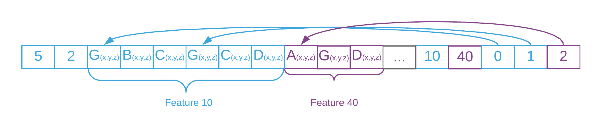

`faceRange` is an inclusive range of faces of the geometry that belongs to a specific feature.

For each feature, `faceRange` indicates its first and last triangles as a pair of integer indices in the face list. 

**Notes**:
- [`featureID`](geometryFeatureID.cmn.md) attribute is required
- This attributes is only supported when topology is `triangle` 
- Vertices in the geometry buffer must be grouped by `feature_id`
- for _un-indexed triangle meshes_, `vertex_index = face_index * 3 `

**Example**

_Mesh with 2 features._

_Grouped vertices in the geometry buffer._